# Podcast Scraper Architecture

> **Strategic Overview**: This document provides high-level architectural decisions, design principles, and system structure. For detailed implementation guides, see the [Development Guide](guides/DEVELOPMENT_GUIDE.md) and other specialized documents linked below.

## Navigation

This architecture document is the central hub for understanding the system. For detailed information, see:

### Core Documentation

- **[ADR Index](adr/index.md)** — **The immutable record of architectural laws and decisions**
- **[Development Guide](guides/DEVELOPMENT_GUIDE.md)** — Detailed implementation instructions, dependency management, code patterns, and development workflows
- **[Testing Strategy](TESTING_STRATEGY.md)** — Testing philosophy, test pyramid, and quality standards
- **[Testing Guide](guides/TESTING_GUIDE.md)** — Quick reference and test execution commands
  - [Unit Testing Guide](guides/UNIT_TESTING_GUIDE.md) — Unit test mocking patterns
  - [Integration Testing Guide](guides/INTEGRATION_TESTING_GUIDE.md) — Integration test guidelines
  - [E2E Testing Guide](guides/E2E_TESTING_GUIDE.md) — E2E server, real ML models
  - [Critical Path Testing Guide](guides/CRITICAL_PATH_TESTING_GUIDE.md) — What to test, prioritization
- **[CI/CD](ci/index.md)** — Continuous integration and deployment pipeline

### API Documentation

- **[API Reference](api/REFERENCE.md)** — Complete API documentation
- **[Configuration](api/CONFIGURATION.md)** — Configuration options and examples
- **[CLI Reference](api/CLI.md)** — Command-line interface documentation

### Feature Documentation

- **[Provider Implementation Guide](guides/PROVIDER_IMPLEMENTATION_GUIDE.md)** — Complete guide for implementing new providers (includes OpenAI example, testing, E2E server mocking)
- **[ML Provider Reference](guides/ML_PROVIDER_REFERENCE.md)** — ML implementation details
- **[Configuration API](api/CONFIGURATION.md)** — Configuration API reference (includes environment variables)

### Specifications

- **[PRDs](prd/index.md)** — Product Requirements Documents
- **[RFCs](rfc/index.md)** — Request for Comments (design decisions)

## Goals and Scope

- Provide a resilient pipeline that collects podcast episode transcripts from RSS feeds and fills gaps via Whisper transcription.
- Offer both CLI and Python APIs with a single configuration surface (`Config`) and deterministic filesystem layout.
- Keep the public surface area small (`Config`, `load_config_file`, `run_pipeline`, `service.run`, `service.run_from_config_file`, `cli.main`) while exposing well-factored submodules for advanced use.
- Provide a service API (`service.py`) optimized for non-interactive use (daemons, process managers) with structured error handling and exit codes.

## Architectural Decisions (ADRs)

The following architectural principles govern this system. For the full history and rationale, see the **[ADR Index](adr/index.md)**.

### Core Patterns

- **Concurrency**: IO-bound threading for downloads, sequential CPU/GPU tasks for ML ([ADR-001](adr/ADR-001-hybrid-concurrency-strategy.md)).
- **Providers**: Protocol-based discovery ([ADR-012](adr/ADR-012-protocol-based-provider-discovery.md)) using unified provider classes ([ADR-011](adr/ADR-011-unified-provider-pattern.md)) and library-based naming ([ADR-013](adr/ADR-013-technology-based-provider-naming.md)).
- **Lazy Loading**: Heavy ML dependencies are loaded only when needed ([ADR-005](adr/ADR-005-lazy-ml-dependency-loading.md)).

### Data & Filesystem

- **Storage**: Hash-based deterministic directory layout ([ADR-003](adr/ADR-003-deterministic-feed-storage.md)) with flat archives ([ADR-004](adr/ADR-004-flat-filesystem-archive-layout.md)).
- **Identity**: Universal GUID-based episode identification ([ADR-007](adr/ADR-007-universal-episode-identity.md)).
- **Metadata**: Unified JSON schema compatible with SQL and NoSQL ([ADR-008](adr/ADR-008-database-agnostic-metadata-schema.md)).

### ML & AI Processing

- **Summarization**: Hybrid MAP-REDUCE strategy ([ADR-010](adr/ADR-010-hierarchical-summarization-pattern.md), [ADR-036](adr/ADR-036-hybrid-map-reduce-summarization.md)) favoring local models ([ADR-009](adr/ADR-009-privacy-first-local-summarization.md)).
- **Audio**: Mandatory preprocessing ([ADR-032](adr/ADR-032-standardized-pre-provider-audio-stage.md)) with content-hash caching ([ADR-033](adr/ADR-033-content-hash-based-audio-caching.md)) using FFmpeg ([ADR-034](adr/ADR-034-ffmpeg-first-audio-manipulation.md)) and Opus ([ADR-035](adr/ADR-035-speech-optimized-codec-opus.md)).
- **Governance**: Explicit benchmarking gates ([ADR-031](adr/ADR-031-heuristic-based-quality-gates.md)) and golden dataset versioning ([ADR-026](adr/ADR-026-explicit-golden-dataset-versioning.md)).

### Development & CI

- **Workflow**: Git worktree-based isolation ([ADR-016](adr/ADR-016-git-worktree-based-development.md)) with independent environments ([ADR-018](adr/ADR-018-isolated-runtime-environments.md)).
- **Quality**: Three-tier test pyramid ([ADR-021](adr/ADR-021-standardized-test-pyramid.md)) with automated health metrics ([ADR-023](adr/ADR-023-public-operational-metrics.md)).

## High-Level Flow

1. **Entry**: `podcast_scraper.cli.main` parses CLI args (optionally merging JSON/YAML configs) into a validated `Config` object and applies global logging preferences.
2. **Run orchestration**: `workflow.run_pipeline` coordinates the end-to-end job: output setup, RSS acquisition, episode materialization, transcript download, optional Whisper transcription, optional metadata generation, optional summarization, and cleanup.
3. **Episode handling**: For each `Episode`, `episode_processor.process_episode_download` either saves an existing transcript or enqueues media for Whisper.
4. **Speaker detection** (RFC-010): When automatic speaker detection is enabled, host names are extracted from RSS author tags (channel-level `<author>`, `<itunes:author>`, `<itunes:owner>`) as the primary source, falling back to NER extraction from feed metadata if no author tags exist. Guest names are extracted from episode-specific metadata (titles and descriptions) using Named Entity Recognition (NER) with spaCy. Manual speaker names are only used as fallback when detection fails.
5. **Audio Preprocessing** (RFC-040): When preprocessing is enabled, audio files are optimized before transcription: converted to mono, resampled to 16 kHz, silence removed via VAD, loudness normalized, and compressed with Opus codec. This reduces file size (typically 10-25× smaller) and ensures API compatibility (e.g., OpenAI 25 MB limit). Preprocessing happens at the pipeline level in `episode_processor.transcribe_media_to_text` before any provider receives the audio. All providers benefit from optimized audio.
6. **Transcription**: When Whisper fallback is enabled, `episode_processor.download_media_for_transcription` downloads media to a temp area and `episode_processor.transcribe_media_to_text` persists Whisper output using deterministic naming. Detected speaker names are integrated into screenplay formatting when enabled.
7. **Metadata generation** (PRD-004/RFC-011): When enabled, per-episode metadata documents are generated alongside transcripts, capturing feed-level and episode-level information, detected speaker names, and processing metadata in JSON/YAML format.
8. **Summarization** (PRD-005/RFC-012): When enabled, episode transcripts are summarized using local transformer models (BART, PEGASUS, LED) with a hybrid map-reduce strategy. See [ML Provider Reference](guides/ML_PROVIDER_REFERENCE.md) for detailed architecture.
9. **Progress/UI**: All long-running operations report progress through the pluggable factory in `progress.py`, defaulting to `rich` in the CLI.

### Pipeline Flow Diagram

```mermaid
flowchart TD
    Start([CLI Entry]) --> Parse[Parse CLI Args & Config Files]
    Parse --> Validate[Validate & Normalize Config]
    Validate --> Setup[Setup Output Directory]
    Setup --> FetchRSS[Fetch & Parse RSS Feed]
    FetchRSS --> ExtractEpisodes[Extract Episode Metadata]
    ExtractEpisodes --> DetectSpeakers{Speaker Detection Enabled?}
    DetectSpeakers -->|Yes| ExtractHosts[Extract Host Names from RSS]
    ExtractHosts --> ExtractGuests[Extract Guest Names via NER]
    DetectSpeakers -->|No| ProcessEpisodes[Process Episodes]
    ExtractGuests --> ProcessEpisodes
    ProcessEpisodes --> CheckTranscript{Transcript Available?}
    CheckTranscript -->|Yes| DownloadTranscript[Download Transcript]
    CheckTranscript -->|No| QueueWhisper[Queue for Whisper]
    DownloadTranscript --> SaveTranscript[Save Transcript File]
    QueueWhisper --> DownloadMedia[Download Media File]
    DownloadMedia --> Preprocess{Preprocessing Enabled?}
    Preprocess -->|Yes| PreprocessAudio[Preprocess Audio: Mono, 16kHz, VAD, Normalize, Opus]
    Preprocess -->|No| Transcribe
    PreprocessAudio --> Transcribe[Whisper Transcription]
    Transcribe --> FormatScreenplay[Format with Speaker Names]
    FormatScreenplay --> SaveTranscript
    SaveTranscript --> GenerateMetadata{Metadata Generation?}
    GenerateMetadata -->|Yes| CreateMetadata[Generate Metadata JSON/YAML]
    GenerateMetadata -->|No| Cleanup
    CreateMetadata --> GenerateSummary{Summarization Enabled?}
    GenerateSummary -->|Yes| Summarize[Generate Summary]
    GenerateSummary -->|No| Cleanup
    Summarize --> AddSummaryToMetadata[Add Summary to Metadata]
    AddSummaryToMetadata --> Cleanup[Cleanup Temp Files]
    Cleanup --> End([Complete])

    style Start fill:#e1f5ff
    style End fill:#d4edda
    style ProcessEpisodes fill:#fff3cd
    style Transcribe fill:#f8d7da
    style GenerateMetadata fill:#d1ecf1
```



- `cli.py`: Parse/validate CLI arguments, integrate config files, set up progress reporting, trigger `run_pipeline`. Optimized for interactive command-line use.
- `service.py`: Service API for programmatic/daemon use. Provides `service.run()` and `service.run_from_config_file()` functions that return structured `ServiceResult` objects. Works exclusively with configuration files (no CLI arguments), optimized for non-interactive use (supervisor, systemd, etc.). Entry point: `python -m podcast_scraper.service --config config.yaml`.
- `config.py`: Immutable Pydantic model representing all runtime options; JSON/YAML loader with strict validation and normalization helpers. Includes language configuration, NER settings, and speaker detection flags (RFC-010).
- `workflow.py`: Pipeline coordinator that orchestrates directory prep, RSS parsing, download concurrency, Whisper lifecycle, speaker detection coordination, and cleanup.
- `rss_parser.py`: Safe RSS/XML parsing using `defusedxml` ([ADR-002](adr/ADR-002-security-first-xml-processing.md)), discovery of transcript/enclosure URLs, and creation of `Episode` models.
- `downloader.py`: HTTP session pooling with retry-enabled adapters, streaming downloads, and shared progress hooks.
- `episode_processor.py`: Episode-level decision logic, transcript storage, Whisper job management, delay handling, and file naming rules. Integrates detected speaker names into Whisper screenplay formatting.
- `filesystem.py`: Filename sanitization, output directory derivation based on feed hash ([ADR-003](adr/ADR-003-deterministic-feed-storage.md)), run suffix logic, and helper utilities for Whisper output paths.
- **Provider System** (RFC-013, RFC-029): Protocol-based provider architecture for transcription, speaker detection, and summarization ([ADR-012](adr/ADR-012-protocol-based-provider-discovery.md)). Each capability has a protocol interface (`TranscriptionProvider`, `SpeakerDetector`, `SummarizationProvider`) and factory functions that create provider instances based on configuration. Providers implement `initialize()`, protocol methods (e.g., `transcribe()`, `summarize()`), and `cleanup()`. See [Provider Implementation Guide](guides/PROVIDER_IMPLEMENTATION_GUIDE.md) for details.
- **Unified Providers** (RFC-029): Two unified provider classes implement all three protocols ([ADR-011](adr/ADR-011-unified-provider-pattern.md)):
  - `ml/ml_provider.py` - `MLProvider`: Implements all three protocols using local ML models (Whisper for transcription, spaCy for speaker detection, Transformers for summarization)
  - `openai/openai_provider.py` - `OpenAIProvider`: Implements all three protocols using OpenAI APIs (Whisper API for transcription, GPT API for speaker detection and summarization)
  - **Factories**: Factory functions in `transcription/factory.py`, `speaker_detectors/factory.py`, and `summarization/factory.py` create the appropriate unified provider based on configuration.
- `whisper_integration.py`: Lazy loading of the third-party `openai-whisper` library, transcription invocation with language-aware model selection (preferring `.en` variants for English), and screenplay formatting helpers that use detected speaker names. Now accessed via `MLProvider` (unified provider pattern).
- `speaker_detection.py` (RFC-010): Named Entity Recognition using spaCy to extract PERSON entities from episode metadata, distinguish hosts from guests, and provide speaker names for Whisper screenplay formatting. spaCy is a required dependency. Now accessed via `MLProvider` (unified provider pattern).
- `summarizer.py` (PRD-005/RFC-012): Episode summarization using local transformer models (BART, PEGASUS, LED) to generate concise summaries from transcripts. Implements a hybrid map-reduce strategy. Now accessed via `MLProvider` (unified provider pattern). See [ML Provider Reference](guides/ML_PROVIDER_REFERENCE.md) for details.
- `progress.py`: Minimal global progress publishing API so callers can swap in alternative UIs.
- `models.py`: Simple dataclasses (`RssFeed`, `Episode`, `TranscriptionJob`) shared across modules. May be extended to include detected speaker metadata.
- `metadata.py` (PRD-004/RFC-011): Per-episode metadata document generation, capturing feed-level and episode-level information, detected speaker names, transcript sources, processing metadata, and optional summaries in structured JSON/YAML format. Opt-in feature for backwards compatibility.

### Module Dependencies Diagram

```mermaid
graph TB
    subgraph "Public API"
        CLI[cli.py]
        Config[config.py]
        Workflow[workflow.py]
    end

    subgraph "Core Processing"
        RSSParser[rss_parser.py]
        EpisodeProc[episode_processor.py]
        Downloader[downloader.py]
    end

    subgraph "Support Modules"
        Filesystem[filesystem.py]
        Models[models.py]
        Progress[progress.py]
    end

    subgraph "Provider System"
        TranscriptionFactory[transcription/factory.py]
        SpeakerFactory[speaker_detectors/factory.py]
        SummaryFactory[summarization/factory.py]
        MLProvider[ml/ml_provider.py]
        OpenAIProvider[openai/openai_provider.py]
    end

    subgraph "Internal ML Logic"
        Whisper[whisper_integration.py]
        SpeakerDetect[speaker_detection.py]
        Summarizer[summarizer.py]
    end

    subgraph "Optional Features"
        Metadata[metadata.py]
    end

    CLI --> Config
    CLI --> Workflow
    CLI --> Progress
    Workflow --> RSSParser
    Workflow --> EpisodeProc
    Workflow --> Downloader
    Workflow --> TranscriptionFactory
    Workflow --> SpeakerFactory
    Workflow --> SummaryFactory
    TranscriptionFactory --> MLProvider
    TranscriptionFactory --> OpenAIProvider
    SpeakerFactory --> MLProvider
    SpeakerFactory --> OpenAIProvider
    SummaryFactory --> MLProvider
    SummaryFactory --> OpenAIProvider
    MLProvider --> Whisper
    MLProvider --> SpeakerDetect
    MLProvider --> Summarizer
    Workflow --> Metadata
    Workflow --> Filesystem
    Workflow --> Models
    Workflow --> Progress
    EpisodeProc --> Downloader
    EpisodeProc --> Filesystem
    EpisodeProc --> Models
    RSSParser --> Models
    Metadata --> Summarizer
    Metadata --> Models
    Summarizer --> Models
    SpeakerDetect --> Models

```python
- **Typed, immutable configuration**: `Config` is a frozen Pydantic model, ensuring every module receives canonicalized values (e.g., normalized URLs, integer coercions, validated Whisper models). This centralizes validation and guards downstream logic.
- **Resilient HTTP interactions**: A per-thread `requests.Session` with exponential backoff retry (`LoggingRetry`) handles transient network issues while logging retries for observability.
- **Concurrent transcript pulls**: Transcript downloads are parallelized via `ThreadPoolExecutor`, guarded with locks when mutating shared counters/job queues. Whisper remains sequential to avoid GPU/CPU thrashing and to keep the UX predictable.
- **Deterministic filesystem layout**: Output folders follow `output/rss_<host>_<hash>` conventions. Optional `run_id` and Whisper suffixes create run-scoped subdirectories while `sanitize_filename` protects against filesystem hazards.
- **Dry-run and resumability**: `--dry-run` walks the entire plan without touching disk, while `--skip-existing` short-circuits work per episode, making repeated runs idempotent.
- **Pluggable progress/UI**: A narrow `ProgressFactory` abstraction lets embedding applications replace the default `tqdm` progress without touching business logic.
- **Optional Whisper dependency**: Whisper is imported lazily and guarded so environments without GPU support or `openai-whisper` can still run transcript-only workloads.
- **Optional summarization dependency** (PRD-005/RFC-012): Summarization requires `torch` and `transformers` dependencies and is imported lazily. When dependencies are unavailable, summarization is gracefully skipped. Models are automatically selected based on available hardware (MPS for Apple Silicon, CUDA for NVIDIA GPUs, CPU fallback). See [ML Provider Reference](guides/ML_PROVIDER_REFERENCE.md) for details.
- **Language-aware processing** (RFC-010): A single `language` configuration drives both Whisper model selection (preferring English-only `.en` variants) and NER model selection (e.g., `en_core_web_sm`), ensuring consistent language handling across the pipeline.
- **Automatic speaker detection** (RFC-010): Named Entity Recognition extracts speaker names from episode metadata transparently. Manual speaker names (`--speaker-names`) are ONLY used as fallback when automatic detection fails, not as override. spaCy is a required dependency for speaker detection.
- **Host/guest distinction**: Host detection prioritizes RSS author tags (channel-level only) as the most reliable source, falling back to NER extraction from feed metadata when author tags are unavailable. Guests are always detected from episode-specific metadata using NER, ensuring accurate speaker labeling in Whisper screenplay output.
- **Provider-based architecture** (RFC-013): All capabilities (transcription, speaker detection, summarization) use a protocol-based provider system. Providers are created via factory functions based on configuration, allowing pluggable implementations (e.g., Whisper vs OpenAI for transcription, NER vs OpenAI for speaker detection, local transformers vs OpenAI for summarization). Providers implement consistent interfaces (`initialize()`, protocol methods, `cleanup()`) ensuring type safety and easy testing. See [Provider Implementation Guide](guides/PROVIDER_IMPLEMENTATION_GUIDE.md) for complete implementation details.
- **Local-first summarization** (PRD-005/RFC-012): Summarization defaults to local transformer models for privacy and cost-effectiveness. API-based providers (OpenAI) are supported via the provider system. Long transcripts are handled via chunking strategies, and memory optimization is applied for GPU backends (CUDA/MPS). Models are automatically cached and reused across runs, with cache management utilities available via CLI and programmatic APIs.

## Third-Party Dependencies

The project uses a layered dependency approach: **core dependencies** (always required) provide essential functionality, while **ML dependencies** (optional) enable advanced features like transcription and summarization.

**Core Dependencies**: `requests`, `pydantic`, `defusedxml`, `tqdm`, `platformdirs`, `PyYAML`

**ML Dependencies** (optional, install via `pip install -e .[ml]`): `openai-whisper`, `spacy`, `torch`, `transformers`, `sentencepiece`, `accelerate`, `protobuf`

**API Provider Dependencies** (optional, for OpenAI providers): `openai` (OpenAI Python SDK)

For detailed dependency information including rationale, alternatives considered, version requirements, and dependency management philosophy, see [Dependencies Guide](guides/DEPENDENCIES_GUIDE.md).

## Module Dependency Analysis

The project uses **pydeps** for visualizing module dependencies, detecting circular imports, and tracking architectural health over time. This tooling helps maintain clean module boundaries and identify coupling issues early.

### Tools and Commands

**Makefile Targets:**
- `make deps-graph` - Generate simplified module dependency graph (SVG)
- `make deps-graph-full` - Generate full module dependency graph with all dependencies
- `make deps-check-cycles` - Check for circular imports
- `make deps-analyze` - Run full dependency analysis (cycles + graph)

**Analysis Script:**
- `python scripts/tools/analyze_dependencies.py` - Analyze dependencies and detect issues
  - `--check` - Exit with error if issues found
  - `--report` - Generate detailed JSON report

### Key Metrics

| Metric | Description | Threshold |
| -------- | ------------- | ----------- |
| **Max depth** | Longest dependency chain | <5 levels |
| **Circular imports** | Cycles in import graph | 0 |
| **Fan-out** | Modules a file imports | <15 |
| **Fan-in** | Modules importing a file | Monitor only |

### CI Integration

Dependency analysis runs automatically in the **nightly workflow**:
- Generates dependency graphs (SVG) for visualization
- Checks for circular imports
- Runs full dependency analysis with JSON report
- Artifacts are uploaded for download (90-day retention)

### Output Files

- `reports/deps-simple.svg` - Simplified dependency graph (clustered, max-bacon=2)
- `reports/deps-full.svg` - Full dependency graph with all dependencies
- `reports/deps-analysis.json` - Detailed analysis report (when using `--report`)

### Related Documentation

- [RFC-038: Continuous Review Tooling](rfc/RFC-038-continuous-review-tooling.md) - Module coupling analysis implementation
- [Issue #170](https://github.com/chipi/podcast_scraper/issues/170) - Module coupling analysis tooling
- [CI/CD Documentation](ci/WORKFLOWS.md) - Nightly workflow details

## Constraints and Assumptions

- Python 3.10+ with third-party packages: `requests`, `tqdm`, `defusedxml`, `platformdirs`, `pydantic`, `PyYAML`, `spacy` (required for speaker detection), and optionally `openai-whisper` + `ffmpeg` when transcription is required, and optionally `torch` + `transformers` when summarization is required.
- Network-facing operations assume well-formed HTTPS endpoints; malformed feeds raise early during parsing to avoid partial state.
- Whisper transcription supports multiple languages via `language` configuration, with English (`"en"`) as the default. Model selection automatically prefers `.en` variants for English content. Transcription remains sequential by design; concurrent transcription is intentionally out of scope due to typical hardware limits.
- Speaker name detection via NER (RFC-010) requires spaCy. When automatic detection fails, the system falls back to manual speaker names (if provided) or default `["Host", "Guest"]` labels.
- Output directories must live in safe roots (cwd, user home, or platform data/cache dirs); other locations trigger warnings for operator review.

### Configuration Flow

```mermaid

flowchart TD
    Input[CLI Args + Config Files] --> Merge[Merge Sources]
    Merge --> Validate[Pydantic Validation]
    Validate --> Normalize[Normalize Values]
    Normalize --> Config[Immutable Config Object]
    Config --> Workflow[workflow.run_pipeline]
    Config --> EpisodeProc[episode_processor]
    Config --> RSSParser[rss_parser]
    Config --> Downloader[downloader]
    Config --> Whisper[whisper_integration]
    Config --> SpeakerDetect[speaker_detection]
    Config --> Metadata[metadata]
    Config --> Summarizer[summarizer]

    style Input fill:#e1f5ff
    style Config fill:#fff3cd
    style Validate fill:#f8d7da

```python

- `models.Episode` encapsulates the RSS item, chosen transcript URLs, and media enclosure metadata, keeping parsing concerns separate from processing. May be extended to include detected speaker names (RFC-010).
- Transcript filenames follow `<####> - <episode_title>[ _<run_suffix>].<ext>` with extensions inferred from declared types, HTTP headers, or URL heuristics.
- Whisper output names append the Whisper model/run identifier to differentiate multiple experimental runs inside the same base directory. Screenplay formatting uses detected speaker names when available.
- Temporary media downloads land in `<output>/ .tmp_media/` and always get cleaned up (best effort) after transcription completes.
- Episode metadata documents (per PRD-004/RFC-011) are generated when `generate_metadata` is enabled, storing detected speaker names, feed information, transcript sources, and other episode details alongside transcripts in JSON/YAML format for downstream use cases. When summarization is enabled, metadata documents include summary and key takeaways fields with model information and generation timestamps.

### Filesystem Layout

```mermaid

graph TD
    Root[output/rss_hostname_hash/] --> RunDir{Run ID<br/>Specified?}
    RunDir -->|Yes| RunSubdir[run_id/]
    RunDir -->|No| BaseDir[Base Directory]
    RunSubdir --> Episodes[Episode Files]
    BaseDir --> Episodes
    Episodes --> Transcript1["0001 - Episode Title.txt"]
    Episodes --> Transcript2["0002 - Episode Title.txt"]
    Episodes --> WhisperDir{Whisper<br/>Used?}
    WhisperDir -->|Yes| WhisperSubdir[whisper_model_run/]
    WhisperSubdir --> WhisperFiles["0001 - Episode Title_whisper_base.txt"]
    Episodes --> Metadata{Metadata<br/>Enabled?}
    Metadata -->|Yes| MetaFiles["0001 - Episode Title.json<br/>0001 - Episode Title.yaml"]
    Root --> TempDir[.tmp_media/]
    TempDir --> TempFiles[Temporary Media Files<br/>Cleaned Up After Use]

    style Root fill:#e1f5ff
    style Episodes fill:#fff3cd
    style TempDir fill:#f8d7da
    style Metadata fill:#d1ecf1

```text

- RSS and HTTP failures raise `ValueError` early with descriptive messages; CLI wraps these in exit codes for scripting.
- Transcript/Media downloads log warnings rather than hard-fail the pipeline, allowing other episodes to proceed.
- Filesystem operations sanitize user-provided paths, emit warnings when outside trusted roots, and handle I/O errors gracefully.
- Unexpected exceptions inside worker futures are caught and logged without terminating the executor loop.

For detailed error handling patterns and implementation guidelines, see [Development Guide - Error Handling](guides/DEVELOPMENT_GUIDE.md#error-handling).

## Extensibility Points

- **Configuration**: Extend `Config` (and CLI) when introducing new features; validation rules keep downstream logic defensive. Language and NER configuration (RFC-010) demonstrate this pattern.
- **Progress**: Replace `progress.set_progress_factory` to integrate with custom UIs or disable progress output entirely.
- **Download strategy**: `downloader` centralizes HTTP behavior—alternate adapters or auth strategies can be injected by decorating `fetch_url`/`http_get`.
- **Episode transforms**: New transcript processors can reuse `models.Episode` and `filesystem` helpers without modifying the main pipeline.
- **CLI embedding**: `cli.main` accepts override callables (`apply_log_level_fn`, `run_pipeline_fn`, `logger`) to facilitate testing and reuse from other entry points.
- **Speaker detection** (RFC-010): NER implementation is modular and can be extended with custom heuristics, additional entity types, or alternative NLP libraries. Configuration allows disabling detection behavior or providing manual fallback names.
- **Language support**: Language configuration drives both Whisper and NER model selection, enabling multi-language support through consistent configuration. New languages can be added by extending model selection logic and spaCy model support.
- **Metadata generation** (PRD-004/RFC-011): Metadata document generation is opt-in and can be extended with additional fields or alternative output formats. The schema is versioned to support future evolution.
- **Provider system** (RFC-013): The provider architecture enables extensibility for all capabilities. New providers can be added by implementing protocol interfaces and registering in factory functions. The system supports both local implementations (Whisper, spaCy NER, local transformers) and API-based providers (OpenAI). E2E testing infrastructure includes mock endpoints for API providers, allowing tests to run without real API calls. See [Provider Implementation Guide](guides/PROVIDER_IMPLEMENTATION_GUIDE.md) for complete implementation patterns, testing strategies, and E2E server mocking details.
- **Summarization** (PRD-005/RFC-012): Summarization is opt-in and integrated with metadata generation. Local transformer models are preferred for privacy and cost-effectiveness, with automatic hardware-aware model selection. The implementation supports multiple model architectures (BART, DistilBART) and can be extended with additional models or API-based providers via the provider system. Long transcript handling via chunking strategies ensures scalability. Models are automatically cached locally and reused across runs. Cache management utilities (`get_cache_size`, `prune_cache`, `format_cache_size`) are available via CLI (`--cache-info`, `--prune-cache`) and programmatically for disk space management.

## Testing

The project follows a three-tier testing strategy (Unit, Integration, E2E). For comprehensive testing information:

| Document | Purpose |
| ---------- | --------- |
| **[Testing Strategy](TESTING_STRATEGY.md)** | Testing philosophy, test pyramid, decision criteria |
| **[Testing Guide](guides/TESTING_GUIDE.md)** | Quick reference, test execution commands |
| **[Unit Testing Guide](guides/UNIT_TESTING_GUIDE.md)** | Unit test mocking patterns and isolation |
| **[Integration Testing Guide](guides/INTEGRATION_TESTING_GUIDE.md)** | Integration test guidelines |
| **[E2E Testing Guide](guides/E2E_TESTING_GUIDE.md)** | E2E server, real ML models |
| **[Critical Path Testing Guide](guides/CRITICAL_PATH_TESTING_GUIDE.md)** | What to test, prioritization |
| **[Provider Implementation Guide](guides/PROVIDER_IMPLEMENTATION_GUIDE.md)** | Provider-specific testing |
