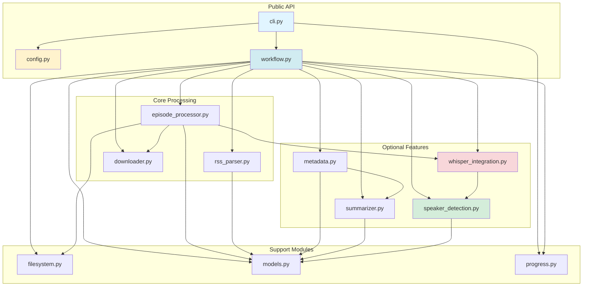
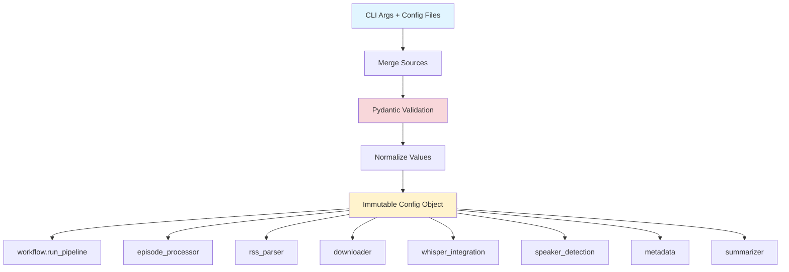
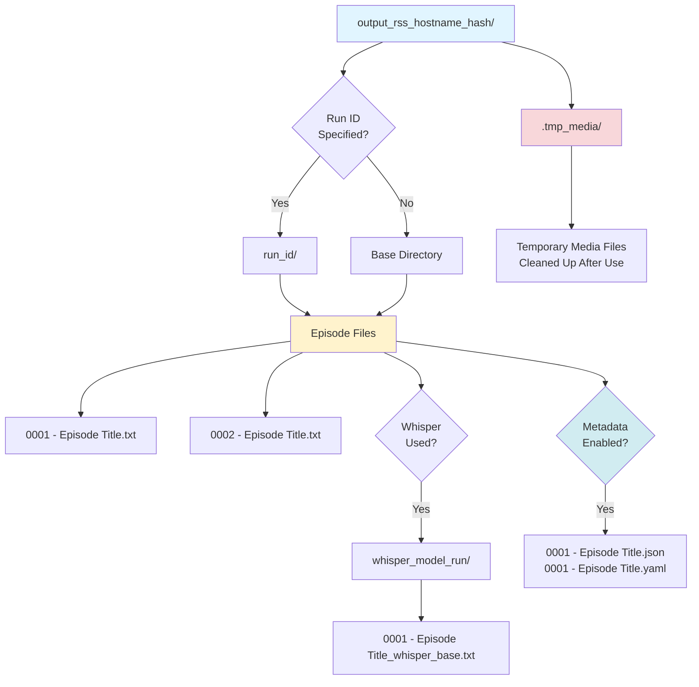

# Podcast Scraper Architecture

> **Strategic Overview**: This document provides high-level architectural decisions, design principles, and system structure. For detailed implementation guides, see the [Development Guide](DEVELOPMENT_GUIDE.md) and other specialized documents linked below.

## Navigation

This architecture document is the central hub for understanding the system. For detailed information, see:

### Core Documentation

- **[Development Guide](DEVELOPMENT_GUIDE.md)** — Detailed implementation instructions, dependency management, code patterns, and development workflows
- **[Testing Strategy](TESTING_STRATEGY.md)** — Testing philosophy, test pyramid, and quality standards
- **[Testing Guide](TESTING_GUIDE.md)** — Detailed test execution, fixtures, and coverage information
- **[CI/CD](CI_CD.md)** — Continuous integration and deployment pipeline

### API Documentation

- **[API Reference](api/API_REFERENCE.md)** — Complete API documentation
- **[Configuration](api/configuration.md)** — Configuration options and examples
- **[CLI Reference](api/cli.md)** — Command-line interface documentation

### Feature Documentation

- **[Provider System](PROVIDER_MIGRATION_GUIDE.md)** — Provider architecture and migration guides
- **[Custom Providers](CUSTOM_PROVIDER_GUIDE.md)** — Creating custom providers
- **[Summarization Guide](SUMMARIZATION_GUIDE.md)** — Summarization implementation details
- **[Configuration API](api/configuration.md)** — Configuration API reference (includes environment variables)

### Specifications

- **[PRDs](prd/index.md)** — Product Requirements Documents
- **[RFCs](rfc/index.md)** — Request for Comments (design decisions)

## Goals and Scope

- Provide a resilient pipeline that collects podcast episode transcripts from RSS feeds and fills gaps via Whisper transcription.
- Offer both CLI and Python APIs with a single configuration surface (`Config`) and deterministic filesystem layout.
- Keep the public surface area small (`Config`, `load_config_file`, `run_pipeline`, `service.run`, `service.run_from_config_file`, `cli.main`) while exposing well-factored submodules for advanced use.
- Provide a service API (`service.py`) optimized for non-interactive use (daemons, process managers) with structured error handling and exit codes.

## High-Level Flow

1. **Entry**: `podcast_scraper.cli.main` parses CLI args (optionally merging JSON/YAML configs) into a validated `Config` object and applies global logging preferences.
2. **Run orchestration**: `workflow.run_pipeline` coordinates the end-to-end job: output setup, RSS acquisition, episode materialization, transcript download, optional Whisper transcription, optional metadata generation, optional summarization, and cleanup.
3. **Episode handling**: For each `Episode`, `episode_processor.process_episode_download` either saves an existing transcript or enqueues media for Whisper.
4. **Speaker detection** (RFC-010): When automatic speaker detection is enabled, host names are extracted from RSS author tags (channel-level `<author>`, `<itunes:author>`, `<itunes:owner>`) as the primary source, falling back to NER extraction from feed metadata if no author tags exist. Guest names are extracted from episode-specific metadata (titles and descriptions) using Named Entity Recognition (NER) with spaCy. Manual speaker names are only used as fallback when detection fails.
5. **Transcription**: When Whisper fallback is enabled, `episode_processor.download_media_for_transcription` downloads media to a temp area and `episode_processor.transcribe_media_to_text` persists Whisper output using deterministic naming. Detected speaker names are integrated into screenplay formatting when enabled.
6. **Metadata generation** (PRD-004/RFC-011): When enabled, per-episode metadata documents are generated alongside transcripts, capturing feed-level and episode-level information, detected speaker names, and processing metadata in JSON/YAML format.
7. **Summarization** (PRD-005/RFC-012): When enabled, episode transcripts are summarized using local transformer models (BART, PEGASUS, LED) with a hybrid map-reduce strategy. See [Summarization Guide](SUMMARIZATION_GUIDE.md) for detailed architecture.
8. **Progress/UI**: All long-running operations report progress through the pluggable factory in `progress.py`, defaulting to `tqdm` in the CLI.

### Pipeline Flow Diagram

## Module Responsibilities

- `cli.py`: Parse/validate CLI arguments, integrate config files, set up progress reporting, trigger `run_pipeline`. Optimized for interactive command-line use.
- `service.py`: Service API for programmatic/daemon use. Provides `service.run()` and `service.run_from_config_file()` functions that return structured `ServiceResult` objects. Works exclusively with configuration files (no CLI arguments), optimized for non-interactive use (supervisor, systemd, etc.). Entry point: `python -m podcast_scraper.service --config config.yaml`.
- `config.py`: Immutable Pydantic model representing all runtime options; JSON/YAML loader with strict validation and normalization helpers. Includes language configuration, NER settings, and speaker detection flags (RFC-010).
- `workflow.py`: Pipeline coordinator that orchestrates directory prep, RSS parsing, download concurrency, Whisper lifecycle, speaker detection coordination, and cleanup.
- `rss_parser.py`: Safe RSS/XML parsing, discovery of transcript/enclosure URLs, and creation of `Episode` models.
- `downloader.py`: HTTP session pooling with retry-enabled adapters, streaming downloads, and shared progress hooks.
- `episode_processor.py`: Episode-level decision logic, transcript storage, Whisper job management, delay handling, and file naming rules. Integrates detected speaker names into Whisper screenplay formatting.
- `filesystem.py`: Filename sanitization, output directory derivation, run suffix logic, and helper utilities for Whisper output paths.
- `whisper_integration.py`: Lazy loading of the third-party `openai-whisper` library, transcription invocation with language-aware model selection (preferring `.en` variants for English), and screenplay formatting helpers that use detected speaker names.
- `speaker_detection.py` (RFC-010): Named Entity Recognition using spaCy to extract PERSON entities from episode metadata, distinguish hosts from guests, and provide speaker names for Whisper screenplay formatting. spaCy is a required dependency.
- `summarizer.py` (PRD-005/RFC-012): Episode summarization using local transformer models (BART, PEGASUS, LED) to generate concise summaries from transcripts. Implements a hybrid map-reduce strategy. See [Summarization Guide](SUMMARIZATION_GUIDE.md) for details.
- `progress.py`: Minimal global progress publishing API so callers can swap in alternative UIs.
- `models.py`: Simple dataclasses (`RssFeed`, `Episode`, `TranscriptionJob`) shared across modules. May be extended to include detected speaker metadata.
- `metadata.py` (PRD-004/RFC-011): Per-episode metadata document generation, capturing feed-level and episode-level information, detected speaker names, transcript sources, processing metadata, and optional summaries in structured JSON/YAML format. Opt-in feature for backwards compatibility.

### Module Dependencies Diagram

## Key Design Decisions

- **Typed, immutable configuration**: `Config` is a frozen Pydantic model, ensuring every module receives canonicalized values (e.g., normalized URLs, integer coercions, validated Whisper models). This centralizes validation and guards downstream logic.
- **Resilient HTTP interactions**: A per-thread `requests.Session` with exponential backoff retry (`LoggingRetry`) handles transient network issues while logging retries for observability.
- **Concurrent transcript pulls**: Transcript downloads are parallelized via `ThreadPoolExecutor`, guarded with locks when mutating shared counters/job queues. Whisper remains sequential to avoid GPU/CPU thrashing and to keep the UX predictable.
- **Deterministic filesystem layout**: Output folders follow `output_rss_<host>_<hash>` conventions. Optional `run_id` and Whisper suffixes create run-scoped subdirectories while `sanitize_filename` protects against filesystem hazards.
- **Dry-run and resumability**: `--dry-run` walks the entire plan without touching disk, while `--skip-existing` short-circuits work per episode, making repeated runs idempotent.
- **Pluggable progress/UI**: A narrow `ProgressFactory` abstraction lets embedding applications replace the default `tqdm` progress without touching business logic.
- **Optional Whisper dependency**: Whisper is imported lazily and guarded so environments without GPU support or `openai-whisper` can still run transcript-only workloads.
- **Optional summarization dependency** (PRD-005/RFC-012): Summarization requires `torch` and `transformers` dependencies and is imported lazily. When dependencies are unavailable, summarization is gracefully skipped. Models are automatically selected based on available hardware (MPS for Apple Silicon, CUDA for NVIDIA GPUs, CPU fallback). See [Summarization Guide](SUMMARIZATION_GUIDE.md) for details.
- **Language-aware processing** (RFC-010): A single `language` configuration drives both Whisper model selection (preferring English-only `.en` variants) and NER model selection (e.g., `en_core_web_sm`), ensuring consistent language handling across the pipeline.
- **Automatic speaker detection** (RFC-010): Named Entity Recognition extracts speaker names from episode metadata transparently. Manual speaker names (`--speaker-names`) are ONLY used as fallback when automatic detection fails, not as override. spaCy is a required dependency for speaker detection.
- **Host/guest distinction**: Host detection prioritizes RSS author tags (channel-level only) as the most reliable source, falling back to NER extraction from feed metadata when author tags are unavailable. Guests are always detected from episode-specific metadata using NER, ensuring accurate speaker labeling in Whisper screenplay output.
- **Local-first summarization** (PRD-005/RFC-012): Summarization defaults to local transformer models for privacy and cost-effectiveness. API-based providers (OpenAI, Anthropic) are supported in configuration but not yet implemented. Long transcripts are handled via chunking strategies, and memory optimization is applied for GPU backends (CUDA/MPS). Models are automatically cached and reused across runs, with cache management utilities available via CLI and programmatic APIs.

## Third-Party Dependencies

The project uses a layered dependency approach: **core dependencies** (always required) provide essential functionality, while **ML dependencies** (optional) enable advanced features like transcription and summarization.

**Core Dependencies**: `requests`, `pydantic`, `defusedxml`, `tqdm`, `platformdirs`, `PyYAML`

**ML Dependencies** (optional, install via `pip install -e .[ml]`): `openai-whisper`, `spacy`, `torch`, `transformers`, `sentencepiece`, `accelerate`, `protobuf`

For detailed dependency information including rationale, alternatives considered, version requirements, and dependency management philosophy, see [Dependencies Guide](DEPENDENCIES.md).

## Constraints and Assumptions

- Python 3.10+ with third-party packages: `requests`, `tqdm`, `defusedxml`, `platformdirs`, `pydantic`, `PyYAML`, `spacy` (required for speaker detection), and optionally `openai-whisper` + `ffmpeg` when transcription is required, and optionally `torch` + `transformers` when summarization is required.
- Network-facing operations assume well-formed HTTPS endpoints; malformed feeds raise early during parsing to avoid partial state.
- Whisper transcription supports multiple languages via `language` configuration, with English (`"en"`) as the default. Model selection automatically prefers `.en` variants for English content. Transcription remains sequential by design; concurrent transcription is intentionally out of scope due to typical hardware limits.
- Speaker name detection via NER (RFC-010) requires spaCy. When automatic detection fails, the system falls back to manual speaker names (if provided) or default `["Host", "Guest"]` labels.
- Output directories must live in safe roots (cwd, user home, or platform data/cache dirs); other locations trigger warnings for operator review.

### Configuration Flow

## Data and File Layout

- `models.Episode` encapsulates the RSS item, chosen transcript URLs, and media enclosure metadata, keeping parsing concerns separate from processing. May be extended to include detected speaker names (RFC-010).
- Transcript filenames follow `<####> - <episode_title>[ _<run_suffix>].<ext>` with extensions inferred from declared types, HTTP headers, or URL heuristics.
- Whisper output names append the Whisper model/run identifier to differentiate multiple experimental runs inside the same base directory. Screenplay formatting uses detected speaker names when available.
- Temporary media downloads land in `<output>/ .tmp_media/` and always get cleaned up (best effort) after transcription completes.
- Episode metadata documents (per PRD-004/RFC-011) are generated when `generate_metadata` is enabled, storing detected speaker names, feed information, transcript sources, and other episode details alongside transcripts in JSON/YAML format for downstream use cases. When summarization is enabled, metadata documents include summary and key takeaways fields with model information and generation timestamps.

### Filesystem Layout

## Error Handling and Resilience

- RSS and HTTP failures raise `ValueError` early with descriptive messages; CLI wraps these in exit codes for scripting.
- Transcript/Media downloads log warnings rather than hard-fail the pipeline, allowing other episodes to proceed.
- Filesystem operations sanitize user-provided paths, emit warnings when outside trusted roots, and handle I/O errors gracefully.
- Unexpected exceptions inside worker futures are caught and logged without terminating the executor loop.

For detailed error handling patterns and implementation guidelines, see [Development Guide - Error Handling](DEVELOPMENT_GUIDE.md#error-handling).

## Extensibility Points

- **Configuration**: Extend `Config` (and CLI) when introducing new features; validation rules keep downstream logic defensive. Language and NER configuration (RFC-010) demonstrate this pattern.
- **Progress**: Replace `progress.set_progress_factory` to integrate with custom UIs or disable progress output entirely.
- **Download strategy**: `downloader` centralizes HTTP behavior—alternate adapters or auth strategies can be injected by decorating `fetch_url`/`http_get`.
- **Episode transforms**: New transcript processors can reuse `models.Episode` and `filesystem` helpers without modifying the main pipeline.
- **CLI embedding**: `cli.main` accepts override callables (`apply_log_level_fn`, `run_pipeline_fn`, `logger`) to facilitate testing and reuse from other entry points.
- **Speaker detection** (RFC-010): NER implementation is modular and can be extended with custom heuristics, additional entity types, or alternative NLP libraries. Configuration allows disabling detection behavior or providing manual fallback names.
- **Language support**: Language configuration drives both Whisper and NER model selection, enabling multi-language support through consistent configuration. New languages can be added by extending model selection logic and spaCy model support.
- **Metadata generation** (PRD-004/RFC-011): Metadata document generation is opt-in and can be extended with additional fields or alternative output formats. The schema is versioned to support future evolution.
- **Summarization** (PRD-005/RFC-012): Summarization is opt-in and integrated with metadata generation. Local transformer models are preferred for privacy and cost-effectiveness, with automatic hardware-aware model selection. The implementation supports multiple model architectures (BART, DistilBART) and can be extended with additional models or API-based providers. Long transcript handling via chunking strategies ensures scalability. Models are automatically cached locally and reused across runs. Cache management utilities (`get_cache_size`, `prune_cache`, `format_cache_size`) are available via CLI (`--cache-info`, `--prune-cache`) and programmatically for disk space management.

## Testing

The project follows a three-tier testing strategy (Unit, Integration, E2E) with distinct purposes, speeds, scopes, and I/O policies. For comprehensive testing information, see:

- **[Testing Strategy](TESTING_STRATEGY.md)** — Testing philosophy, test pyramid, decision criteria, and quality standards
- **[Testing Guide](TESTING_GUIDE.md)** — Detailed test execution, fixtures, coverage, and implementation specifics
