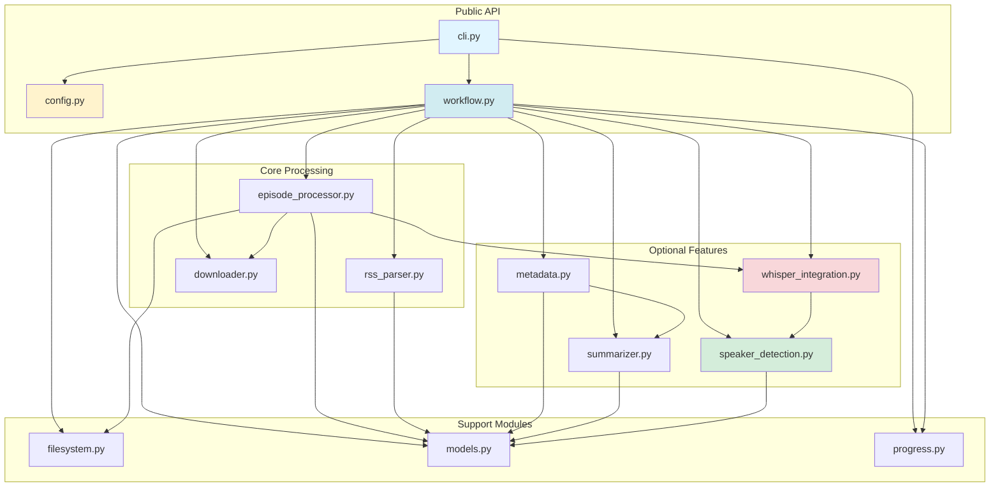
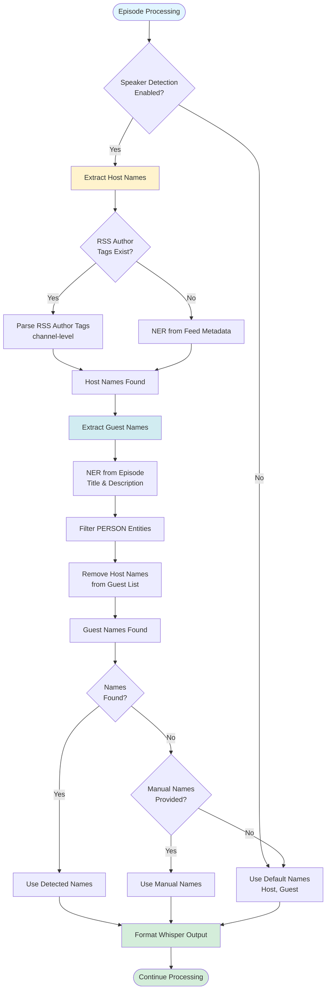
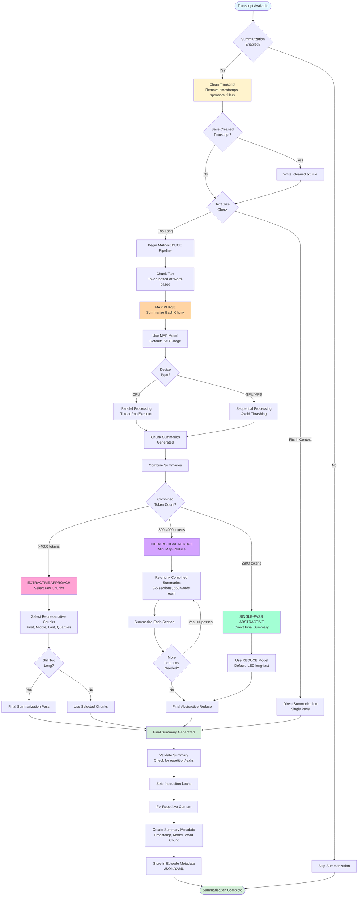
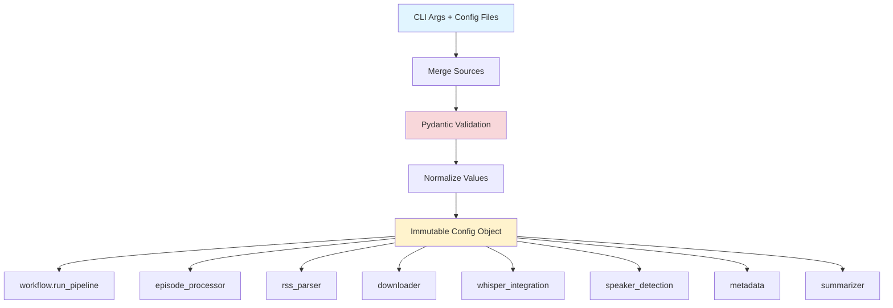
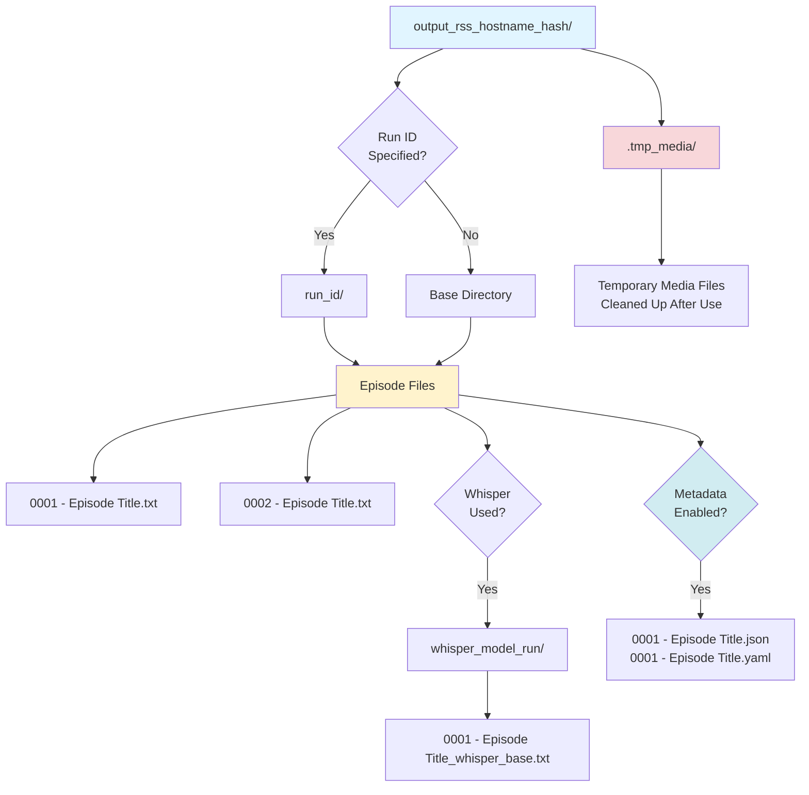

# Podcast Scraper Architecture

## Goals and Scope

- Provide a resilient pipeline that collects podcast episode transcripts from RSS feeds and fills gaps via Whisper transcription.
- Offer both CLI and Python APIs with a single configuration surface (`Config`) and deterministic filesystem layout.
- Keep the public surface area small (`Config`, `load_config_file`, `run_pipeline`, `service.run`, `service.run_from_config_file`, `cli.main`) while exposing well-factored submodules for advanced use.
- Provide a service API (`service.py`) optimized for non-interactive use (daemons, process managers) with structured error handling and exit codes.

## High-Level Flow

1. **Entry**: `podcast_scraper.cli.main` parses CLI args (optionally merging JSON/YAML configs) into a validated `Config` object and applies global logging preferences.
2. **Run orchestration**: `workflow.run_pipeline` coordinates the end-to-end job: output setup, RSS acquisition, episode materialization, transcript download, optional Whisper transcription, optional metadata generation, optional summarization, and cleanup.
3. **Episode handling**: For each `Episode`, `episode_processor.process_episode_download` either saves an existing transcript or enqueues media for Whisper.
4. **Speaker detection** (RFC-010): When automatic speaker detection is enabled, host names are extracted from RSS author tags (channel-level `<author>`, `<itunes:author>`, `<itunes:owner>`) as the primary source, falling back to NER extraction from feed metadata if no author tags exist. Guest names are extracted from episode-specific metadata (titles and descriptions) using Named Entity Recognition (NER) with spaCy. Manual speaker names are only used as fallback when detection fails.
5. **Transcription**: When Whisper fallback is enabled, `episode_processor.download_media_for_transcription` downloads media to a temp area and `episode_processor.transcribe_media_to_text` persists Whisper output using deterministic naming. Detected speaker names are integrated into screenplay formatting when enabled.
6. **Metadata generation** (PRD-004/RFC-011): When enabled, per-episode metadata documents are generated alongside transcripts, capturing feed-level and episode-level information, detected speaker names, and processing metadata in JSON/YAML format.
7. **Summarization** (PRD-005/RFC-012): When enabled, episode transcripts are summarized using local transformer models (BART, PEGASUS, LED) with a hybrid map-reduce strategy. Transcripts are first cleaned (removes timestamps, generic speaker tags, sponsor blocks) before summarization. The map phase (default: BART-large) chunks long transcripts and summarizes each chunk efficiently. The reduce phase (default: LED/long-fast) combines summaries using single-pass abstractive (≤800 tokens), mini map-reduce (800-4000 tokens, fully abstractive with re-chunking), or extractive selection (>4000 tokens). The mini map-reduce approach re-chunks combined summaries into 3-5 smaller sections (650 words each), summarizes each section, then performs a final abstractive reduce. Summaries are stored in metadata documents and include model information, word count, and generation timestamp. When `save_cleaned_transcript` is enabled (default: `true`), cleaned transcripts are saved to `.cleaned.txt` files alongside formatted transcripts for external testing and validation. Requires `torch` and `transformers` dependencies. Supports GPU acceleration via CUDA (NVIDIA) or MPS (Apple Silicon). See [Summarization Flow](#summarization-flow) for detailed architecture.
8. **Progress/UI**: All long-running operations report progress through the pluggable factory in `progress.py`, defaulting to `tqdm` in the CLI.

### Pipeline Flow Diagram

```mermaid
flowchart TD
    Start([CLI Entry]) --> Parse[Parse CLI Args & Config Files]
    Parse --> Validate[Validate & Normalize Config]
    Validate --> Setup[Setup Output Directory]
    Setup --> FetchRSS[Fetch & Parse RSS Feed]
    FetchRSS --> ExtractEpisodes[Extract Episode Metadata]
    ExtractEpisodes --> DetectSpeakers{Speaker Detection<br/>Enabled?}
    DetectSpeakers -->|Yes| ExtractHosts[Extract Host Names<br/>RSS Author Tags]
    ExtractHosts --> ExtractGuests[Extract Guest Names<br/>NER from Episodes]
    DetectSpeakers -->|No| ProcessEpisodes[Process Episodes]
    ExtractGuests --> ProcessEpisodes
    ProcessEpisodes --> CheckTranscript{Transcript<br/>Available?}
    CheckTranscript -->|Yes| DownloadTranscript[Download Transcript<br/>Concurrent]
    CheckTranscript -->|No| QueueWhisper[Queue for Whisper]
    DownloadTranscript --> SaveTranscript[Save Transcript File]
    QueueWhisper --> DownloadMedia[Download Media File]
    DownloadMedia --> Transcribe[Whisper Transcription<br/>Sequential]
    Transcribe --> FormatScreenplay[Format with Speaker Names]
    FormatScreenplay --> SaveTranscript
    SaveTranscript --> GenerateMetadata{Metadata<br/>Generation?}
    GenerateMetadata -->|Yes| CreateMetadata[Generate Metadata JSON/YAML]
    GenerateMetadata -->|No| Cleanup
    CreateMetadata --> GenerateSummary{Summarization<br/>Enabled?}
    GenerateSummary -->|Yes| Summarize[Generate Summary & Takeaways<br/>Local Transformer Models]
    GenerateSummary -->|No| Cleanup
    Summarize --> AddSummaryToMetadata[Add Summary to Metadata]
    AddSummaryToMetadata --> Cleanup[Cleanup Temp Files]
    Cleanup --> End([Complete])
    
    style Start fill:#e1f5ff
    style End fill:#d4edda
    style ProcessEpisodes fill:#fff3cd
    style Transcribe fill:#f8d7da
    style GenerateMetadata fill:#d1ecf1
```

## Module Responsibilities

- `cli.py`: Parse/validate CLI arguments, integrate config files, set up progress reporting, trigger `run_pipeline`. Optimized for interactive command-line use.
- `service.py`: Service API for programmatic/daemon use. Provides `service.run()` and `service.run_from_config_file()` functions that return structured `ServiceResult` objects. Works exclusively with configuration files (no CLI arguments), optimized for non-interactive use (supervisor, systemd, etc.). Entry point: `python -m podcast_scraper.service --config config.yaml`.
- `config.py`: Immutable Pydantic model representing all runtime options; JSON/YAML loader with strict validation and normalization helpers. Includes language configuration, NER settings, and speaker detection flags (RFC-010).
- `workflow.py`: Pipeline coordinator that orchestrates directory prep, RSS parsing, download concurrency, Whisper lifecycle, speaker detection coordination, and cleanup.
- `rss_parser.py`: Safe RSS/XML parsing, discovery of transcript/enclosure URLs, and creation of `Episode` models.
- `downloader.py`: HTTP session pooling with retry-enabled adapters, streaming downloads, and shared progress hooks.
- `episode_processor.py`: Episode-level decision logic, transcript storage, Whisper job management, delay handling, and file naming rules. Integrates detected speaker names into Whisper screenplay formatting.
- `filesystem.py`: Filename sanitization, output directory derivation, run suffix logic, and helper utilities for Whisper output paths.
- `whisper_integration.py`: Lazy loading of the third-party `openai-whisper` library, transcription invocation with language-aware model selection (preferring `.en` variants for English), and screenplay formatting helpers that use detected speaker names.
- `speaker_detection.py` (RFC-010): Named Entity Recognition using spaCy to extract PERSON entities from episode metadata, distinguish hosts from guests, and provide speaker names for Whisper screenplay formatting. spaCy is a required dependency.
- `summarizer.py` (PRD-005/RFC-012): Episode summarization using local transformer models (BART, PEGASUS, LED) to generate concise summaries from transcripts. Implements a hybrid map-reduce strategy: (1) **MAP phase** (default: BART-large): chunks transcript into manageable pieces (word-based for encoder-decoder models, token-based for others) and summarizes each chunk efficiently, (2) **REDUCE phase** (default: LED/long-fast): combines chunk summaries using a three-tier approach: single abstractive reduce (≤800 tokens), mini map-reduce (800-4000 tokens, fully abstractive with re-chunking into 3-5 sections), or extractive selection (>4000 tokens). The mini map-reduce approach re-chunks combined summaries into smaller sections (650 words each), summarizes each section, then performs a final abstractive reduce. This hybrid BART→LED approach is widely used in production systems for optimal balance of speed (MAP) and accuracy (REDUCE). Supports GPU acceleration via CUDA (NVIDIA) or MPS (Apple Silicon). Both MAP and REDUCE models are configurable via `summary_model` and `summary_reduce_model` config fields. Requires `torch` and `transformers` dependencies (optional). Models are automatically cached locally (default: `~/.cache/huggingface/hub/`) and reused across runs. Provides cache management utilities (`get_cache_size`, `prune_cache`) accessible via CLI (`--cache-info`, `--prune-cache`). Includes transcript cleaning functionality (`clean_transcript`) that removes timestamps, generic speaker tags, sponsor blocks, and collapses blank lines. When `save_cleaned_transcript` is enabled (default: `true`), cleaned transcripts are saved to `.cleaned.txt` files alongside formatted transcripts for external testing and validation. See [Summarization Flow](#summarization-flow) for detailed architecture.
- `progress.py`: Minimal global progress publishing API so callers can swap in alternative UIs.
- `models.py`: Simple dataclasses (`RssFeed`, `Episode`, `TranscriptionJob`) shared across modules. May be extended to include detected speaker metadata.
- `metadata.py` (PRD-004/RFC-011): Per-episode metadata document generation, capturing feed-level and episode-level information, detected speaker names, transcript sources, processing metadata, and optional summaries in structured JSON/YAML format. When summarization is enabled, reads formatted transcripts (screenplay or plain), cleans them using `summarizer.clean_transcript()`, and optionally saves cleaned versions to `.cleaned.txt` files. Opt-in feature for backwards compatibility.

### Module Dependencies Diagram

## Key Design Decisions

- **Typed, immutable configuration**: `Config` is a frozen Pydantic model, ensuring every module receives canonicalized values (e.g., normalized URLs, integer coercions, validated Whisper models). This centralizes validation and guards downstream logic.
- **Resilient HTTP interactions**: A per-thread `requests.Session` with exponential backoff retry (`LoggingRetry`) handles transient network issues while logging retries for observability.
- **Concurrent transcript pulls**: Transcript downloads are parallelized via `ThreadPoolExecutor`, guarded with locks when mutating shared counters/job queues. Whisper remains sequential to avoid GPU/CPU thrashing and to keep the UX predictable.
- **Deterministic filesystem layout**: Output folders follow `output_rss_<host>_<hash>` conventions. Optional `run_id` and Whisper suffixes create run-scoped subdirectories while `sanitize_filename` protects against filesystem hazards.
- **Dry-run and resumability**: `--dry-run` walks the entire plan without touching disk, while `--skip-existing` short-circuits work per episode, making repeated runs idempotent.
- **Pluggable progress/UI**: A narrow `ProgressFactory` abstraction lets embedding applications replace the default `tqdm` progress without touching business logic.
- **Optional Whisper dependency**: Whisper is imported lazily and guarded so environments without GPU support or `openai-whisper` can still run transcript-only workloads.
- **Optional summarization dependency** (PRD-005/RFC-012): Summarization requires `torch` and `transformers` dependencies and is imported lazily. When dependencies are unavailable, summarization is gracefully skipped. Models are automatically selected based on available hardware (MPS for Apple Silicon, CUDA for NVIDIA GPUs, CPU fallback), with memory-efficient options for systems like Apple M4 Pro. The summarization pipeline uses a map-reduce strategy: (1) Map phase chunks long transcripts and summarizes each chunk, (2) Reduce phase intelligently combines summaries using single-pass abstractive (≤800 tokens), mini map-reduce (800-4000 tokens, fully abstractive with re-chunking into 3-5 sections of 650 words each), or extractive selection (>4000 tokens) based on combined summary size. The mini map-reduce approach ensures fully abstractive processing for medium-sized combined summaries by re-chunking them into smaller sections, summarizing each section, then performing a final abstractive reduce. Transformer models are automatically cached locally (default: `~/.cache/huggingface/hub/` for newer transformers, `~/.cache/huggingface/transformers/` for older versions) and reused across runs to avoid re-downloading. Cache management is available via CLI (`--cache-info`, `--prune-cache`) and programmatically via `summarizer.get_cache_size()` and `summarizer.prune_cache()`.
- **Language-aware processing** (RFC-010): A single `language` configuration drives both Whisper model selection (preferring English-only `.en` variants) and NER model selection (e.g., `en_core_web_sm`), ensuring consistent language handling across the pipeline.
- **Automatic speaker detection** (RFC-010): Named Entity Recognition extracts speaker names from episode metadata transparently. Manual speaker names (`--speaker-names`) are ONLY used as fallback when automatic detection fails, not as override. spaCy is a required dependency for speaker detection.
- **Host/guest distinction**: Host detection prioritizes RSS author tags (channel-level only) as the most reliable source, falling back to NER extraction from feed metadata when author tags are unavailable. Guests are always detected from episode-specific metadata using NER, ensuring accurate speaker labeling in Whisper screenplay output.
- **Local-first summarization** (PRD-005/RFC-012): Summarization defaults to local transformer models for privacy and cost-effectiveness. API-based providers (OpenAI, Anthropic) are supported in configuration but not yet implemented. Long transcripts are handled via chunking strategies, and memory optimization is applied for GPU backends (CUDA/MPS). Models are automatically cached and reused across runs, with cache management utilities available via CLI and programmatic APIs.

### Episode Processing Flow

```mermaid
flowchart LR
    Episode[Episode Object] --> CheckSkip{Skip<br/>Existing?}
    CheckSkip -->|Yes| CheckExists{File<br/>Exists?}
    CheckExists -->|Yes| Skip[Skip Episode]
    CheckExists -->|No| CheckTranscript
    CheckSkip -->|No| CheckTranscript{Transcript<br/>URL?}
    CheckTranscript -->|Yes| Download[Download Transcript<br/>ThreadPoolExecutor]
    CheckTranscript -->|No| CheckWhisper{Whisper<br/>Enabled?}
    CheckWhisper -->|No| Skip
    CheckWhisper -->|Yes| QueueJob[Create TranscriptionJob]
    Download --> SaveFile[Save to Filesystem]
    QueueJob --> WaitQueue[Wait in Queue]
    WaitQueue --> ProcessSeq[Process Sequentially]
    ProcessSeq --> DownloadMedia[Download Media]
    DownloadMedia --> Transcribe[Whisper Transcribe]
    Transcribe --> Format[Format Screenplay<br/>with Speakers]
    Format --> SaveFile
    SaveFile --> Metadata{Generate<br/>Metadata?}
    Metadata -->|Yes| GenerateSummary{Summarization<br/>Enabled?}
    Metadata -->|No| Complete[Complete]
    GenerateSummary -->|Yes| Summarize[Generate Summary & Takeaways]
    GenerateSummary -->|No| WriteMeta
    Summarize --> WriteMeta[Write Metadata File<br/>with Summary]
    WriteMeta --> Complete
    Skip --> Complete
    
    style Episode fill:#e1f5ff
    style Download fill:#fff3cd
    style Transcribe fill:#f8d7da
    style Complete fill:#d4edda
```

### Speaker Detection Flow

### Summarization Flow

The summarization system implements a sophisticated hybrid MAP-REDUCE architecture to handle transcripts of any length efficiently. This flow is triggered when `generate_summaries` is enabled and a transcript is available.

#### Summarization Process Details

**1. Transcript Cleaning Phase**

- Removes timestamps (language-agnostic: `[00:12:34]` patterns)
- Strips generic speaker tags while preserving actual speaker names
- Removes sponsor blocks and outro sections
- Collapses excessive blank lines
- Optionally saves cleaned transcript to `.cleaned.txt` for validation

**2. Size Assessment & Model Selection**

- Checks if transcript fits within model's context window
- If fits: performs single-pass direct summarization (most efficient)
- If too long: initiates MAP-REDUCE pipeline
- Selects MAP model (default: BART-large for chunk summaries)
- Selects REDUCE model (default: LED long-fast for final combination)

**3. MAP Phase (Chunk Summarization)**

- **Chunking Strategy**: Token-based chunking with configurable overlap
  - Encoder-decoder models (BART/PEGASUS): forced to 600 tokens per chunk
  - Long-context models (LED): can handle larger chunks
  - Overlap: 10% of chunk size for context continuity
- **Parallel vs Sequential Processing**:
  - CPU devices: parallel processing with ThreadPoolExecutor (up to 4 workers)
  - GPU/MPS devices: sequential to avoid memory thrashing
- **Progress Tracking**: Logs every 5 chunks with ETA estimation
- **Output**: Collection of chunk summaries (80-160 tokens each)

**4. REDUCE Phase (Summary Combination)**

The REDUCE phase employs a three-tier decision tree based on combined summary size:

**Tier 1: Single-Pass Abstractive (≤800 tokens)**

- Most efficient approach for short combined summaries
- Uses REDUCE model (default: LED) to generate final summary in one pass
- Target: 200-480 tokens final summary
- No chunk selection - uses ALL summaries for completeness

**Tier 2: Hierarchical Reduce (800-4000 tokens)**

- Fully abstractive approach for medium-sized combined summaries
- Implements mini map-reduce strategy:
  1. Re-chunk combined summaries into 3-5 sections (650 words each)
  2. Summarize each section (80-160 tokens per section)
  3. Check if result is small enough for final reduce
  4. If still too large, repeat (up to 4 iterations max)
  5. Final abstractive reduce when size permits
- Uses token-based chunking to guarantee no truncation
- Uses ALL section summaries (no selection) for accuracy
- Prevents extractive fallback by iteratively reducing size

**Tier 3: Extractive Approach (>4000 tokens)**

- Safety fallback for very large combined summaries
- Selects representative chunks instead of using all:
  - ≤3 chunks: use all
  - ≤10 chunks: use first, middle, last
  - >10 chunks: use first, 25th, 50th, 75th percentile, last
- One optional final summarization pass if selected chunks still too long
- Prioritizes avoiding hallucination over completeness

**5. Quality Validation**

- Strips instruction leaks (removes prompt text that leaked into output)
- Detects and fixes repetitive content (deduplicates repeated sentences)
- Validates summary length (flags if suspiciously close to input length)
- Returns empty string if quality validation fails

**6. Metadata Storage**

- Creates `SummaryMetadata` object with:
  - Generated summary text
  - Generation timestamp
  - Model used (MAP and optionally REDUCE)
  - Provider (local/openai/anthropic)
  - Word count of original transcript
- Stores in episode metadata document (PRD-004/RFC-011)
- Respects `--skip-existing` flag (regenerates if transcription source changes)

#### Model Selection Strategy

**MAP Model (Chunk Summarization)**

- Default: `facebook/bart-large-cnn` (best quality, ~2GB)
- Fast option: `sshleifer/distilbart-cnn-12-6` (~300MB)
- Alternative: `google/pegasus-large` (trained for summarization, ~2.5GB)

**REDUCE Model (Final Combination)**

- Default: `allenai/led-base-16384` (long-context, ~1GB, handles 16k tokens)
- High quality: `allenai/led-large-16384` (~2.5GB, better accuracy)
- Same as MAP: Falls back to MAP model if not specified

**Device Selection**

- Auto-detects: MPS (Apple Silicon) → CUDA (NVIDIA) → CPU
- GPU/MPS: Sequential processing, memory-efficient
- CPU: Parallel processing (4 workers), slower but works without GPU

#### Performance Characteristics

- **Direct Summarization**: <5s for transcripts ≤1024 tokens
- **MAP-REDUCE**: ~3s per chunk (varies by model and device)
- **Parallel Processing**: 3-4x speedup on CPU with 4 workers
- **Memory Usage**:
  - BART-large: ~2GB GPU memory
  - DistilBART: ~300MB (recommended for memory-constrained systems)
  - LED-base: ~1GB (reduce phase)

#### Error Handling

- Model loading failures: Log warning, skip summarization
- Out-of-memory errors: Log error, skip summarization (no automatic fallback)
- Buffer size errors (MPS): Log error with device details
- Validation failures: Return empty summary rather than hallucinated content
- Summarization failures don't block transcript processing

## Constraints and Assumptions

- Python 3.10+ with third-party packages: `requests`, `tqdm`, `defusedxml`, `platformdirs`, `pydantic`, `PyYAML`, `spacy` (required for speaker detection), and optionally `openai-whisper` + `ffmpeg` when transcription is required, and optionally `torch` + `transformers` when summarization is required.
- Network-facing operations assume well-formed HTTPS endpoints; malformed feeds raise early during parsing to avoid partial state.
- Whisper transcription supports multiple languages via `language` configuration, with English (`"en"`) as the default. Model selection automatically prefers `.en` variants for English content. Transcription remains sequential by design; concurrent transcription is intentionally out of scope due to typical hardware limits.
- Speaker name detection via NER (RFC-010) requires spaCy. When automatic detection fails, the system falls back to manual speaker names (if provided) or default `["Host", "Guest"]` labels.
- Output directories must live in safe roots (cwd, user home, or platform data/cache dirs); other locations trigger warnings for operator review.

### Configuration Flow

## Data and File Layout

- `models.Episode` encapsulates the RSS item, chosen transcript URLs, and media enclosure metadata, keeping parsing concerns separate from processing. May be extended to include detected speaker names (RFC-010).
- Transcript filenames follow `<####> - <episode_title>[ _<run_suffix>].<ext>` with extensions inferred from declared types, HTTP headers, or URL heuristics.
- Whisper output names append the Whisper model/run identifier to differentiate multiple experimental runs inside the same base directory. Screenplay formatting uses detected speaker names when available.
- Temporary media downloads land in `<output>/ .tmp_media/` and always get cleaned up (best effort) after transcription completes.
- Episode metadata documents (per PRD-004/RFC-011) are generated when `generate_metadata` is enabled, storing detected speaker names, feed information, transcript sources, and other episode details alongside transcripts in JSON/YAML format for downstream use cases. When summarization is enabled, metadata documents include summary and key takeaways fields with model information and generation timestamps.

### Filesystem Layout

## Error Handling and Resilience

- RSS and HTTP failures raise `ValueError` early with descriptive messages; CLI wraps these in exit codes for scripting.
- Transcript/Media downloads log warnings rather than hard-fail the pipeline, allowing other episodes to proceed.
- Filesystem operations sanitize user-provided paths, emit warnings when outside trusted roots, and handle I/O errors gracefully.
- Unexpected exceptions inside worker futures are caught and logged without terminating the executor loop.

## Extensibility Points

- **Configuration**: Extend `Config` (and CLI) when introducing new features; validation rules keep downstream logic defensive. Language and NER configuration (RFC-010) demonstrate this pattern.
- **Progress**: Replace `progress.set_progress_factory` to integrate with custom UIs or disable progress output entirely.
- **Download strategy**: `downloader` centralizes HTTP behavior—alternate adapters or auth strategies can be injected by decorating `fetch_url`/`http_get`.
- **Episode transforms**: New transcript processors can reuse `models.Episode` and `filesystem` helpers without modifying the main pipeline.
- **CLI embedding**: `cli.main` accepts override callables (`apply_log_level_fn`, `run_pipeline_fn`, `logger`) to facilitate testing and reuse from other entry points.
- **Speaker detection** (RFC-010): NER implementation is modular and can be extended with custom heuristics, additional entity types, or alternative NLP libraries. Configuration allows disabling detection behavior or providing manual fallback names.
- **Language support**: Language configuration drives both Whisper and NER model selection, enabling multi-language support through consistent configuration. New languages can be added by extending model selection logic and spaCy model support.
- **Metadata generation** (PRD-004/RFC-011): Metadata document generation is opt-in and can be extended with additional fields or alternative output formats. The schema is versioned to support future evolution.
- **Summarization** (PRD-005/RFC-012): Summarization is opt-in and integrated with metadata generation. Local transformer models are preferred for privacy and cost-effectiveness, with automatic hardware-aware model selection. The implementation supports multiple model architectures (BART, DistilBART) and can be extended with additional models or API-based providers. Long transcript handling via chunking strategies ensures scalability. Models are automatically cached locally and reused across runs. Cache management utilities (`get_cache_size`, `prune_cache`, `format_cache_size`) are available via CLI (`--cache-info`, `--prune-cache`) and programmatically for disk space management.

## Testing Notes

- `tests/test_podcast_scraper.py` acts as an integration-focused suite, simulating CLI usage, error cases, transcript selection heuristics, and Whisper fallbacks via mocks. This keeps the public API stable and documents expected behaviors for future refactors.
- Speaker detection tests (RFC-010) should cover RSS author tag extraction, NER extraction scenarios, host/guest distinction, manual fallback behavior, and integration with Whisper screenplay formatting.
- Metadata generation tests (PRD-004/RFC-011) should cover JSON/YAML output formats, schema validation, file naming conventions, and integration with the episode processing pipeline.
- Summarization tests (PRD-005/RFC-012) should cover:
  - Transcript cleaning (timestamp removal, speaker normalization, sponsor block detection)
  - Model selection logic (MAP vs REDUCE models, device detection)
  - MAP phase (chunking strategies, parallel vs sequential processing)
  - REDUCE phase decision tree (single-pass abstractive, hierarchical reduce, extractive approach)
  - Quality validation (instruction leak detection, repetitive content handling)
  - Long transcript handling (chunking, mini map-reduce iterations)
  - Error handling (OOM, buffer size errors, model loading failures)
  - Memory optimization (GPU/MPS/CPU device selection)
  - Integration with metadata generation
  - See [Summarization Flow](#summarization-flow) for architecture details
- See `docs/TESTING_STRATEGY.md` for comprehensive testing requirements, patterns, and infrastructure.
