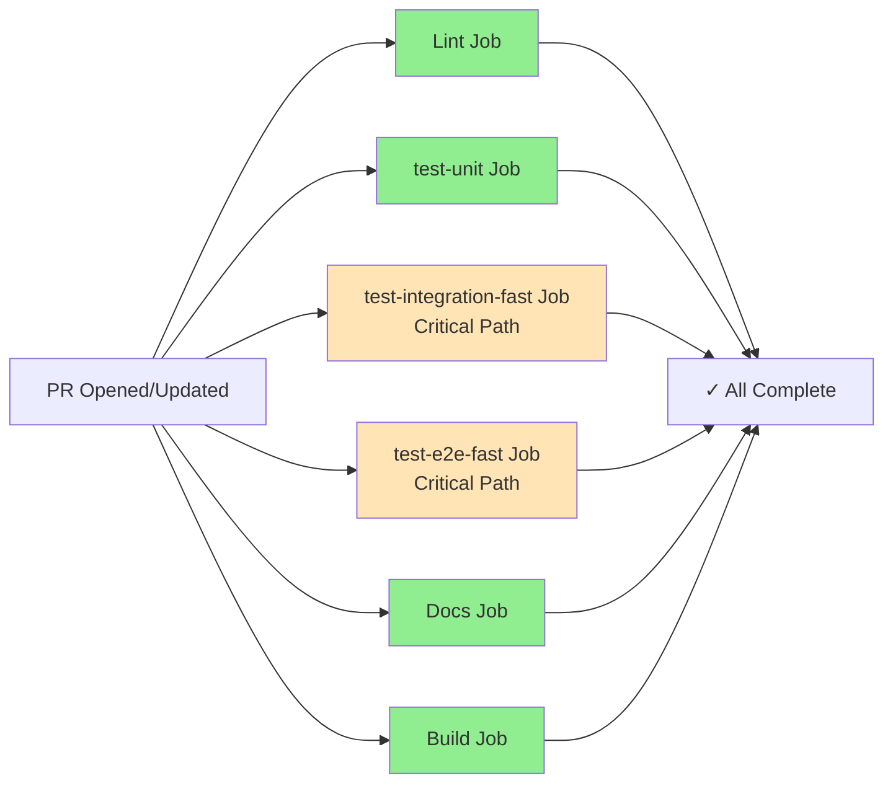

# CI/CD Pipeline

## Overview

The Podcast Scraper project uses GitHub Actions for continuous integration and deployment. The CI/CD
pipeline consists of **six main workflows** that automate testing, code quality checks, security
scanning, Docker validation, documentation deployment, and metrics collection.

### Workflows Summary

| Workflow                  | File             | Purpose                                               | Trigger                                                                     |
| ------------------------- | ---------------- | ----------------------------------------------------- | --------------------------------------------------------------------------- |
| **Python Application**    | `python-app.yml` | Main CI pipeline with testing, linting, and builds    | Push/PR to `main` (only when Python/config files change)                    |
| **Documentation Deploy**  | `docs.yml`       | Build and deploy MkDocs documentation to GitHub Pages | Push to `main`, PR with doc changes, manual                                 |
| **CodeQL Security**       | `codeql.yml`     | Security vulnerability scanning                       | Push/PR to `main` (only when code/workflow files change), scheduled weekly  |
| **Docker Build & Test**   | `docker.yml`     | Build and test Docker images                          | Push to `main` (all), PRs (Dockerfile/.dockerignore only)                   |
| **Snyk Security Scan**    | `snyk.yml`       | Dependency and Docker image vulnerability scanning    | Push/PR to `main`, scheduled weekly (Mondays), manual                       |
| **Nightly Comprehensive** | `nightly.yml`    | Full test suite with comprehensive metrics collection | Scheduled daily (2 AM UTC), manual                                          |

---

## Complete Pipeline Visualization

````mermaid
graph TB
    subgraph "Trigger Events"
        T1[Push to main]
        T2[Pull Request to main]
        T3[Schedule: Weekly Thu 13:17 UTC]
        T4[Manual Dispatch]
    end

    subgraph "Python Application Workflow"
        P1[Lint Job]
        P2[Test Job]
        P3[Docs Build Job]
        P4[Build Package Job]

        P1 -->|Format Check| P1A[Black/isort]
        P1 -->|Linting| P1B[flake8]
        P1 -->|Markdown| P1C[markdownlint]
        P1 -->|Type Check| P1D[mypy]
        P1 -->|Security| P1E[bandit/safety]

```python

        P2 -->|Install ML deps| P2A[pytest + coverage]

```python

        P3 -->|Install docs deps| P3A[mkdocs build]

```python

        P4 -->|Install build tools| P4A[python -m build]
    end

```
        D2[Deploy to Pages]

```python

        D1 -->|mkdocs build| D1A[Generate Site]
        D1 -->|Upload| D1B[Pages Artifact]
        D1B -->|Only on push| D2
        D2 -->|Deploy| D2A[GitHub Pages]
    end

```

```python

    C1 -->|Python Analysis| C1A[Scan Python Code]
    C1 -->|Actions Analysis| C1B[Scan GitHub Actions]
    end

```python
    subgraph "Docker Workflow"
    DOCK1[Build Docker Image]
    DOCK2[Test Docker Image]
    DOCK3[Hadolint Validation]
    DOCK1 --> DOCK2
    DOCK1 --> DOCK3
    end

    subgraph "Snyk Workflow"
    SNYK1[Dependencies Scan]
    SNYK2[Docker Scan]
    SNYK3[Monitor]
    end

```python

    T1 --> P1 & P2 & P3 & P4
    T2 --> P1 & P2 & P3 & P4

```python

    T1 --> D1
    T2 --> D1
    T4 --> D1

```python

    T1 --> C1
    T2 --> C1
    T3 --> C1

```python

    T1 --> DOCK1
    T2 -->|Only if Dockerfile/.dockerignore change| DOCK1

```python

    T1 --> SNYK1 & SNYK2
    T2 --> SNYK1 & SNYK2
    T3 --> SNYK3

```
    style P3 fill:#e1f5e1
    style P4 fill:#e1f5e1
    style D1 fill:#e1e5ff
    style D2 fill:#e1e5ff
    style C1 fill:#ffe1e1
    style DOCK1 fill:#fff4e1
    style SNYK1 fill:#ffe1f5
```text

**File:** `.github/workflows/python-app.yml`
**Triggers:** Push and Pull Requests to `main` branch (only when relevant files change)

**Path Filters:**

- `**.py` - All Python source files
- `tests/**` - Test files
- `pyproject.toml` - Project configuration
- `Makefile` - Build configuration
- `Dockerfile`, `.dockerignore` - Docker files
- `.github/workflows/python-app.yml` - Workflow itself

**Skips when:** Only documentation, markdown, or non-code files change

### Workflow Trigger Conditions

Each workflow only runs when specific files are modified:

**`python-app.yml` Workflow:**
- `**.py` (any Python file)
- `tests/**` (any test file)
- `pyproject.toml`
- `Makefile`
- `Dockerfile`
- `.dockerignore`

**`docker.yml` Workflow:**
- **Push to main:** All changes (Dockerfile, .dockerignore, pyproject.toml, *.py)
- **Pull requests:** Only `Dockerfile` or `.dockerignore` changes

**`snyk.yml` Workflow:**
- `**.py`
- `pyproject.toml`
- `Dockerfile`
- `.dockerignore`

**`codeql.yml` Workflow:**
- `**.py`
- `.github/workflows/**`

**`docs.yml` Workflow:**
- **Note:** Docs workflow does NOT trigger on PRs (only on push to main)

This is the main CI pipeline that ensures code quality, runs tests, builds documentation, and validates the package.

### Two-Tier Testing Strategy

The workflow uses a **two-tier testing strategy** optimized for speed and coverage:

1. **Pull Requests:** Fast critical path tests only (quick feedback, ~10-15 min)
2. **Push to Main:** Full test suite only (complete validation, no redundant fast tests)

### Pull Request Execution Flow

On pull requests, jobs run in parallel for fast feedback:



- **Parallel execution:** All jobs run simultaneously for maximum speed
- **Critical path focus:** Fast jobs run only critical path tests
- **Fast feedback:** Critical path tests provide early pass/fail signal
- **No coverage job on PRs:** Coverage is handled by individual test jobs

### Push to Main Execution Flow

On push to main branch, separate test jobs run in parallel:

```mermaid
graph LR
    A[Push to Main] --> B[Lint Job]
    A --> C[test-unit Job]
    A --> D[test-integration Job]
    A --> E[test-e2e Job<br/>All E2E Tests]
    A --> F[Docs Job]
    A --> G[Build Job]

    B --> H[✓ All Complete]
    C --> H
    D --> H
    E --> H
    F --> H
    G --> H

    style B fill:#90EE90
    style C fill:#90EE90
    style D fill:#90EE90
    style E fill:#FFE4B5
    style F fill:#90EE90
    style G fill:#90EE90
```yaml

- **Separate jobs:** Maximum parallelization for fastest overall completion
- **All tests run:** Includes slow integration and slow E2E tests
- **Complete validation:** Full test coverage before code is merged

### Job Details

#### 1. Lint Job (Always Runs)

**Purpose:** Perform quick code quality checks without heavy ML dependencies

**When:** Both PRs and push to main

**Duration:** ~1-2 minutes

**Steps:**

1. Checkout code
2. Set up Python 3.11 with pip caching
3. Set up Node.js 20 for markdown linting
4. Install dev dependencies (excluding ML packages)
5. Install markdownlint-cli
6. Run all lint checks:
   - `make format-check` - Black & isort formatting validation
   - `make lint` - flake8 code linting
   - `make lint-markdown` - Markdown file linting
   - `make type` - mypy static type checking
   - `make security` - bandit & pip-audit security scanning

**Why separate from test?** Linting is much faster without ML dependencies, providing quick feedback.

---

#### 2. test-integration-fast Job (Runs on PRs only, with exceptions)

**Purpose:** Run critical path integration tests for fast PR feedback

**When:** Pull requests only (not on push to main, with exceptions for docs-only PRs)

**Conditional Execution:**

```yaml
if: |
  github.event_name == 'pull_request' &&
  github.event.pull_request.head.ref != 'fix/ai-guidelines-linting' &&
  !contains(github.event.pull_request.head.ref, 'docs/')
```

- Push to main (full integration tests run instead)
- PR branch is `fix/ai-guidelines-linting`
- PR branch name contains `docs/`

**Duration:** ~5-8 minutes

**What it runs:** `pytest tests/integration/ -m "integration and critical_path" --durations=20`
- **Critical path integration tests only:** Uses `critical_path` marker, includes ALL critical path tests (even if slow)
- **Network guard:** `--disable-socket --allow-hosts=127.0.0.1,localhost`
- **Re-runs enabled:** 2 retries with 1s delay for flaky tests
- **Parallel execution:** Uses `-n auto` for speed
- **Duration monitoring:** `--durations=20` shows the 20 slowest tests for optimization

**Key Features:**
- **Fast feedback:** Critical path tests only (not all integration tests)
- **Includes slow critical path tests:** Critical path tests cannot be excluded even if slow - they must run to validate core functionality
- **Slow test monitoring:** Use `--durations=20` output to identify slow tests and optimize them separately
- **Network isolation:** Enforced via pytest-socket
- **Re-runs:** Handles flaky tests automatically
- **ML dependencies:** Installs ML dependencies (required for real Whisper in integration tests)

---

#### 3. test-e2e-fast Job (Runs on PRs only, with exceptions)

**Purpose:** Run critical path E2E tests for fast PR feedback

**When:** Pull requests only (not on push to main, with exceptions for docs-only PRs)

**Conditional Execution:**

```yaml
if: |
  github.event_name == 'pull_request' &&
  github.event.pull_request.head.ref != 'fix/ai-guidelines-linting' &&
  !contains(github.event.pull_request.head.ref, 'docs/')
```

- Push to main (full E2E tests run instead)
- PR branch is `fix/ai-guidelines-linting`
- PR branch name contains `docs/`

**Duration:** ~8-12 minutes

**What it runs:** `pytest tests/e2e/ -m "e2e and critical_path" --durations=20`
- **Critical path E2E tests only:** Uses `critical_path` marker, includes ALL critical path tests (even if slow)
- **Network guard:** `--disable-socket --allow-hosts=127.0.0.1,localhost`
- **Re-runs enabled:** 2 retries with 1s delay for flaky tests
- **Parallel execution:** Uses `-n auto` for speed
- **Duration monitoring:** `--durations=20` shows the 20 slowest tests for optimization

**Key Features:**
- **Fast feedback:** Critical path tests only (not all E2E tests)
- **Includes slow critical path tests:** Critical path tests cannot be excluded even if slow - they must run to validate core functionality
- **Slow test monitoring:** Use `--durations=20` output to identify slow tests and optimize them separately
- **Network isolation:** Enforced via pytest-socket
- **Re-runs:** Handles flaky tests automatically
- **ML dependencies:** Installs ML dependencies (required for real Whisper in E2E tests)
- **Real ML models:** Uses real Whisper, spaCy, and Transformers models (no mocks)

---

#### 4. test-unit Job (Always Runs)

**Purpose:** Run unit tests separately for maximum parallelization

**When:** Both PRs and push to main

**Duration:** ~2-5 minutes

**What it runs:** `pytest tests/unit/ -v --tb=short -n auto`
- **Unit tests:** All unit tests (no markers, runs all unit tests)
- **Network isolation:** Enforced and verified
- **Import verification:** Ensures modules work without ML dependencies
- **Parallel execution:** Uses `-n auto` for speed

**Key Features:**
- **No ML dependencies:** Fast execution (dev dependencies only)
- **Network isolation:** Verified with dedicated test (`test_network_isolation.py`)
- **Test count verification:** Ensures at least 50 unit tests run

---

#### 5. preload-ml-models Job (Main Branch Only)

**Purpose:** Preload ML models to ensure they are cached for integration and E2E tests

**When:** Push to main branch only

**Conditional Execution:**

```yaml
if: github.event_name == 'push' && github.ref == 'refs/heads/main'
```

**Steps:**
1. Checkout code
2. Free disk space
3. Set up Python 3.11
4. Cache ML models (for faster execution)
5. Install full dependencies (including ML)
6. Preload ML models (if cache miss): `make preload-ml-models`

**Key Features:**
- **Dependency for full test jobs:** `test-integration` and `test-e2e` depend on this job
- **ML model caching:** Ensures models are available before test jobs run
- **Efficiency:** Models are cached, so subsequent jobs can use them immediately

---

#### 6. test-integration-slow Job (Main Branch Only)

**Purpose:** Run slow integration tests (includes slow/ml_models tests)

**When:** Push to main branch only

**Conditional Execution:**

```yaml
if: github.event_name == 'push' && github.ref == 'refs/heads/main'
needs: [preload-ml-models]
```

**Duration:** ~10-15 minutes

**What it runs:** `pytest tests/integration/ -m "integration and (slow or ml_models)"`
- **Slow integration tests only:** Includes tests marked with `slow` or `ml_models`
- **Re-runs enabled:** 2 retries with 1s delay for flaky tests
- **Network guard:** `--disable-socket --allow-hosts=127.0.0.1,localhost`
- **Parallel execution:** Uses `-n auto` for speed
- **ML dependencies:** Required (includes ML packages)

**Key Features:**
- **Slow tests only:** Focuses on tests that require ML models or are slow
- **Re-runs:** Handles flaky tests automatically
- **ML model caching:** Uses models preloaded by `preload-ml-models` job
- **Test count verification:** Ensures at least 10 slow integration tests run

---

#### 7. test-e2e Job (Main Branch Only)

**Purpose:** Run all E2E tests (full suite)

**When:** Push to main branch only

**Conditional Execution:**

```yaml
if: github.event_name == 'push' && github.ref == 'refs/heads/main'
needs: [preload-ml-models]
```

**Duration:** ~20-30 minutes

**What it runs:** `pytest tests/e2e/ -m e2e`
- **All E2E tests:** Full suite (no marker filtering)
- **Re-runs enabled:** 2 retries with 1s delay for flaky tests
- **Network guard:** `--disable-socket --allow-hosts=127.0.0.1,localhost`
- **Parallel execution:** Uses `-n auto` for speed
- **ML dependencies:** Required (includes ML packages)

**Key Features:**
- **Complete validation:** All E2E tests run (critical path + non-critical)
- **Network isolation:** Enforced via pytest-socket
- **Re-runs:** Handles flaky tests automatically
- **ML model caching:** Uses models preloaded by `preload-ml-models` job
- **Test count verification:** Ensures at least 50 E2E tests run

---

#### 7. Docs Build Job (Always Runs)

**Purpose:** Validate documentation builds correctly

**When:** Both PRs and push to main

**Duration:** ~2-3 minutes

**Steps:**

1. Checkout code
2. Set up Python 3.11 with pip caching (docs + pyproject.toml)
3. Install documentation dependencies + ML packages (needed for mkdocstrings API docs)
4. Build documentation: `make docs`
   - Runs `mkdocs build --strict`
   - Generates API documentation from docstrings
   - Validates all internal links

**Note:** This job runs in the main workflow to validate docs on every PR, even if not touching doc files.

---

#### 8. Build Package Job (Always Runs)

**Purpose:** Validate the package can be built for distribution

**When:** Both PRs and push to main

**Duration:** ~1-2 minutes

**Steps:**

1. Checkout code
2. Set up Python 3.11 with pip caching
3. Install build tools (`pip install build`)
4. Build package: `make build`
   - Creates source distribution (`.tar.gz`)
   - Creates wheel distribution (`.whl`)
   - Validates `pyproject.toml` configuration

---

### Additional Jobs (Conditional)

#### 9. docker-build Job (Runs if Docker files changed)

**Purpose:** Build and test Docker image

**Conditional Execution:**
- Only runs if PR modifies: `Dockerfile`, `.dockerignore`, `pyproject.toml`, or `*.py`

**Duration:** ~5-8 minutes

**Steps:**
1. Checkout code
2. Free disk space
3. Set up Docker Buildx
4. Build Docker image (default)
5. Build Docker image (multiple models variant)
6. Test Docker image (help command)
7. Test Docker image (version check)
8. Test Docker image (error handling)
9. Validate Dockerfile with hadolint

**Runs in parallel with:** All other jobs

#### 10. snyk-dependencies Job (Runs if code/Docker files changed)

**Purpose:** Security scan of Python dependencies

**Conditional Execution:**
- Only runs if PR modifies: `**.py`, `pyproject.toml`, `Dockerfile`, or `.dockerignore`

**Duration:** ~3-5 minutes

**Steps:**
1. Checkout code
2. Set up Python 3.11
3. Install dependencies (including ML)
4. Run Snyk scan (Python dependencies)
5. Upload results to GitHub Code Scanning

**Note:** `continue-on-error: true` (doesn't fail PR)

#### 11. snyk-docker Job (Runs if code/Docker files changed)

**Purpose:** Security scan of Docker image

**Conditional Execution:**
- Only runs if PR modifies: `**.py`, `pyproject.toml`, `Dockerfile`, or `.dockerignore`
- Skips on scheduled runs: `if: github.event_name != 'schedule'`

**Duration:** ~8-12 minutes

**Steps:**
1. Checkout code
2. Free disk space
3. Set up Docker Buildx
4. Build Docker image
5. Verify Docker image exists
6. Run Snyk scan (Docker image)
7. Upload results to GitHub Code Scanning

**Note:** `continue-on-error: true` (doesn't fail PR)

#### 12. snyk-monitor Job (Always Runs on PR)

**Purpose:** Monitor dependencies for security updates

**Conditional Execution:**

```yaml
if: github.event_name == 'pull_request' || github.event_name == 'schedule'
```

**Steps:**
1. Checkout code
2. Set up Python 3.11
3. Install dependencies (including ML)
4. Run Snyk monitor

**Note:** `continue-on-error: true` (doesn't fail PR)

#### 13. analyze Job (Runs if Python/workflow files changed)

**Purpose:** CodeQL security analysis

**Conditional Execution:**
- Only runs if PR modifies: `**.py` or `.github/workflows/**`

**Duration:** ~10-15 minutes

**Steps:**
1. Checkout repository
2. Initialize CodeQL (for Python and Actions)
3. Perform CodeQL analysis

**Runs in parallel with:** All other jobs

### Critical Path Testing Strategy

On pull requests, multiple test jobs run in parallel to provide fast feedback:

#### Critical Path Jobs (Run in Parallel)

**Purpose:** Quick pass/fail signal on critical path tests

**Jobs:**
- `test-unit` - All unit tests (~2-5 min)
- `test-integration-fast` - Critical path integration tests only (~5-8 min)
- `test-e2e-fast` - Critical path E2E tests only (~8-12 min)

**Features:**
- Run in parallel (no waiting)
- Use `critical_path` marker to filter tests
- Network isolation enforced
- Re-runs enabled for flaky test handling
- No coverage overhead (faster execution)

**When to check:** After ~8-12 minutes for early feedback

#### Why This Design?

1. **Fast feedback:** Critical path jobs provide early signal if something is broken
2. **Parallel execution:** All critical path jobs run simultaneously, no sequential waiting
3. **Simplicity:** No separate coverage job - each test job handles its own validation
4. **Efficiency:** Critical path tests focus on what matters most for fast feedback

#### What About Non-Critical Tests?

Non-critical path integration and E2E tests are excluded from PRs for faster feedback. They run on the main branch only:

- **All integration tests:** Run in `test-integration` job on main branch (after `preload-ml-models`)
- **All E2E tests:** Run in `test-e2e` job on main branch (after `preload-ml-models`)

This ensures:
- ✅ Fast PR feedback (critical path tests only)
- ✅ Full validation on main branch (all tests run)
- ✅ Balance between speed and coverage

### Jobs That DO NOT Run on PRs

**`preload-ml-models` Job:**
- **Condition:** `if: github.event_name == 'push' && github.ref == 'refs/heads/main'`
- **Only runs on:** Push to main branch
- **Does NOT run on:** Pull requests
- **Purpose:** Preload ML models for full test suite jobs

**`test-integration` Job:**
- **Condition:** `if: github.event_name == 'push' && github.ref == 'refs/heads/main'`
- **Only runs on:** Push to main branch
- **Does NOT run on:** Pull requests
- **Runs:** All integration tests (full suite)
- **Dependencies:** `needs: [preload-ml-models]`

**`test-e2e` Job:**
- **Condition:** `if: github.event_name == 'push' && github.ref == 'refs/heads/main'`
- **Only runs on:** Push to main branch
- **Does NOT run on:** Pull requests
- **Runs:** All E2E tests (full suite)
- **Dependencies:** `needs: [preload-ml-models]`

### When Do Slow Jobs Run? (Important Clarification)

**"Push to main"** means code is actually committed to the `main` branch. This happens in two scenarios:

1. **PR is merged** → Code is pushed to main → Slow jobs run
2. **Direct push to main** (bypassing PR) → Slow jobs run

**Timeline: PR Creation → Merge → Slow Jobs**

```
│                                                              │
│ ❌ Full suite jobs DO NOT run:                               │
│   - preload-ml-models                                        │
│   - test-integration                                         │
│   - test-e2e                                                 │
│                                                              │
│ Purpose: Fast feedback during code review                    │
└─────────────────────────────────────────────────────────────┘
                          ↓
                    PR is Merged
                          ↓
┌─────────────────────────────────────────────────────────────┐
│ PHASE 2: After Merge (Push to Main)                         │
├─────────────────────────────────────────────────────────────┤
│ ✅ All fast jobs run again (same as PR)                      │
│                                                              │
│ ✅ Full suite jobs NOW run:                                  │
│   - preload-ml-models (preloads ML models)                  │
│   - test-integration (all integration tests)               │
│   - test-e2e (all E2E tests)                                │
│                                                              │
│ Purpose: Full test suite validation after merge              │
└─────────────────────────────────────────────────────────────┘
```

1. **Fast PR feedback:** Developers get quick results during review (5-15 min)
2. **Full validation after merge:** Slow tests (with ML models) run after code is merged
3. **Resource efficiency:** ML model tests are expensive, so they run only on main branch
4. **Safety net:** If slow tests fail after merge, you can fix immediately or revert

**What If Full Suite Tests Fail After Merge?**

If `test-integration` or `test-e2e` fail after merging:
- The main branch will show a failed status
- You'll get a notification
- You can either:
  - Fix the issue in a new PR
  - Revert the merge if it's critical

**Note:** Slow test failures don't prevent the merge (they run after merge), but they do alert you to issues that need attention.

### Comparison: PR vs Push to Main

| Job | During PR Review | After Merge (Push to Main) |
| ----- | ------------------ | ---------------------------- |
| `lint` | ✅ | ✅ |
| `test-unit` | ✅ | ✅ |
| `test-integration-fast` | ✅ (with exceptions) | ❌ **Does NOT run** |
| `preload-ml-models` | ❌ **Does NOT run** | ✅ **Runs after merge** |
| `test-integration` | ❌ **Does NOT run** | ✅ **Runs after merge** |
| `test-e2e-fast` | ✅ (with exceptions) | ❌ **Does NOT run** |
| `test-e2e` | ❌ **Does NOT run** | ✅ **Runs after merge** |
| `docs` | ✅ | ✅ |
| `build` | ✅ | ✅ |
| `docker-build` | ✅ (if Dockerfile/.dockerignore change) | ✅ (all changes) |
| `snyk-*` | ✅ (if files match) | ✅ (if files match) |
| `analyze` | ✅ (if files match) | ✅ (if files match) |

**Key Difference:**
- **PR Review:** Fast critical path tests only (quick feedback, ~10-15 min total)
- **After Merge:** Full test suite only (complete validation, no redundant fast tests)

### PR Execution Timeline

**Typical PR Flow (All Jobs Run):**

```
│  ├─ docs (3-5 min)
│  ├─ build (1-2 min)
│  ├─ docker-build (5-8 min) [if Docker files changed]
│  ├─ snyk-dependencies (3-5 min) [if code changed]
│  ├─ snyk-docker (8-12 min) [if Docker files changed]
│  ├─ snyk-monitor (2-3 min)
│  └─ analyze (10-15 min) [if Python/workflow files changed]
│
Time ~8-12 min - All critical path jobs complete
└─ PR status updated

Time ~15-20 min - All jobs complete (if no failures)
└─ PR status updated
```

If only documentation or non-code files are changed:
- Only `lint`, `docs`, and `build` jobs run
- Total time: ~5-8 minutes

**Slowest PR Flow (All Jobs + CodeQL):**

If Python code, Docker files, and workflow files are changed:
- All jobs run including CodeQL analysis
- Total time: ~20-25 minutes (CodeQL is the bottleneck)

### PR Status Checks

The PR will show a status check for each job that runs. All checks must pass for the PR to be mergeable (unless branch protection rules allow otherwise).

**Required Checks (Always Run):**
- ✅ `lint`
- ✅ `test-unit`
- ✅ `test-integration-fast` (PRs only, unless docs-only PR)
- ✅ `test-e2e-fast` (PRs only, unless docs-only PR)
- ✅ `docs`
- ✅ `build`
- ✅ `snyk-monitor`

**Optional Checks (Run if files match):**
- ⚠️ `docker-build` (PRs: only if Dockerfile/.dockerignore changed)
- ⚠️ `snyk-dependencies` (if code changed)
- ⚠️ `snyk-docker` (if Docker files changed)
- ⚠️ `analyze` (if Python/workflow files changed)

**Note:** Snyk jobs have `continue-on-error: true`, so they won't block PRs even if they fail.

### Re-runs for Flaky Tests

Some test jobs include automatic re-runs to handle flaky tests:

**Configuration:**

- `--reruns 2`: Retry failed tests up to 2 times (3 total attempts)
- `--reruns-delay 1`: Wait 1 second between retries

**Which jobs use re-runs:**
- ✅ `test-integration-fast` (PRs only): Critical path integration tests
- ✅ `test-integration` (main branch): All integration tests
- ✅ `test-e2e-fast` (PRs only): Critical path E2E tests
- ✅ `test-e2e` (main branch): All E2E tests
- ❌ `test-unit` (always): No re-runs (unit tests should be stable)
- ❌ `preload-ml-models` (main branch): No re-runs (setup job)

**How it works:**
1. Test runs and fails
2. Wait 1 second
3. Retry test (attempt 1)
4. If still fails, wait 1 second
5. Retry test (attempt 2)
6. If all attempts fail, mark as FAILED

**Why re-runs?**
- Integration and E2E tests can be flaky due to timing, I/O, or resource contention
- Re-runs reduce false negatives from transient failures
- Improves CI reliability without masking real issues

### Dependency Management

```mermaid
graph TD
    A[pyproject.toml] --> B{Job Type}

    B -->|Lint Job| C[dev dependencies only]
    C --> C1[black]
    C --> C2[flake8]
    C --> C3[mypy]
    C --> C4[bandit]

    B -->|test-unit Job| C2[dev dependencies only]
    C2 --> C2A[pytest]
    C2 --> C2B[No ML deps - fast]
    C2 --> C2C[Import check script]

    B -->|test-integration-fast Job| E2[dev + pytest-socket]
    E2 --> E2A[pytest]
    E2 --> E2B[pytest-socket for network guard]
    E2 --> E2C[No ML deps - critical path only]

```python

    B -->|test-e2e-fast Job| E5[dev + pytest-socket]
    E5 --> E5A[pytest]
    E5 --> E5B[pytest-socket for network guard]
    E5 --> E5C[No ML deps - critical path only]

```python

    B -->|preload-ml-models Job Main| F[dev + ml dependencies]
    F --> F1[make preload-ml-models]
    F --> F2[Cache ML models]

```python

    B -->|test-integration Job Main| D[dev + ml dependencies]
    D --> D1[pytest]
    D --> D2[transformers]
    D --> D3[torch]
    D --> D4[whisper]
    D --> D5[spacy]
    D --> D6[Uses preloaded models]

```python

    B -->|test-e2e Job Main| E3[dev + ml dependencies + pytest-socket]
    E3 --> E3A[pytest]
    E3 --> E3B[pytest-socket for network guard]
    E3 --> E3C[transformers]
    E3 --> E3D[torch]
    E3 --> E3E[whisper]
    E3 --> E3F[spacy]

```python

    B -->|Docs Job| E[docs + ml dependencies]
    E --> E1[mkdocs-material]
    E --> E2D[mkdocstrings]
    E --> E3G[ML packages for API docs]

```python

    B -->|Build Job| F[build tools only]
    F --> F1[python -m build]

```



**File:** `.github/workflows/docs.yml`
**Triggers:**

- Push to `main` branch (when docs or related files change)
- Pull Requests modifying docs or related files
- Manual dispatch (`workflow_dispatch`)

**Path Filters:**

- `docs/**` - Documentation files
- `mkdocs.yml` - MkDocs configuration
- `**.py` - Python files (needed for API documentation)
- `README.md` - Main readme file
- `.github/workflows/docs.yml` - Workflow itself

### Sequential Pipeline (Build → Deploy)

Unlike the Python app workflow, this has a sequential dependency:

```mermaid

graph LR
    A[Trigger] --> B[Build Job]
    B -->|Generate Site| C[Upload Artifact]
    C -->|Only on push to main| D[Deploy Job]
    D -->|Deploy| E[GitHub Pages]

    style B fill:#87CEEB
    style D fill:#90EE90

```python

**Purpose:** Build MkDocs site from documentation sources

**Runs:** On all triggers (push, PR, manual)

**Steps:**

1. Check out repository
2. Set up Python 3.11 with pip caching
3. Install documentation dependencies
4. Build MkDocs site with strict mode (`mkdocs build --strict`)
5. Upload artifact (only on push to `main`)

**Output:** `.build/site/` directory containing the static website

#### 2. Deploy Job

**Purpose:** Deploy built site to GitHub Pages

**Runs:** Only on push to `main` (conditional)

**Depends on:** Build job must succeed

**Steps:**

1. Deploy to GitHub Pages using the uploaded artifact

**Environment:**

- Name: `github-pages`
- URL: Deployment URL exposed as output

### Concurrency Control

```yaml

concurrency:
  group: "pages"
  cancel-in-progress: true

```text

## CodeQL Security Workflow

**File:** `.github/workflows/codeql.yml`
**Triggers:**

- Push to `main` branch (only when code or workflow files change)
- Pull Requests to `main` branch (only when code or workflow files change)
- **Scheduled:** Every Thursday at 13:17 UTC (weekly security scan)

**Path Filters:**

- `**.py` - All Python source files
- `.github/workflows/**` - GitHub Actions workflow files

**Skips when:** Only documentation or non-code files change

### Matrix Strategy (Parallel Language Analysis)

CodeQL analyzes multiple languages in parallel using a matrix:

```mermaid

graph TB
    A[CodeQL Workflow] --> B{Matrix Strategy}

    B --> C[Python Analysis]
    B --> D[GitHub Actions Analysis]

    C --> C1[Initialize CodeQL]
    C --> C2[Analyze Python Code]
    C --> C3[Upload Results]

    D --> D1[Initialize CodeQL]
    D --> D2[Analyze Actions YAML]
    D --> D3[Upload Results]

    style C fill:#FFE4B5
    style D fill:#FFE4B5

```text

| Language | Build Mode | Purpose |
| -------- | ---------- | ------- |
| **Python** | `none` | Analyze application code for security vulnerabilities |
| **GitHub Actions** | `none` | Analyze workflow YAML files for security issues |

**Build Mode:** `none` means no compilation required (interpreted languages)

### CodeQL Job Details

**Per-language steps:**

1. Checkout repository
2. Initialize CodeQL tools
3. Scan codebase for security vulnerabilities
4. Upload results to GitHub Security tab

**Scan Categories:**

- SQL injection
- Cross-site scripting (XSS)
- Path traversal
- Code injection
- Hardcoded secrets
- Unsafe deserialization
- And more...

### Schedule Details

```yaml

schedule:

  - cron: '17 13 * * 4'

```text

**Runs:** Every Thursday at 13:17 UTC
**Purpose:** Catch newly discovered vulnerabilities in dependencies

---

## Docker Build & Test Workflow

**File:** `.github/workflows/docker.yml`
**Triggers:**

- **Push to main:** All changes (Dockerfile, .dockerignore, pyproject.toml, *.py)
- **Pull requests:** Only when `Dockerfile` or `.dockerignore` change

**Path Filters:**

- **Push to main:**
  - `Dockerfile`, `.dockerignore` - Docker-related files
  - `pyproject.toml` - Project configuration
  - `*.py` - Python source files
- **Pull requests:**
  - `Dockerfile` - Main Dockerfile
  - `.dockerignore` - Docker ignore file

**Optimization:** Docker build no longer runs on PRs for Python-only changes, saving ~10 minutes per PR. Full Docker validation still runs on merge to main.

### Optimization Implementation

The Docker workflow uses a **hybrid optimization approach** to balance fast PR feedback with comprehensive validation:

**PR Triggers (Conditional):**
- Docker build runs on PRs **only** when `Dockerfile` or `.dockerignore` change
- Python code changes (`pyproject.toml`, `*.py`) no longer trigger Docker build on PRs
- **Result**: ~10 minutes saved per PR for Python-only changes

**Lightweight Build on PRs:**
- When PRs do trigger (Dockerfile changes), they use a lightweight build:
  - Build only default image (skip multi-model build)
  - Skip model preloading (`PRELOAD_ML_MODELS=false`)
  - **Result**: ~3-5 minutes per PR (vs 10+ minutes for full build)

**Optimized Full Build on Main:**
- Push to `main` triggers optimized full build:
  - **Parallel builds**: Both images (default + multi-model) build simultaneously using matrix strategy
  - **Scoped caching**: Separate cache scopes for each image type for better cache hits
  - **BuildKit cache mounts**: Already implemented in Dockerfile for pip and model caches
  - **Result**: ~5 minutes saved on main (parallel execution vs sequential)

**Performance Improvements:**
- **PRs**: ~10 minutes saved (no build for Python-only changes) + ~5-7 minutes saved (lightweight build when triggered)
- **Main**: ~5 minutes saved (parallel builds) + faster rebuilds (better caching)

### Workflow Purpose

Validates that Docker images can be built correctly and pass basic smoke tests. Ensures Docker configuration remains functional as code evolves.

### Docker Job Details

#### Docker Build Jobs

**Purpose:** Build Docker images and run smoke tests

**Duration:**
- **PR builds (fast)**: ~3-5 minutes (lightweight, single image, no model preloading)
- **Main builds (full)**: ~5-10 minutes (parallel builds, both images, with model preloading)

**PR Build (docker-build-fast):**
- Runs only when `Dockerfile` or `.dockerignore` change
- Builds only default image
- Skips model preloading (`PRELOAD_ML_MODELS=false`)
- Fast feedback for Dockerfile changes

**Main Build (docker-build-full):**
- Runs on push to `main` branch
- Uses matrix strategy for parallel builds:
  - **Default image**: `PRELOAD_ML_MODELS=true`, `WHISPER_MODELS=base.en`
  - **Multi-model image**: `PRELOAD_ML_MODELS=true`, `WHISPER_MODELS=tiny.en,base.en`
- Scoped caching per image type for better cache hits
- Full validation with all models

**Steps:**

1. Checkout code
2. Free disk space (removes unnecessary system packages)
3. Set up Docker Buildx
4. Build Docker image(s):
   - Uses `Dockerfile`
   - Caches layers using GitHub Actions cache
   - BuildKit cache mounts for pip and model caches
   - Tags: `podcast-scraper:test` (default) or `podcast-scraper:multi-model`
5. Test Docker images:
   - Test `--help` command
   - Test `--version` command
   - Test error handling (no args should show error)
6. Validate Dockerfile with hadolint
   - Lints Dockerfile for best practices
   - Catches common Docker anti-patterns

**Docker Image Tests:**

- ✅ Help command works
- ✅ Version command works
- ✅ Error handling works (no args shows error)
- ✅ Multiple model preloading works

**Dockerfile Validation:**

- ✅ Hadolint linting passes
- ✅ Best practices enforced

---

## Snyk Security Scan Workflow

**File:** `.github/workflows/snyk.yml`
**Triggers:**

- Push to `main` branch (only when code/Docker files change)
- Pull Requests to `main` branch (only when code/Docker files change)
- **Scheduled:** Every Monday at 00:00 UTC (weekly security scan)
- Manual dispatch (`workflow_dispatch`)

**Path Filters:**

- `**.py` - Python source files
- `pyproject.toml` - Project configuration
- `Dockerfile`, `.dockerignore` - Docker files
- `Dockerfile` - Main Dockerfile

**Skips when:** Only documentation or unrelated files change

### Snyk Workflow Purpose

Provides comprehensive security scanning for both Python dependencies and Docker images using Snyk's vulnerability database.

### Snyk Job Details

#### 1. Snyk Dependencies Scan

**Purpose:** Scan Python dependencies for known vulnerabilities

**Runs:** On all triggers (push, PR, schedule, manual)

**Steps:**

1. Checkout code
2. Set up Python 3.11 with pip caching
3. Install dependencies (`pip install -e .[dev,ml]`)
4. Run Snyk scan on Python dependencies
   - Scans installed packages from `pyproject.toml`
   - Severity threshold: `high` (only reports high/critical issues)
   - Generates SARIF file for GitHub Code Scanning integration
5. Upload results to GitHub Code Scanning
   - Results appear in Security tab
   - Integrated with GitHub's security dashboard

**Output:** SARIF file uploaded to GitHub Code Scanning

#### 2. Snyk Docker Scan

**Purpose:** Scan Docker image for vulnerabilities

**Runs:** On push/PR (not on schedule)

**Steps:**

1. Checkout code
2. Free disk space
3. Set up Docker Buildx
4. Build Docker image
   - Tags as `podcast-scraper:snyk-scan`
   - Uses GitHub Actions cache
5. Verify Docker image exists
6. Run Snyk scan on Docker image
   - Scans built image for vulnerabilities
   - Severity threshold: `high`
   - Generates SARIF file
7. Upload results to GitHub Code Scanning

**Output:** SARIF file uploaded to GitHub Code Scanning

#### 3. Snyk Monitor

**Purpose:** Monitor dependencies for ongoing security tracking

**Runs:** On PRs and scheduled runs (not on push)

**Steps:**

1. Checkout code
2. Set up Python 3.11 with pip caching
3. Install dependencies
4. Run Snyk monitor
   - Tracks dependencies in Snyk dashboard
   - Enables ongoing monitoring and alerts

**Purpose:** Provides long-term security monitoring and alerts for new vulnerabilities

### Snyk Schedule Details

```yaml

schedule:

  - cron: '0 0 * * 1'

```text

**Runs:** Every Monday at 00:00 UTC
**Purpose:** Weekly security scan to catch newly discovered vulnerabilities

### Integration with GitHub Security

- Results uploaded to GitHub Code Scanning
- Appears in Security tab
- Integrated with Dependabot alerts
- SARIF format for standardized reporting

---

## Parallel Execution Summary

### Workflow Independence

All workflows run independently and in parallel when triggered:

- **Python Application Workflow** (PRs: 6 jobs - lint, unit, fast integration, fast E2E, docs, build; Main: 6 jobs - lint, unit, full integration, full E2E, docs, build)
- **Documentation Deployment Workflow** (sequential: build → deploy)
- **CodeQL Workflow** (matrix: Python + Actions analysis in parallel)
- **Docker Workflow** (single job: build → test → validate)
- **Snyk Workflow** (3 jobs: dependencies scan, Docker scan, monitor - run based on trigger type)

### Parallel Workflow Execution

Each workflow is independent and can run simultaneously:

- Python app workflow doesn't wait for Docker
- Docker workflow doesn't wait for Snyk
- CodeQL runs independently of other workflows
- Documentation workflow runs independently

This maximizes parallelism and reduces total CI time.

### Parallel Execution Details

#### ✅ Completely Parallel

**Within Python Application Workflow - Pull Requests:**

```text

├── Lint Job (1-2 min)
├── test-unit (2-5 min) - All unit tests
├── test-integration-fast (5-8 min) - Critical path only
├── test-e2e-fast (8-12 min) - Critical path only
├── Docs Job (2-3 min)
└── Build Job (1-2 min)

```text

**Within Python Application Workflow - Push to Main:**

```text

├── Lint Job (1-2 min)
├── test-unit Job (2-5 min) - No ML deps, fast
├── preload-ml-models (2-5 min) - Preloads ML models for full suite
├── test-integration (5-10 min) - Full suite, includes re-runs, ML deps, needs preload-ml-models
├── test-e2e (20-30 min) - Full suite, includes re-runs, ML deps, network guard, needs preload-ml-models
├── Docs Job (2-3 min)
└── Build Job (1-2 min)

```text
```text

├── Python Analysis
└── Actions Analysis

```text

- All three workflows (Python app, docs, CodeQL) trigger independently
- They run in parallel when triggered by the same event

#### ❌ Sequential

**Documentation Workflow:**

```text

Build Job → Deploy Job

```text

## Performance Optimizations

### 1. Pip Caching

All workflows use pip caching to speed up dependency installation:

```yaml

- uses: actions/setup-python@v5
  with:

    python-version: "3.11"
    cache: "pip"
    cache-dependency-path: pyproject.toml

```text
```mermaid

graph TD
    A[Dependency Strategy] --> B[Lint: dev only]
    A --> C[Test: dev + ml]
    A --> D[Docs: docs + ml]
    A --> E[Build: build tools only]

    B --> F[Fast: 2-3 min]
    C --> G[Slow: 10-15 min]
    D --> H[Medium: 3-5 min]
    E --> I[Fast: 2-3 min]

```text

Test job proactively frees ~30GB of disk space before installing ML dependencies:

```bash

sudo rm -rf /usr/share/dotnet
sudo rm -rf /usr/local/lib/android
sudo rm -rf /opt/ghc

# ... more cleanup

```text
```bash

rm -rf ~/.cache/huggingface
rm -rf ~/.cache/torch
rm -rf ~/.cache/whisper

```text

## Workflow Triggers Matrix

| Workflow | Push to main | PR to main | Schedule | Manual | Doc Changes | Code Changes |
| -------- | ------------ | ---------- | -------- | ------ | ----------- | ------------ |
| **Python Application** | ✅ (code only) | ✅ (code only) | ❌ | ❌ | ❌ | ✅ |
| **Documentation Deploy** | ✅ (deploy) | ✅ (build only) | ❌ | ✅ | ✅ | ✅ (API docs) |
| **CodeQL Security** | ✅ (code only) | ✅ (code only) | ✅ Weekly | ❌ | ❌ | ✅ |

---

## Path-Based Optimization Strategy

### Strategy Overview

All workflows implement **intelligent path-based filtering** to ensure CI/CD runs only when necessary. This optimization dramatically reduces unnecessary CI runs, saves compute resources, and provides faster feedback.

### Decision Matrix

When you change files, here's what runs:

| Files Changed | Python App | Docs Deploy | CodeQL | Reasoning |
| ------------- | ---------- | ----------- | ------ | --------- |
| **Only `docs/`** | ❌ Skip | ✅ Run | ❌ Skip | Docs changes don't require code validation |
| **Only `.py` files** | ✅ Run | ✅ Run | ✅ Run | Code changes need full validation + API docs rebuild |
| **Only `README.md`** | ❌ Skip | ✅ Run | ❌ Skip | README is included in docs site |
| **`pyproject.toml`** | ✅ Run | ❌ Skip | ❌ Skip | Config changes affect dependencies/build |
| **`Dockerfile`** | ✅ Run | ❌ Skip | ❌ Skip | Docker builds depend on package validation |
| **`.github/workflows/`** | ✅ (if python-app.yml) | ✅ (if docs.yml) | ✅ Run | Workflow changes need validation |
| **Mixed changes** | ✅ Run | ✅ Run | ✅ Run | Any match triggers the workflow |

### Benefits

**Time Savings:**

- Docs-only change: ~18 minutes saved (only 3-5 min for docs vs. 20+ min for everything)
- README-only change: ~18 minutes saved
- Config-only change: ~5 minutes saved (skips docs and CodeQL)

**Resource Savings:**

- ~70% fewer runner minutes for documentation updates
- ~30GB less disk space operations per docs-only change
- Reduced ML dependency installations

**Developer Experience:**

- ✅ Faster feedback loop for documentation updates
- ✅ Clear separation: code changes = full CI, docs changes = docs only
- ✅ No wasted time waiting for unrelated checks

### Examples

#### Example 1: Documentation Update

```bash

# You change only: docs/api/REFERENCE.md

git commit -m "Update API documentation"

```text

- ✅ `docs.yml` runs (3-5 min)
- ❌ `python-app.yml` skipped
- ❌ `codeql.yml` skipped

**Total CI time:** ~3-5 minutes (vs. 20+ minutes before)

## Example 2: Python Code Change

```bash

# You change: downloader.py

git commit -m "Fix download retry logic"

```text

- ✅ `python-app.yml` runs (lint, test, docs, build)
- ✅ `docs.yml` runs (API docs need rebuild)
- ✅ `codeql.yml` runs (security scan on code)

**Total CI time:** ~15-20 minutes (all workflows needed)

## Example 3: Mixed Changes

```bash

# You change: docs/index.md AND service.py

git commit -m "Update docs and fix service"

```text

- ✅ All workflows run (code changed = full validation needed)

**Total CI time:** ~15-20 minutes (appropriate for code changes)

## Minimal Docs CI/CD Validation ✅

The system now passes the "minimal docs CI/CD" requirement:

**When changing ONLY documentation files:**

- ✅ Docs build and deploy (required)
- ❌ NO Python linting
- ❌ NO Python testing
- ❌ NO security scanning
- ❌ NO package building

**Status:** ✅ **VALIDATED - Optimization complete**

---

## CI/CD Evolution Highlights

### Key Improvements Over Time

1. **Path-Based Workflow Filtering** ⭐ NEW
   - Intelligent path filtering prevents unnecessary workflow runs
   - Docs-only changes skip Python testing, linting, and security scanning
   - Saves ~18 minutes per docs-only commit
   - ~70% reduction in runner minutes for documentation updates

2. **Parallel Job Execution**
   - Separated lint, unit tests, integration tests, docs, and build into independent parallel jobs
   - Reduced total CI time from ~20 minutes sequential to ~15 minutes parallel (limited by slowest job)
   - Unit tests run fast (2-3 min) without ML dependencies, integration tests run in parallel (10-15 min)

3. **Smart Dependency Management**
   - Lint job runs without ML dependencies for fast feedback (2-3 min)
   - Unit test job runs without ML dependencies for fast feedback (2-3 min)
   - Integration test job includes full ML stack for complete validation
   - Separate dependency groups in `pyproject.toml`: `[dev]`, `[ml]`, `[docs]`

4. **ML Dependency Import Verification** ⭐ NEW
   - Automatic check that unit tests can import modules without ML dependencies
   - Prevents modules from importing ML deps at top level (which would break CI)
   - Script: `scripts/check_unit_test_imports.py`
   - Runs before unit tests in CI, catches issues early
   - Local command: `make test-unit-no-ml` to verify locally

4. **Comprehensive Security Scanning**
   - CodeQL for static analysis (Python + Actions)
   - Snyk for dependency and Docker image scanning
   - Scheduled weekly scans for newly discovered vulnerabilities
   - Bandit & pip-audit in lint job for immediate feedback
   - Multiple layers of security validation

5. **Documentation as Code**
   - Docs build validated on every PR
   - Automatic deployment to GitHub Pages on merge
   - API documentation auto-generated from docstrings

7. **Resource Optimization**
   - Pip caching reduces dependency install time
   - Proactive disk space management
   - Post-test cache cleanup

8. **Developer Experience**
   - Fast lint feedback (~2-3 min)
   - Clear separation of concerns (lint vs test)
   - `make ci` command to run full CI suite locally

---

## Local Development

### Automatic Pre-commit Checks

**Prevent linting failures before they reach CI!**

Install the git pre-commit hook to automatically check your code before every commit:

```bash

# One-time setup

make install-hooks

```python

- ✅ **Black** formatting check
- ✅ **isort** import sorting check
- ✅ **flake8** linting
- ✅ **markdownlint** (if installed)
- ✅ **mypy** type checking

**If any check fails, the commit is blocked** until you fix the issues.

## Skip Hook (Not Recommended)

```bash

# Skip pre-commit checks for a specific commit

git commit --no-verify -m "your message"

```bash

make format

# Then try committing again

git commit -m "your message"

```text

# Run full CI suite (matches GitHub Actions PR validation)

# - Runs unit + critical path integration + critical path e2e tests

# - Full validation before commits/PRs

# - Note: No cleanup step (faster), use ci-full for complete validation

make ci

# Fast CI checks (quick feedback during development)

# - Skips cleanup step (faster)

# - Runs unit + critical path integration + critical path e2e (no coverage)

# - Use for quick validation during development

make ci-fast

# Complete CI suite (all tests including slow/ml_models)

# - Cleans cache first (clean-all)

# - Runs all tests: unit + integration + e2e (all slow/fast variants)

# - Use for complete validation before releases

make ci-full

# Individual checks (same as CI)

make format-check  # Black & isort
make lint          # flake8
make lint-markdown # markdownlint
make type          # mypy
make security      # bandit & pip-audit
make test-unit     # pytest with coverage (parallel, unit tests only)
make test-unit-sequential  # pytest sequentially (for debugging)
make test-integration      # All integration tests (parallel, with re-runs)
make test-e2e             # All E2E tests (parallel, with re-runs, network guard)
make docs          # mkdocs build
make build         # package build

```yaml

- **`make ci`**: Full validation before commits/PRs (unit + fast integration + fast e2e tests), matches GitHub Actions PR validation exactly
- **`make ci-fast`**: Quick feedback during development (unit + fast integration + fast e2e, no coverage), faster iteration
- **`make ci-full`**: Complete validation with all tests including slow/ml_models tests (unit + integration + e2e, all variants), use before releases

## Local CI Validation Flow

```mermaid

graph TD
    A[Local Development] --> B{git commit}

    B --> C[Pre-commit Hook]
    C --> C1[format-check]
    C --> C2[lint]
    C --> C3[lint-markdown]
    C --> C4[type]

    C1 & C2 & C3 & C4 --> D{Hook Pass?}
    D -->|No| E[Commit Blocked]
    E --> F[make format to fix]
    F --> A

    D -->|Yes| G[Commit Created]
    G --> H[git push]

    H --> I{make ci}
    I --> J[All CI Checks]
    J --> K{CI Pass?}
    K -->|Yes| L[PR Ready]
    K -->|No| M[Fix Issues]
    M --> A

    style L fill:#90EE90
    style E fill:#FFB6C6
    style M fill:#FFB6C6
    style G fill:#87CEEB

```text

### ✅ Prevention

- **Pre-commit hooks:** Catch issues before they're committed
- **Local CI validation:** `make ci` runs full suite before push
- **Auto-fix formatting:** `make format` fixes issues automatically

### ✅ Speed

- **Parallel execution:** All independent jobs run simultaneously
- **Caching:** Pip cache for faster dependency installation
- **Early feedback:** Fast lint job without ML dependencies

### ✅ Reliability

- **Reproducible:** Same checks run locally via `make ci`
- **Isolated:** Jobs don't depend on each other (except docs deploy)
- **Clean environment:** Each job starts fresh, post-cleanup prevents cache pollution

### ✅ Security

- **Multi-layered:** CodeQL + bandit + safety
- **Continuous:** Weekly scheduled scans
- **Early detection:** Security checks on every PR

### ✅ Documentation

- **Validated:** Docs build checked on every PR
- **Automated:** Deployment on merge to main
- **Complete:** Code + architecture + API reference

### ✅ Developer Experience

- **Fast feedback:** Lint results in 2-3 minutes
- **Local parity:** `make ci` runs same checks as GitHub
- **Quick iteration:** `make ci-fast` for rapid development feedback
- **Clear errors:** Strict mode for docs and type checking

---

## Monitoring & Debugging

### Viewing Workflow Results

1. **GitHub Actions Tab:** [View all runs](https://github.com/chipi/podcast_scraper/actions)
2. **PR Checks:** Status checks appear on pull requests
3. **Branch Protection:** Can require specific jobs to pass before merge

### Common Issues & Solutions

| Issue | Cause | Solution |
| ----- | ----- | -------- |
| Test timeout | Large ML models download | Already handled by disk space management |
| Lint failures | Formatting issues | Run `make format` locally before push |
| Docs build failure | Broken links or invalid syntax | Run `make docs` locally, check `mkdocs build` output |
| CodeQL alerts | Security vulnerabilities | Review in Security tab, address findings |
| Out of disk space | ML model caches | Cleanup is automatic, check disk usage logs |

### Debugging Failed Runs

```bash

# Reproduce lint failures locally

make format-check lint lint-markdown type security

# Reproduce test failures locally

make test

# Reproduce E2E test failures locally

make test-e2e  # All E2E tests
make test-e2e-fast      # Critical path E2E tests only
make test-e2e-slow      # Slow E2E tests only (requires ML dependencies)

# Reproduce docs failures locally

make docs

# Run everything (matches full CI)

make ci

```bash

# Run all E2E tests (with network guard)

make test-e2e

# Run critical path E2E tests only (faster feedback)

make test-e2e-fast

# Run slow E2E tests only (includes slow/ml_models, requires ML dependencies)

make test-e2e-slow

```python

- All RSS and audio must be served from local E2E HTTP server
- Tests fail hard if a real URL is hit

**Test Markers:**

- `e2e`: All E2E tests
- `slow`: Slow tests (Whisper, ML models)
- `ml_models`: Tests requiring ML dependencies

See [Testing Guide](guides/TESTING_GUIDE.md#e2e-test-implementation) for detailed E2E test documentation.

---

## Nightly Comprehensive Tests Workflow

**File:** `.github/workflows/nightly.yml`
**Triggers:**

- Scheduled: Daily at 2 AM UTC
- Manual dispatch (`workflow_dispatch`)

**Purpose:** Run comprehensive test suite with full metrics collection, trend tracking, and reporting.

### Overview

The nightly workflow implements **RFC-025 Layer 3** (Comprehensive Analysis). Unlike the main branch jobs which focus on fast validation, the nightly workflow:

- Runs **all tests** (unit + integration + e2e, including slow/ml_models)
- Collects **comprehensive metrics** (JUnit XML, coverage reports, JSON reports)
- Tracks **historical trends** (metrics history file)
- Publishes **metrics to GitHub Pages** (accessible via public URL)
- Generates **job summaries** with key metrics

### Metrics Collection Strategy

**Current Implementation:** Metrics collection is **only in the nightly workflow** (not in main branch jobs).

**Why Nightly Only?**

1. **Simplicity:** One place for metrics collection, easier to maintain
2. **Performance:** Main branch jobs stay fast (no metrics overhead)
3. **Sufficiency:** Daily metrics are enough for trend tracking
4. **Cost:** Less artifact storage and processing

**What Gets Collected:**

- ✅ **JUnit XML** (`reports/junit.xml`) - Test results and timing
- ✅ **Coverage XML** (`reports/coverage.xml`) - Coverage data
- ✅ **Coverage HTML** (`reports/coverage-html/`) - Human-readable coverage reports
- ✅ **JSON Report** (`reports/pytest.json`) - Structured test metrics
- ✅ **Slowest Tests** (`--durations=20`) - Identifies performance bottlenecks
- ✅ **Metrics JSON** (`metrics/latest.json`) - Aggregated metrics for consumption
- ✅ **History File** (`metrics/history.jsonl`) - Historical trend data

**Metrics Publishing:**

- Metrics are published to the `gh-pages` branch
- Accessible via GitHub Pages: `https://[username].github.io/podcast_scraper/metrics/`
- `metrics/latest.json` - Latest metrics (machine-readable)
- `metrics/history.jsonl` - Historical trends (line-delimited JSON)

### Nightly Workflow Jobs

#### nightly-tests Job

**Purpose:** Run all tests with comprehensive metrics collection

**Duration:** ~30-60 minutes (includes all slow/ml_models tests)

**Steps:**
1. Checkout code (full history for trend tracking)
2. Free disk space
3. Set up Python 3.11
4. Cache ML models (for faster execution)
5. Install full dependencies (including ML + pytest-json-report)
6. Preload ML models (if cache miss)
7. Run all tests with comprehensive metrics:
   - `--junitxml=reports/junit.xml` (JUnit XML for test results)
   - `--json-report --json-report-file=reports/pytest.json` (Structured JSON metrics)
   - `--cov-report=xml:reports/coverage.xml` (Coverage XML)
   - `--cov-report=html:reports/coverage-html` (Coverage HTML)
   - `--cov-report=term-missing` (Terminal coverage report)
   - `--durations=20` (Slowest tests identification)
   - `--reruns 2 --reruns-delay 1` (Flaky test handling)
   - `--disable-socket --allow-hosts=127.0.0.1,localhost` (Network guard)
8. Generate job summary with key metrics:
   - Test summary (total, passed, failed, skipped, duration)
   - Coverage percentage
   - Slowest tests (top 10)
   - Flaky tests detection (tests that passed on rerun)
   - Metric alerts (if any)
9. Generate metrics (`scripts/generate_metrics.py`):
   - Extracts metrics from pytest JSON and coverage XML
   - Creates `metrics/latest.json` with trends and alerts
   - Updates `metrics/history.jsonl` (appends to history)
   - Calculates trends (runtime, coverage, test count changes)
   - Detects deviations (regressions, coverage drops, flaky test increases)
10. Generate HTML dashboard (`scripts/generate_dashboard.py`):
   - Creates interactive dashboard with Chart.js
   - Displays current metrics, trends, alerts, and slowest tests
   - Shows flaky test details and historical trends
   - Outputs `metrics/index.html`
11. Upload artifacts (test reports, coverage reports, metrics) - 90-day retention
12. Upload metrics artifact for GitHub Pages deployment

#### deploy-metrics Job

**Purpose:** Deploy metrics to GitHub Pages

**Runs:** After `nightly-tests` completes (even if tests fail)

**Steps:**
1. Deploy metrics to GitHub Pages using `actions/deploy-pages@v4`
   - Automatically publishes `metrics/` directory from artifact
   - Accessible via: `https://[username].github.io/podcast_scraper/metrics/`
   - Includes `latest.json`, `history.jsonl`, and `index.html` (dashboard)

**Metrics Dashboard:**
- **URL**: `https://[username].github.io/podcast_scraper/metrics/index.html`
- **Features**:
  - Current metrics display (tests, coverage, runtime, flaky tests)
  - Interactive trend charts (runtime, coverage, test count, flaky tests)
  - Alerts section (regressions, coverage drops, flaky test increases)
  - Slowest tests table
  - Flaky tests table (tests that passed on rerun)
  - Historical data visualization (last 30 runs)

**Result:** Metrics accessible via public URL

**Concurrency Control:**
- Uses `concurrency: group: "pages-metrics"` with `cancel-in-progress: false`
- Allows multiple nightly runs to accumulate metrics without conflicts

### Metrics vs Main Branch Jobs

**Main Branch Jobs (`python-app.yml`):**
- ✅ Fast validation (pass/fail)
- ❌ No metrics collection
- ✅ Quick feedback (5-20 minutes)
- **Purpose:** Validate code works

**Nightly Workflow (`nightly.yml`):**
- ✅ Comprehensive metrics collection
- ✅ Historical trend tracking
- ✅ Full test suite (including slow tests)
- ✅ Metrics publishing to GitHub Pages
- **Purpose:** Deep analysis and trend tracking

**Why This Design?**

1. **Fast PR feedback:** Main branch jobs focus on validation, not analysis
2. **Comprehensive analysis:** Nightly workflow does deep metrics collection
3. **Resource efficiency:** Metrics collection only once per day
4. **Simplicity:** Clear separation of concerns

### Accessing Metrics

**Via GitHub Pages:**
- Latest metrics: `https://[username].github.io/podcast_scraper/metrics/latest.json`
- History: `https://[username].github.io/podcast_scraper/metrics/history.jsonl`
- Dashboard: `https://[username].github.io/podcast_scraper/metrics/index.html` (if generated)

**Via GitHub Actions:**
- Job summaries show key metrics in workflow run
- Artifacts available for download (90-day retention)

**Via Automation:**

```bash

# Fetch latest metrics

curl https://[username].github.io/podcast_scraper/metrics/latest.json | jq

# Check history

curl https://[username].github.io/podcast_scraper/metrics/history.jsonl | tail -1 | jq

```yaml

- [RFC-025: Test Metrics and Health Tracking](../rfc/RFC-025-test-metrics-and-health-tracking.md) - Metrics collection strategy
- [RFC-026: Metrics Consumption and Dashboards](../rfc/RFC-026-metrics-consumption-and-dashboards.md) - Metrics consumption methods
- [GitHub Pages Setup Complete](../wip/GITHUB_PAGES_SETUP_COMPLETE.md) - Setup details

---

## Future Enhancements

### Planned Enhancements

1. **AI Experiment Pipeline CI/CD** (See PRD-007, RFC-015)
   - Layer A: Fast smoke tests on every push/PR
   - Layer B: Full evaluation pipeline (nightly/on-demand)
   - Integration with experiment runner
   - Automated regression detection

2. **Environment Variable Management**
   - `.env` file support via `python-dotenv`
   - Environment-specific configurations
   - Secure API key management

### Potential Improvements

1. **Test Sharding**
   - Split test suite across multiple jobs for faster execution
   - Parallel test execution could reduce test time (if needed, but sequential is simpler)

2. **Artifact Caching**
   - Cache built wheels for dependencies
   - Cache ML models between runs

3. **Container-based Testing**
   - Run tests in Docker for better reproducibility
   - Pre-built images with ML dependencies

4. **Performance Benchmarking**
   - Track execution time trends
   - Automated performance regression detection

5. **Release Automation**
   - Automated version bumping
   - Automated changelog generation
   - PyPI publishing on tag creation

---

## Testing Path Filtering

After merging the path filtering optimization, validate it works correctly:

### Test 1: Documentation-Only Change

```bash

# Edit a docs file

echo "Test update" >> docs/CI_CD.md
git add docs/CI_CD.md
git commit -m "docs: test path filtering"
git push

```bash

# Edit a Python file

echo "# Test comment" >> downloader.py
git add downloader.py
git commit -m "feat: test python path filtering"
git push

```text
```bash

# Edit Dockerfile

echo "# Test comment" >> Dockerfile
git add Dockerfile
git commit -m "chore: test docker path filtering"
git push

```text
```bash

# Edit README

echo "Test update" >> README.md
git add README.md
git commit -m "docs: test readme path filtering"
git push

```text
```text

## Related Documentation

- **[Contributing Guide](https://github.com/chipi/podcast_scraper/blob/main/CONTRIBUTING.md)** - Development workflow
- **[Architecture](ARCHITECTURE.md)** - System design and module boundaries
- **[Testing Strategy](TESTING_STRATEGY.md)** - Test coverage and quality standards
- **[Testing Guide](guides/TESTING_GUIDE.md)** - Test execution commands
- **[Development Guide](guides/DEVELOPMENT_GUIDE.md)** - Implementation instructions

---

## Quick Reference

### Workflow Files

```text

.github/workflows/
├── python-app.yml    # Main CI (lint, test, docs, build)
├── docs.yml          # Documentation deployment
└── codeql.yml        # Security scanning

```bash

# Individual checks

make format-check lint type security test docs build

# Auto-fix formatting

make format

```yaml

- [Documentation Deployment](https://github.com/chipi/podcast_scraper/actions/workflows/docs.yml)
- [CodeQL Security Scanning](https://github.com/chipi/podcast_scraper/actions/workflows/codeql.yml)

````
