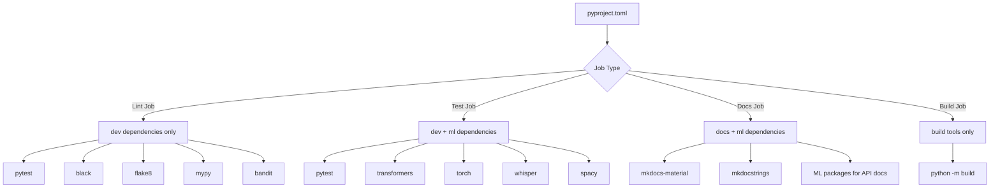

# CI/CD Pipeline

## Overview

The Podcast Scraper project uses GitHub Actions for continuous integration and deployment. The CI/CD pipeline consists of three main workflows that automate testing, code quality checks, security scanning, and documentation deployment.

### Workflows Summary

| Workflow | File | Purpose | Trigger |
|----------|------|---------|---------|
| **Python Application** | `python-app.yml` | Main CI pipeline with testing, linting, and builds | Push/PR to `main` |
| **Documentation Deploy** | `docs.yml` | Build and deploy MkDocs documentation to GitHub Pages | Push to `main`, PR with doc changes, manual |
| **CodeQL Security** | `codeql.yml` | Security vulnerability scanning | Push/PR to `main`, scheduled weekly |

---

## Complete Pipeline Visualization


---

## Python Application Workflow

**File:** `.github/workflows/python-app.yml`  
**Triggers:** Push and Pull Requests to `main` branch

This is the main CI pipeline that ensures code quality, runs tests, builds documentation, and validates the package.

### Parallel Execution Strategy

All four jobs run **completely in parallel** for maximum speed:


### Job Details

#### 1. Lint Job (Fast - No ML Dependencies)

**Purpose:** Perform quick code quality checks without heavy ML dependencies

**Duration:** ~2-3 minutes

**Steps:**
1. Checkout code
2. Set up Python 3.11 with pip caching
3. Set up Node.js 20 for markdown linting
4. Install dev dependencies (excluding ML packages)
5. Install markdownlint-cli
6. Run all lint checks:
   - `make format-check` - Black & isort formatting validation
   - `make lint` - flake8 code linting
   - `make lint-markdown` - Markdown file linting
   - `make type` - mypy static type checking
   - `make security` - bandit & safety security scanning

**Why separate from test?** Linting is much faster without ML dependencies, providing quick feedback.

#### 2. Test Job (Full - Includes ML Dependencies)

**Purpose:** Run the complete test suite with all dependencies

**Duration:** ~10-15 minutes (includes ML package installation)

**Steps:**
1. Checkout code
2. Free disk space (removes unnecessary system packages)
3. Set up Python 3.11 with pip caching
4. Install **full dependencies** including ML packages (`pip install -e .[dev,ml]`)
5. Run test suite: `make test`
   - Runs pytest with coverage reporting
   - Includes integration tests
   - Tests Whisper integration, summarization, etc.
6. Post-build cleanup (cache cleanup for disk space management)

**Disk Space Management:**
- Pre-test: Removes unnecessary system packages (~30GB freed)
- Post-test: Cleans ML model caches (HuggingFace, Torch, Whisper)

#### 3. Docs Build Job

**Purpose:** Validate documentation builds correctly

**Duration:** ~3-5 minutes

**Steps:**
1. Checkout code
2. Set up Python 3.11 with pip caching (docs + pyproject.toml)
3. Install documentation dependencies + ML packages (needed for mkdocstrings API docs)
4. Build documentation: `make docs`
   - Runs `mkdocs build --strict`
   - Generates API documentation from docstrings
   - Validates all internal links

**Note:** This job runs in the main workflow (not the separate docs workflow) to validate docs on every PR, even if not touching doc files.

#### 4. Build Package Job

**Purpose:** Validate the package can be built for distribution

**Duration:** ~2-3 minutes

**Steps:**
1. Checkout code
2. Set up Python 3.11 with pip caching
3. Install build tools (`pip install build`)
4. Build package: `make build`
   - Creates source distribution (`.tar.gz`)
   - Creates wheel distribution (`.whl`)
   - Validates `pyproject.toml` configuration

### Dependency Management



---

## Documentation Deployment Workflow

**File:** `.github/workflows/docs.yml`  
**Triggers:**
- Push to `main` branch
- Pull Requests modifying `docs/**`, `mkdocs.yml`, or the workflow file
- Manual dispatch (`workflow_dispatch`)

### Sequential Pipeline (Build → Deploy)

Unlike the Python app workflow, this has a sequential dependency:


### Job Details

#### 1. Build Job

**Purpose:** Build MkDocs site from documentation sources

**Runs:** On all triggers (push, PR, manual)

**Steps:**
1. Check out repository
2. Set up Python 3.11 with pip caching
3. Install documentation dependencies
4. Build MkDocs site with strict mode (`mkdocs build --strict`)
5. Upload artifact (only on push to `main`)

**Output:** `.build/site/` directory containing the static website

#### 2. Deploy Job

**Purpose:** Deploy built site to GitHub Pages

**Runs:** Only on push to `main` (conditional)

**Depends on:** Build job must succeed

**Steps:**
1. Deploy to GitHub Pages using the uploaded artifact

**Environment:**
- Name: `github-pages`
- URL: Deployment URL exposed as output

### Concurrency Control

```yaml
concurrency:
  group: "pages"
  cancel-in-progress: true
```

Only one deployment runs at a time. If multiple pushes occur, older deployments are cancelled.

---

## CodeQL Security Workflow

**File:** `.github/workflows/codeql.yml`  
**Triggers:**
- Push to `main` branch
- Pull Requests to `main` branch
- **Scheduled:** Every Thursday at 13:17 UTC (weekly security scan)

### Matrix Strategy (Parallel Language Analysis)

CodeQL analyzes multiple languages in parallel using a matrix:


### Analysis Configuration

**Languages Analyzed:**

| Language | Build Mode | Purpose |
|----------|------------|---------|
| **Python** | `none` | Analyze application code for security vulnerabilities |
| **GitHub Actions** | `none` | Analyze workflow YAML files for security issues |

**Build Mode:** `none` means no compilation required (interpreted languages)

### Job Details

**Per-language steps:**
1. Checkout repository
2. Initialize CodeQL tools
3. Scan codebase for security vulnerabilities
4. Upload results to GitHub Security tab

**Scan Categories:**
- SQL injection
- Cross-site scripting (XSS)
- Path traversal
- Code injection
- Hardcoded secrets
- Unsafe deserialization
- And more...

### Schedule Details

```yaml
schedule:
  - cron: '17 13 * * 4'
```

**Runs:** Every Thursday at 13:17 UTC  
**Purpose:** Catch newly discovered vulnerabilities in dependencies

---

## Parallel Execution Summary

### What Runs in Parallel?

#### ✅ Completely Parallel

**Within Python Application Workflow:**
```
├── Lint Job (2-3 min)
├── Test Job (10-15 min)
├── Docs Job (3-5 min)
└── Build Job (2-3 min)
```
All four jobs start simultaneously and run independently.

**Within CodeQL Workflow:**
```
├── Python Analysis
└── Actions Analysis
```
Both language analyses run in parallel via matrix strategy.

**Across Workflows:**
- All three workflows (Python app, docs, CodeQL) trigger independently
- They run in parallel when triggered by the same event

#### ❌ Sequential

**Documentation Workflow:**
```
Build Job → Deploy Job
```
Deploy job waits for build job to complete and only runs on push to `main`.

---

## Performance Optimizations

### 1. Pip Caching

All workflows use pip caching to speed up dependency installation:

```yaml
- uses: actions/setup-python@v5
  with:
    python-version: "3.11"
    cache: "pip"
    cache-dependency-path: pyproject.toml
```

**Benefit:** Reduces dependency installation from minutes to seconds on cache hit.

### 2. Dependency Splitting


**Benefit:** Lint feedback is fast (no waiting for large ML packages).

### 3. Disk Space Management

Test job proactively frees ~30GB of disk space before installing ML dependencies:

```bash
sudo rm -rf /usr/share/dotnet
sudo rm -rf /usr/local/lib/android
sudo rm -rf /opt/ghc
# ... more cleanup
```

**Benefit:** Prevents out-of-disk errors with large ML models.

### 4. Post-Test Cleanup

```bash
rm -rf ~/.cache/huggingface
rm -rf ~/.cache/torch
rm -rf ~/.cache/whisper
```

**Benefit:** Recovers disk space, prevents cache bloat across runs.

---

## Workflow Triggers Matrix

| Workflow | Push to main | PR to main | Schedule | Manual | Doc Changes |
|----------|--------------|------------|----------|--------|-------------|
| **Python Application** | ✅ | ✅ | ❌ | ❌ | ❌ |
| **Documentation Deploy** | ✅ (deploy) | ✅ (build only) | ❌ | ✅ | ✅ |
| **CodeQL Security** | ✅ | ✅ | ✅ Weekly | ❌ | ❌ |

---

## CI/CD Evolution Highlights

### Key Improvements Over Time

1. **Parallel Job Execution**
   - Separated lint, test, docs, and build into independent parallel jobs
   - Reduced total CI time from ~20 minutes sequential to ~15 minutes parallel (limited by slowest job)

2. **Smart Dependency Management**
   - Lint job runs without ML dependencies for fast feedback (2-3 min)
   - Test job includes full ML stack for complete validation
   - Separate dependency groups in `pyproject.toml`: `[dev]`, `[ml]`, `[docs]`

3. **Comprehensive Security Scanning**
   - CodeQL for static analysis (Python + Actions)
   - Scheduled weekly scans for newly discovered vulnerabilities
   - Bandit & Safety in lint job for immediate feedback

4. **Documentation as Code**
   - Docs build validated on every PR
   - Automatic deployment to GitHub Pages on merge
   - API documentation auto-generated from docstrings

5. **Resource Optimization**
   - Pip caching reduces dependency install time
   - Proactive disk space management
   - Post-test cache cleanup

6. **Developer Experience**
   - Fast lint feedback (~2-3 min)
   - Clear separation of concerns (lint vs test)
   - `make ci` command to run full CI suite locally

---

## Local Development

### Running CI Checks Locally

The project provides a `Makefile` that mirrors the CI workflow:

```bash
# Run full CI suite (matches GitHub Actions)
make ci

# Individual checks (same as CI)
make format-check  # Black & isort
make lint          # flake8
make lint-markdown # markdownlint
make type          # mypy
make security      # bandit & safety
make test          # pytest with coverage
make docs          # mkdocs build
make build         # package build
```

### Local CI Validation Flow


---

## CI/CD Best Practices Implemented

### ✅ Speed

- **Parallel execution:** All independent jobs run simultaneously
- **Caching:** Pip cache for faster dependency installation
- **Early feedback:** Fast lint job without ML dependencies

### ✅ Reliability

- **Reproducible:** Same checks run locally via `make ci`
- **Isolated:** Jobs don't depend on each other (except docs deploy)
- **Clean environment:** Each job starts fresh, post-cleanup prevents cache pollution

### ✅ Security

- **Multi-layered:** CodeQL + bandit + safety
- **Continuous:** Weekly scheduled scans
- **Early detection:** Security checks on every PR

### ✅ Documentation

- **Validated:** Docs build checked on every PR
- **Automated:** Deployment on merge to main
- **Complete:** Code + architecture + API reference

### ✅ Developer Experience

- **Fast feedback:** Lint results in 2-3 minutes
- **Local parity:** `make ci` runs same checks as GitHub
- **Clear errors:** Strict mode for docs and type checking

---

## Monitoring & Debugging

### Viewing Workflow Results

1. **GitHub Actions Tab:** [View all runs](https://github.com/chipi/podcast_scraper/actions)
2. **PR Checks:** Status checks appear on pull requests
3. **Branch Protection:** Can require specific jobs to pass before merge

### Common Issues & Solutions

| Issue | Cause | Solution |
|-------|-------|----------|
| Test timeout | Large ML models download | Already handled by disk space management |
| Lint failures | Formatting issues | Run `make format` locally before push |
| Docs build failure | Broken links or invalid syntax | Run `make docs` locally, check `mkdocs build` output |
| CodeQL alerts | Security vulnerabilities | Review in Security tab, address findings |
| Out of disk space | ML model caches | Cleanup is automatic, check disk usage logs |

### Debugging Failed Runs

```bash
# Reproduce lint failures locally
make format-check lint lint-markdown type security

# Reproduce test failures locally
make test

# Reproduce docs failures locally
make docs

# Run everything (matches full CI)
make ci
```

---

## Future Enhancements

### Potential Improvements

1. **Test Sharding**
   - Split test suite across multiple jobs for faster execution
   - Parallel test execution could reduce test time from 15min to <5min

2. **Artifact Caching**
   - Cache built wheels for dependencies
   - Cache ML models between runs

3. **Container-based Testing**
   - Run tests in Docker for better reproducibility
   - Pre-built images with ML dependencies

4. **Performance Benchmarking**
   - Track execution time trends
   - Automated performance regression detection

5. **Release Automation**
   - Automated version bumping
   - Automated changelog generation
   - PyPI publishing on tag creation

---

## Related Documentation

- **[Contributing Guide](https://github.com/chipi/podcast_scraper/blob/main/CONTRIBUTING.md)** - Development workflow and local testing
- **[Testing Strategy](TESTING_STRATEGY.md)** - Test coverage and quality standards
- **[Architecture](ARCHITECTURE.md)** - System design and module boundaries

---

## Quick Reference

### Workflow Files

```
.github/workflows/
├── python-app.yml    # Main CI (lint, test, docs, build)
├── docs.yml          # Documentation deployment
└── codeql.yml        # Security scanning
```

### Key Commands

```bash
# Local CI validation
make ci

# Individual checks
make format-check lint type security test docs build

# Auto-fix formatting
make format
```

### Workflow URLs

- [Python Application Workflow](https://github.com/chipi/podcast_scraper/actions/workflows/python-app.yml)
- [Documentation Deployment](https://github.com/chipi/podcast_scraper/actions/workflows/docs.yml)
- [CodeQL Security Scanning](https://github.com/chipi/podcast_scraper/actions/workflows/codeql.yml)
