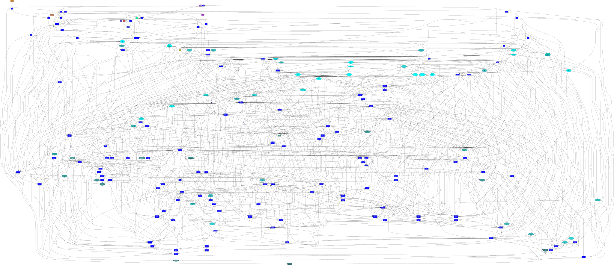
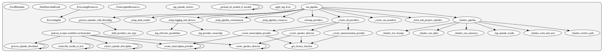
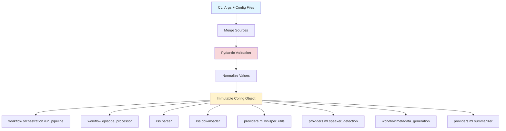
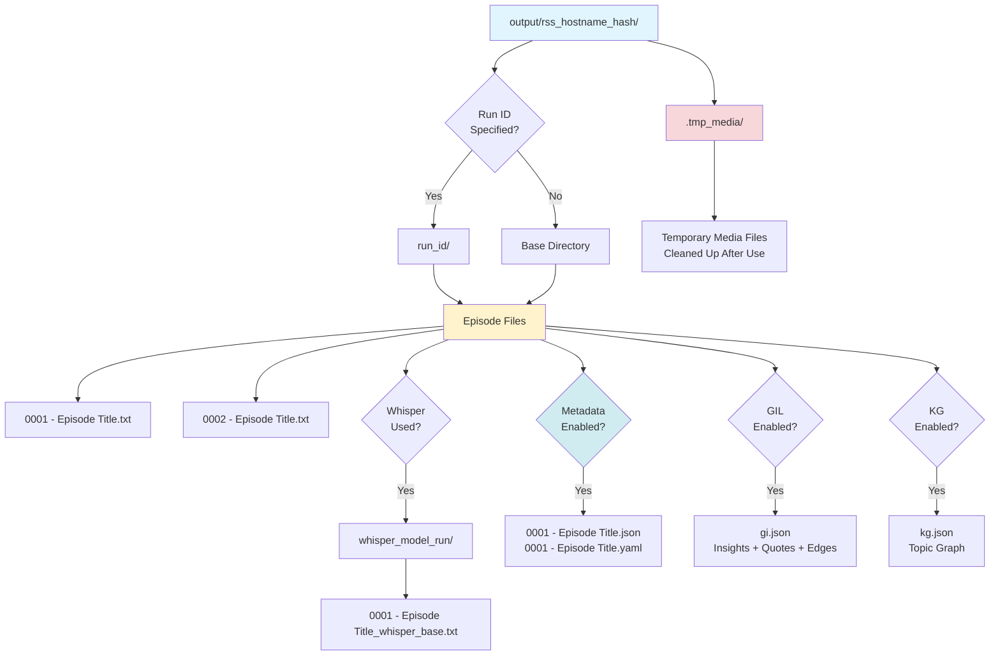

# Podcast Scraper Architecture

> **Strategic Overview**: This document provides high-level architectural decisions, design principles, and system structure. For detailed implementation guides, see the [Development Guide](../guides/DEVELOPMENT_GUIDE.md) and other specialized documents linked below.

## Navigation

This architecture document is the central hub for understanding the system. For detailed information, see:

### Core Documentation

- **[ADR Index](../adr/index.md)** — **The immutable record of architectural laws and decisions**
- **Architecture — [Ways to run and deploy](#ways-to-run-and-deploy)** — CLI vs service vs Docker; one pipeline, one Config
- **[Non-Functional Requirements](NON_FUNCTIONAL_REQUIREMENTS.md)** — Performance, security, reliability, observability, maintainability, scalability
- **[Development Guide](../guides/DEVELOPMENT_GUIDE.md)** — Detailed implementation instructions, dependency management, code patterns, and development workflows
- **[Pipeline and Workflow Guide](../guides/PIPELINE_AND_WORKFLOW.md)** — Pipeline flow, module roles, behavioral quirks, run tracking
- **[Testing Strategy](TESTING_STRATEGY.md)** — Testing philosophy, test pyramid, and quality standards
- **[Testing Guide](../guides/TESTING_GUIDE.md)** — Quick reference and test execution commands
  - [Unit Testing Guide](../guides/UNIT_TESTING_GUIDE.md) — Unit test mocking patterns
  - [Integration Testing Guide](../guides/INTEGRATION_TESTING_GUIDE.md) — Integration test guidelines
  - [E2E Testing Guide](../guides/E2E_TESTING_GUIDE.md) — E2E server, real ML models
  - [Critical Path Testing Guide](../guides/CRITICAL_PATH_TESTING_GUIDE.md) — What to test, prioritization
- **[Server Guide](../guides/SERVER_GUIDE.md)** — FastAPI server, REST API, viewer, development workflow
- **[Viewer Frontend Architecture](VIEWER_FRONTEND_ARCHITECTURE.md)** — Vue SPA internals: component tree, Pinia stores, API layer, async correctness
- **[CI/CD](../ci/index.md)** — Continuous integration and deployment pipeline

### API Documentation

- **[API Reference](../api/REFERENCE.md)** — Complete API documentation
- **[Configuration](../api/CONFIGURATION.md)** — Configuration options and examples
- **[CLI Reference](../api/CLI.md)** — Command-line interface documentation

### Feature Documentation

- **[Provider Implementation Guide](../guides/PROVIDER_IMPLEMENTATION_GUIDE.md)** — Complete guide for implementing new providers (includes OpenAI example, testing, E2E server mocking)
- **[ML Provider Reference](../guides/ML_PROVIDER_REFERENCE.md)** — ML implementation details
- **[Configuration API](../api/CONFIGURATION.md)** — Configuration API reference (includes environment variables)

### Specifications

- **[PRDs](../prd/index.md)** — Product Requirements
  Documents
- **[RFCs](../rfc/index.md)** — Request for Comments
  (design decisions)
- **[GIL Ontology](gi/ontology.md)** — Grounded
  Insight Layer node/edge types and grounding contract
- **[GIL Schema](gi/gi.schema.json)** — Machine-
  readable JSON schema for `gi.json` validation
- **[GIL / KG / CIL cross-layer](../guides/GIL_KG_CIL_CROSS_LAYER.md)** — `bridge.json`, CIL HTTP queries, search lift, offset verification (RFC-072)

## Goals and Scope

- Provide a resilient pipeline that collects podcast
  episode transcripts from RSS feeds and fills gaps
  via Whisper transcription.
- Offer both CLI and Python APIs with a single
  configuration surface (`Config`) and deterministic
  filesystem layout.
- Keep the public surface area small (`Config`,
  `load_config_file`, `run_pipeline`, `service.run`,
  `service.run_from_config_file`, `cli.main`) while
  exposing well-factored submodules for advanced use.
- Provide a service API (`service.py`) optimized for
  non-interactive use (daemons, process managers) with
  structured error handling and exit codes.
- Support a **multi-provider architecture** with
  local ML (`MLProvider`), hybrid MAP-REDUCE
  (`HybridMLProvider`), and 7 LLM providers (OpenAI,
  Gemini, Anthropic, Mistral, DeepSeek, Grok, Ollama)
  enabling choice across cost, quality, privacy, and
  latency dimensions.
- Enable **structured knowledge extraction** via the
  Grounded Insight Layer (GIL) — extracting insights
  and verbatim quotes with evidence grounding from
  podcast transcripts (PRD-017).
- Enable **Knowledge Graph (KG) extraction** from
  transcripts and summaries, producing structured
  topic graphs per episode.
- Provide **semantic corpus search** (PRD-021) via
  FAISS vector indexing over transcript chunks,
  enabling natural-language queries and episode
  similarity across multi-feed corpora.
- Expose a **read-oriented HTTP API and viewer**
  (RFC-062) with corpus library browsing (RFC-067),
  corpus digest (RFC-068), graph exploration
  (RFC-069), and semantic search — served as a
  FastAPI + Vue 3 SPA.
- Support **canonical cross-layer identity** (CIL,
  RFC-072): per-episode **`bridge.json`** joins GIL and
  KG under shared **`person:`** / **`topic:`** / **`org:`**
  ids; **read-only CIL HTTP APIs** and optional
  **transcript hit lift** in semantic search depend on
  aligned **Quote** and **FAISS chunk** char offsets.
  Overview: [GIL / KG / CIL cross-layer guide](../guides/GIL_KG_CIL_CROSS_LAYER.md).

## Ways to run and deploy

The system has **one pipeline** (`workflow.run_pipeline`) and **one configuration model** (`Config`). Both entry points produce a `Config` and call the same pipeline; only how config is supplied and how results are surfaced differs.

| Mode | Use case | Config source | Entry / deployment |
| ---- | --------- | ------------- | ------------------- |
| **CLI** | Interactive runs, ad-hoc flags, progress bars | CLI args + optional `--config` file | `podcast-scraper <rss_url>`, repeatable `--rss`, `python -m podcast_scraper.cli`. Multi-feed: `--output-dir` required when ≥2 feeds ([CLI.md](../api/CLI.md#rss-and-multi-feed)). Subcommands: `doctor`, `cache`, `corpus-status` (#506). |
| **Service** | Daemons, automation, process managers | Config file only (no CLI args) | `python -m podcast_scraper.service --config config.yaml`. YAML `feeds` / `rss_urls` list runs one pipeline per feed when len ≥ 2. Returns `ServiceResult`; exit code 0/1. For supervisor, systemd, etc. |
| **Docker** | Service-oriented deployment | Config file (default `/app/config.yaml` or `PODCAST_SCRAPER_CONFIG`) | Container runs **service mode**: no CLI arguments, config from file and env. See [Docker Service Guide](../guides/DOCKER_SERVICE_GUIDE.md). |
| **Server (viewer)** | GI/KG graph, dashboard, semantic search, explore, **Corpus Library**, **index stats / rebuild** | `--output-dir` (corpus path) | `podcast serve --output-dir <path>`. FastAPI + Vue SPA; OpenAPI at **`/docs`**. Needs **`pip install -e ".[server]"`**. See [Server Guide](../guides/SERVER_GUIDE.md) and [API index — HTTP](../api/index.md#http-viewer-api-server-extra). |

**Programmatic use:** Import `config.load_config_file`, `Config`, and either `workflow.run_pipeline` (returns count + summary) or `service.run` / `service.run_from_config_file` (returns `ServiceResult`). See [API Reference](../api/REFERENCE.md) and [Service API](../api/SERVICE.md).

**Server / viewer:** `src/podcast_scraper/server/` is the canonical **read-oriented** HTTP layer exposing REST endpoints for the Vue SPA. **`routes/platform/*`** remains **stub-only** (not registered in `create_app`) until ADR-064 platform routes land (#50, #347). OpenAPI: **`/docs`**, **`/openapi.json`**. See [Server Guide](../guides/SERVER_GUIDE.md) for the API contract and [Viewer Frontend Architecture](VIEWER_FRONTEND_ARCHITECTURE.md) for the SPA internals.

## GIL, KG, and canonical cross-layer (CIL) {#gil-kg-and-canonical-cross-layer-cil}

**GIL** (`gi.json`) and **KG** (`*.kg.json`) stay **separate artifacts** ([ADR-052](../adr/ADR-052-separate-gil-and-kg-artifact-layers.md)). **RFC-072** adds **`bridge.json`** per episode: a compact list of **canonical identities** (`person:…`, `topic:…`, `org:…`) with **`display_name`** and provenance so HTTP APIs and the viewer can join layers without merging the full ontologies.

**Consumption today:**

- **Viewer** — Loads GI/KG (and bridge where present) via **`GET /api/artifacts`**; graph merge and catalog rows may use bridge paths from metadata ([Server Guide](../guides/SERVER_GUIDE.md), [RFC-062](../rfc/RFC-062-gi-kg-viewer-v2.md)).
- **CIL query API** — Filesystem scans for `*.bridge.json` with sibling `gi.json` / `kg.json`; patterns for person/topic arcs and timelines ([RFC-072 § query patterns](../rfc/RFC-072-canonical-identity-layer-cross-layer-bridge.md)).
- **Semantic search** — **Transcript** hits can expose an optional **`lifted`** object (insight, speaker, topic, quote timestamps) when chunk char ranges overlap a **Quote** and edges/`bridge.json` allow resolution ([Semantic Search Guide](../guides/SEMANTIC_SEARCH_GUIDE.md)).

**Shared implementation seams:** `src/podcast_scraper/builders/bridge_artifact_paths.py` is the single place for **bridge / GI / KG sibling path** rules (metadata → `bridge.json`, `bridge.json` → `gi.json`/`kg.json`, `gi.json` → `bridge.json`). `src/podcast_scraper/gi/edge_normalization.py` normalises **GIL edge `type`** strings for graph walks (CIL queries and search lift). **`build_bridge`** payload assembly stays in `builders/bridge_builder.py`.

**Operational gate:** Before relying on lift in production-shaped corpora, run **Quote vs chunk offset** verification (`verify-gil-chunk-offsets` or **`make verify-gil-offsets-strict`**) on an indexed run. Details: [Semantic Search Guide — lift and verification](../guides/SEMANTIC_SEARCH_GUIDE.md#chunk-to-insight-lift-and-offset-verification-rfc-072--528), [GIL / KG / CIL cross-layer guide](../guides/GIL_KG_CIL_CROSS_LAYER.md).

**Re-pipeline stance:** Re-running extraction, the bridge builder, or RFC-075 clustering **replaces** on-disk artifacts under the corpus root. Canonical ids and `tc:` cluster parents are **not** frozen at first ingest. HTTP APIs and the viewer read **current** files for the configured path. See [RFC-072 — Operational note](../rfc/RFC-072-canonical-identity-layer-cross-layer-bridge.md#operational-note-re-pipeline-enrichment-and-read-path-stance) and [GIL / KG / CIL — When the corpus is re-built](../guides/GIL_KG_CIL_CROSS_LAYER.md#when-the-corpus-is-re-built).

**Full spec:** [RFC-072](../rfc/RFC-072-canonical-identity-layer-cross-layer-bridge.md).

## Corpus Topic Clustering Layer (RFC-075) {#corpus-topic-clustering-layer-rfc-075}

**Purpose:** Group **semantically similar KG topic nodes** across episodes when LLMs assign different `topic:{slug}` ids for the same real-world subject. This is a **corpus-level, optional** step that sits **beside** per-episode KG extraction and **beside** CIL: it **reads** KG topic labels and embeddings produced for semantic search (RFC-061), writes a small filesystem artifact **`topic_clusters.json`** under `<corpus>/search/`, and can feed **auto-generated** `topic_id_aliases` for CIL (RFC-072). The GI/KG viewer may render clusters as **Cytoscape compound parent nodes** without rewriting raw `*.kg.json`.

**Boundaries:**

- **In scope:** Build-time or CLI-triggered clustering; optional operator-authored YAML for `topic-clusters --validate-config` (no committed canonical file); HTTP surface to serve the JSON artifact; viewer overlay only.
- **Out of scope:** Replacing KG extraction, replacing FAISS, or requiring a database. No query-time external embedding APIs.

**Design:** [RFC-075](../rfc/RFC-075-corpus-topic-clustering.md) (Draft) — current writers emit **`schema_version`: `"2"`** with distinct **`graph_compound_parent_id`** (viewer) vs **`cil_alias_target_topic_id`** (CIL). Holistic review notes:
[docs/wip/rfc-075-holistic-review.md](../wip/rfc-075-holistic-review.md).

## Insight Clustering Layer (#599) {#insight-clustering-layer}

**Purpose:** Group **semantically similar GI insights** across episodes. While topic clustering groups KG topic labels, insight clustering groups the actual claims/findings extracted by the GI pipeline. Each cluster aggregates supporting quotes from multiple episodes, enabling cross-episode evidence queries.

**Boundaries:**

- **In scope:** CLI-triggered clustering via `insight-clusters` command; `--expand-clusters` flag on `gi explore` for cross-episode evidence; insight_clusters.json artifact.
- **Out of scope:** Speaker profiles, consensus detection, temporal tracking (parked — need diarization data).

**Design:** Same average-linkage algorithm as topic clustering (RFC-075). Reads insight texts from `*.gi.json` artifacts, embeds with sentence-transformers, clusters at configurable threshold (default 0.75). The cluster context expansion layer (`insight_cluster_context.py`) adds cross-episode quotes to explore results without modifying the core explore pipeline.

**Multi-quote extraction (#600):** All 8 providers extract multiple verbatim quotes per insight (uncapped, typically 3-5 on real podcasts). Parser handles both new `{"quotes": [...]}` format and backward-compatible `{"quote_text": "..."}`. ML provider uses `answer_candidates(top_k=3)`. Quote deduplication by text prevents LLM repetition.

**Providers:** Nine providers (1 local ML + 1 hybrid ML + 7 LLM) supply transcription, speaker detection, and summarization; capability matrix and selection are in [Pipeline and Workflow Guide](../guides/PIPELINE_AND_WORKFLOW.md). Adding or extending providers: [Provider Implementation Guide](../guides/PROVIDER_IMPLEMENTATION_GUIDE.md).

## Architectural Decisions (ADRs)

The following architectural principles govern this system. For the full history and rationale, see the **[ADR Index](../adr/index.md)**.

### Core Patterns

- **Concurrency**: IO-bound threading for downloads, sequential CPU/GPU tasks for ML ([ADR-001](../adr/ADR-001-hybrid-concurrency-strategy.md)). MPS exclusive mode ([ADR-046](../adr/ADR-046-mps-exclusive-mode-apple-silicon.md)) serializes GPU work on Apple Silicon to prevent memory contention when both Whisper and summarization use MPS (enabled by default).
- **Providers**: Protocol-based discovery ([ADR-020](../adr/ADR-020-protocol-based-provider-discovery.md)) using unified provider classes ([ADR-024](../adr/ADR-024-unified-provider-pattern.md)), library-based naming ([ADR-025](../adr/ADR-025-technology-based-provider-naming.md)), and per-capability provider selection ([ADR-026](../adr/ADR-026-per-capability-provider-selection.md)).
- **Lazy Loading**: Heavy ML dependencies are loaded only when needed ([ADR-005](../adr/ADR-005-lazy-ml-dependency-loading.md)).

### Data & Filesystem

- **Storage**: Hash-based deterministic directory layout ([ADR-003](../adr/ADR-003-deterministic-feed-storage.md)) with flat archives ([ADR-004](../adr/ADR-004-flat-filesystem-archive-layout.md)).
- **Identity**: Universal GUID-based episode identification ([ADR-007](../adr/ADR-007-universal-episode-identity.md)).
- **Metadata**: Unified JSON schema compatible with SQL and NoSQL ([ADR-008](../adr/ADR-008-database-agnostic-metadata-schema.md)).

### ML & AI Processing

- **Summarization**: Hybrid MAP-REDUCE strategy ([ADR-010](../adr/ADR-010-hierarchical-summarization-pattern.md), [ADR-043](../adr/ADR-043-hybrid-map-reduce-summarization.md)) favoring local models ([ADR-009](../adr/ADR-009-privacy-first-local-summarization.md)).
- **Audio**: Mandatory preprocessing ([ADR-036](../adr/ADR-036-standardized-pre-provider-audio-stage.md)) with content-hash caching ([ADR-037](../adr/ADR-037-content-hash-based-audio-caching.md)) using FFmpeg ([ADR-038](../adr/ADR-038-ffmpeg-first-audio-manipulation.md)) and Opus ([ADR-039](../adr/ADR-039-speech-optimized-codec-opus.md)).
- **Governance**: Explicit benchmarking gates ([ADR-042](../adr/ADR-042-heuristic-based-quality-gates.md)) and golden dataset versioning ([ADR-040](../adr/ADR-040-explicit-golden-dataset-versioning.md)).

### Development & CI

- **Workflow**: Git worktree-based isolation ([ADR-032](../adr/ADR-032-git-worktree-based-development.md)) with independent environments ([ADR-034](../adr/ADR-034-isolated-runtime-environments.md)).
- **Quality**: Three-tier test pyramid ([ADR-019](../adr/ADR-019-standardized-test-pyramid.md)) with automated health metrics ([ADR-023](../adr/ADR-023-public-operational-metrics.md)).
- **Process Safety** ([RFC-074](../rfc/RFC-074-process-safety-ml-workloads-macos.md)): ML model loading (spaCy, Transformers, Whisper) triggers heavy APFS filesystem I/O that can cause macOS kernel lock contention. Mitigations: no ML imports at Makefile parse time, filesystem-only cache checks, pre-commit hook timeout (120s), `cleanup-processes` prerequisite on `ci`/`ci-fast`, offline-mode enforcement (`HF_HUB_OFFLINE`, `TRANSFORMERS_OFFLINE`), and agent rules preventing overlapping `make ci` runs. Diagnostic targets: `make check-zombie` (detects unkillable UE-state processes) and `make check-spotlight` (verifies Spotlight indexing status).

### Reproducibility & Operational Hardening (Issue #379)

- **Determinism**: Seed-based reproducibility for `torch`, `numpy`, and `transformers` ensures consistent outputs across runs. Seeds are configurable via environment variables or config files.
- **Run Tracking**: Comprehensive run manifests capture system state (Python version, OS, GPU info, model versions, git commit SHA, config hash) for complete reproducibility. Per-episode stage timings track processing duration for performance analysis.
- **Failure Handling**: Configurable `--fail-fast` and `--max-failures` flags allow operators to control pipeline behavior on episode failures. Episode-level failures are tracked in metrics without affecting exit codes.
- **Retry Policies**: Three-layer retry for transient errors: (1) urllib3 retry adapters on every HTTP request with configurable counts and exponential backoff (`http_retry_total`, `rss_retry_total`); (2) application-level episode retry that re-runs the entire episode download on transient network errors (`episode_retry_max`, default 1); (3) model loading retry via `retry_with_exponential_backoff`. All retry parameters are configurable via `Config` with resilient defaults active out of the box. See [CONFIGURATION.md -- Download Resilience](../api/CONFIGURATION.md#download-resilience).
- **Timeout Enforcement**: Configurable timeouts for transcription and summarization stages prevent hung operations.
- **Security**: Path validation prevents directory traversal attacks. Model allowlist validation restricts HuggingFace model sources. Safetensors format preference improves security and performance. `trust_remote_code=False` enforced on all model loading.
- **Structured Logging**: `--json-logs` flag enables structured JSON logging for log aggregation systems (ELK, Splunk, CloudWatch).
- **Diagnostics**: `podcast_scraper doctor` command validates environment (Python version, ffmpeg, write permissions, model cache, network connectivity).

## Pipeline and Workflow

The pipeline processes podcast feeds through a sequence of stages: RSS
acquisition, episode selection, transcript download (or Whisper transcription),
optional metadata generation, optional summarization, optional GIL/KG
extraction, and optional FAISS vector indexing. Multi-feed corpora run the inner
pipeline per feed with a single parent index pass. Append/resume mode skips
already-processed episodes.

For the **full stage-by-stage walkthrough**, pipeline flow diagram, module roles,
multi-feed semantics, and behavioral details see the
[Pipeline and Workflow Guide](../guides/PIPELINE_AND_WORKFLOW.md).

### Module map (summary)

| Package / module | Responsibility | Detail link |
| ---------------- | -------------- | ----------- |
| `cli.py` | CLI entry, arg parsing, multi-feed outer loop | [CLI Reference](../api/CLI.md) |
| `service.py` | Daemon/programmatic entry, `ServiceResult` | [Service API](../api/SERVICE.md) |
| `config.py` | Immutable `Config` model, YAML/JSON loader | [Configuration](../api/CONFIGURATION.md) |
| `workflow/` | Orchestration, stages, degradation, corpus ops, run tracking | [Pipeline Guide](../guides/PIPELINE_AND_WORKFLOW.md) |
| `rss/` | RSS parsing (`defusedxml`), HTTP downloads, feed cache | [RSS Guide](../guides/RSS_GUIDE.md) |
| `providers/` | 9 unified providers (ML, Hybrid, 7 LLM); factories, capabilities, prompts | [Provider Guide](../guides/PROVIDER_IMPLEMENTATION_GUIDE.md) |
| `gi/` | Grounded Insight Layer extraction (PRD-017) | [GI Guide](../guides/GROUNDED_INSIGHTS_GUIDE.md) |
| `kg/` | Knowledge Graph extraction (RFC-055) | [KG Guide](../guides/KNOWLEDGE_GRAPH_GUIDE.md) |
| `search/` | FAISS vector indexing, semantic search, episode similarity; **corpus topic clustering** (`topic_clusters.json`, RFC-075) | [Search Guide](../guides/SEMANTIC_SEARCH_GUIDE.md), [RFC-075](../rfc/RFC-075-corpus-topic-clustering.md) |
| `server/` | FastAPI HTTP layer, corpus catalog, digest, index rebuild | [Server Guide](../guides/SERVER_GUIDE.md), [Viewer Frontend](VIEWER_FRONTEND_ARCHITECTURE.md) |
| `monitor/` | Live pipeline monitor (RFC-065) | [Monitor Guide](../guides/LIVE_PIPELINE_MONITOR.md) |
| `models/` | Shared dataclasses (`RssFeed`, `Episode`, etc.) | |
| `utils/` | Filesystem helpers, progress reporting | |

### Module Dependencies Diagram

```mermaid
graph TB
    subgraph "Public API"
        CLI[cli.py]
        Config[config.py]
        Service[service.py]
        Workflow[workflow/orchestration.py]
    end

    subgraph "Core Processing"
        RSSParser[rss/parser.py]
        EpisodeProc[workflow/episode_processor.py]
        Downloader[rss/downloader.py]
        AudioPreproc[preprocessing/]
    end

    subgraph "Support Modules"
        Filesystem[utils/filesystem.py]
        Models[models/]
        Progress[utils/progress.py]
        Schemas[schemas/summary_schema.py]
    end

    subgraph "Prompt Management"
        PromptStore[prompts/store.py]
        PromptTemplates[prompts/provider/task/v1.j2]
    end

    subgraph "Provider System"
        TranscriptionFactory[transcription/factory.py]
        SpeakerFactory[speaker_detectors/factory.py]
        SummaryFactory[summarization/factory.py]
        Capabilities[providers/capabilities.py]
    end

    subgraph "Local ML Provider"
        MLProvider[providers/ml/ml_provider.py]
        HybridMLProvider[providers/ml/hybrid_ml_provider.py]
        ModelRegistry[providers/ml/model_registry.py]
        Whisper[providers/ml/whisper_utils.py]
        SpeakerDetect[providers/ml/speaker_detection.py]
        Summarizer[providers/ml/summarizer.py]
        NER[providers/ml/ner_extraction.py]
    end

    subgraph "LLM Providers"
        OpenAIProvider[providers/openai/]
        GeminiProvider[providers/gemini/]
        AnthropicProvider[providers/anthropic/]
        MistralProvider[providers/mistral/]
        DeepSeekProvider[providers/deepseek/]
        GrokProvider[providers/grok/]
        OllamaProvider[providers/ollama/]
    end

    subgraph "Semantic Search"
        SearchIndexer[search/indexer.py]
        FaissStore[search/faiss_store.py]
        Chunker[search/chunker.py]
        CorpusSearch[search/corpus_search.py]
        CorpusSimilar[search/corpus_similar.py]
        CorpusScope[search/corpus_scope.py]
    end

    subgraph "Corpus Topic Clustering (RFC-075)"
        TopicClusters[search/topic_clusters.py]
    end

    subgraph "Server Layer"
        ServerApp[server/app.py]
        ServerRoutes[server/routes/]
        ServerSchemas[server/schemas.py]
        CorpusCatalog[server/corpus_catalog.py]
        CorpusDigest[server/corpus_digest.py]
        CorpusTopicClusters[server/routes/corpus_topic_clusters.py]
        IndexRebuild[server/index_rebuild.py]
        IndexStaleness[server/index_staleness.py]
    end

    subgraph "Knowledge Extraction"
        GI[gi/pipeline.py]
        GISchema[gi/schema.py]
        GIGrounding[gi/grounding.py]
        KG[kg/pipeline.py]
        KGSchema[kg/schema.py]
        KGExtract[kg/llm_extract.py]
    end

    subgraph "Workflow Stages"
        StageSetup[workflow/stages/setup.py]
        StageScraping[workflow/stages/scraping.py]
        StageProcessing[workflow/stages/processing.py]
        StageTranscription[workflow/stages/transcription.py]
        StageMetadata[workflow/stages/metadata.py]
        StageSummarization[workflow/stages/summarization.py]
    end

    subgraph "Optional Features"
        Metadata[workflow/metadata_generation.py]
        CorpusOps[workflow/corpus_operations.py]
        Degradation[workflow/degradation.py]
        Evaluation[evaluation/]
        Cleaning[cleaning/]
    end

    CLI --> Config
    CLI --> Workflow
    CLI --> ServerApp
    Service --> Config
    Service --> Workflow
    ServerApp --> ServerRoutes
    ServerRoutes --> GI
    ServerRoutes --> ServerSchemas
    ServerRoutes --> CorpusCatalog
    ServerRoutes --> CorpusDigest
    ServerRoutes --> CorpusTopicClusters
    ServerRoutes --> CorpusSearch
    ServerRoutes --> IndexRebuild
    ServerRoutes --> IndexStaleness
    CorpusCatalog --> CorpusScope
    CorpusDigest --> CorpusCatalog
    IndexRebuild --> SearchIndexer
    IndexStaleness --> CorpusScope
    SearchIndexer --> FaissStore
    SearchIndexer --> Chunker
    CorpusSearch --> FaissStore
    CorpusSimilar --> CorpusSearch
    FaissStore -. optional read .-> TopicClusters
    Workflow --> RSSParser
    Workflow --> EpisodeProc
    Workflow --> Downloader
    Workflow --> TranscriptionFactory
    Workflow --> SpeakerFactory
    Workflow --> SummaryFactory
    Workflow --> AudioPreproc
    Workflow --> StageSetup
    Workflow --> StageScraping
    Workflow --> StageProcessing
    Workflow --> StageTranscription
    Workflow --> StageMetadata
    Workflow --> StageSummarization
    Workflow --> CorpusOps
    Workflow --> Degradation
    TranscriptionFactory --> MLProvider
    TranscriptionFactory --> OpenAIProvider
    TranscriptionFactory --> GeminiProvider
    SpeakerFactory --> MLProvider
    SpeakerFactory --> OpenAIProvider
    SpeakerFactory --> GeminiProvider
    SpeakerFactory --> AnthropicProvider
    SpeakerFactory --> MistralProvider
    SpeakerFactory --> DeepSeekProvider
    SpeakerFactory --> GrokProvider
    SpeakerFactory --> OllamaProvider
    SummaryFactory --> MLProvider
    SummaryFactory --> HybridMLProvider
    SummaryFactory --> OpenAIProvider
    SummaryFactory --> GeminiProvider
    SummaryFactory --> AnthropicProvider
    SummaryFactory --> MistralProvider
    SummaryFactory --> DeepSeekProvider
    SummaryFactory --> GrokProvider
    SummaryFactory --> OllamaProvider
    MLProvider --> Whisper
    MLProvider --> SpeakerDetect
    MLProvider --> Summarizer
    MLProvider --> NER
    MLProvider --> ModelRegistry
    HybridMLProvider --> Summarizer
    HybridMLProvider --> ModelRegistry
    Summarizer --> ModelRegistry
    OpenAIProvider --> PromptStore
    GeminiProvider --> PromptStore
    AnthropicProvider --> PromptStore
    MistralProvider --> PromptStore
    DeepSeekProvider --> PromptStore
    GrokProvider --> PromptStore
    OllamaProvider --> PromptStore
    PromptStore --> PromptTemplates
    Workflow --> Metadata
    Workflow --> GI
    Workflow --> KG
    Workflow --> Filesystem
    GI --> GISchema
    GI --> GIGrounding
    GI --> SummaryFactory
    KG --> KGSchema
    KG --> KGExtract
    KGExtract --> SummaryFactory
    EpisodeProc --> Downloader
    EpisodeProc --> Filesystem
    RSSParser --> Models
    Summarizer --> Models
    SpeakerDetect --> Models
    TranscriptionFactory --> Capabilities
    SpeakerFactory --> Capabilities
    SummaryFactory --> Capabilities
```



**Actual import relationships (pydeps):**

The diagram below shows the actual import relationships between modules, generated from code analysis. Compare with the Mermaid diagram above to validate that implementation matches design.



*Generated by [pydeps](https://github.com/thebjorn/pydeps). Regenerate with `make visualize` (requires Graphviz).*

**Workflow call graph (function-level):**

The following diagram shows which functions call which in the pipeline entry point (`workflow/orchestration.py`). Useful for understanding orchestration flow and hot paths.



*Generated by [pyan3](https://github.com/Technologicat/pyan).*

**Flowcharts:** For control flow within key modules, see [orchestration flowchart](diagrams/orchestration-flow.svg) and [service API flowchart](diagrams/service-flow.svg) (generated by [code2flow](https://github.com/scottrogowski/code2flow)).

<!-- markdownlint-disable MD037 -->
- **Typed, immutable configuration**: `Config` is a frozen Pydantic model, ensuring every module receives canonicalized values (e.g., normalized URLs, integer coercions, validated Whisper models). This centralizes validation and guards downstream logic.
- **Resilient HTTP interactions**: A per-thread `requests.Session` with exponential backoff retry (`LoggingRetry`) handles transient network issues while logging retries for observability. Retry counts and backoff factors are configurable via `Config` fields (`http_retry_total`, `http_backoff_factor`, `rss_retry_total`, `rss_backoff_factor`) with resilient defaults (8 retries / 1.0 s backoff for media; 10 retries / 2.0 s backoff for RSS). An additional application-level episode retry (`episode_retry_max`, default 1) re-runs the full episode download on transient network errors after urllib3 retries are exhausted. Model loading operations use `retry_with_exponential_backoff` for transient errors (network failures, timeouts). See [CONFIGURATION.md -- Download Resilience](../api/CONFIGURATION.md#download-resilience).
- **Concurrent transcript pulls**: Transcript downloads are parallelized via `ThreadPoolExecutor`, guarded with locks when mutating shared counters/job queues. Whisper remains sequential to avoid GPU/CPU thrashing and to keep the UX predictable.
- **Deterministic filesystem layout**: Output folders follow `output/rss_<host>_<hash>` conventions. Optional `run_id` and Whisper suffixes create run-scoped subdirectories while `sanitize_filename` protects against filesystem hazards.
- **Dry-run and resumability**: `--dry-run` walks the entire plan without touching disk, while `--skip-existing` short-circuits work per episode, making repeated runs idempotent.
- **Pluggable progress/UI**: A narrow `ProgressFactory` abstraction lets embedding applications replace the default `tqdm` progress without touching business logic.
- **Optional Whisper dependency**: Whisper is imported lazily and guarded so environments without GPU support or `openai-whisper` can still run transcript-only workloads.
- **Optional summarization dependency** (PRD-005/RFC-012): Summarization requires `torch` and `transformers` dependencies and is imported lazily. When dependencies are unavailable, summarization is gracefully skipped. Models are automatically selected based on available hardware (MPS for Apple Silicon, CUDA for NVIDIA GPUs, CPU fallback). See [ML Provider Reference](../guides/ML_PROVIDER_REFERENCE.md) for details.
- **Language-aware processing** (RFC-010): A single `language` configuration drives both Whisper model selection (preferring English-only `.en` variants) and NER model selection (e.g., `en_core_web_sm`), ensuring consistent language handling across the pipeline.
- **Automatic speaker detection** (RFC-010): Named Entity Recognition extracts speaker names from episode metadata transparently. Manual speaker names (`--speaker-names`) are ONLY used as fallback when automatic detection fails, not as override. spaCy is a required dependency for speaker detection.
- **Host/guest distinction**: Host detection prioritizes RSS author tags (channel-level only) as the most reliable source, falling back to NER extraction from feed metadata when author tags are unavailable. Guests are always detected from episode-specific metadata using NER, ensuring accurate speaker labeling in Whisper screenplay output.
- **Provider-based architecture** (RFC-013): All capabilities (transcription, speaker detection, summarization) use a protocol-based provider system. Providers are created via factory functions based on configuration, allowing pluggable implementations (e.g., Whisper vs OpenAI for transcription, NER vs OpenAI for speaker detection, local transformers vs OpenAI for summarization). Providers implement consistent interfaces (`initialize()`, protocol methods, `cleanup()`) ensuring type safety and easy testing. See [Provider Implementation Guide](../guides/PROVIDER_IMPLEMENTATION_GUIDE.md) for complete implementation details.
- **Local-first summarization** (PRD-005/RFC-012): Summarization defaults to local transformer models for privacy and cost-effectiveness. API-based providers (OpenAI) are supported via the provider system. Long transcripts are handled via chunking strategies, and memory optimization is applied for GPU backends (CUDA/MPS). Models are automatically cached and reused across runs, with cache management utilities available via CLI and programmatic APIs. Model loading prefers safetensors format for security and performance (Issue #379). Pinned model revisions ensure reproducibility (Issue #379).
- **Reproducibility** (Issue #379): Deterministic runs via seed control (`torch`, `numpy`, `transformers`). Run manifests capture complete system state. Per-episode stage timings enable performance analysis. Run summaries combine manifest and metrics for complete run records.
- **Operational Hardening** (Issue #379): Three-layer retry with configurable parameters and resilient defaults (see [CONFIGURATION.md -- Download Resilience](../api/CONFIGURATION.md#download-resilience)). Timeout enforcement for transcription and summarization. Failure handling flags (`--fail-fast`, `--max-failures`) for pipeline control. Structured JSON logging for log aggregation. Path validation and model allowlist validation for security. End-of-run `failure_summary` in `run.json` aggregates failed episodes by error type for triage.

## Architecture Evolution

The system has evolved through four phases that expand
ML capabilities and enable structured knowledge
extraction. This section documents the architectural
progression and how components integrate with the
existing system.

### Phase 1: Model Registry (RFC-044)

**Status**: **Implemented**

Centralizes all model metadata (architecture limits,
capabilities, memory footprint, device defaults) into
a `ModelRegistry` class in
`providers/ml/model_registry.py`. Eliminates hardcoded
model limits scattered across the codebase. Every model
(summarization, embedding, QA, NLI) is registered with
a `ModelCapabilities` dataclass.

**Impact on existing architecture:**

- `providers/ml/summarizer.py` — uses registry for
  token limits instead of hardcoded values
- `config.py` — registry validates model selections
- Module: `providers/ml/model_registry.py`

### Phase 2: Hybrid ML Platform (RFC-042)

**Status**: **Implemented** (Hybrid MAP-REDUCE summarization + embedding/QA/NLI extensions).

**Implemented:**

- **Hybrid MAP-REDUCE summarization**: Use
  `summary_provider: hybrid_ml` with MAP phase
  (LongT5-base or other transformers) and REDUCE
  phase via **transformers** (FLAN-T5), **ollama**
  (local LLMs, e.g. llama3.1:8b, mistral:7b), or
  **llama_cpp** (GGUF). See
  [ML Provider Reference](../guides/ML_PROVIDER_REFERENCE.md#hybrid-ml-provider-summary_provider-hybrid_ml)
  and [Ollama Provider Guide](../guides/OLLAMA_PROVIDER_GUIDE.md) (Ollama as REDUCE backend).
- **Layered transcript cleaning (Issue #419):** Workflow
  `transcript_cleaning_strategy` / `cleaning_processor` runs before
  `HybridMLProvider.summarize`; internal preprocessing defaults to
  `cleaning_v4`, with `cleaning_hybrid_after_pattern` when strategy is
  `pattern` (field `hybrid_internal_preprocessing_after_pattern`). See
  [RFC-042 § Layered transcript cleaning](../rfc/RFC-042-hybrid-summarization-pipeline.md#layered-transcript-cleaning-issue-419).

**New modules (present):**

- `providers/ml/hybrid_ml_provider.py` — Hybrid
  MAP-REDUCE provider; REDUCE backends: transformers,
  Ollama, llama.cpp

**Implemented (Phase 2 extensions):**

- `providers/ml/embedding_loader.py` —
  Sentence-transformers for topic deduplication
- `providers/ml/extractive_qa.py` — Extractive QA
  for grounding validation
- `providers/ml/nli_loader.py` — NLI cross-encoders
  for entailment checking
- `MLProvider` extensions with embedding, QA, NLI
  models (lazy-loaded)

### Phase 2b: Local LLM Prompt Optimization (RFC-052)

**Status**: **Implemented** (parallel with Phase 2)

Creates model-specific prompt templates for Ollama
models (Qwen2.5, Llama 3.1, Mistral 7B, Gemma 2,
Phi-3). Adds GIL extraction prompts
(`extraction/insight_v1.j2`, `topic_v1.j2`,
`quote_v1.j2`) to the existing `prompts/` structure.

**Impact on existing architecture:**

- New prompt directories under `prompts/ollama/`
- No structural changes; extends existing
  `PromptStore`

### Phase 3: Grounded Insight Layer (RFC-049)

**Status**: **Implemented**

Structured knowledge extraction in the pipeline:

```text
Transcript → Insight Extraction → Quote Extraction
    → Grounding (Insight↔Quote linking)
    → Topic Assignment → gi.json
```

**Modules (implemented):**

- `gi/pipeline.py` — GIL orchestration (called after
  summarization in pipeline)
- `gi/schema.py` — `gi.json` validation against
  `docs/architecture/gi/gi.schema.json`
- `gi/io.py` — Serializes GIL output to `gi.json`
  per episode
- `gi/grounding.py` — Insight↔Quote grounding logic
- `gi/contracts.py` — Grounding contract enforcement
- `gi/explore.py` — GIL data exploration utilities
- `gi/corpus.py` — Cross-episode corpus operations
- `gi/quality_metrics.py` — GIL quality scoring
- `gi/provenance.py` — Provenance tracking
- `gi/compare_runs.py` — Cross-run comparison

**Three extraction tiers:**

| Tier | Models | Quality | Cost |
| --- | --- | --- | --- |
| ML-only | FLAN-T5 + RoBERTa QA + NLI | Good | Free |
| Hybrid | Ollama (Qwen/Llama) + QA | Better | Free |
| Cloud LLM | OpenAI/Gemini + QA | Best | API cost |

All tiers use extractive QA for grounding contract
compliance (every quote must be verbatim).

### Phase 3a: KG Extraction (RFC-055)

**Status**: **Implemented**

Knowledge Graph extraction produces structured topic
graphs from transcripts and summaries.

**Modules (implemented):**

- `kg/pipeline.py` — KG extraction orchestration
- `kg/schema.py` — KG schema validation
- `kg/io.py` — Serializes KG output to `kg.json`
- `kg/llm_extract.py` — LLM-based KG extraction
- `kg/contracts.py` — KG contract enforcement
- `kg/corpus.py` — Cross-episode KG operations
- `kg/quality_metrics.py` — KG quality scoring
- `kg/cli_handlers.py` — KG CLI subcommands

### Phase 3b: Use Cases & DB Projection

**RFC-050** (Use Cases): **Implemented.** CLI commands
(`gi inspect`, `gi show-insight`, `gi explore`) for
consuming GIL data. See `gi/explore.py`.

**RFC-051** (Database Projection): Projects **`gi.json`**
(GIL) and **KG artifacts** (RFC-055) into **separate**
Postgres tables for fast SQL queries (e.g. GIL:
`insights`, `quotes`, `insight_support`; KG: `kg_nodes`,
`kg_edges` per RFC-051). Enables Insight Explorer,
notebook workflows, and KG discovery queries.

### Phase 4: Adaptive Routing (RFC-053)

**Status**: Planned

Selects optimal summarization and extraction
strategies based on episode characteristics (duration,
structure, content type). Uses episode profiling and
deterministic routing rules. Enables expansion beyond
podcasts to interviews, lectures, panels, etc.

### Phase 5: Server & Viewer (RFC-062)

**Status**: **Implemented** (M1–M7)

FastAPI server in `src/podcast_scraper/server/` with
Vue 3 SPA in `web/gi-kg-viewer/`. CLI: `podcast serve`.
See [Server Guide](../guides/SERVER_GUIDE.md) for the
API route table and
[Viewer Frontend Architecture](VIEWER_FRONTEND_ARCHITECTURE.md)
for the SPA internals (component tree, Pinia stores,
API client layer, async correctness).

### Phase 5a: Semantic Corpus Search (RFC-061)

**Status**: **Implemented** (Phase 1 — FAISS)

FAISS-based vector search over transcript chunks.
Sentence-transformers embeddings, corpus-wide
indexing, CLI (`podcast search`) and HTTP
(`/api/search`) interfaces. Multi-feed corpora use
a single unified index under `<corpus>/search/`.
Phase 2 (Qdrant migration) is planned.

**Modules (implemented):**

- `search/indexer.py` — Corpus-wide index build
- `search/faiss_store.py` — FAISS vector store
- `search/chunker.py` — Transcript chunking
- `search/protocol.py` — `VectorStore` / `SearchResult`
  protocols
- `search/corpus_search.py` — Shared search logic
- `search/corpus_similar.py` — Episode similarity
- `search/corpus_scope.py` — Multi-feed identity
- `search/cli_handlers.py` — CLI subcommands

### Phase 5b: Corpus Library (RFC-067)

**Status**: **Implemented** (Phases 1–3)

Filesystem-backed corpus catalog exposed via
`/api/corpus/*` endpoints. Episode similarity via
search handoff (Phase 3). Viewer Library tab
documented in
[Viewer Frontend Architecture](VIEWER_FRONTEND_ARCHITECTURE.md).

### Phase 5c: Corpus Digest (RFC-068)

**Status**: **Implemented**

Time-windowed episode digest with topic-band
classification. `/api/corpus/digest` endpoint.
Configurable via `config/digest_topics.yaml`. Viewer
Digest tab documented in
[Viewer Frontend Architecture](VIEWER_FRONTEND_ARCHITECTURE.md).

### Phase 5d: Graph Exploration Toolkit (RFC-069)

**Status**: **In progress**

Extends the viewer graph canvas with zoom controls,
minimap, degree filter, and alternative layouts.
Viewer graph internals documented in
[Viewer Frontend Architecture](VIEWER_FRONTEND_ARCHITECTURE.md).

### Execution Order Summary

```text
Phase 1: RFC-044 (Model Registry)       Implemented
Phase 2: RFC-042 (Hybrid ML Platform)   Implemented (core + extensions)
    2b:  RFC-052 (LLM Prompts)          Implemented
Phase 3: RFC-049 (GIL Core)             Implemented
    3a:  RFC-050 (Use Cases)            Implemented
    3b:  RFC-051 (DB Projection)        planned
    3c:  KG Extraction (RFC-055)        Implemented
Phase 4: RFC-053 (Adaptive Routing)     planned
Phase 5: RFC-062 (Server & Viewer)      Implemented
    5a:  RFC-061 (Semantic Search)      Implemented (FAISS Phase 1)
    5b:  RFC-067 (Corpus Library)       Implemented (Phases 1–3)
    5c:  RFC-068 (Corpus Digest)        Implemented
    5d:  RFC-069 (Graph Exploration)    in progress
```

## Third-Party Dependencies

The project uses a layered dependency approach:
**core dependencies** (always required) provide
essential functionality, while **ML dependencies**
(optional) enable advanced features like transcription
and summarization.

**Core Dependencies**: `requests`, `pydantic`,
`defusedxml`, `tqdm`, `platformdirs`, `PyYAML`,
`Jinja2`

**ML Dependencies** (optional, install via
`pip install -e .[ml]`): `openai-whisper`, `spacy`,
`torch`, `transformers`, `sentencepiece`,
`sentence-transformers`, `faiss-cpu`, `accelerate`, `protobuf`,
`llama-cpp-python` (GGUF / hybrid REDUCE, RFC-042)

**API Provider Dependencies:**

- **Core**: `openai` (OpenAI, DeepSeek, Grok OpenAI-compat)
- **Optional `[llm]` extra**: `google-genai`, `google-api-core`, `anthropic`, `mistralai`, `httpx` (Ollama health checks; Ollama itself is a separate local server)

**Other optional extras:** `[compare]` (Streamlit run comparison, RFC-047), `[server]` (FastAPI + Uvicorn viewer API, RFC-062), `[dev]` (tooling)

**Search dependencies** (included in `[ml]`):
`sentence-transformers` (embeddings), `faiss-cpu`
(vector storage and retrieval)

For detailed dependency information including
rationale, alternatives considered, version
requirements, and dependency management philosophy,
see [Dependencies Guide](../guides/DEPENDENCIES_GUIDE.md).

## Module Dependency Analysis

The project uses **pydeps** for visualizing module dependencies, detecting circular imports, and tracking architectural health over time. This tooling helps maintain clean module boundaries and identify coupling issues early. The dependency graph is integrated into this document above (see [Module Dependencies Diagram](#module-dependencies-diagram)).

### Tools and Commands

**Makefile Targets:**

- `make deps-graph` - Generate module dependency graphs (SVG) in `docs/architecture/`
- `make deps-graph-full` - Generate full module dependency graph with all dependencies
- `make call-graph` - Generate workflow call graph (pyan3, orchestration entry point)
- `make flowcharts` - Generate flowcharts for orchestration and service (code2flow)
- `make visualize` - Generate all architecture visualizations (deps + call graph + flowcharts) into `docs/architecture/`
- `make release-docs-prep` - Regenerate diagrams and create release notes draft before release, then commit
- `make deps-check` - Check dependencies and exit with error if issues found
- `make deps-analyze` - Run full dependency analysis with JSON report

**Analysis Script:**

- `python scripts/tools/analyze_dependencies.py` - Analyze dependencies and detect issues
  - `--check` - Exit with error if issues found
  - `--report` - Generate detailed JSON report

**Note:** Generating SVG graphs requires [Graphviz](https://graphviz.org/) (`dot` on PATH). Install with `brew install graphviz` (macOS) or your system package manager.

### Key Metrics

| Metric | Description | Threshold |
| -------- | ------------- | ----------- |
| **Max depth** | Longest dependency chain | <5 levels |
| **Circular imports** | Cycles in import graph | 0 |
| **Fan-out** | Modules a file imports | <15 |
| **Fan-in** | Modules importing a file | Monitor only |

### CI Integration

Dependency analysis runs automatically in the **nightly workflow**:

- Generates dependency graphs (SVG) for visualization
- Checks for circular imports
- Runs full dependency analysis with JSON report
- Artifacts are uploaded for download (90-day retention)

### Output Files

- `docs/architecture/diagrams/dependency-graph.svg` - Module dependency graph (clustered, for documentation)
- `docs/architecture/diagrams/dependency-graph-simple.svg` - Simplified dependency graph (clustered, max-bacon=2)
- `docs/architecture/diagrams/dependency-graph-full.svg` - Full dependency graph with all dependencies (from `make deps-graph-full`)
- `docs/architecture/diagrams/workflow-call-graph.svg` - Function call graph for orchestration (from `make call-graph`, pyan3)
- `docs/architecture/diagrams/orchestration-flow.svg`, `service-flow.svg` - Flowcharts for orchestration and service (from `make flowcharts`, code2flow)
- `reports/deps-analysis.json` - Detailed analysis report (when using `make deps-analyze` or script `--report`)

### Related Documentation

- [Architecture visualizations](diagrams/README.md) - Generated diagrams in `docs/architecture/diagrams/`
- [RFC-038: Continuous Review Tooling](../rfc/RFC-038-continuous-review-tooling.md) - Module coupling analysis implementation
- [Issue #170](https://github.com/chipi/podcast_scraper/issues/170) - Module coupling analysis tooling
- [Issue #425](https://github.com/chipi/podcast_scraper/issues/425) - Codebase visualization tools for documentation
- [CI/CD Documentation](../ci/WORKFLOWS.md) - Nightly workflow details

## Constraints and Assumptions

- Python 3.10+ with third-party packages: `requests`,
  `tqdm`, `defusedxml`, `platformdirs`, `pydantic`,
  `PyYAML`, `Jinja2`, `spacy` (required for speaker
  detection), and optionally `openai-whisper` +
  `ffmpeg` when ML transcription is required, and
  optionally `torch` + `transformers` when ML
  summarization is required.
- Network-facing operations assume well-formed HTTPS
  endpoints; malformed feeds raise early during
  parsing to avoid partial state.
- The system supports 9 providers with different
  capability profiles (see provider table above).
  Provider selection is driven by `Config` fields
  (`transcription_provider`,
  `speaker_detector_provider`,
  `summary_provider`).
- Whisper transcription supports multiple languages
  via `language` configuration, with English (`"en"`)
  as the default. Transcription remains sequential by
  design; concurrent transcription is intentionally
  out of scope due to typical hardware limits.
- Speaker name detection via NER (RFC-010) requires
  spaCy. When automatic detection fails, the system
  falls back to manual speaker names (if provided) or
  default `["Host", "Guest"]` labels.
- Output directories must live in safe roots (cwd,
  user home, or platform data/cache dirs); other
  locations trigger warnings for operator review.
- GIL extraction produces `gi.json` per episode
  conforming to a versioned schema. The grounding
  contract requires every quote to be verbatim and
  every insight to declare grounding status.
- KG extraction produces `kg.json` per episode with
  structured topic graphs derived from transcripts
  and summaries.

### Configuration Flow



- `models.Episode` encapsulates the RSS item, chosen transcript URLs, and media enclosure metadata, keeping parsing concerns separate from processing.
- Transcript filenames follow `<####> - <episode_title>[ _<run_suffix>].<ext>` with extensions inferred from declared types, HTTP headers, or URL heuristics.
- Whisper output names append the Whisper model/run identifier to differentiate multiple experimental runs inside the same base directory. Screenplay formatting uses detected speaker names when available.
- Temporary media downloads land in `<output>/ .tmp_media/` and always get cleaned up (best effort) after transcription completes.
- Episode metadata documents (per PRD-004/RFC-011)
  are generated when `generate_metadata` is enabled,
  storing detected speaker names, feed information,
  transcript sources, and other episode details
  alongside transcripts in JSON/YAML format for
  downstream use cases. When summarization is enabled,
  metadata documents include summary and key takeaways
  fields with model information and generation
  timestamps.
- **GIL artifacts** (PRD-017): When GIL extraction is
  enabled, a `gi.json` file is generated per episode
  containing structured insights, verbatim quotes,
  topics, and their grounding relationships. The file
  conforms to `docs/architecture/gi/gi.schema.json` and is
  co-located with other episode artifacts.
- **KG artifacts** (RFC-055): When KG extraction is
  enabled, a `kg.json` file is generated per episode
  containing structured topic graphs.
- **Run tracking files** (Issue #379, #429): The pipeline writes `run.json`, `index.json`, `run_manifest.json`, and `metrics.json` in each run directory. See [Pipeline and Workflow Guide - Run tracking files](../guides/PIPELINE_AND_WORKFLOW.md#run-tracking-files-issue-379-429) for details.

### Filesystem Layout



- RSS and HTTP failures raise `ValueError` early with descriptive messages; CLI wraps these in exit codes for scripting.
- Transcript/Media downloads log warnings rather than hard-fail the pipeline, allowing other episodes to proceed.
- Filesystem operations sanitize user-provided paths, emit warnings when outside trusted roots, and handle I/O errors gracefully.
- Unexpected exceptions inside worker futures are caught and logged without terminating the executor loop.

For detailed error handling patterns and implementation guidelines, see [Development Guide - Error Handling](../guides/DEVELOPMENT_GUIDE.md#error-handling).

## Extensibility Points

- **Configuration**: Extend `Config` (and CLI) when introducing new features; validation rules keep downstream logic defensive. Language and NER configuration (RFC-010) demonstrate this pattern.
- **Progress**: Replace `progress.set_progress_factory` to integrate with custom UIs or disable progress output entirely.
- **Download strategy**: `downloader` centralizes HTTP behavior—alternate adapters or auth strategies can be injected by decorating `fetch_url`/`http_get`.
- **Episode transforms**: New transcript processors can reuse `models.Episode` and `filesystem` helpers without modifying the main pipeline.
- **CLI embedding**: `cli.main` accepts override callables (`apply_log_level_fn`, `run_pipeline_fn`, `logger`) to facilitate testing and reuse from other entry points.
- **Speaker detection** (RFC-010): NER implementation is modular and can be extended with custom heuristics, additional entity types, or alternative NLP libraries. Configuration allows disabling detection behavior or providing manual fallback names.
- **Language support**: Language configuration drives both Whisper and NER model selection, enabling multi-language support through consistent configuration. New languages can be added by extending model selection logic and spaCy model support.
- **Metadata generation** (PRD-004/RFC-011): Metadata document generation is opt-in and can be extended with additional fields or alternative output formats. The schema is versioned to support future evolution.
- **Provider system** (RFC-013): The provider
  architecture enables extensibility for all
  capabilities. New providers can be added by
  implementing protocol interfaces and registering in
  factory functions. The system supports 9 providers:
  1 local ML + 1 hybrid ML + 7 LLM (OpenAI, Gemini,
  Anthropic, Mistral, DeepSeek, Grok, Ollama). E2E
  testing infrastructure includes mock endpoints for API
  providers. See
  [Provider Implementation Guide](../guides/PROVIDER_IMPLEMENTATION_GUIDE.md)
  for complete implementation patterns.
- **Prompt templates** (RFC-017): LLM providers use
  versioned Jinja2 prompt templates managed by
  `PromptStore`. New tasks can be added by creating
  `<provider>/<task>/<version>.j2` files. GIL
  extraction prompts will follow this pattern.
- **Summarization** (PRD-005/RFC-012): Summarization
  is opt-in and integrated with metadata generation.
  Local transformer models are preferred for privacy
  and cost-effectiveness, with automatic
  hardware-aware model selection. The implementation
  supports multiple model architectures (BART,
  PEGASUS, LED, DistilBART) and all 7 LLM providers
  via prompt templates. Long transcript handling via
  chunking strategies ensures scalability.
- **GIL Extraction** (PRD-017): The Grounded Insight
  Layer is an opt-in pipeline stage that produces
  `gi.json` files per episode. The three-tier
  extraction model (ML-only, Hybrid, Cloud LLM)
  reuses the existing provider architecture. New
  extraction capabilities can be added by implementing
  the `StructuredExtractor` protocol (RFC-042). The
  `gi.json` schema is versioned and validated against
  `docs/architecture/gi/gi.schema.json`.
- **KG Extraction** (RFC-055): Knowledge Graph
  extraction is an opt-in pipeline stage that produces
  `kg.json` files per episode. Supports stub,
  summary-bullet-derived, and LLM-based extraction
  modes via `kg_extraction_source` config.
- **Server / viewer** (RFC-062): The FastAPI server in
  `server/` exposes REST endpoints wrapping existing
  Python APIs. New route groups can be added by
  creating a router in `routes/` and including it in
  `app.py`. See [Server Guide](../guides/SERVER_GUIDE.md)
  and [Viewer Frontend Architecture](VIEWER_FRONTEND_ARCHITECTURE.md).

## Operational Tooling

Beyond the core `src/` package, the repository includes
standalone tools and scripts that support development,
evaluation, and operations.

### `tools/run_compare/` (RFC-047, RFC-066)

Streamlit UI for comparing ML evaluation runs from
`data/eval/` artifacts (`metrics.json`,
`predictions.jsonl`, optional `diagnostics.jsonl`).
Install via `pip install -e '.[compare]'`; run with
`make run-compare`.

Pages: **Home** (token/latency charts, ROUGE
aggregates), **KPIs** (wide table with ROUGE-L F1),
**Delta** (baseline vs candidates), **Episodes**
(intersection comparison, diffs), **Performance**
(RFC-066 — frozen profiles from
`data/profiles/*.yaml` joined by release key;
resource deltas, per-stage trends, quality-vs-cost
scatter). See
[RFC-047](../rfc/RFC-047-run-comparison-visual-tool.md)
and
[RFC-066](../rfc/RFC-066-run-compare-performance-tab.md).

### `scripts/` Directory

Utility scripts organized by purpose. All have
corresponding `make` targets — never invoke scripts
directly.

| Folder | Purpose | Key scripts |
| ------ | ------- | ----------- |
| `acceptance/` | E2E acceptance test runners and analysis | `run_acceptance_tests.py`, `analyze_bulk_runs.py`, `generate_performance_benchmark.py` |
| `cache/` | ML model cache management | `preload_ml_models.py`, `backup_cache.py`, `restore_cache.py` |
| `dashboard/` | CI/nightly metrics collection, dashboard generation, JSONL history | `generate_metrics.py`, `generate_dashboard.py`, `consolidate_dashboard_data.py`, `collect_pipeline_metrics.py` |
| `eval/` | Experiment pipeline, benchmarks, dataset materialization, run promotion | `run_experiment.py`, `compare_runs.py`, `materialize_baseline.py`, `materialize_dataset.py`, `promote_run.py`, `freeze_profile.py`, `diff_profiles.py` |
| `registry/` | Baseline promotion | `promote_baseline.py` |
| `tools/` | Dev tooling: dependency analysis, markdown fix, test memory profiling, schema validation, testing policy enforcement | `analyze_dependencies.py`, `fix_markdown.py`, `check_unit_test_imports.py`, `check_test_policy.py`, `profile_e2e_test_memory.py` |

See `scripts/README.md` for detailed usage and
`make` target mappings.

### `config/` Directory

Runtime configuration organized by use case.

| Folder | Purpose |
| ------ | ------- |
| `acceptance/` | Acceptance fast matrix (`MAIN_ACCEPTANCE_CONFIG.yaml`) + fragments; optional local YAML presets |
| `ci/` | CI-oriented local-only files (gitignored except `README.md`; not used for acceptance fast list) |
| `examples/` | Example YAML/JSON configs and `.env.example` for onboarding |
| `manual/` | Manual/benchmark-oriented configs (GI/KG, multi-feed variants) |
| `playground/` | Experimental user-specific configs |
| `profiles/` | Deployment YAML; `profiles/freeze/` for RFC-064 capture presets; frozen snapshots in `data/profiles/` |

Root files: `digest_topics.yaml` (Corpus Digest
topic-band config, RFC-068),
`pricing_assumptions.yaml` (cost estimation).

## Process Safety for ML Workloads (RFC-074)

ML model loading (spaCy, Transformers, Whisper) involves heavy filesystem
I/O -- `readdir()`, `lstat()`, `mmap()` on multi-GB files. On macOS (APFS),
this contends for a global kernel lock, and processes can enter
uninterruptible wait (`UE` state) where even `kill -9` has no effect.
Repeated `make` invocations (especially from agentic tooling) amplify the
problem into a pileup that can corrupt APFS metadata and prevent login
after reboot.

### Mitigations in the build system

| Layer | Mitigation | Location |
| ----- | ---------- | -------- |
| Makefile parse time | No `$(shell ...)` calls that import ML libraries; `PYTEST_WORKERS` is a static default | `Makefile` |
| ML cache checks | Filesystem-only probes (`config.json` + weight file existence) instead of `AutoTokenizer.from_pretrained()` | `tests/integration/ml_model_cache_helpers.py` |
| CI targets | `cleanup-processes` runs as a prerequisite to `ci` and `ci-fast` | `Makefile` |
| Offline mode | Pytest: `tests/conftest.py`; `make ci` probe: inline env; preload/smoke: `env -u` so Hub works | `Makefile`, `tests/conftest.py` |
| Pre-commit hook | 120-second watchdog timeout; process group cleanup on exit (`kill -- -$$`) | `.github/hooks/pre-commit` |
| Preload script | 600-second `signal.alarm` hard timeout | `scripts/cache/preload_ml_models.py` |
| Agent rules | Rules 10/10a/10b in `.cursorrules`: no retrying stuck commands, no overlapping `make ci`, mandatory `cleanup-processes` after hung runs | `.cursorrules` |
| Session hook | Cursor `sessionStart` hook runs `check-zombie.sh` to detect UE processes before any work begins | `.cursor/hooks/` |

### Diagnostic targets

```bash
make check-zombie      # Detect unkillable (UE state) Python processes
make check-spotlight   # Verify Spotlight indexing status (macOS)
make cleanup-processes # Kill leftover Python/test processes
```

`check-zombie` and `check-spotlight` are advisory -- they are not wired
into `ci-fast` or `ci` and never block builds. `cleanup-processes` runs
automatically before every `ci` and `ci-fast` invocation.

### Recovery

If `check-zombie` reports UE processes, reboot is the only option. After
reboot, run Disk Utility First Aid on the boot volume. Full recovery
runbook: [RFC-074](../rfc/RFC-074-process-safety-ml-workloads-macos.md#recovery-runbook).

## Testing

The project follows a three-tier testing strategy (Unit, Integration, E2E). For comprehensive testing information:

| Document | Purpose |
| ---------- | --------- |
| **[Testing Strategy](TESTING_STRATEGY.md)** | Testing philosophy, test pyramid, decision criteria |
| **[Testing Guide](../guides/TESTING_GUIDE.md)** | Quick reference, test execution commands |
| **[Unit Testing Guide](../guides/UNIT_TESTING_GUIDE.md)** | Unit test mocking patterns and isolation |
| **[Integration Testing Guide](../guides/INTEGRATION_TESTING_GUIDE.md)** | Integration test guidelines |
| **[E2E Testing Guide](../guides/E2E_TESTING_GUIDE.md)** | E2E server, real ML models |
| **[Critical Path Testing Guide](../guides/CRITICAL_PATH_TESTING_GUIDE.md)** | What to test, prioritization |
| **[Provider Implementation Guide](../guides/PROVIDER_IMPLEMENTATION_GUIDE.md)** | Provider-specific testing |
| **[Server Guide](../guides/SERVER_GUIDE.md)** | Server API testing, Playwright E2E |
