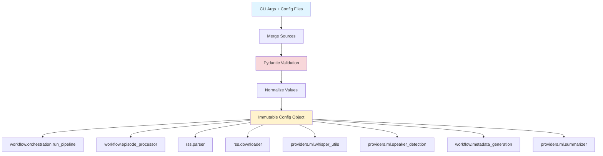
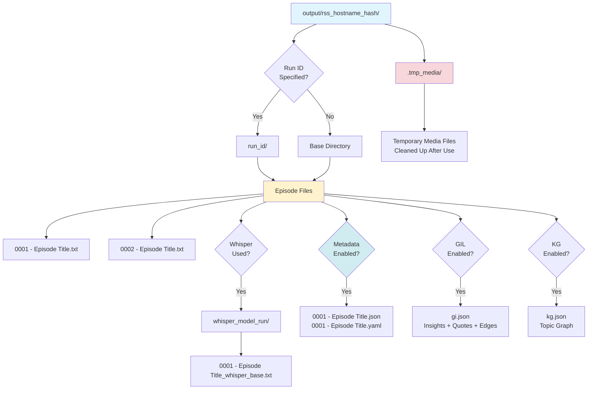

# Podcast Scraper Architecture

> **Strategic Overview**: This document provides high-level architectural decisions, design principles, and system structure. For detailed implementation guides, see the [Development Guide](../guides/DEVELOPMENT_GUIDE.md) and other specialized documents linked below.

## Navigation

This architecture document is the central hub for understanding the system. For detailed information, see:

### Core Documentation

- **[ADR Index](../adr/index.md)** — **The immutable record of architectural laws and decisions**
- **Architecture — [Ways to run and deploy](#ways-to-run-and-deploy)** — CLI vs service vs Docker; one pipeline, one Config
- **[Non-Functional Requirements](NON_FUNCTIONAL_REQUIREMENTS.md)** — Performance, security, reliability, observability, maintainability, scalability
- **[Development Guide](../guides/DEVELOPMENT_GUIDE.md)** — Detailed implementation instructions, dependency management, code patterns, and development workflows
- **[Pipeline and Workflow Guide](../guides/PIPELINE_AND_WORKFLOW.md)** — Pipeline flow, module roles, behavioral quirks, run tracking
- **[Testing Strategy](TESTING_STRATEGY.md)** — Testing philosophy, test pyramid, and quality standards
- **[Testing Guide](../guides/TESTING_GUIDE.md)** — Quick reference and test execution commands
  - [Unit Testing Guide](../guides/UNIT_TESTING_GUIDE.md) — Unit test mocking patterns
  - [Integration Testing Guide](../guides/INTEGRATION_TESTING_GUIDE.md) — Integration test guidelines
  - [E2E Testing Guide](../guides/E2E_TESTING_GUIDE.md) — E2E server, real ML models
  - [Critical Path Testing Guide](../guides/CRITICAL_PATH_TESTING_GUIDE.md) — What to test, prioritization
- **[Server Guide](../guides/SERVER_GUIDE.md)** — FastAPI server, REST API, viewer, development workflow
- **[CI/CD](../ci/index.md)** — Continuous integration and deployment pipeline

### API Documentation

- **[API Reference](../api/REFERENCE.md)** — Complete API documentation
- **[Configuration](../api/CONFIGURATION.md)** — Configuration options and examples
- **[CLI Reference](../api/CLI.md)** — Command-line interface documentation

### Feature Documentation

- **[Provider Implementation Guide](../guides/PROVIDER_IMPLEMENTATION_GUIDE.md)** — Complete guide for implementing new providers (includes OpenAI example, testing, E2E server mocking)
- **[ML Provider Reference](../guides/ML_PROVIDER_REFERENCE.md)** — ML implementation details
- **[Configuration API](../api/CONFIGURATION.md)** — Configuration API reference (includes environment variables)

### Specifications

- **[PRDs](../prd/index.md)** — Product Requirements
  Documents
- **[RFCs](../rfc/index.md)** — Request for Comments
  (design decisions)
- **[GIL Ontology](gi/ontology.md)** — Grounded
  Insight Layer node/edge types and grounding contract
- **[GIL Schema](gi/gi.schema.json)** — Machine-
  readable JSON schema for `gi.json` validation

## Goals and Scope

- Provide a resilient pipeline that collects podcast
  episode transcripts from RSS feeds and fills gaps
  via Whisper transcription.
- Offer both CLI and Python APIs with a single
  configuration surface (`Config`) and deterministic
  filesystem layout.
- Keep the public surface area small (`Config`,
  `load_config_file`, `run_pipeline`, `service.run`,
  `service.run_from_config_file`, `cli.main`) while
  exposing well-factored submodules for advanced use.
- Provide a service API (`service.py`) optimized for
  non-interactive use (daemons, process managers) with
  structured error handling and exit codes.
- Support a **multi-provider architecture** with
  local ML (`MLProvider`), hybrid MAP-REDUCE
  (`HybridMLProvider`), and 7 LLM providers (OpenAI,
  Gemini, Anthropic, Mistral, DeepSeek, Grok, Ollama)
  enabling choice across cost, quality, privacy, and
  latency dimensions.
- Enable **structured knowledge extraction** via the
  Grounded Insight Layer (GIL) — extracting insights
  and verbatim quotes with evidence grounding from
  podcast transcripts (PRD-017).
- Enable **Knowledge Graph (KG) extraction** from
  transcripts and summaries, producing structured
  topic graphs per episode.

## Ways to run and deploy

The system has **one pipeline** (`workflow.run_pipeline`) and **one configuration model** (`Config`). Both entry points produce a `Config` and call the same pipeline; only how config is supplied and how results are surfaced differs.

| Mode | Use case | Config source | Entry / deployment |
| ---- | --------- | ------------- | ------------------- |
| **CLI** | Interactive runs, ad-hoc flags, progress bars | CLI args + optional `--config` file | `podcast-scraper <rss_url>`, `python -m podcast_scraper.cli`. Subcommands: `doctor`, `cache`. |
| **Service** | Daemons, automation, process managers | Config file only (no CLI args) | `python -m podcast_scraper.service --config config.yaml`. Returns `ServiceResult`; exit code 0/1. For supervisor, systemd, etc. |
| **Docker** | Service-oriented deployment | Config file (default `/app/config.yaml` or `PODCAST_SCRAPER_CONFIG`) | Container runs **service mode**: no CLI arguments, config from file and env. See [Docker Service Guide](../guides/DOCKER_SERVICE_GUIDE.md). |
| **Server (viewer)** | GI/KG visualization, semantic search, explore | `--output-dir` (corpus path) | `podcast serve --output-dir <path>`. FastAPI + Vue SPA. See [Server Guide](../guides/SERVER_GUIDE.md). |

**Programmatic use:** Import `config.load_config_file`, `Config`, and either `workflow.run_pipeline` (returns count + summary) or `service.run` / `service.run_from_config_file` (returns `ServiceResult`). See [API Reference](../api/REFERENCE.md) and [Service API](../api/SERVICE.md).

**Server / viewer:** The FastAPI server in `src/podcast_scraper/server/` is the project's canonical HTTP layer — the viewer is its first consumer, platform routes (#50, #347) will be the second. The server wraps existing Python APIs (`VectorStore.search()`, `gi explore`, artifact loading) behind REST endpoints and serves the Vue SPA as static files. See [Server Guide](../guides/SERVER_GUIDE.md) and [RFC-062](../rfc/RFC-062-gi-kg-viewer-v2.md).

**Providers:** Nine providers (1 local ML + 1 hybrid ML + 7 LLM) supply transcription, speaker detection, and summarization; capability matrix and selection are in [Pipeline and Workflow Guide](../guides/PIPELINE_AND_WORKFLOW.md). Adding or extending providers: [Provider Implementation Guide](../guides/PROVIDER_IMPLEMENTATION_GUIDE.md).

## Architectural Decisions (ADRs)

The following architectural principles govern this system. For the full history and rationale, see the **[ADR Index](../adr/index.md)**.

### Core Patterns

- **Concurrency**: IO-bound threading for downloads, sequential CPU/GPU tasks for ML ([ADR-001](../adr/ADR-001-hybrid-concurrency-strategy.md)). MPS exclusive mode ([ADR-046](../adr/ADR-046-mps-exclusive-mode-apple-silicon.md)) serializes GPU work on Apple Silicon to prevent memory contention when both Whisper and summarization use MPS (enabled by default).
- **Providers**: Protocol-based discovery ([ADR-020](../adr/ADR-020-protocol-based-provider-discovery.md)) using unified provider classes ([ADR-024](../adr/ADR-024-unified-provider-pattern.md)), library-based naming ([ADR-025](../adr/ADR-025-technology-based-provider-naming.md)), and per-capability provider selection ([ADR-026](../adr/ADR-026-per-capability-provider-selection.md)).
- **Lazy Loading**: Heavy ML dependencies are loaded only when needed ([ADR-005](../adr/ADR-005-lazy-ml-dependency-loading.md)).

### Data & Filesystem

- **Storage**: Hash-based deterministic directory layout ([ADR-003](../adr/ADR-003-deterministic-feed-storage.md)) with flat archives ([ADR-004](../adr/ADR-004-flat-filesystem-archive-layout.md)).
- **Identity**: Universal GUID-based episode identification ([ADR-007](../adr/ADR-007-universal-episode-identity.md)).
- **Metadata**: Unified JSON schema compatible with SQL and NoSQL ([ADR-008](../adr/ADR-008-database-agnostic-metadata-schema.md)).

### ML & AI Processing

- **Summarization**: Hybrid MAP-REDUCE strategy ([ADR-010](../adr/ADR-010-hierarchical-summarization-pattern.md), [ADR-043](../adr/ADR-043-hybrid-map-reduce-summarization.md)) favoring local models ([ADR-009](../adr/ADR-009-privacy-first-local-summarization.md)).
- **Audio**: Mandatory preprocessing ([ADR-036](../adr/ADR-036-standardized-pre-provider-audio-stage.md)) with content-hash caching ([ADR-037](../adr/ADR-037-content-hash-based-audio-caching.md)) using FFmpeg ([ADR-038](../adr/ADR-038-ffmpeg-first-audio-manipulation.md)) and Opus ([ADR-039](../adr/ADR-039-speech-optimized-codec-opus.md)).
- **Governance**: Explicit benchmarking gates ([ADR-042](../adr/ADR-042-heuristic-based-quality-gates.md)) and golden dataset versioning ([ADR-040](../adr/ADR-040-explicit-golden-dataset-versioning.md)).

### Development & CI

- **Workflow**: Git worktree-based isolation ([ADR-032](../adr/ADR-032-git-worktree-based-development.md)) with independent environments ([ADR-034](../adr/ADR-034-isolated-runtime-environments.md)).
- **Quality**: Three-tier test pyramid ([ADR-019](../adr/ADR-019-standardized-test-pyramid.md)) with automated health metrics ([ADR-023](../adr/ADR-023-public-operational-metrics.md)).

### Reproducibility & Operational Hardening (Issue #379)

- **Determinism**: Seed-based reproducibility for `torch`, `numpy`, and `transformers` ensures consistent outputs across runs. Seeds are configurable via environment variables or config files.
- **Run Tracking**: Comprehensive run manifests capture system state (Python version, OS, GPU info, model versions, git commit SHA, config hash) for complete reproducibility. Per-episode stage timings track processing duration for performance analysis.
- **Failure Handling**: Configurable `--fail-fast` and `--max-failures` flags allow operators to control pipeline behavior on episode failures. Episode-level failures are tracked in metrics without affecting exit codes.
- **Retry Policies**: Exponential backoff retry for transient errors (network failures, model loading errors) with configurable retry counts and delays. HTTP requests use urllib3 retry adapters.
- **Timeout Enforcement**: Configurable timeouts for transcription and summarization stages prevent hung operations.
- **Security**: Path validation prevents directory traversal attacks. Model allowlist validation restricts HuggingFace model sources. Safetensors format preference improves security and performance. `trust_remote_code=False` enforced on all model loading.
- **Structured Logging**: `--json-logs` flag enables structured JSON logging for log aggregation systems (ELK, Splunk, CloudWatch).
- **Diagnostics**: `podcast_scraper doctor` command validates environment (Python version, ffmpeg, write permissions, model cache, network connectivity).

## Pipeline and Workflow

1. **Entry**: `podcast_scraper.cli.main` parses CLI args (optionally merging JSON/YAML configs) into a validated `Config` object and applies global logging preferences.
2. **Run orchestration**: `workflow.orchestration.run_pipeline` coordinates the end-to-end job: output setup, RSS acquisition, episode materialization, transcript download, optional Whisper transcription, optional metadata generation, optional summarization, and cleanup.
3. **Episode handling**: For each `Episode`, `workflow.episode_processor.process_episode_download` either saves an existing transcript or enqueues media for Whisper.
4. **Speaker detection** (RFC-010): When automatic speaker detection is enabled, host names are extracted from RSS author tags (channel-level `<author>`, `<itunes:author>`, `<itunes:owner>`) as the primary source, falling back to NER extraction from feed metadata if no author tags exist. Guest names are extracted from episode-specific metadata (titles and descriptions) using Named Entity Recognition (NER) with spaCy. Manual speaker names are only used as fallback when detection fails. Note: The pipeline logs debug messages when transcription parallelism is ignored due to provider limitations (e.g., Whisper always uses sequential processing).
5. **Audio Preprocessing** (RFC-040): When preprocessing is enabled, audio files are optimized before transcription: converted to mono, resampled to 16 kHz, silence removed via VAD, loudness normalized, and compressed with Opus codec. This reduces file size (typically 10-25× smaller) and ensures API compatibility (e.g., OpenAI 25 MB limit). Preprocessing happens at the pipeline level in `workflow.episode_processor.transcribe_media_to_text` before any provider receives the audio. All providers benefit from optimized audio.
6. **Transcription**: When Whisper fallback is enabled, `workflow.episode_processor.download_media_for_transcription` downloads media to a temp area and `workflow.episode_processor.transcribe_media_to_text` persists Whisper output using deterministic naming. Detected speaker names are integrated into screenplay formatting when enabled.
7. **Metadata generation** (PRD-004/RFC-011): When enabled, per-episode metadata documents are generated alongside transcripts, capturing feed-level and episode-level information, detected speaker names, and processing metadata in JSON/YAML format.
8. **Summarization** (PRD-005/RFC-012): When enabled,
   episode transcripts are summarized using the
   configured provider — local transformer models
   (BART, PEGASUS, LED) via `MLProvider`; the
   **hybrid_ml** provider (MAP with LongT5 + REDUCE
   via Ollama, llama.cpp, or transformers); or any
   of 7 LLM providers (OpenAI, Gemini, Anthropic,
   Mistral, DeepSeek, Grok, Ollama) via prompt
   templates. See
   [ML Provider Reference](../guides/ML_PROVIDER_REFERENCE.md)
   for ML architecture details.
9. **Run Tracking** (Issue #379): Run manifests
   capture system state at pipeline start. Per-episode
   stage timings track processing duration. Run
   summaries combine manifest and metrics. Episode
   index files list all processed episodes with
   status.
10. **Progress/UI**: All long-running operations
    report progress through the pluggable factory in
    `utils.progress`, defaulting to `rich` in the CLI.
11. **GIL Extraction** (PRD-017): When enabled,
    the Grounded Insight Layer extracts structured
    insights and verbatim quotes from transcripts,
    links them via grounding relationships, and
    writes a `gi.json` file per episode. This step
    runs after summarization and uses the same
    multi-provider architecture. See `gi/` module.
12. **KG Extraction**: When enabled, Knowledge Graph
    extraction produces structured topic graphs from
    transcripts and summaries, writing `kg.json` per
    episode. See `kg/` module.

### Pipeline Flow Diagram

```mermaid
flowchart TD
    Start([CLI Entry]) --> Parse[Parse CLI Args & Config Files]
    Parse --> Validate[Validate & Normalize Config]
    Validate --> Setup[Setup Output Directory]
    Setup --> FetchRSS[Fetch & Parse RSS Feed]
    FetchRSS --> ExtractEpisodes[Extract Episode Metadata]
    ExtractEpisodes --> DetectSpeakers{Speaker Detection Enabled?}
    DetectSpeakers -->|Yes| ExtractHosts[Extract Host Names from RSS]
    ExtractHosts --> ExtractGuests[Extract Guest Names via NER]
    DetectSpeakers -->|No| ProcessEpisodes[Process Episodes]
    ExtractGuests --> ProcessEpisodes
    ProcessEpisodes --> CheckTranscript{Transcript Available?}
    CheckTranscript -->|Yes| DownloadTranscript[Download Transcript]
    CheckTranscript -->|No| QueueWhisper[Queue for Whisper]
    DownloadTranscript --> SaveTranscript[Save Transcript File]
    QueueWhisper --> DownloadMedia[Download Media File]
    DownloadMedia --> Preprocess{Preprocessing Enabled?}
    Preprocess -->|Yes| PreprocessAudio[Preprocess Audio: Mono, 16kHz, VAD, Normalize, Opus]
    Preprocess -->|No| Transcribe
    PreprocessAudio --> Transcribe[Whisper Transcription]
    Transcribe --> FormatScreenplay[Format with Speaker Names]
    FormatScreenplay --> SaveTranscript
    SaveTranscript --> GenerateMetadata{Metadata Generation?}
    GenerateMetadata -->|Yes| CreateMetadata[Generate Metadata JSON/YAML]
    GenerateMetadata -->|No| Cleanup
    CreateMetadata --> GenerateSummary{Summarization Enabled?}
    GenerateSummary -->|Yes| Summarize[Generate Summary]
    GenerateSummary -->|No| GILCheck
    Summarize --> AddSummaryToMetadata[Add Summary to Metadata]
    AddSummaryToMetadata --> GILCheck{GIL Extraction?}
    GILCheck -->|Yes| ExtractGIL[Extract Insights + Quotes]
    GILCheck -->|No| KGCheck
    ExtractGIL --> GroundInsights[Ground Insights with Quotes]
    GroundInsights --> WriteGI[Write gi.json]
    WriteGI --> KGCheck{KG Extraction?}
    KGCheck -->|Yes| ExtractKG[Extract Topic Graph]
    KGCheck -->|No| Cleanup
    ExtractKG --> WriteKG[Write kg.json]
    WriteKG --> Cleanup[Cleanup Temp Files]
    Cleanup --> End([Complete])

    style Start fill:#e1f5ff
    style End fill:#d4edda
    style ProcessEpisodes fill:#fff3cd
    style Transcribe fill:#f8d7da
    style GenerateMetadata fill:#d1ecf1
    style ExtractGIL fill:#e8daef
    style ExtractKG fill:#d5f5e3
```



- `cli.py`: Parse/validate CLI arguments, integrate config files, set up progress reporting, trigger `run_pipeline`. Optimized for interactive command-line use.
- `service.py`: Service API for programmatic/daemon use. Provides `service.run()` and `service.run_from_config_file()` functions that return structured `ServiceResult` objects. Works exclusively with configuration files (no CLI arguments), optimized for non-interactive use (supervisor, systemd, etc.). Entry point: `python -m podcast_scraper.service --config config.yaml`.
- `config.py`: Immutable Pydantic model representing all runtime options; JSON/YAML loader with strict validation and normalization helpers. Includes language configuration, NER settings, and speaker detection flags (RFC-010).
- `workflow.orchestration`: Pipeline coordinator that orchestrates directory prep, RSS parsing, download concurrency, Whisper lifecycle, speaker detection coordination, and cleanup.
- `rss.parser`: Safe RSS/XML parsing using `defusedxml` ([ADR-002](../adr/ADR-002-security-first-xml-processing.md)), discovery of transcript/enclosure URLs, and creation of `Episode` models.
- `rss.downloader`: HTTP session pooling with retry-enabled adapters, streaming downloads, and shared progress hooks.
- `workflow.episode_processor`: Episode-level decision logic, transcript storage, Whisper job management, delay handling, and file naming rules. Integrates detected speaker names into Whisper screenplay formatting.
- `utils.filesystem`: Filename sanitization, output directory derivation based on feed hash ([ADR-003](../adr/ADR-003-deterministic-feed-storage.md)), run suffix logic, and helper utilities for Whisper output paths.
- **Provider System** (RFC-013, RFC-029): Protocol-based provider architecture for transcription, speaker detection, and summarization ([ADR-020](../adr/ADR-020-protocol-based-provider-discovery.md)). Each capability has a protocol interface (`TranscriptionProvider`, `SpeakerDetector`, `SummarizationProvider`) and factory functions that create provider instances based on configuration. Providers implement `initialize()`, protocol methods (e.g., `transcribe()`, `summarize()`), and `cleanup()`. See [Provider Implementation Guide](../guides/PROVIDER_IMPLEMENTATION_GUIDE.md) for details.
- **Unified Providers** (RFC-029): Nine unified
  provider classes implement protocol combinations
  ([ADR-024](../adr/ADR-024-unified-provider-pattern.md)):

  | Provider | Transcription | Speaker Detection | Summarization | Notes |
  | --- | --- | --- | --- | --- |
  | `MLProvider` | ✅ Whisper | ✅ spaCy NER | ✅ Transformers | Local, no API cost |
  | `HybridMLProvider` | ❌ | ❌ | ✅ MAP-REDUCE | LongT5 MAP + Ollama/llama_cpp/transformers REDUCE (RFC-042) |
  | `OpenAIProvider` | ✅ Whisper API | ✅ GPT API | ✅ GPT API | Cloud, prompt-managed |
  | `GeminiProvider` | ✅ Gemini API | ✅ Gemini API | ✅ Gemini API | 2M context, native audio |
  | `AnthropicProvider` | ❌ | ✅ Claude API | ✅ Claude API | High quality reasoning |
  | `MistralProvider` | ❌ | ✅ Mistral API | ✅ Mistral API | OpenAI alternative |
  | `DeepSeekProvider` | ❌ | ✅ DeepSeek API | ✅ DeepSeek API | Ultra low-cost |
  | `GrokProvider` | ❌ | ✅ Grok API | ✅ Grok API | Real-time info (xAI) |
  | `OllamaProvider` | ❌ | ✅ Ollama API | ✅ Ollama API | Local LLM, zero cost |

  - **Factories**: Factory functions in
    `transcription/factory.py`,
    `speaker_detectors/factory.py`, and
    `summarization/factory.py` create the appropriate
    unified provider based on configuration.
  - **Capabilities**: `providers/capabilities.py`
    defines `ProviderCapabilities` — a dataclass
    describing what each provider supports (JSON mode,
    tool calls, streaming, etc.). Used by factories
    and orchestration to select appropriate providers.
  - **Prompt Management** (RFC-017):
    `prompts/store.py` implements versioned Jinja2
    prompt templates organized by
    `<provider>/<task>/<version>.j2` (e.g.,
    `openai/summarization/long_v1.j2`). Each of the
    9 providers has tuned templates for summarization
    and NER. LLM providers load prompts via
    `PromptStore.render()` ensuring consistent,
    version-tracked prompt engineering.
- `providers/ml/whisper_utils.py`: Lazy loading of the third-party `openai-whisper` library, transcription invocation with language-aware model selection (preferring `.en` variants for English), and screenplay formatting helpers that use detected speaker names. Accessed via `MLProvider` (unified provider pattern).
- `providers/ml/speaker_detection.py` (RFC-010): Named Entity Recognition using spaCy to extract PERSON entities from episode metadata, distinguish hosts from guests, and provide speaker names for Whisper screenplay formatting. spaCy is a required dependency. Accessed via `MLProvider` (unified provider pattern).
- `providers/ml/summarizer.py` (PRD-005/RFC-012): Episode summarization using local transformer models (BART, PEGASUS, LED) to generate concise summaries from transcripts. Implements a hybrid map-reduce strategy. Accessed via `MLProvider` (unified provider pattern). See [ML Provider Reference](../guides/ML_PROVIDER_REFERENCE.md) for details.
- `providers/ml/model_registry.py` (RFC-044): Centralized model metadata registry (`ModelRegistry` class) with `ModelCapabilities` dataclass for all models (summarization, embedding, QA, NLI).
- `gi/` (PRD-017): Grounded Insight Layer — structured insight and quote extraction with evidence grounding. Key modules: `pipeline.py` (orchestration), `schema.py` (validation), `grounding.py` (insight↔quote linking), `contracts.py` (grounding contract), `explore.py` (CLI exploration), `corpus.py` (cross-episode operations).
- `kg/` (RFC-055): Knowledge Graph extraction — structured topic graphs from transcripts and summaries. Key modules: `pipeline.py` (orchestration), `schema.py` (validation), `llm_extract.py` (LLM-based extraction), `cli_handlers.py` (CLI subcommands).
- `server/` (RFC-062): FastAPI HTTP layer. App factory in `app.py`, Pydantic schemas in `schemas.py`, route modules in `routes/` (health, artifacts, search, explore, index_stats). CLI integration via `cli_handlers.py` (`podcast serve`). Serves the Vue SPA (`web/gi-kg-viewer/dist/`) as static files. Platform route stubs in `routes/platform/` for future #50/#347 work.
- `utils.progress`: Minimal global progress publishing API so callers can swap in alternative UIs.
- `models/` (package): Simple dataclasses (`RssFeed`, `Episode`, `TranscriptionJob` in `entities.py`) shared across modules.
- `workflow.metadata_generation` (PRD-004/RFC-011): Per-episode metadata document generation, capturing feed-level and episode-level information, detected speaker names, transcript sources, processing metadata, and optional summaries in structured JSON/YAML format. Opt-in feature for backwards compatibility.

### Module Dependencies Diagram

```mermaid
graph TB
    subgraph "Public API"
        CLI[cli.py]
        Config[config.py]
        Service[service.py]
        Workflow[workflow/orchestration.py]
    end

    subgraph "Core Processing"
        RSSParser[rss/parser.py]
        EpisodeProc[workflow/episode_processor.py]
        Downloader[rss/downloader.py]
        AudioPreproc[preprocessing/]
    end

    subgraph "Support Modules"
        Filesystem[utils/filesystem.py]
        Models[models/]
        Progress[utils/progress.py]
        Schemas[schemas/summary_schema.py]
    end

    subgraph "Prompt Management"
        PromptStore[prompts/store.py]
        PromptTemplates[prompts/provider/task/v1.j2]
    end

    subgraph "Provider System"
        TranscriptionFactory[transcription/factory.py]
        SpeakerFactory[speaker_detectors/factory.py]
        SummaryFactory[summarization/factory.py]
        Capabilities[providers/capabilities.py]
    end

    subgraph "Local ML Provider"
        MLProvider[providers/ml/ml_provider.py]
        HybridMLProvider[providers/ml/hybrid_ml_provider.py]
        ModelRegistry[providers/ml/model_registry.py]
        Whisper[providers/ml/whisper_utils.py]
        SpeakerDetect[providers/ml/speaker_detection.py]
        Summarizer[providers/ml/summarizer.py]
        NER[providers/ml/ner_extraction.py]
    end

    subgraph "LLM Providers"
        OpenAIProvider[providers/openai/]
        GeminiProvider[providers/gemini/]
        AnthropicProvider[providers/anthropic/]
        MistralProvider[providers/mistral/]
        DeepSeekProvider[providers/deepseek/]
        GrokProvider[providers/grok/]
        OllamaProvider[providers/ollama/]
    end

    subgraph "Server Layer"
        ServerApp[server/app.py]
        ServerRoutes[server/routes/]
        ServerSchemas[server/schemas.py]
    end

    subgraph "Knowledge Extraction"
        GI[gi/pipeline.py]
        GISchema[gi/schema.py]
        GIGrounding[gi/grounding.py]
        KG[kg/pipeline.py]
        KGSchema[kg/schema.py]
        KGExtract[kg/llm_extract.py]
    end

    subgraph "Optional Features"
        Metadata[workflow/metadata_generation.py]
        Evaluation[evaluation/]
        Cleaning[cleaning/]
    end

    CLI --> Config
    CLI --> Workflow
    CLI --> ServerApp
    Service --> Config
    Service --> Workflow
    ServerApp --> ServerRoutes
    ServerRoutes --> GI
    ServerRoutes --> ServerSchemas
    Workflow --> RSSParser
    Workflow --> EpisodeProc
    Workflow --> Downloader
    Workflow --> TranscriptionFactory
    Workflow --> SpeakerFactory
    Workflow --> SummaryFactory
    Workflow --> AudioPreproc
    TranscriptionFactory --> MLProvider
    TranscriptionFactory --> OpenAIProvider
    TranscriptionFactory --> GeminiProvider
    SpeakerFactory --> MLProvider
    SpeakerFactory --> OpenAIProvider
    SpeakerFactory --> GeminiProvider
    SpeakerFactory --> AnthropicProvider
    SpeakerFactory --> MistralProvider
    SpeakerFactory --> DeepSeekProvider
    SpeakerFactory --> GrokProvider
    SpeakerFactory --> OllamaProvider
    SummaryFactory --> MLProvider
    SummaryFactory --> HybridMLProvider
    SummaryFactory --> OpenAIProvider
    SummaryFactory --> GeminiProvider
    SummaryFactory --> AnthropicProvider
    SummaryFactory --> MistralProvider
    SummaryFactory --> DeepSeekProvider
    SummaryFactory --> GrokProvider
    SummaryFactory --> OllamaProvider
    MLProvider --> Whisper
    MLProvider --> SpeakerDetect
    MLProvider --> Summarizer
    MLProvider --> NER
    MLProvider --> ModelRegistry
    HybridMLProvider --> Summarizer
    HybridMLProvider --> ModelRegistry
    Summarizer --> ModelRegistry
    OpenAIProvider --> PromptStore
    GeminiProvider --> PromptStore
    AnthropicProvider --> PromptStore
    MistralProvider --> PromptStore
    DeepSeekProvider --> PromptStore
    GrokProvider --> PromptStore
    OllamaProvider --> PromptStore
    PromptStore --> PromptTemplates
    Workflow --> Metadata
    Workflow --> GI
    Workflow --> KG
    Workflow --> Filesystem
    GI --> GISchema
    GI --> GIGrounding
    GI --> SummaryFactory
    KG --> KGSchema
    KG --> KGExtract
    KGExtract --> SummaryFactory
    EpisodeProc --> Downloader
    EpisodeProc --> Filesystem
    RSSParser --> Models
    Summarizer --> Models
    SpeakerDetect --> Models
    TranscriptionFactory --> Capabilities
    SpeakerFactory --> Capabilities
    SummaryFactory --> Capabilities
```



**Actual import relationships (pydeps):**

The diagram below shows the actual import relationships between modules, generated from code analysis. Compare with the Mermaid diagram above to validate that implementation matches design.


*Generated by [pydeps](https://github.com/thebjorn/pydeps). Regenerate with `make visualize` (requires Graphviz).*

**Workflow call graph (function-level):**

The following diagram shows which functions call which in the pipeline entry point (`workflow/orchestration.py`). Useful for understanding orchestration flow and hot paths.


*Generated by [pyan3](https://github.com/Technologicat/pyan).*

**Flowcharts:** For control flow within key modules, see [orchestration flowchart](diagrams/orchestration-flow.svg) and [service API flowchart](diagrams/service-flow.svg) (generated by [code2flow](https://github.com/scottrogowski/code2flow)).

<!-- markdownlint-disable MD037 -->
- **Typed, immutable configuration**: `Config` is a frozen Pydantic model, ensuring every module receives canonicalized values (e.g., normalized URLs, integer coercions, validated Whisper models). This centralizes validation and guards downstream logic.
- **Resilient HTTP interactions**: A per-thread `requests.Session` with exponential backoff retry (`LoggingRetry`) handles transient network issues while logging retries for observability. Model loading operations use `retry_with_exponential_backoff` for transient errors (network failures, timeouts).
- **Concurrent transcript pulls**: Transcript downloads are parallelized via `ThreadPoolExecutor`, guarded with locks when mutating shared counters/job queues. Whisper remains sequential to avoid GPU/CPU thrashing and to keep the UX predictable.
- **Deterministic filesystem layout**: Output folders follow `output/rss_<host>_<hash>` conventions. Optional `run_id` and Whisper suffixes create run-scoped subdirectories while `sanitize_filename` protects against filesystem hazards.
- **Dry-run and resumability**: `--dry-run` walks the entire plan without touching disk, while `--skip-existing` short-circuits work per episode, making repeated runs idempotent.
- **Pluggable progress/UI**: A narrow `ProgressFactory` abstraction lets embedding applications replace the default `tqdm` progress without touching business logic.
- **Optional Whisper dependency**: Whisper is imported lazily and guarded so environments without GPU support or `openai-whisper` can still run transcript-only workloads.
- **Optional summarization dependency** (PRD-005/RFC-012): Summarization requires `torch` and `transformers` dependencies and is imported lazily. When dependencies are unavailable, summarization is gracefully skipped. Models are automatically selected based on available hardware (MPS for Apple Silicon, CUDA for NVIDIA GPUs, CPU fallback). See [ML Provider Reference](../guides/ML_PROVIDER_REFERENCE.md) for details.
- **Language-aware processing** (RFC-010): A single `language` configuration drives both Whisper model selection (preferring English-only `.en` variants) and NER model selection (e.g., `en_core_web_sm`), ensuring consistent language handling across the pipeline.
- **Automatic speaker detection** (RFC-010): Named Entity Recognition extracts speaker names from episode metadata transparently. Manual speaker names (`--speaker-names`) are ONLY used as fallback when automatic detection fails, not as override. spaCy is a required dependency for speaker detection.
- **Host/guest distinction**: Host detection prioritizes RSS author tags (channel-level only) as the most reliable source, falling back to NER extraction from feed metadata when author tags are unavailable. Guests are always detected from episode-specific metadata using NER, ensuring accurate speaker labeling in Whisper screenplay output.
- **Provider-based architecture** (RFC-013): All capabilities (transcription, speaker detection, summarization) use a protocol-based provider system. Providers are created via factory functions based on configuration, allowing pluggable implementations (e.g., Whisper vs OpenAI for transcription, NER vs OpenAI for speaker detection, local transformers vs OpenAI for summarization). Providers implement consistent interfaces (`initialize()`, protocol methods, `cleanup()`) ensuring type safety and easy testing. See [Provider Implementation Guide](../guides/PROVIDER_IMPLEMENTATION_GUIDE.md) for complete implementation details.
- **Local-first summarization** (PRD-005/RFC-012): Summarization defaults to local transformer models for privacy and cost-effectiveness. API-based providers (OpenAI) are supported via the provider system. Long transcripts are handled via chunking strategies, and memory optimization is applied for GPU backends (CUDA/MPS). Models are automatically cached and reused across runs, with cache management utilities available via CLI and programmatic APIs. Model loading prefers safetensors format for security and performance (Issue #379). Pinned model revisions ensure reproducibility (Issue #379).
- **Reproducibility** (Issue #379): Deterministic runs via seed control (`torch`, `numpy`, `transformers`). Run manifests capture complete system state. Per-episode stage timings enable performance analysis. Run summaries combine manifest and metrics for complete run records.
- **Operational Hardening** (Issue #379): Retry policies with exponential backoff for transient errors. Timeout enforcement for transcription and summarization. Failure handling flags (`--fail-fast`, `--max-failures`) for pipeline control. Structured JSON logging for log aggregation. Path validation and model allowlist validation for security.

## Architecture Evolution

The system has evolved through four phases that expand
ML capabilities and enable structured knowledge
extraction. This section documents the architectural
progression and how components integrate with the
existing system.

### Phase 1: Model Registry (RFC-044)

**Status**: **Implemented**

Centralizes all model metadata (architecture limits,
capabilities, memory footprint, device defaults) into
a `ModelRegistry` class in
`providers/ml/model_registry.py`. Eliminates hardcoded
model limits scattered across the codebase. Every model
(summarization, embedding, QA, NLI) is registered with
a `ModelCapabilities` dataclass.

**Impact on existing architecture:**

- `providers/ml/summarizer.py` — uses registry for
  token limits instead of hardcoded values
- `config.py` — registry validates model selections
- Module: `providers/ml/model_registry.py`

### Phase 2: Hybrid ML Platform (RFC-042)

**Status**: **Implemented** (Hybrid MAP-REDUCE summarization + embedding/QA/NLI extensions).

**Implemented:**

- **Hybrid MAP-REDUCE summarization**: Use
  `summary_provider: hybrid_ml` with MAP phase
  (LongT5-base or other transformers) and REDUCE
  phase via **transformers** (FLAN-T5), **ollama**
  (local LLMs, e.g. llama3.1:8b, mistral:7b), or
  **llama_cpp** (GGUF). See
  [ML Provider Reference](../guides/ML_PROVIDER_REFERENCE.md#hybrid-ml-provider-summary_provider-hybrid_ml)
  and [Ollama Provider Guide](../guides/OLLAMA_PROVIDER_GUIDE.md) (Ollama as REDUCE backend).

**New modules (present):**

- `providers/ml/hybrid_ml_provider.py` — Hybrid
  MAP-REDUCE provider; REDUCE backends: transformers,
  Ollama, llama.cpp

**Implemented (Phase 2 extensions):**

- `providers/ml/embedding_loader.py` —
  Sentence-transformers for topic deduplication
- `providers/ml/extractive_qa.py` — Extractive QA
  for grounding validation
- `providers/ml/nli_loader.py` — NLI cross-encoders
  for entailment checking
- `MLProvider` extensions with embedding, QA, NLI
  models (lazy-loaded)

### Phase 2b: Local LLM Prompt Optimization (RFC-052)

**Status**: Planned (parallel with Phase 2)

Creates model-specific prompt templates for Ollama
models (Qwen2.5, Llama 3.1, Mistral 7B, Gemma 2,
Phi-3). Adds GIL extraction prompts
(`extraction/insight_v1.j2`, `topic_v1.j2`,
`quote_v1.j2`) to the existing `prompts/` structure.

**Impact on existing architecture:**

- New prompt directories under `prompts/ollama/`
- No structural changes; extends existing
  `PromptStore`

### Phase 3: Grounded Insight Layer (RFC-049)

**Status**: **Implemented**

Structured knowledge extraction in the pipeline:

```text
Transcript → Insight Extraction → Quote Extraction
    → Grounding (Insight↔Quote linking)
    → Topic Assignment → gi.json
```

**Modules (implemented):**

- `gi/pipeline.py` — GIL orchestration (called after
  summarization in pipeline)
- `gi/schema.py` — `gi.json` validation against
  `docs/architecture/gi/gi.schema.json`
- `gi/io.py` — Serializes GIL output to `gi.json`
  per episode
- `gi/grounding.py` — Insight↔Quote grounding logic
- `gi/contracts.py` — Grounding contract enforcement
- `gi/explore.py` — GIL data exploration utilities
- `gi/corpus.py` — Cross-episode corpus operations
- `gi/quality_metrics.py` — GIL quality scoring
- `gi/provenance.py` — Provenance tracking
- `gi/compare_runs.py` — Cross-run comparison

**Three extraction tiers:**

| Tier | Models | Quality | Cost |
| --- | --- | --- | --- |
| ML-only | FLAN-T5 + RoBERTa QA + NLI | Good | Free |
| Hybrid | Ollama (Qwen/Llama) + QA | Better | Free |
| Cloud LLM | OpenAI/Gemini + QA | Best | API cost |

All tiers use extractive QA for grounding contract
compliance (every quote must be verbatim).

### Phase 3a: KG Extraction (RFC-055)

**Status**: **Implemented**

Knowledge Graph extraction produces structured topic
graphs from transcripts and summaries.

**Modules (implemented):**

- `kg/pipeline.py` — KG extraction orchestration
- `kg/schema.py` — KG schema validation
- `kg/io.py` — Serializes KG output to `kg.json`
- `kg/llm_extract.py` — LLM-based KG extraction
- `kg/contracts.py` — KG contract enforcement
- `kg/corpus.py` — Cross-episode KG operations
- `kg/quality_metrics.py` — KG quality scoring
- `kg/cli_handlers.py` — KG CLI subcommands

### Phase 3b: Use Cases & DB Projection

**RFC-050** (Use Cases): **Implemented.** CLI commands
(`gi inspect`, `gi show-insight`, `gi explore`) for
consuming GIL data. See `gi/explore.py`.

**RFC-051** (Database Projection): Projects **`gi.json`**
(GIL) and **KG artifacts** (RFC-055) into **separate**
Postgres tables for fast SQL queries (e.g. GIL:
`insights`, `quotes`, `insight_support`; KG: `kg_nodes`,
`kg_edges` per RFC-051). Enables Insight Explorer,
notebook workflows, and KG discovery queries.

### Phase 4: Adaptive Routing (RFC-053)

**Status**: Planned

Selects optimal summarization and extraction
strategies based on episode characteristics (duration,
structure, content type). Uses episode profiling and
deterministic routing rules. Enables expansion beyond
podcasts to interviews, lectures, panels, etc.

### Phase 5: Server & Viewer (RFC-062)

**Status**: **Implemented** (M1–M7)

FastAPI server in `src/podcast_scraper/server/` with
Vue 3 SPA in `web/gi-kg-viewer/`. Endpoints:
`/api/health`, `/api/artifacts`, `/api/index/stats`,
`/api/search`, `/api/explore`. CLI: `podcast serve`.
Playwright E2E tests. Platform route stubs for
future #50/#347 work.

**Modules (implemented):**

- `server/app.py` — App factory, CORS, static file
  mounting
- `server/schemas.py` — Pydantic response models
- `server/routes/` — Route modules (health, artifacts,
  search, explore, index_stats)
- `server/cli_handlers.py` — CLI integration
  (`podcast serve`)

### Execution Order Summary

```text
Phase 1: RFC-044 (Model Registry)       ✅ Implemented
Phase 2: RFC-042 (Hybrid ML Platform)   ✅ Implemented (core + extensions)
    2b:  RFC-052 (LLM Prompts)          parallel
Phase 3: RFC-049 (GIL Core)             ✅ Implemented
    3a:  RFC-050 (Use Cases)            ✅ Implemented
    3b:  RFC-051 (DB Projection)        planned
    3c:  KG Extraction (RFC-055)        ✅ Implemented
Phase 4: RFC-053 (Adaptive Routing)     planned
Phase 5: RFC-062 (Server & Viewer)      ✅ Implemented
```

## Third-Party Dependencies

The project uses a layered dependency approach:
**core dependencies** (always required) provide
essential functionality, while **ML dependencies**
(optional) enable advanced features like transcription
and summarization.

**Core Dependencies**: `requests`, `pydantic`,
`defusedxml`, `tqdm`, `platformdirs`, `PyYAML`,
`Jinja2`

**ML Dependencies** (optional, install via
`pip install -e .[ml]`): `openai-whisper`, `spacy`,
`torch`, `transformers`, `sentencepiece`,
`accelerate`, `protobuf`

**API Provider Dependencies** (optional):

- `openai` — OpenAI, DeepSeek, Grok (OpenAI-compat)
- `google-genai` — Google Gemini (migrated from google-generativeai in Issue #415)
- `anthropic` — Anthropic Claude
- `mistralai` — Mistral AI
- `ollama` — Ollama (local LLMs)

**Additional ML Dependencies** (RFC-042):
`sentence-transformers`, `llama-cpp-python` (optional)

For detailed dependency information including
rationale, alternatives considered, version
requirements, and dependency management philosophy,
see [Dependencies Guide](../guides/DEPENDENCIES_GUIDE.md).

## Module Dependency Analysis

The project uses **pydeps** for visualizing module dependencies, detecting circular imports, and tracking architectural health over time. This tooling helps maintain clean module boundaries and identify coupling issues early. The dependency graph is integrated into this document above (see [Module Dependencies Diagram](#module-dependencies-diagram)).

### Tools and Commands

**Makefile Targets:**

- `make deps-graph` - Generate module dependency graphs (SVG) in `docs/architecture/`
- `make deps-graph-full` - Generate full module dependency graph with all dependencies
- `make call-graph` - Generate workflow call graph (pyan3, orchestration entry point)
- `make flowcharts` - Generate flowcharts for orchestration and service (code2flow)
- `make visualize` - Generate all architecture visualizations (deps + call graph + flowcharts) into `docs/architecture/`
- `make release-docs-prep` - Regenerate diagrams and create release notes draft before release, then commit
- `make deps-check` - Check dependencies and exit with error if issues found
- `make deps-analyze` - Run full dependency analysis with JSON report

**Analysis Script:**

- `python scripts/tools/analyze_dependencies.py` - Analyze dependencies and detect issues
  - `--check` - Exit with error if issues found
  - `--report` - Generate detailed JSON report

**Note:** Generating SVG graphs requires [Graphviz](https://graphviz.org/) (`dot` on PATH). Install with `brew install graphviz` (macOS) or your system package manager.

### Key Metrics

| Metric | Description | Threshold |
| -------- | ------------- | ----------- |
| **Max depth** | Longest dependency chain | <5 levels |
| **Circular imports** | Cycles in import graph | 0 |
| **Fan-out** | Modules a file imports | <15 |
| **Fan-in** | Modules importing a file | Monitor only |

### CI Integration

Dependency analysis runs automatically in the **nightly workflow**:

- Generates dependency graphs (SVG) for visualization
- Checks for circular imports
- Runs full dependency analysis with JSON report
- Artifacts are uploaded for download (90-day retention)

### Output Files

- `docs/architecture/diagrams/dependency-graph.svg` - Module dependency graph (clustered, for documentation)
- `docs/architecture/diagrams/dependency-graph-simple.svg` - Simplified dependency graph (clustered, max-bacon=2)
- `docs/architecture/diagrams/dependency-graph-full.svg` - Full dependency graph with all dependencies (from `make deps-graph-full`)
- `docs/architecture/diagrams/workflow-call-graph.svg` - Function call graph for orchestration (from `make call-graph`, pyan3)
- `docs/architecture/diagrams/orchestration-flow.svg`, `service-flow.svg` - Flowcharts for orchestration and service (from `make flowcharts`, code2flow)
- `reports/deps-analysis.json` - Detailed analysis report (when using `make deps-analyze` or script `--report`)

### Related Documentation

- [Architecture visualizations](diagrams/README.md) - Generated diagrams in `docs/architecture/diagrams/`
- [RFC-038: Continuous Review Tooling](../rfc/RFC-038-continuous-review-tooling.md) - Module coupling analysis implementation
- [Issue #170](https://github.com/chipi/podcast_scraper/issues/170) - Module coupling analysis tooling
- [Issue #425](https://github.com/chipi/podcast_scraper/issues/425) - Codebase visualization tools for documentation
- [CI/CD Documentation](../ci/WORKFLOWS.md) - Nightly workflow details

## Constraints and Assumptions

- Python 3.10+ with third-party packages: `requests`,
  `tqdm`, `defusedxml`, `platformdirs`, `pydantic`,
  `PyYAML`, `Jinja2`, `spacy` (required for speaker
  detection), and optionally `openai-whisper` +
  `ffmpeg` when ML transcription is required, and
  optionally `torch` + `transformers` when ML
  summarization is required.
- Network-facing operations assume well-formed HTTPS
  endpoints; malformed feeds raise early during
  parsing to avoid partial state.
- The system supports 9 providers with different
  capability profiles (see provider table above).
  Provider selection is driven by `Config` fields
  (`transcription_provider`,
  `speaker_detector_provider`,
  `summary_provider`).
- Whisper transcription supports multiple languages
  via `language` configuration, with English (`"en"`)
  as the default. Transcription remains sequential by
  design; concurrent transcription is intentionally
  out of scope due to typical hardware limits.
- Speaker name detection via NER (RFC-010) requires
  spaCy. When automatic detection fails, the system
  falls back to manual speaker names (if provided) or
  default `["Host", "Guest"]` labels.
- Output directories must live in safe roots (cwd,
  user home, or platform data/cache dirs); other
  locations trigger warnings for operator review.
- GIL extraction produces `gi.json` per episode
  conforming to a versioned schema. The grounding
  contract requires every quote to be verbatim and
  every insight to declare grounding status.
- KG extraction produces `kg.json` per episode with
  structured topic graphs derived from transcripts
  and summaries.

### Configuration Flow



- `models.Episode` encapsulates the RSS item, chosen transcript URLs, and media enclosure metadata, keeping parsing concerns separate from processing.
- Transcript filenames follow `<####> - <episode_title>[ _<run_suffix>].<ext>` with extensions inferred from declared types, HTTP headers, or URL heuristics.
- Whisper output names append the Whisper model/run identifier to differentiate multiple experimental runs inside the same base directory. Screenplay formatting uses detected speaker names when available.
- Temporary media downloads land in `<output>/ .tmp_media/` and always get cleaned up (best effort) after transcription completes.
- Episode metadata documents (per PRD-004/RFC-011)
  are generated when `generate_metadata` is enabled,
  storing detected speaker names, feed information,
  transcript sources, and other episode details
  alongside transcripts in JSON/YAML format for
  downstream use cases. When summarization is enabled,
  metadata documents include summary and key takeaways
  fields with model information and generation
  timestamps.
- **GIL artifacts** (PRD-017): When GIL extraction is
  enabled, a `gi.json` file is generated per episode
  containing structured insights, verbatim quotes,
  topics, and their grounding relationships. The file
  conforms to `docs/architecture/gi/gi.schema.json` and is
  co-located with other episode artifacts.
- **KG artifacts** (RFC-055): When KG extraction is
  enabled, a `kg.json` file is generated per episode
  containing structured topic graphs.
- **Run tracking files** (Issue #379, #429): The pipeline writes `run.json`, `index.json`, `run_manifest.json`, and `metrics.json` in each run directory. See [Pipeline and Workflow Guide - Run tracking files](../guides/PIPELINE_AND_WORKFLOW.md#run-tracking-files-issue-379-429) for details.

### Filesystem Layout



- RSS and HTTP failures raise `ValueError` early with descriptive messages; CLI wraps these in exit codes for scripting.
- Transcript/Media downloads log warnings rather than hard-fail the pipeline, allowing other episodes to proceed.
- Filesystem operations sanitize user-provided paths, emit warnings when outside trusted roots, and handle I/O errors gracefully.
- Unexpected exceptions inside worker futures are caught and logged without terminating the executor loop.

For detailed error handling patterns and implementation guidelines, see [Development Guide - Error Handling](../guides/DEVELOPMENT_GUIDE.md#error-handling).

## Extensibility Points

- **Configuration**: Extend `Config` (and CLI) when introducing new features; validation rules keep downstream logic defensive. Language and NER configuration (RFC-010) demonstrate this pattern.
- **Progress**: Replace `progress.set_progress_factory` to integrate with custom UIs or disable progress output entirely.
- **Download strategy**: `downloader` centralizes HTTP behavior—alternate adapters or auth strategies can be injected by decorating `fetch_url`/`http_get`.
- **Episode transforms**: New transcript processors can reuse `models.Episode` and `filesystem` helpers without modifying the main pipeline.
- **CLI embedding**: `cli.main` accepts override callables (`apply_log_level_fn`, `run_pipeline_fn`, `logger`) to facilitate testing and reuse from other entry points.
- **Speaker detection** (RFC-010): NER implementation is modular and can be extended with custom heuristics, additional entity types, or alternative NLP libraries. Configuration allows disabling detection behavior or providing manual fallback names.
- **Language support**: Language configuration drives both Whisper and NER model selection, enabling multi-language support through consistent configuration. New languages can be added by extending model selection logic and spaCy model support.
- **Metadata generation** (PRD-004/RFC-011): Metadata document generation is opt-in and can be extended with additional fields or alternative output formats. The schema is versioned to support future evolution.
- **Provider system** (RFC-013): The provider
  architecture enables extensibility for all
  capabilities. New providers can be added by
  implementing protocol interfaces and registering in
  factory functions. The system supports 9 providers:
  1 local ML + 1 hybrid ML + 7 LLM (OpenAI, Gemini,
  Anthropic, Mistral, DeepSeek, Grok, Ollama). E2E
  testing infrastructure includes mock endpoints for API
  providers. See
  [Provider Implementation Guide](../guides/PROVIDER_IMPLEMENTATION_GUIDE.md)
  for complete implementation patterns.
- **Prompt templates** (RFC-017): LLM providers use
  versioned Jinja2 prompt templates managed by
  `PromptStore`. New tasks can be added by creating
  `<provider>/<task>/<version>.j2` files. GIL
  extraction prompts will follow this pattern.
- **Summarization** (PRD-005/RFC-012): Summarization
  is opt-in and integrated with metadata generation.
  Local transformer models are preferred for privacy
  and cost-effectiveness, with automatic
  hardware-aware model selection. The implementation
  supports multiple model architectures (BART,
  PEGASUS, LED, DistilBART) and all 7 LLM providers
  via prompt templates. Long transcript handling via
  chunking strategies ensures scalability.
- **GIL Extraction** (PRD-017): The Grounded Insight
  Layer is an opt-in pipeline stage that produces
  `gi.json` files per episode. The three-tier
  extraction model (ML-only, Hybrid, Cloud LLM)
  reuses the existing provider architecture. New
  extraction capabilities can be added by implementing
  the `StructuredExtractor` protocol (RFC-042). The
  `gi.json` schema is versioned and validated against
  `docs/architecture/gi/gi.schema.json`.
- **KG Extraction** (RFC-055): Knowledge Graph
  extraction is an opt-in pipeline stage that produces
  `kg.json` files per episode. Supports stub,
  summary-bullet-derived, and LLM-based extraction
  modes via `kg_extraction_source` config.
- **Server / viewer** (RFC-062): The FastAPI server in
  `server/` exposes REST endpoints wrapping existing
  Python APIs. New route groups can be added by
  creating a router in `routes/` and including it in
  `app.py`. Platform routes (#50, #347) follow this
  pattern. See
  [Server Guide](../guides/SERVER_GUIDE.md).

## Testing

The project follows a three-tier testing strategy (Unit, Integration, E2E). For comprehensive testing information:

| Document | Purpose |
| ---------- | --------- |
| **[Testing Strategy](TESTING_STRATEGY.md)** | Testing philosophy, test pyramid, decision criteria |
| **[Testing Guide](../guides/TESTING_GUIDE.md)** | Quick reference, test execution commands |
| **[Unit Testing Guide](../guides/UNIT_TESTING_GUIDE.md)** | Unit test mocking patterns and isolation |
| **[Integration Testing Guide](../guides/INTEGRATION_TESTING_GUIDE.md)** | Integration test guidelines |
| **[E2E Testing Guide](../guides/E2E_TESTING_GUIDE.md)** | E2E server, real ML models |
| **[Critical Path Testing Guide](../guides/CRITICAL_PATH_TESTING_GUIDE.md)** | What to test, prioritization |
| **[Provider Implementation Guide](../guides/PROVIDER_IMPLEMENTATION_GUIDE.md)** | Provider-specific testing |
| **[Server Guide](../guides/SERVER_GUIDE.md)** | Server API testing, Playwright E2E |
