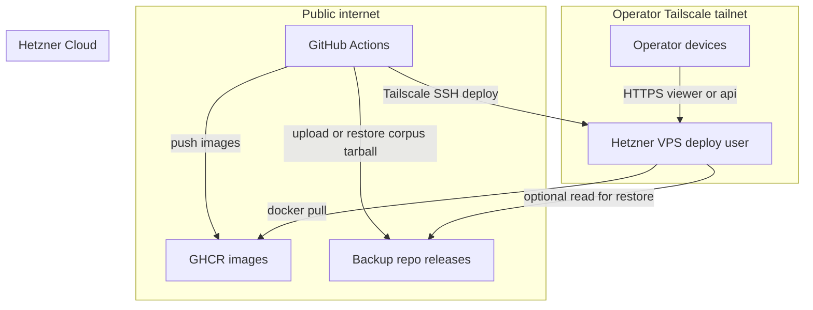
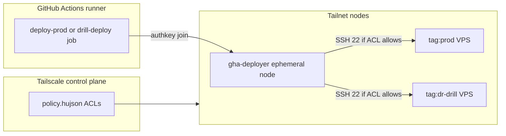
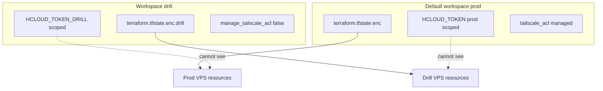
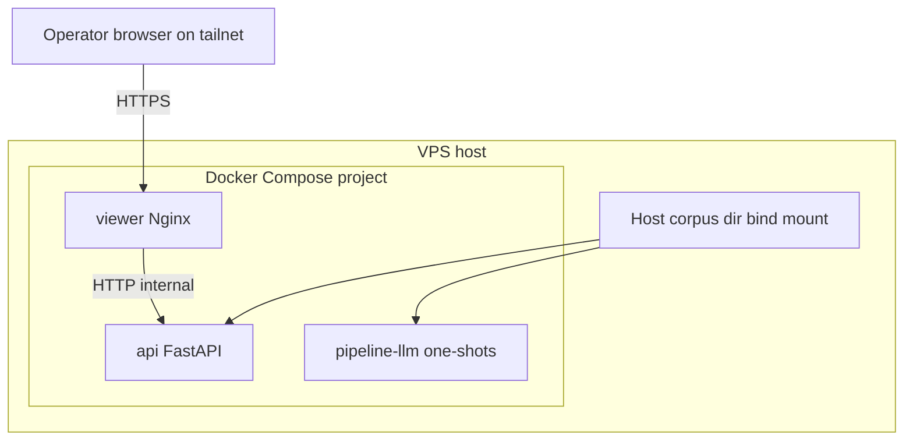
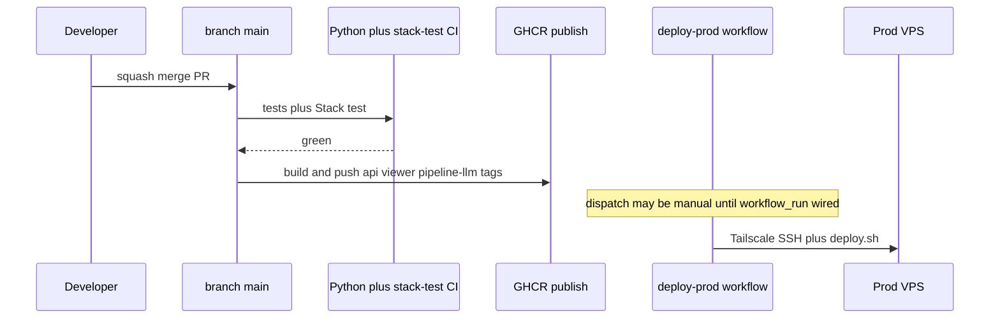
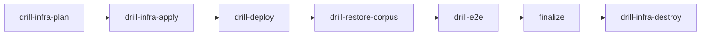

# Hosting and infrastructure architecture

**Audience:** Operators and engineers who need a **single narrative** for how the always-on
environment, CI, Tailscale, OpenTofu, and Docker Compose fit together — without rereading every RFC
paragraph first.

**Relationship to other docs:**

| Need | Start here | Go deeper with |
| --- | --- | --- |
| **Why** these choices exist (trade-offs, alternatives) | This document (summary) + **ADRs** below | [RFC-082](../rfc/RFC-082-always-on-pre-prod-and-prod-hosting.md) |
| **What to type** on prod or drill | Not this doc | [PROD_RUNBOOK.md](../guides/PROD_RUNBOOK.md), [DR_DRILL_RUNBOOK.md](../guides/DR_DRILL_RUNBOOK.md) |
| **OpenTofu file layout and workflow table** | § IaC below | [`infra/README.md` (repo root)](https://github.com/chipi/podcast_scraper/blob/main/infra/README.md) |
| **Every workflow file and trigger** | § Control plane | [WORKFLOWS.md](../ci/WORKFLOWS.md) |
| **Compose stack for CI and prod-shaped runs** | § Runtime on the host | [RFC-079](../rfc/RFC-079-full-stack-docker-compose.md), [DOCKER_SERVICE_GUIDE.md](../guides/DOCKER_SERVICE_GUIDE.md) |
| **Target-state platform** (multi-tenant, K8s graduation) | Out of scope for detail | [PLATFORM_ARCHITECTURE_BLUEPRINT.md](PLATFORM_ARCHITECTURE_BLUEPRINT.md) Part F |

**ADR spine (immutable decisions referenced throughout):**

- **Always-on VPS path:** [ADR-079](../adr/ADR-079-opentofu-for-always-on-hosting-iac.md) through [ADR-083](../adr/ADR-083-tailscale-private-ingress-always-on-vps.md)
- **Compose + CI gates:** [ADR-084](../adr/ADR-084-full-stack-docker-compose-topology.md), [ADR-085](../adr/ADR-085-ephemeral-stack-test-integration-gate.md)
- **App promotion contract:** [ADR-082](../adr/ADR-082-gitops-app-deploy-via-stack-test-and-gha.md)

**Last updated:** 2026-05-08.

---

## 1. Goals and boundaries

### 1.1 What this architecture optimises for

1. **Always-on api + viewer** on a **small VPS**, reachable from the operator’s devices without
   exposing application ports to the public internet by default.
2. **Same container images** on CI, pre-prod-shaped environments, and prod: **`api`**, **`viewer`**,
   **`pipeline-llm`** from GHCR, with tags **`main`** and **`sha-<short>`** for reproducibility.
3. **Git-reviewed infrastructure**: Hetzner objects, firewall posture, Tailscale auth keys, and
   first-boot bootstrap are declared under **`infra/`** and applied through OpenTofu with
   **encrypted state in git** ([ADR-080](../adr/ADR-080-opentofu-state-sops-age-in-git.md)).
4. **Automated app delivery** after integration gates: **`main`** is the source of truth for what
   should run; **stack-test** proves the Dockerized path before images are treated as release
   candidates ([ADR-085](../adr/ADR-085-ephemeral-stack-test-integration-gate.md),
   [ADR-082](../adr/ADR-082-gitops-app-deploy-via-stack-test-and-gha.md)).
5. **Disaster-recovery rehearsal** without touching prod state: a **separate OpenTofu workspace**
   **`drill`**, separate Hetzner token, separate encrypted state file
   ([ADR-081](../adr/ADR-081-drill-opentofu-workspace-tailscale-acl-ownership.md)).

### 1.2 Explicit non-goals (today)

- **Multi-region HA**, blue/green fleets, or **Kubernetes** as the default control plane ([RFC-082
  non-goals](../rfc/RFC-082-always-on-pre-prod-and-prod-hosting.md)).
- **Public-internet** ingress to the FastAPI or viewer ports; **Tailscale** is the primary trust
   boundary for humans and headless callers ([ADR-083](../adr/ADR-083-tailscale-private-ingress-always-on-vps.md)).
- **Auto `tofu apply` on every merge** for `infra/**` — infra changes stay **manual dispatch** after
   plan review ([ADR-082](../adr/ADR-082-gitops-app-deploy-via-stack-test-and-gha.md)).

---

## 2. System at a glance

The always-on system is the intersection of **four planes**:

| Plane | Responsibility | Primary artifacts |
| --- | --- | --- |
| **IaC** | Create or replace the VPS, firewall, Tailscale keys, cloud-init | `infra/terraform/*.tf`, `infra/tofu`, `.enc` state |
| **Data** | Corpus on disk, bind-mounted into containers | `/srv/podcast-scraper/corpus` (typical VPS layout) |
| **Runtime** | Long-lived **`api`** + **`viewer`**, one-shot **`pipeline-llm`** jobs | `compose/docker-compose.stack.yml` + `compose/docker-compose.prod.yml` |
| **Control** | Build, test, publish images; deploy; backups; drill | `.github/workflows/*.yml`, GitHub Environments |

**How to read the diagram:** GitHub Actions never needs inbound ports on your home network. For
deploy, a workflow job joins the tailnet as **`tag:gha-deployer`**, then **SSHs to `deploy@` on the
VPS hostname** resolved from MagicDNS / configured FQDN variables. The operator’s phone or laptop
uses the same tailnet with different identities and ACL rules.

---

## 3. Trust zones and Tailscale

### 3.1 Why Tailscale sits in the middle

A traditional VPS might expose **:443** to `0.0.0.0/0`. That forces a public CA story, constant
scanner noise, and a wider blast radius. Here, **the application is intended to be consumed on the
tailnet**: MagicDNS gives stable names; **`tailscale serve`** (or equivalent) terminates TLS for
the viewer; ACLs express **who may SSH** and **which tags may reach which ports**.

**CI deployers** are first-class tailnet members with **`TS_AUTHKEY`** scoped to **`tag:gha-deployer`**.
ACL rules allow **SSH from that tag to `tag:prod:22` or `tag:dr-drill:22`**, not arbitrary WAN SSH.

**Single writer for ACL JSON:** only the **default OpenTofu workspace** manages **`tailscale_acl`**
resources. The **`drill`** workspace sets **`manage_tailscale_acl = false`** so two states never
fight the same API object ([ADR-081](../adr/ADR-081-drill-opentofu-workspace-tailscale-acl-ownership.md)).
Operators land ACL edits through **prod `infra-apply`**, then drill CI consumes the updated policy.

---

## 4. Infrastructure as code (OpenTofu)

### 4.1 Engine and providers

OpenTofu runs the same HCL as Terraform would, with providers for **Hetzner** and **Tailscale**
([ADR-079](../adr/ADR-079-opentofu-for-always-on-hosting-iac.md)). That yields:

- A **CX-class** server, firewall rules, and SSH key wiring suitable for bootstrap.
- **Tailscale auth key** material for cloud-init so the VPS joins the tailnet on first boot.
- Optional **Grafana Alloy** bootstrap when Grafana Cloud remote-write variables are all set
  (host metrics path; see `infra/README.md`).

### 4.2 State: encrypted blobs in git

Plaintext **`terraform.tfstate`** must never be committed. The **`infra/tofu`** wrapper:

1. Decrypts **`terraform.tfstate.enc`** (or **`.drill`** variant) with **sops + age**.
2. Runs **`tofu plan`** or **`apply`** against plaintext on disk.
3. Re-encrypts if the state changed.
4. Shreds plaintext on exit.

This trades **remote state locking** for **simplicity and zero extra SaaS** at team-of-1 scale
([ADR-080](../adr/ADR-080-opentofu-state-sops-age-in-git.md)). CI holds **`TFSTATE_AGE_KEY`** as a
secret for the same dance.

### 4.3 Two workspaces: prod default vs `drill`

**Why two files:** blast-radius isolation. A mistaken **`tofu destroy`** in **`drill`** cannot
delete prod servers because they are not in that state file. **Why prod-only ACL:** prevents two
OpenTofu backends from issuing conflicting writes to the same Tailscale ACL API object.

### 4.4 First boot vs steady state

**`cloud-init`** (`infra/cloud-init/prod.user-data`) installs Docker, joins Tailscale, creates the
**`deploy`** user, clones the repo under **`/srv/podcast-scraper`**, and leaves a marker if
**`.env`** is still missing so Compose will not half-start secrets.

**Steady-state changes** to app images happen through **`deploy.sh`** invoked from GitHub Actions,
not through re-running cloud-init on every release (immutable infrastructure for the **machine**,
mutable **containers** on top).

---

## 5. Runtime stack on the VPS

### 5.1 Compose shape

Production-shaped runs layer **`compose/docker-compose.stack.yml`** with
**`compose/docker-compose.prod.yml`**:

- **`viewer`**: Nginx serves the built Vue app and reverse-proxies **`/api/*`** to the api service.
- **`api`**: FastAPI **`podcast serve`**, **`--no-static`**, reads corpus from **`/app/output`** inside
  the container.
- **`pipeline-llm`**: not always `up`; jobs are typically **`docker compose run`** one-shots spawned
  from the api when **`PODCAST_PIPELINE_EXEC_MODE=docker`**, using the host Docker socket mount
  described in the prod overlay comments.

**Corpus bind mount:** the prod overlay replaces the ephemeral named volume with a **host path**
(typically **`/srv/podcast-scraper/corpus`**) so operators and **`backup-corpus-prod.yml`** can
reason about files on disk. Inside containers the canonical path remains **`/app/output`**.

See [ADR-084](../adr/ADR-084-full-stack-docker-compose-topology.md) for the architectural decision
record; [RFC-079](../rfc/RFC-079-full-stack-docker-compose.md) for the full design narrative.

### 5.2 What `deploy.sh` does (conceptually)

`infra/deploy/deploy.sh` (called over SSH from **`deploy-prod.yml`**) is the **idempotent** host
orchestrator: git fetch for the pinned workflow SHA context, **`docker compose pull`**, **`up -d`**,
and health checks. It assumes the host already has Docker, the compose project directory, and a
valid **`.env`**. Exact flags and probes live in the script and [PROD_RUNBOOK.md](../guides/PROD_RUNBOOK.md).

---

## 6. Control plane: GitHub Actions

### 6.1 App path vs infra path

| Path | Trigger philosophy | Risk profile |
| --- | --- | --- |
| **App images + deploy** | Frequent; must track **`main`** after gates | Mistaken image tag mainly affects one stack; rollback is another deploy |
| **OpenTofu apply** | **Manual** `workflow_dispatch` after PR shows plan | Typo could destroy cloud resources or rewrite ACLs |

**Important nuance ([ADR-082](../adr/ADR-082-gitops-app-deploy-via-stack-test-and-gha.md)):** the
**contract** is *stack-test gate, then publish, then `deploy-prod`*. The repository may still use
**`workflow_dispatch`** only for **`deploy-prod.yml`** until **`workflow_run: Stack test`** is merged;
operators then **`gh workflow run deploy-prod`** after the same gates. Infra **`infra-apply.yml`**
remains manual regardless.

### 6.2 Stack-test as the Docker integration gate

**`stack-test.yml`** builds the compose stack, runs fixture pipeline work, asserts logs and
artifacts, starts **api + viewer**, and runs Playwright under **`tests/stack-test/`**. That is
**not** the same as README acceptance scripts ([ADR-021](../adr/ADR-021-acceptance-test-tier-as-final-ci-gate.md)):
stack-test proves **real services and Nginx**, not mocked viewer APIs ([ADR-085](../adr/ADR-085-ephemeral-stack-test-integration-gate.md)).

Local **`make ci`** chains through **`stack-test-ml-ci`** so developers feel the same final gate
before push when they run the full target ([`Makefile` at repo root](https://github.com/chipi/podcast_scraper/blob/main/Makefile) targets **`ci`** / **`_ci_body`**).

### 6.3 DR drill automation (outline)

For exercises that must **create and destroy** a throwaway footprint, **`drill-exercise.yml`**
chains: plan → apply → **`drill-deploy`** → restore corpus snapshot → smoke → **always destroy**.
Typed confirms and environment approvals are documented in [DR_DRILL_RUNBOOK.md](../guides/DR_DRILL_RUNBOOK.md).

---

## 7. Images, registry, and promotion

- **GHCR** hosts **`ghcr.io/chipi/podcast-scraper-stack-{api,viewer,pipeline-llm}`** with **`main`**
  and **`sha-<short>`** tags aligned to **`main`** commits that passed the publish prerequisites.
- **Stack-test** validates those same image layers in CI before **`main`** is trusted for release
  promotion.
- **VPS** pulls by tag; **`PODCAST_RELEASE=sha-<short>`** in the host **`.env`** ties Sentry and
  operator debugging to the running digest ([PROD_RUNBOOK.md](../guides/PROD_RUNBOOK.md)).

---

## 8. Backups and corpus continuity

- **Prod corpus** is snapshotted to **`chipi/podcast_scraper-backup`** with tags **`snapshot-prod-*`**
  via **`backup-corpus-prod.yml`** (SSH over Tailscale as **`deploy@`**).
- **Drill restore** pulls **`snapshot.tgz`** for rehearsal ([DR_DRILL_RUNBOOK.md](../guides/DR_DRILL_RUNBOOK.md)).
- **Prod restore** is a separate workflow and confirm path (**`prod-restore-corpus.yml`**) documented
  in the prod runbook — different secrets and environment on purpose.

Backups are **git-visible workflows**, not a hidden cron on the VPS only, so changes go through review
([RFC-082](../rfc/RFC-082-always-on-pre-prod-and-prod-hosting.md) design intent).

---

## 9. Observability

- **Grafana Agent** (or Alloy on the host when enabled) ships metrics to Grafana Cloud using the same
  env contract as pre-prod, with **`env` labels** distinguishing prod vs drill vs other
  **`PODCAST_ENV`** values ([PROD_RUNBOOK.md — Grafana env filter](../guides/PROD_RUNBOOK.md)).
- **Sentry** in api and viewer builds groups releases using **`PODCAST_RELEASE`**.
- **Logs** for pipeline jobs surface in Docker logs and workflow logs; there is no separate ELK stack
  in the hobby baseline.

---

## 10. Security summary

| Topic | Mechanism |
| --- | --- |
| **Network exposure** | Tailscale ACLs; Hetzner firewall default deny inbound for app ports |
| **CI to host** | Ed25519 deploy key in GitHub **Secrets**; only **`deploy@`** runs **`deploy.sh`** |
| **Infra secrets** | `HCLOUD_TOKEN`, `TS_API_KEY`, `TFSTATE_AGE_KEY`, device **`TS_AUTHKEY`**, per-env SSH keys |
| **State at rest** | sops + age encrypted files; age private key not in repo |
| **Drill isolation** | Separate Hetzner token and OpenTofu state; destroy path returns workspace to empty |

---

## 11. Cost and scale assumptions

The RFC targets a **hobby** cost envelope: single small VPS, one tailnet, GHCR within free tier for
public repos, Grafana Cloud free tier, and optional small Hetzner extras. Growth triggers (volume
snapshots, larger CX, remote state locking) are documented as **when to revisit** decisions in
[RFC-082](../rfc/RFC-082-always-on-pre-prod-and-prod-hosting.md) and [ADR-080](../adr/ADR-080-opentofu-state-sops-age-in-git.md).

---

## 12. How this relates to the platform blueprint

[PLATFORM_ARCHITECTURE_BLUEPRINT.md](PLATFORM_ARCHITECTURE_BLUEPRINT.md) describes **where the
product may go** (multi-tenant platform, optional Kubernetes, broader observability tiers). **This
document** describes **what runs today** for the always-on operator: single VPS, Compose, GitHub
Actions, Tailscale, OpenTofu with in-repo encrypted state. When a blueprint milestone (for example
GitOps with Flux) becomes real, add a new ADR and extend this doc with a “graduation delta” section.

---

## 13. Suggested reading order for a new operator

1. This document (context).
2. [ADR-079](../adr/ADR-079-opentofu-for-always-on-hosting-iac.md)–[ADR-083](../adr/ADR-083-tailscale-private-ingress-always-on-vps.md) (decision record, short).
3. [`infra/README.md` (repo root)](https://github.com/chipi/podcast_scraper/blob/main/infra/README.md) (hands-on OpenTofu and drill table).
4. [PROD_RUNBOOK.md](../guides/PROD_RUNBOOK.md) (commands, secrets staging, first boot).
5. [WORKFLOWS.md](../ci/WORKFLOWS.md) when you need exact workflow names and filters.

---

## References

- [RFC-082: Production hosting](../rfc/RFC-082-always-on-pre-prod-and-prod-hosting.md)
- [ADR-079](../adr/ADR-079-opentofu-for-always-on-hosting-iac.md)–[ADR-083](../adr/ADR-083-tailscale-private-ingress-always-on-vps.md), [ADR-082](../adr/ADR-082-gitops-app-deploy-via-stack-test-and-gha.md), [ADR-084](../adr/ADR-084-full-stack-docker-compose-topology.md), [ADR-085](../adr/ADR-085-ephemeral-stack-test-integration-gate.md)
- [`infra/README.md` (repo root)](https://github.com/chipi/podcast_scraper/blob/main/infra/README.md)
- [PROD_RUNBOOK.md](../guides/PROD_RUNBOOK.md)
- [DR_DRILL_RUNBOOK.md](../guides/DR_DRILL_RUNBOOK.md)
- [WORKFLOWS.md](../ci/WORKFLOWS.md)
