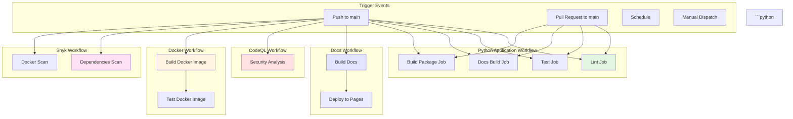
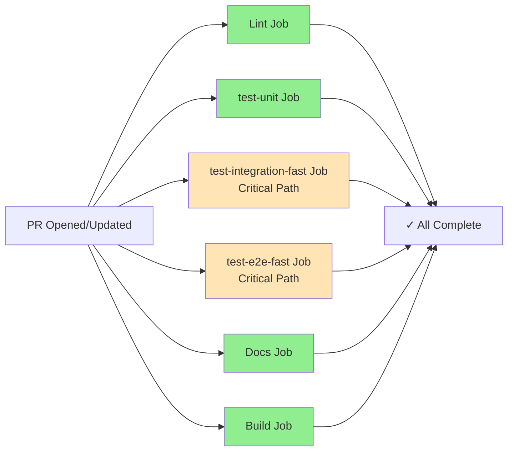
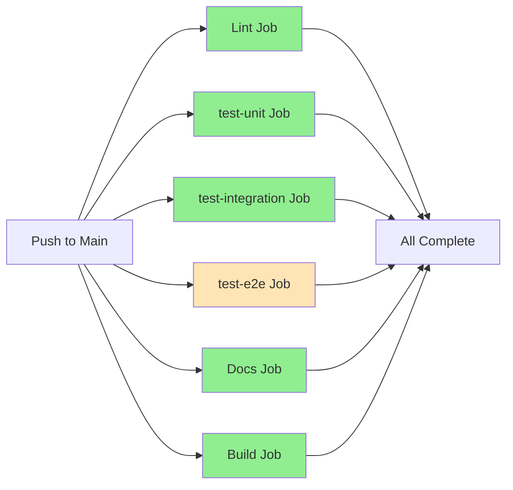

# CI/CD Overview

This document covers the architecture, optimization strategies, and high-level concepts of the CI/CD pipeline.

For detailed workflow documentation, see [Workflows](WORKFLOWS.md).
For local development setup, see [Local Development](LOCAL_DEVELOPMENT.md).

---

# CI/CD Pipeline

## Overview

The Podcast Scraper project uses GitHub Actions for continuous integration and deployment. The CI/CD
pipeline consists of **six main workflows** that automate testing, code quality checks, security
scanning, Docker validation, documentation deployment, and metrics collection.

### Workflows Summary

| Workflow                  | File             | Purpose                                               | Trigger                                                                     |
| ------------------------- | ---------------- | ----------------------------------------------------- | --------------------------------------------------------------------------- |
| **Python Application**    | `python-app.yml` | Main CI pipeline with testing, linting, and builds    | Push/PR to `main` (only when Python/config files change)                    |
| **Documentation Deploy**  | `docs.yml`       | Build and deploy MkDocs documentation to GitHub Pages | Push to `main`, PR with doc changes, manual                                 |
| **CodeQL Security**       | `codeql.yml`     | Security vulnerability scanning                       | Push/PR to `main` (only when code/workflow files change), scheduled weekly  |
| **Docker Build & Test**   | `docker.yml`     | Build and test Docker images                          | Push to `main` (all), PRs (Dockerfile/.dockerignore only)                   |
| **Snyk Security Scan**    | `snyk.yml`       | Dependency and Docker image vulnerability scanning    | Push/PR to `main`, scheduled weekly (Mondays), manual                       |
| **Nightly Comprehensive** | `nightly.yml`    | Full test suite with comprehensive metrics collection | Scheduled daily (2 AM UTC), manual                                          |

---

## Complete Pipeline Visualization



### Workflow Trigger Conditions

Each workflow only runs when specific files are modified:

**`python-app.yml` Workflow:**

- `**.py` (any Python file)
- `tests/**` (any test file)
- `pyproject.toml`
- `Makefile`
- `Dockerfile`
- `.dockerignore`

**`docker.yml` Workflow:**

- **Push to main:** All changes (Dockerfile, .dockerignore, pyproject.toml, *.py)
- **Pull requests:** Only `Dockerfile` or `.dockerignore` changes

**`snyk.yml` Workflow:**

- `**.py`
- `pyproject.toml`
- `Dockerfile`
- `.dockerignore`

**`codeql.yml` Workflow:**

- `**.py`
- `.github/workflows/**`

**`docs.yml` Workflow:**

- **Note:** Docs workflow does NOT trigger on PRs (only on push to main)

This is the main CI pipeline that ensures code quality, runs tests, builds documentation, and validates the package.

### Two-Tier Testing Strategy

The workflow uses a **two-tier testing strategy** optimized for speed and coverage:

1. **Pull Requests:** Fast critical path tests only (quick feedback, ~10-15 min)
2. **Push to Main:** Full test suite only (complete validation, no redundant fast tests)

### Pull Request Execution Flow

On pull requests, jobs run in parallel for fast feedback:



### Push to Main Execution Flow

On push to main branch, separate test jobs run in parallel:



## Parallel Execution Summary

### Workflow Independence

All workflows run independently and in parallel when triggered:

- **Python Application Workflow** (PRs: 6 jobs - lint, unit, fast integration, fast E2E, docs,
  build; Main: 6 jobs - lint, unit, full integration, full E2E, docs, build)

- **Documentation Deployment Workflow** (sequential: build → deploy)
- **CodeQL Workflow** (matrix: Python + Actions analysis in parallel)
- **Docker Workflow** (single job: build → test → validate)
- **Snyk Workflow** (3 jobs: dependencies scan, Docker scan, monitor - run based on trigger type)

### Parallel Workflow Execution

Each workflow is independent and can run simultaneously:

- Python app workflow doesn't wait for Docker
- Docker workflow doesn't wait for Snyk
- CodeQL runs independently of other workflows
- Documentation workflow runs independently

This maximizes parallelism and reduces total CI time.

### Parallel Execution Details

#### ✅ Completely Parallel

**Within Python Application Workflow - Pull Requests:**

```text

├── Lint Job (1-2 min)
├── test-unit (2-5 min) - All unit tests
├── test-integration-fast (5-8 min) - Critical path only
├── test-e2e-fast (8-12 min) - Critical path only
├── Docs Job (2-3 min)
└── Build Job (1-2 min)

```text

**Within Python Application Workflow - Push to Main:**

```text

├── Lint Job (1-2 min)
├── test-unit Job (2-5 min) - No ML deps, fast
├── preload-ml-models (2-5 min) - Preloads ML models for full suite
├── test-integration (5-10 min) - Full suite, includes re-runs, ML deps, needs preload-ml-models
├── test-e2e (20-30 min) - Full suite, includes re-runs, ML deps, network guard, needs preload-ml-models
├── Docs Job (2-3 min)
└── Build Job (1-2 min)

```text
```text

├── Python Analysis
└── Actions Analysis

```text

- All three workflows (Python app, docs, CodeQL) trigger independently
- They run in parallel when triggered by the same event

#### ❌ Sequential

**Documentation Workflow:**

```text

Build Job → Deploy Job

```text

## Performance Optimizations

### 1. Pip Caching

All workflows use pip caching to speed up dependency installation:

```yaml

- uses: actions/setup-python@v5
  with:

    python-version: "3.11"
    cache: "pip"
    cache-dependency-path: pyproject.toml

```text
```mermaid

graph TD
    A[Dependency Strategy] --> B[Lint: dev only]
    A --> C[Test: dev + ml]
    A --> D[Docs: docs + ml]
    A --> E[Build: build tools only]

    B --> F[Fast: 2-3 min]
    C --> G[Slow: 10-15 min]
    D --> H[Medium: 3-5 min]
    E --> I[Fast: 2-3 min]

```text

Test job proactively frees ~30GB of disk space before installing ML dependencies:

```bash

sudo rm -rf /usr/share/dotnet
sudo rm -rf /usr/local/lib/android
sudo rm -rf /opt/ghc

# ... more cleanup

```text
```bash

rm -rf ~/.cache/huggingface
rm -rf ~/.cache/torch
rm -rf ~/.cache/whisper

```text

## Workflow Triggers Matrix

| Workflow | Push to main | PR to main | Schedule | Manual | Doc Changes | Code Changes |
| -------- | ------------ | ---------- | -------- | ------ | ----------- | ------------ |
| **Python Application** | ✅ (code only) | ✅ (code only) | ❌ | ❌ | ❌ | ✅ |
| **Documentation Deploy** | ✅ (deploy) | ✅ (build only) | ❌ | ✅ | ✅ | ✅ (API docs) |
| **CodeQL Security** | ✅ (code only) | ✅ (code only) | ✅ Weekly | ❌ | ❌ | ✅ |

---

## Path-Based Optimization Strategy

### Strategy Overview

All workflows implement **intelligent path-based filtering** to ensure CI/CD runs only when necessary. This optimization dramatically reduces unnecessary CI runs, saves compute resources, and provides faster feedback.

### Decision Matrix

When you change files, here's what runs:

| Files Changed | Python App | Docs Deploy | CodeQL | Reasoning |
| ------------- | ---------- | ----------- | ------ | --------- |
| **Only `docs/`** | ❌ Skip | ✅ Run | ❌ Skip | Docs changes don't require code validation |
| **Only `.py` files** | ✅ Run | ✅ Run | ✅ Run | Code changes need full validation + API docs rebuild |
| **Only `README.md`** | ❌ Skip | ✅ Run | ❌ Skip | README is included in docs site |
| **`pyproject.toml`** | ✅ Run | ❌ Skip | ❌ Skip | Config changes affect dependencies/build |
| **`Dockerfile`** | ✅ Run | ❌ Skip | ❌ Skip | Docker builds depend on package validation |
| **`.github/workflows/`** | ✅ (if python-app.yml) | ✅ (if docs.yml) | ✅ Run | Workflow changes need validation |
| **Mixed changes** | ✅ Run | ✅ Run | ✅ Run | Any match triggers the workflow |

### Benefits

**Time Savings:**

- Docs-only change: ~18 minutes saved (only 3-5 min for docs vs. 20+ min for everything)
- README-only change: ~18 minutes saved
- Config-only change: ~5 minutes saved (skips docs and CodeQL)

**Resource Savings:**

- ~70% fewer runner minutes for documentation updates
- ~30GB less disk space operations per docs-only change
- Reduced ML dependency installations

**Developer Experience:**

- ✅ Faster feedback loop for documentation updates
- ✅ Clear separation: code changes = full CI, docs changes = docs only
- ✅ No wasted time waiting for unrelated checks

### Examples

#### Example 1: Documentation Update

```bash

# You change only: docs/api/REFERENCE.md

git commit -m "Update API documentation"

```text

- ✅ `docs.yml` runs (3-5 min)
- ❌ `python-app.yml` skipped
- ❌ `codeql.yml` skipped

**Total CI time:** ~3-5 minutes (vs. 20+ minutes before)

## Example 2: Python Code Change

```bash

# You change: downloader.py

git commit -m "Fix download retry logic"

```text

- ✅ `python-app.yml` runs (lint, test, docs, build)
- ✅ `docs.yml` runs (API docs need rebuild)
- ✅ `codeql.yml` runs (security scan on code)

**Total CI time:** ~15-20 minutes (all workflows needed)

## Example 3: Mixed Changes

```bash

# You change: docs/index.md AND service.py

git commit -m "Update docs and fix service"

```text

- ✅ All workflows run (code changed = full validation needed)

**Total CI time:** ~15-20 minutes (appropriate for code changes)

## Minimal Docs CI/CD Validation ✅

The system now passes the "minimal docs CI/CD" requirement:

**When changing ONLY documentation files:**

- ✅ Docs build and deploy (required)
- ❌ NO Python linting
- ❌ NO Python testing
- ❌ NO security scanning
- ❌ NO package building

**Status:** ✅ **VALIDATED - Optimization complete**

---

## CI/CD Evolution Highlights

### Key Improvements Over Time

1. **Path-Based Workflow Filtering** ⭐ NEW
   - Intelligent path filtering prevents unnecessary workflow runs
   - Docs-only changes skip Python testing, linting, and security scanning
   - Saves ~18 minutes per docs-only commit
   - ~70% reduction in runner minutes for documentation updates

2. **Parallel Job Execution**
   - Separated lint, unit tests, integration tests, docs, and build into independent parallel jobs
   - Reduced total CI time from ~20 minutes sequential to ~15 minutes parallel (limited by slowest job)
   - Unit tests run fast (2-3 min) without ML dependencies, integration tests run in parallel (10-15 min)

3. **Smart Dependency Management**
   - Lint job runs without ML dependencies for fast feedback (2-3 min)
   - Unit test job runs without ML dependencies for fast feedback (2-3 min)
   - Integration test job includes full ML stack for complete validation
   - Separate dependency groups in `pyproject.toml`: `[dev]`, `[ml]`, `[docs]`

4. **ML Dependency Import Verification** ⭐ NEW
   - Automatic check that unit tests can import modules without ML dependencies
   - Prevents modules from importing ML deps at top level (which would break CI)
   - Script: `scripts/tools/check_unit_test_imports.py`
   - Runs before unit tests in CI, catches issues early

4. **Comprehensive Security Scanning**
   - CodeQL for static analysis (Python + Actions)
   - Snyk for dependency and Docker image scanning
   - Scheduled weekly scans for newly discovered vulnerabilities
   - Bandit & pip-audit in lint job for immediate feedback
   - Multiple layers of security validation

5. **Documentation as Code**
   - Docs build validated on every PR
   - Automatic deployment to GitHub Pages on merge
   - API documentation auto-generated from docstrings

7. **Resource Optimization**
   - Pip caching reduces dependency install time
   - Proactive disk space management
   - Post-test cache cleanup

8. **Developer Experience**
   - Fast lint feedback (~2-3 min)
   - Clear separation of concerns (lint vs test)
   - `make ci` command to run full CI suite locally

---

## Future Enhancements

### Planned Enhancements

1. **AI Experiment Pipeline CI/CD** (See PRD-007, RFC-015)
   - Layer A: Fast smoke tests on every push/PR
   - Layer B: Full evaluation pipeline (nightly/on-demand)
   - Integration with experiment runner
   - Automated regression detection

2. **Environment Variable Management**
   - `.env` file support via `python-dotenv`
   - Environment-specific configurations
   - Secure API key management

### Potential Improvements

1. **Test Sharding**
   - Split test suite across multiple jobs for faster execution
   - Parallel test execution could reduce test time (if needed, but sequential is simpler)

2. **Artifact Caching**
   - Cache built wheels for dependencies
   - Cache ML models between runs

3. **Container-based Testing**
   - Run tests in Docker for better reproducibility
   - Pre-built images with ML dependencies

4. **Performance Benchmarking**
   - Track execution time trends
   - Automated performance regression detection

5. **Release Automation**
   - Automated version bumping
   - Automated changelog generation
   - PyPI publishing on tag creation

---

## Testing Path Filtering

After merging the path filtering optimization, validate it works correctly:

### Test 1: Documentation-Only Change

```bash

# Edit a docs file

echo "Test update" >> docs/CI_CD.md
git add docs/CI_CD.md
git commit -m "docs: test path filtering"
git push

```bash

# Edit a Python file

echo "# Test comment" >> downloader.py
git add downloader.py
git commit -m "feat: test python path filtering"
git push

```text
```bash

# Edit Dockerfile

echo "# Test comment" >> Dockerfile
git add Dockerfile
git commit -m "chore: test docker path filtering"
git push

```text
```bash

# Edit README

echo "Test update" >> README.md
git add README.md
git commit -m "docs: test readme path filtering"
git push

```text
```text

## Related Documentation

- **[Contributing Guide](https://github.com/chipi/podcast_scraper/blob/main/CONTRIBUTING.md)** - Development workflow
- **[Architecture](../ARCHITECTURE.md)** - System design and module boundaries
- **[Testing Strategy](../TESTING_STRATEGY.md)** - Test coverage and quality standards
- **[Testing Guide](../guides/TESTING_GUIDE.md)** - Test execution commands
- **[Development Guide](../guides/DEVELOPMENT_GUIDE.md)** - Implementation instructions

---
