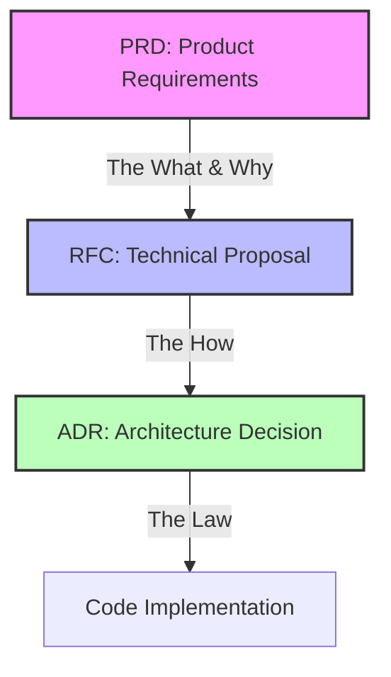

# Engineering Process

This document defines how we manage the lifecycle of features, architectural changes, and technical decisions in `podcast_scraper`. Our process is built on a "Triad of Truth" that ensures clarity, technical rigor, and long-term stability.

## The Triad of Truth

We use three distinct types of documents to drive the project forward:

---

### 1. PRD (Product Requirements Document)

* **Purpose**: Defines the **WHAT** and **WHY**.
* **Focus**: User problems, business value, success criteria, and non-goals.
* **Location**: `docs/prd/`
* **When to create**: For any significant new capability, major user-facing feature, or workflow change.
* **Outcome**: Alignment on the goal before any technical design begins.

### 2. RFC (Request for Comments)

* **Purpose**: Defines the **HOW**.
* **Focus**: Technical architecture, code structure, data schemas, and migration plans.
* **Location**: `docs/rfc/`
* **When to create**: For any change that requires architectural thought, new dependencies, or complex logic.
* **Outcome**: A collaborative technical design that has been reviewed for trade-offs and edge cases.

### 3. ADR (Architecture Decision Record)

* **Purpose**: Defines the **LAW**.
* **Focus**: The final, immutable decisions extracted from an RFC.
* **Location**: `docs/adr/`
* **When to create**: Once an RFC is accepted and the core architectural decisions are finalized.
* **Outcome**: A permanent record of the project's architectural principles, providing context for future maintainers.

---

## The Feature Lifecycle

1. **Ideation**: An idea is proposed (usually as a GitHub Issue).
2. **Product Definition (PRD)**: If the idea is complex, a PRD is drafted to define the requirements and success metrics.
3. **Technical Design (RFC)**: One or more RFCs are written to propose how to build the feature. This includes detailed design and "proof of concept" analysis.
4. **Architectural Commitment (ADR)**: Core decisions from the RFC (e.g., "Use PEP 544 Protocols for providers") are recorded as ADRs.
5. **Implementation**: Code is written following the approved RFC and ADRs.
6. **Validation**: The feature is verified against the success criteria in the PRD and the benchmarking framework (RFC-041).

## Why We Work This Way

* **AI Isolation**: High-quality documentation provides stable context for AI tools like Cursor, preventing hallucinations and ensuring consistent code style.
* **Asynchronous Collaboration**: Decisions are documented and reviewable without requiring constant meetings.
* **Context for the Future**: New contributors can read the ADRs to understand *why* the system is built the way it is, rather than guessing from the code.
* **Rigor & Stability**: Separating requirements (PRD) from design (RFC) and laws (ADR) prevents "scope creep" and architectural drift.

---

## Templates

* **[PRD Template](../prd/PRD_TEMPLATE.md)**
* **[RFC Template](../rfc/RFC_TEMPLATE.md)**
* **[ADR Template](../adr/ADR_TEMPLATE.md)**
