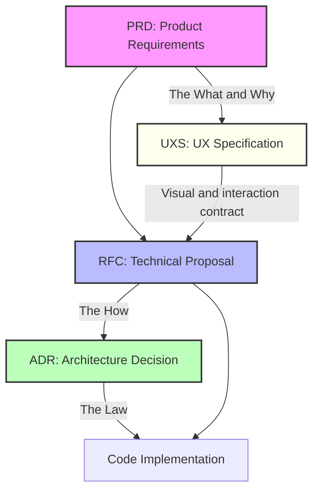

# Engineering Process

This document defines how we manage the lifecycle of features, architectural changes, and technical decisions in `podcast_scraper`. Our process is built on a **PRD / UXS / RFC / ADR** chain that keeps product intent, experience contracts, technical design, and durable decisions aligned.

## Documentation flow

We use distinct document types; **UXS** (UX Specification) runs parallel to RFC when a feature has meaningful UI.

```mermaid
graph TD
    PRD[PRD: Product Requirements]
    UXS[UXS: UX Specification]
    RFC[RFC: Technical Proposal]
    ADR[ADR: Architecture Decision]
    Impl[Code Implementation]
    PRD -->|The What and Why| UXS
    PRD --> RFC
    UXS -->|Visual and interaction contract| RFC
    RFC -->|The How| ADR
    ADR -->|The Law| Impl
    RFC --> Impl

    style PRD fill:#f9f,stroke:#333,stroke-width:2px
    style UXS fill:#ffe,stroke:#333,stroke-width:2px
    style RFC fill:#bbf,stroke:#333,stroke-width:2px
    style ADR fill:#bfb,stroke:#333,stroke-width:2px
```

---

### 1. PRD (Product Requirements Document)

* **Purpose**: Defines the **WHAT** and **WHY**.
* **Focus**: User problems, business value, success criteria, and non-goals.
* **Location**: `docs/prd/`
* **When to create**: For any significant new capability, major user-facing feature, or workflow change.
* **Outcome**: Alignment on the goal before any technical design begins.

### 2. UXS (UX Specification)

* **Purpose**: Defines the **experience and visual contract** for user-facing surfaces.
* **Focus**: Semantic design tokens (color, type, spacing), layout density, key components, accessibility expectations, and review checklists — not functional requirements (PRD) or backend design (RFC).
* **Location**: `docs/uxs/`
* **When to create**: When a feature adds or significantly changes UI (web viewer, local server UI, in-repo dashboards). Omit for CLI-only features unless terminal presentation is explicitly standardized.
* **Outcome**: Implementers and reviewers share one token table and UX bar; RFCs reference UXS so Tailwind/CSS/Cytoscape/Chart.js stay aligned.

### 3. RFC (Request for Comments)

* **Purpose**: Defines the **HOW** (technical).
* **Focus**: Technical architecture, code structure, data schemas, and migration plans.
* **Location**: `docs/rfc/`
* **When to create**: For any change that requires architectural thought, new dependencies, or complex logic.
* **Outcome**: A collaborative technical design that has been reviewed for trade-offs and edge cases.

### 4. ADR (Architecture Decision Record)

* **Purpose**: Defines the **LAW**.
* **Focus**: The final, immutable decisions extracted from an RFC.
* **Location**: `docs/adr/`
* **When to create**: Once an RFC is accepted and the core architectural decisions are finalized.
* **Outcome**: A permanent record of the project's architectural principles, providing context for future maintainers.

---

## The Feature Lifecycle

1. **Ideation**: An idea is proposed (usually as a GitHub Issue).
2. **Product Definition (PRD)**: If the idea is complex, a PRD is drafted to define the requirements and success metrics.
3. **UX contract (UXS)** (when the feature includes meaningful UI): A UX Specification captures semantic tokens, layout, and accessibility expectations; RFCs reference it for implementation.
4. **Technical Design (RFC)**: One or more RFCs are written to propose how to build the feature. This includes detailed design and "proof of concept" analysis.
5. **Architectural Commitment (ADR)**: Core decisions from the RFC (e.g., "Use PEP 544 Protocols for providers") are recorded as ADRs.
6. **Implementation**: Code is written following the approved RFC and ADRs, and against any linked UXS for UI surfaces.
7. **Validation**: The feature is verified against the success criteria in the PRD, UXS checklists where applicable, and the benchmarking framework (RFC-041).

## Why We Work This Way

* **AI Isolation**: High-quality documentation provides stable context for AI tools like Cursor, preventing hallucinations and ensuring consistent code style.
* **Asynchronous Collaboration**: Decisions are documented and reviewable without requiring constant meetings.
* **Context for the Future**: New contributors can read the ADRs to understand *why* the system is built the way it is, rather than guessing from the code.
* **Rigor & Stability**: Separating requirements (PRD), experience contracts (UXS), technical design (RFC), and laws (ADR) prevents scope creep and architectural drift.

---

## Templates

* **[PRD Template](../prd/PRD_TEMPLATE.md)**
* **[UXS Template](../uxs/UXS_TEMPLATE.md)** — [UX specifications index](../uxs/index.md)
* **[RFC Template](../rfc/RFC_TEMPLATE.md)**
* **[ADR Template](../adr/ADR_TEMPLATE.md)**
