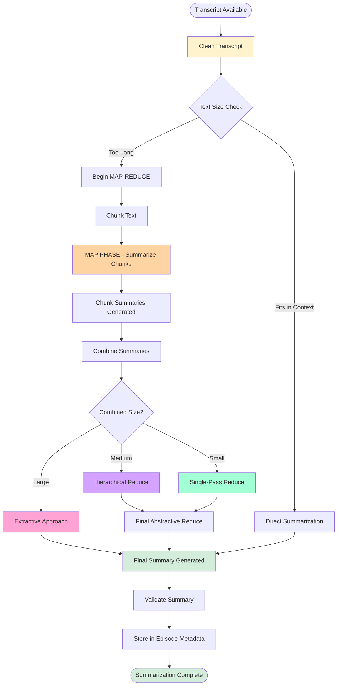

# ML Provider Reference

This document serves as a comprehensive technical reference for the unified local ML provider (`MLProvider`) in the podcast scraper system. It details the internal pipelines, key concepts, and architectural decisions that ensure high-quality transcript processing and summarization.

For general configuration, see the [Provider Configuration Quick Reference](PROVIDER_CONFIGURATION_QUICK_REFERENCE.md).

---

## 1. Architectural Overview

The `MLProvider` is a unified implementation that handles three core capabilities using local machine learning models:

1. **Transcription**: Using **Whisper** (OpenAI's open-source model).
2. **Speaker Detection**: Using **spaCy** (Named Entity Recognition).
3. **Summarization**: Using **Hugging Face Transformers** (BART, LED, PEGASUS).

### Overall ML Pipeline

```mermaid
flowchart TD
    subgraph MLProvider [MLProvider Unified Pipeline]
        direction TB
        Audio([Raw Audio]) --> Transcribe[Transcription Pipeline\n(Whisper)]
        Metadata([Episode Metadata]) --> Detect[Speaker Detection Pipeline\n(spaCy)]

        Transcribe --> Screenplay[Screenplay Formatting\n(Integration)]
        Detect --> Screenplay

        Screenplay --> Preprocess[Preprocessing Pipeline\n(Sanitation)]
        Preprocess --> Summarize[Summarization Pipeline\n(MAP-REDUCE)]

        Summarize --> Results([Final Transcript + Summary])
    end

    style Transcribe fill:#d1ecf1
    style Detect fill:#d1ecf1
    style Preprocess fill:#fff3cd
    style Summarize fill:#ffd4a3
    style Results fill:#d4edda
```

### Key Concepts

* **Unified Implementation**: Matches the pattern of cloud providers (like OpenAI), where a single provider class orchestrates multiple tasks using shared underlying libraries.
* **Lazy Loading**: Models are loaded into memory only when first requested, saving resources during dry runs or partial processing.
* **Device Awareness**: Automatic detection and utilization of the best available hardware accelerator:
  * **MPS** (Apple Silicon GPU)
  * **CUDA** (NVIDIA GPU)
  * **CPU** (Fallback)
* **Thread Safety**: Explicitly marked as requiring separate instances per worker (`_requires_separate_instances = True`) because most Hugging Face and Whisper models are not natively thread-safe.

---

## 2. Transcription Pipeline

The transcription pipeline converts raw audio into structured text with timing information.

### 2.1 Workflow


1. **Audio Loading**: Loads MP3/WAV files.
2. **Whisper Invocation**: Transcribes using the configured model (e.g., `base.en`, `small.en`).
3. **Segment Generation**: Captures start/end timestamps for every sentence or phrase.
4. **Screenplay Formatting**: Rotates through detected speakers based on silence gaps and time intervals to produce a "script-style" transcript.

### 2.2 Whisper Device Detection

Whisper performance varies wildly based on hardware. The system prefers:

1. **MPS** for near-real-time transcription on Mac laptops.
2. **CUDA** for high-throughput processing on servers.
3. **CPU** using **FP32** (as **FP16** is unavailable on most CPUs).

---

## 3. Speaker Detection Pipeline

The system uses Named Entity Recognition (NER) to identify potential hosts and guests from episode metadata.

### 3.1 Multi-Stage Analysis

```mermaid
flowchart TD
    Metadata([Feed & Episode Metadata]) --> Feed[Feed-Level Detection\n(RSS Title/Desc)]
    Metadata --> Episode[Episode-Level Detection\n(Title/Desc)]

    Feed --> NER[spaCy NER\n(PERSON Entities)]
    Episode --> NER

    NER --> Heuristics[Pattern Heuristics\n(with, featuring)]
    Heuristics --> Speakers([Detected Hosts & Guests])

    style Metadata fill:#e1f5ff
    style Speakers fill:#d4edda
```

1. **Feed-Level Detection**: Analyzes the podcast title and description to identify recurring hosts.
2. **Episode-Level Detection**: Analyzes specific episode titles (e.g., "Guest: John Doe") and descriptions.
3. **Pattern Heuristics**: Uses `spaCy` to identify `PERSON` entities and applies heuristics (e.g., "with", "featuring", "interviewing") to differentiate between hosts and guests.
4. **Cross-Episode Analysis**: (Optional) Analyzes patterns across multiple episodes to solidify host identification.

### 3.2 Detection Models

The system supports standard `spaCy` models:

* `en_core_web_sm`: Fastest, suitable for basic testing.
* `en_core_web_md`: Good balance of accuracy and speed.
* `en_core_web_lg`: Best accuracy for identifying names in noisy descriptions.

---

## 4. Preprocessing Pipeline (Sanitation)

Before any text reaches a summarization model, it undergoes a multi-stage "hard cleaning" process. This was identified in **Issue #83** as the single most important factor for preventing model hallucinations and "scaffolding echo."

### 4.1 Processing Order


1. **Credit Stripping**: Removes grammatically perfect "credit blocks" (e.g., "Produced by...", "Music by..."). Models often latch onto these as high-confidence summary targets.
2. **Boilerplate Removal**: Strips website chrome like "Read more," "Back to top," and "Article continues below."
3. **Timestamp Removal**: Strips `[00:12:34]` markers to normalize the text for the encoder.
4. **Speaker Normalization**: Replaces generic labels (e.g., `SPEAKER 1:`) with actual names (if detected) or removes them to prevent "Speaker 1 said Speaker 1 said" loops.
5. **Artifact Removal**: Strips ML-specific artifacts like `TextColor`, `MUSIC`, and `[INAUDIBLE]` that BART/LED tend to copy verbatim.

---

## 5. Summarization Pipeline (BART/LED Implementation)

The summarization system uses a **MAP-REDUCE** architecture designed to handle transcripts ranging from 5 minutes to 2 hours.

### 5.1 Summarization Flow



### 5.2 MAP Phase (Compression)

Individual transcript chunks are summarized in parallel (on CPU) or sequentially (on GPU).

* **Chunking**: Token-based with 10% overlap. Encoder-decoder models (BART) are limited to 600 tokens per chunk.
* **Parallelism**: CPU uses `ThreadPoolExecutor` (up to 4 workers). GPU/MPS is sequential to avoid OOM.
* **Output**: Each chunk produces 80-160 tokens of bullet-style notes.

### 5.3 REDUCE Phase (Synthesis)

The system dynamically selects a synthesis strategy based on the total token count of the combined chunk summaries:

| Strategy | Token Range | Logic |
| :--- | :--- | :--- |
| **Single-Pass Abstractive** | < 800 | Direct summarization of all combined notes. |
| **Hierarchical Reduce** | 800 - 3,500 (BART)<br>800 - 5,500 (LED) | Recursive chunking and summarizing until input is small enough for final pass. |
| **Transition Zone** | 3,500 - 4,500 (BART)<br>5,500 - 6,500 (LED) | Smoothly switches to extractive to avoid quality degradation. |
| **Extractive Fallback** | > 4,500 (BART)<br>> 6,500 (LED) | Selects representative chunks (start, middle, 25/50/75%, end) to form final summary. |

### 5.4 Model Selection Strategy (Aliases)

To ensure stability, only validated model aliases are supported for the `transformers` provider. Direct model IDs are rejected.

* **MAP Models**:
  * `bart-large`: `facebook/bart-large-cnn` (Production default, best quality, ~2GB)
  * `bart-small`: `facebook/bart-base` (Test/Dev, faster, ~500MB)
* **REDUCE Models**:
  * `long`: `allenai/led-large-16384` (Production default, 16k context, ~2.5GB)
  * `long-fast`: `allenai/led-base-16384` (Faster, ~1GB)

---

## 6. Performance & Quality

### 6.1 Performance Characteristics

* **Direct Summarization**: <5s for transcripts ≤1024 tokens.
* **MAP-REDUCE**: ~3s per chunk (varies by hardware).
* **Memory**: High-quality models require 2-3GB of VRAM/RAM.

### 6.2 Quality Validation

The system applies several "safety gates" to the final summary:

1. **Repetition Detection**: Deduplicates repeated sentences or circular loops.
2. **Scaffolding Cleanup**: Strips instruction leaks (e.g., "Summarize the following:").
3. **Length Validation**: Flags if the summary is suspiciously close to the input length.

---

## 7. Current State & Frozen Baseline

As of **Issue #83**, the BART/LED implementation is considered **stable and frozen**.

### 7.1 Known Model-Level Limitations

The following issues are architectural limits of BART/LED, not bugs:

1. **Narrative Recap Bias**: Chronological retelling rather than insight synthesis.
2. **Weak Abstraction**: Struggles with "why this matters" conclusions.
3. **Quote Repetition**: Often repeats hedging language found in investigative reporting.

---

## 8. Next Steps & Evolution

The current BART/LED implementation serves as the **Classic Summarizer Baseline**. The next evolution includes:

* **Hybrid MAP-REDUCE (RFC-042)**: Replacing the REDUCE phase with instruction-following models (Mistral, Qwen) for better abstraction.
* **Semantic Cleaning**: Using lightweight models to filter ads based on meaning.
* **Experimentation Runner (RFC-015)**: Benchmarking new models against this frozen baseline.
