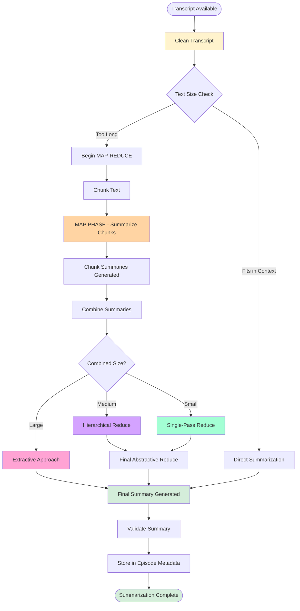

# ML Provider Reference

This document serves as a comprehensive technical reference for the unified local ML provider (`MLProvider`) in the podcast scraper system. It details the internal pipelines, key concepts, and architectural decisions that ensure high-quality transcript processing and summarization.

For general configuration, see the [Provider Configuration Quick Reference](PROVIDER_CONFIGURATION_QUICK_REFERENCE.md).

---

## Architectural Overview

The `MLProvider` is a unified implementation that handles three core capabilities using local machine learning models:

1. **Transcription**: Using **Whisper** (OpenAI's open-source model).
2. **Speaker Detection**: Using **spaCy** (Named Entity Recognition).
3. **Summarization**: Using **Hugging Face Transformers** (BART, LED, PEGASUS).

### Overall ML Pipeline

```mermaid
flowchart TD
    subgraph MLProvider [MLProvider Unified Pipeline]
        direction TB
        Audio([Raw Audio]) --> Transcribe[Transcription Pipeline\n(Whisper)]
        Metadata([Episode Metadata]) --> Detect[Speaker Detection Pipeline\n(spaCy)]

        Transcribe --> Screenplay[Screenplay Formatting\n(Integration)]
        Detect --> Screenplay

        Screenplay --> Preprocess[Preprocessing Pipeline\n(Sanitation)]
        Preprocess --> Summarize[Summarization Pipeline\n(MAP-REDUCE)]

        Summarize --> Results([Final Transcript + Summary])
    end

    style Transcribe fill:#d1ecf1
    style Detect fill:#d1ecf1
    style Preprocess fill:#fff3cd
    style Summarize fill:#ffd4a3
    style Results fill:#d4edda
```

### Key Concepts

* **Unified Implementation**: Matches the pattern of cloud providers (like OpenAI), where a single provider class orchestrates multiple tasks using shared underlying libraries.
* **Optimized Lazy Loading**: Models are loaded into memory only when first requested **and** only if the corresponding provider is configured to use local ML (e.g., Transformers won't load if `summary_provider="openai"`). This saves significant memory during hybrid cloud/local runs.
* **Device Awareness**: Automatic detection and utilization of the best available hardware accelerator:
  * **MPS** (Apple Silicon GPU)
  * **CUDA** (NVIDIA GPU)
  * **CPU** (Fallback)
* **Thread Safety**: Explicitly marked as requiring separate instances per worker (`_requires_separate_instances = True`) because most Hugging Face and Whisper models are not natively thread-safe.

---

## Transcription Pipeline

The transcription pipeline converts raw audio into structured text with timing information.

### 2.1 Workflow

```mermaid
flowchart LR
    Audio([Audio File]) --> Load[Audio Loading]
    Load --> Whisper[Whisper Invocation]
    Whisper --> Segments[Segment Generation]
    Segments --> Screenplay[Screenplay Formatting]
    Screenplay --> FinalTranscript([Structured Transcript])

    style Audio fill:#e1f5ff
    style FinalTranscript fill:#d4edda
```

1. **Audio Loading**: Loads MP3/WAV files.
2. **Whisper Invocation**: Transcribes using the configured model (e.g., `base.en`, `small.en`).
3. **Segment Generation**: Captures start/end timestamps for every sentence or phrase.
4. **Screenplay Formatting**: Rotates through detected speakers based on silence gaps and time intervals to produce a "script-style" transcript.

### 2.2 Whisper Device Detection

Whisper performance varies wildly based on hardware. The system prefers:

1. **MPS** for near-real-time transcription on Mac laptops.
2. **CUDA** for high-throughput processing on servers.
3. **CPU** using **FP32** (as **FP16** is unavailable on most CPUs).

---

## Speaker Detection Pipeline

The system uses Named Entity Recognition (NER) to identify potential hosts and guests from episode metadata.

### 3.1 Multi-Stage Analysis

```mermaid
flowchart TD
    Metadata([Feed & Episode Metadata]) --> Feed[Feed-Level Detection\n(RSS Title/Desc)]
    Metadata --> Episode[Episode-Level Detection\n(Title/Desc)]

    Feed --> NER[spaCy NER\n(PERSON Entities)]
    Episode --> NER

    NER --> Heuristics[Pattern Heuristics\n(with, featuring)]
    Heuristics --> Speakers([Detected Hosts & Guests])

    style Metadata fill:#e1f5ff
    style Speakers fill:#d4edda
```

1. **Feed-Level Detection**: Analyzes the podcast title and description to identify recurring hosts.
2. **Episode-Level Detection**: Analyzes specific episode titles (e.g., "Guest: John Doe") and descriptions.
3. **Pattern Heuristics**: Uses `spaCy` to identify `PERSON` entities and applies heuristics (e.g., "with", "featuring", "interviewing") to differentiate between hosts and guests.
4. **Cross-Episode Analysis**: (Optional) Analyzes patterns across multiple episodes to solidify host identification.

### 3.2 Detection Models

The system supports standard `spaCy` models:

* `en_core_web_sm`: Fastest, suitable for basic testing.
* `en_core_web_md`: Good balance of accuracy and speed.
* `en_core_web_lg`: Best accuracy for identifying names in noisy descriptions.

---

## Preprocessing Pipeline (Sanitation)

Before any text reaches a summarization model, it undergoes a multi-stage "hard cleaning" process. This was identified in **Issue #83** as the single most important factor for preventing model hallucinations and "scaffolding echo."

### 4.1 Processing Order

```mermaid
flowchart LR
    Raw[Raw Transcript] --> Credits[Credit Stripping]
    Credits --> Boilerplate[Boilerplate Removal]
    Boilerplate --> Timestamps[Timestamp Removal]
    Timestamps --> Norm[Speaker Normalization]
    Norm --> Artifacts[Artifact Removal]
    Artifacts --> Clean([Cleaned Transcript])

    style Raw fill:#e1f5ff
    style Clean fill:#d4edda
```

1. **Credit Stripping**: Removes grammatically perfect "credit blocks" (e.g., "Produced by...", "Music by..."). Models often latch onto these as high-confidence summary targets.
2. **Boilerplate Removal**: Strips website chrome like "Read more," "Back to top," and "Article continues below."
3. **Timestamp Removal**: Strips `[00:12:34]` markers to normalize the text for the encoder.
4. **Speaker Normalization**: Replaces generic labels (e.g., `SPEAKER 1:`) with actual names (if detected) or removes them to prevent "Speaker 1 said Speaker 1 said" loops.
5. **Artifact Removal**: Strips ML-specific artifacts like `TextColor`, `MUSIC`, and `[INAUDIBLE]` that BART/LED tend to copy verbatim.

---

## Summarization Pipeline (BART/LED Implementation)

The summarization system uses a **MAP-REDUCE** architecture designed to handle transcripts ranging from 5 minutes to 2 hours.

### 5.1 Summarization Flow

```mermaid
flowchart TD
    Start([Transcript Available]) --> CleanTranscript[Clean Transcript]
    CleanTranscript --> CheckSize{Text Size Check}
    CheckSize -->|Fits in Context| DirectSummarize[Direct Summarization]
    CheckSize -->|Too Long| StartMapReduce[Begin MAP-REDUCE]

    StartMapReduce --> ChunkText[Chunk Text]
    ChunkText --> MapPhase[MAP PHASE - Summarize Chunks]
    MapPhase --> ChunkSummaries[Chunk Summaries Generated]
    ChunkSummaries --> CombineSummaries[Combine Summaries]
    CombineSummaries --> CheckCombinedSize{Combined Size?}

    CheckCombinedSize -->|Small| SinglePass[Single-Pass Reduce]
    CheckCombinedSize -->|Medium| MiniMapReduce[Hierarchical Reduce]
    CheckCombinedSize -->|Large| Extractive[Extractive Approach]

    MiniMapReduce --> FinalAbstractive[Final Abstractive Reduce]
    Extractive --> FinalSummary
    SinglePass --> FinalAbstractive
    FinalAbstractive --> FinalSummary[Final Summary Generated]
    DirectSummarize --> FinalSummary

    FinalSummary --> ValidateSummary[Validate Summary]
    ValidateSummary --> StoreInMetadata[Store in Episode Metadata]
    StoreInMetadata --> Complete([Summarization Complete])

    style CleanTranscript fill:#fff3cd
    style MapPhase fill:#ffd4a3
    style MiniMapReduce fill:#d4a3ff
    style Extractive fill:#ffa3d4
    style SinglePass fill:#a3ffd4
    style FinalSummary fill:#d4edda
    style Complete fill:#d4edda
```

### 5.2 MAP Phase (Compression)

Individual transcript chunks are summarized in parallel (on CPU) or sequentially (on GPU).

* **Chunking**: Token-based with 10% overlap. Encoder-decoder models (BART) are limited to 600 tokens per chunk.
* **Parallelism**: CPU uses `ThreadPoolExecutor` (up to 4 workers). GPU/MPS is sequential to avoid OOM.
* **Output**: Each chunk produces 80-160 tokens of bullet-style notes.

### 5.3 REDUCE Phase (Synthesis)

The system dynamically selects a synthesis strategy based on the total token count of the combined chunk summaries:

| Strategy | Token Range | Logic |
| :--- | :--- | :--- |
| **Single-Pass Abstractive** | < 800 | Direct summarization of all combined notes. |
| **Hierarchical Reduce** | 800 - 3,500 (BART) 800 - 5,500 (LED) | Recursive chunking and summarizing until input is small enough for final pass. |
| **Transition Zone** | 3,500 - 4,500 (BART) 5,500 - 6,500 (LED) | Smoothly switches to extractive to avoid quality degradation. |
| **Extractive Fallback** | > 4,500 (BART) > 6,500 (LED) | Selects representative chunks (start, middle, 25/50/75%, end) to form final summary. |

### 5.4 Model Selection Strategy (Aliases)

To ensure stability, only validated model aliases are supported for the `transformers` provider. Direct model IDs are rejected.

* **MAP Models**:
  * `bart-large`: `facebook/bart-large-cnn` (Production default, best quality, ~2GB)
  * `bart-small`: `facebook/bart-base` (Test/Dev, faster, ~500MB)
* **REDUCE Models**:
  * `long`: `allenai/led-large-16384` (Production default, 16k context, ~2.5GB)
  * `long-fast`: `allenai/led-base-16384` (Faster, ~1GB)

---

## Performance & Quality

### 6.1 Performance Characteristics

* **Direct Summarization**: <5s for transcripts ≤1024 tokens.
* **MAP-REDUCE**: ~3s per chunk (varies by hardware).
* **Memory**: High-quality models require 2-3GB of VRAM/RAM.

### 6.2 Quality Validation

The system applies several "safety gates" to the final summary:

1. **Repetition Detection**: Deduplicates repeated sentences or circular loops.
2. **Scaffolding Cleanup**: Strips instruction leaks (e.g., "Summarize the following:").
3. **Length Validation**: Flags if the summary is suspiciously close to the input length.

---

## Current State & Frozen Baseline

As of **Issue #83**, the BART/LED implementation is considered **stable and frozen**.

### 7.1 Known Model-Level Limitations

The following issues are architectural limits of BART/LED, not bugs:

1. **Narrative Recap Bias**: Chronological retelling rather than insight synthesis.
2. **Weak Abstraction**: Struggles with "why this matters" conclusions.
3. **Quote Repetition**: Often repeats hedging language found in investigative reporting.

---

## Hybrid ML Provider (summary_provider: hybrid_ml)

**Status**: Implemented (RFC-042).

The **Hybrid ML** provider performs MAP-REDUCE summarization with a local MAP phase (e.g. LongT5-base) and a configurable REDUCE phase. Use `summary_provider: hybrid_ml` in config.

### Layered transcript cleaning (Issue #419)

Before MAP, transcripts are cleaned twice in concept: (1) the **workflow** runs `cleaning_processor` from `transcript_cleaning_strategy` (same classes as OpenAI/Gemini/… providers: `PatternBasedCleaner`, `LLMBasedCleaner`, or `HybridCleaner`). (2) **`HybridMLProvider.summarize`** applies a **registered preprocessing profile** (default `cleaning_v4`). When strategy is **`pattern`**, the workflow passes `preprocessing_profile: hybrid_internal_preprocessing_after_pattern` (default `cleaning_hybrid_after_pattern`) so sponsor/outro work is not duplicated while v4-only steps (header strip, junk filter, anonymization, artifact scrub) still run before chunking. For **`llm`** / **`hybrid`** strategies, internal preprocessing stays **`cleaning_v4`**. CLI: `--transcript-cleaning-strategy`, `--hybrid-internal-preprocessing-after-pattern`. See [RFC-042](../rfc/RFC-042-hybrid-summarization-pipeline.md#layered-transcript-cleaning-issue-419).

### Flow

1. **MAP phase**: Transcript is chunked and each chunk is summarized using the MAP model (e.g. `longt5-base`), producing structured notes.
2. **REDUCE phase**: Notes are combined into a final summary using one of three backends:
   * **transformers** — FLAN-T5 or similar (default: `google/flan-t5-base`). Runs locally via PyTorch.
   * **ollama** — Local LLMs (e.g. `llama3.1:8b`, `mistral:7b`, `qwen2.5:7b`, `qwen2.5:32b`). Requires Ollama running; the reduce instruction is sent as an inline prompt (no template file).
   * **llama_cpp** — GGUF models via `llama-cpp-python`. `hybrid_reduce_model` is the path to a `.gguf` file.

### Configuration

| Config key | Default | Description |
| --- | --- | --- |
| `hybrid_map_model` | `longt5-base` | HuggingFace model for MAP (chunk summarization). |
| `hybrid_reduce_model` | `google/flan-t5-base` | Model for REDUCE: HuggingFace ID (transformers), Ollama tag (ollama), or path to GGUF (llama_cpp). |
| `hybrid_reduce_backend` | `transformers` | One of: `transformers`, `ollama`, `llama_cpp`. |
| `hybrid_map_device` | (auto) | Device for MAP (e.g. `mps`, `cuda`, `cpu`). |
| `hybrid_reduce_device` | (auto) | Device for REDUCE when using `transformers` (e.g. `mps`, `cuda`, `cpu`). |
| `hybrid_reduce_n_ctx` | (optional) | Context size for `llama_cpp` (default 4096). |
| `transcript_cleaning_strategy` | `hybrid` | Same as API summarization providers; selects workflow `cleaning_processor`. |
| `hybrid_internal_preprocessing_after_pattern` | `cleaning_hybrid_after_pattern` | Internal MAP preprocessing profile when strategy is `pattern` (see layered cleaning above). |

Transcription and speaker detection are not provided by `HybridMLProvider`; use `whisper` and `spacy` (or other providers) for those. See [Ollama Provider Guide](OLLAMA_PROVIDER_GUIDE.md) for using Ollama as the REDUCE backend and acceptance test configs.

---

## Next Steps & Evolution

The current BART/LED implementation serves as the **Classic Summarizer Baseline**. Implemented and available:

* **Hybrid MAP-REDUCE (RFC-042)**: REDUCE phase can use instruction-following models via **transformers** (FLAN-T5), **ollama** (e.g. Llama, Mistral, Qwen), or **llama_cpp** (GGUF) for better abstraction.
* **Grounded Insights (GI)**: Implemented — evidence-based insight extraction with embedding, extractive QA, and NLI models. See [Grounded Insights Guide](GROUNDED_INSIGHTS_GUIDE.md).
* **Knowledge Graph (KG)**: Implemented — entity and relationship extraction from transcripts via LLM-based pipelines.

Planned or in progress:

* **Semantic Cleaning**: Using lightweight models to filter ads based on meaning.

---

## Hardware Acceleration & Scaling

The performance and feasibility of local ML models depend heavily on your hardware configuration.

### 9.1 Device Preferences

The system automatically detects and utilizes hardware accelerators:

1. **Apple Silicon (MPS)**: Highly efficient for both transcription and summarization. Unified memory allows running larger models (7B-14B) than typical consumer GPUs.
2. **NVIDIA (CUDA)**: The gold standard for high-throughput server processing.
3. **CPU**: Fallback mode. Uses FP32 for stability. Parallelism is achieved via `ThreadPoolExecutor` for map-phase chunks.

### 9.1.1 MPS Exclusive Mode (Apple Silicon)

When both Whisper transcription and summarization use MPS on Apple Silicon, the system can serialize GPU work to prevent memory contention. This is enabled by default (`mps_exclusive: true`) and ensures:

* **Transcription completes first**: All Whisper transcriptions finish before summarization starts
* **I/O remains parallel**: Downloads, RSS parsing, and file I/O continue in parallel
* **Memory safety**: Prevents both models from competing for the same GPU memory pool

**When to disable**: If you have sufficient GPU memory (e.g., M4 Pro with 48GB+ unified memory) and want maximum throughput, you can disable exclusive mode (`mps_exclusive: false` or `--no-mps-exclusive`) to allow concurrent GPU operations.

**Configuration**:

* Config file: `mps_exclusive: true/false`
* CLI: `--mps-exclusive` (default) or `--no-mps-exclusive`
* Environment: `MPS_EXCLUSIVE=1` (enable) or `MPS_EXCLUSIVE=0` (disable)

See [Segfault Mitigation Guide](../guides/SEGFAULT_MITIGATION.md) for more details on MPS stability.

### 9.2 Scaling for Long Content (30k-40k Tokens)

Even on high-end hardware (e.g., Mac Studio or MBP M4 Pro with 48GB+ RAM), attempting to process 40,000 tokens in a single context window is often counterproductive due to quadratic attention complexity and quality degradation ("lost in the middle").

**The system-enforced scaling strategy is:**

* **Never Brute-Force**: Always use the **MAP-REDUCE** pipeline for content exceeding the model's native context window (typically 600-1024 tokens for BART).
* **Memory vs. Context**: Use large RAM/VRAM to run **better** models (e.g., `bart-large` vs `bart-small`) and more **parallel chunks**, rather than attempting to increase the context window beyond the model's training limit.
* **Recursive Reduction**: For extremely long transcripts, the system uses hierarchical reduction to consolidate summaries without losing key insights.

### 9.3 Evidence Stack and Grounded Insights (GIL)

The **evidence stack** provides embedding, extractive QA, and NLI models used by the Grounded Insight Layer (GIL) when enabled. These load **lazily** (on first use when GIL or a dependent feature runs):

* **Embedding**: `embedding_loader` — sentence embeddings (e.g. MiniLM, mpnet); used for similarity and retrieval.
* **Extractive QA**: `extractive_qa` — question-answering over context; returns answer spans with character offsets and scores; used for quote extraction ("What evidence supports this insight?").
* **NLI**: `nli_loader` — premise/hypothesis entailment scoring; used to validate that a quote supports an insight.

Config keys: `embedding_model`, `embedding_device`, `extractive_qa_model`, `extractive_qa_device`, `nli_model`, `nli_device`. Model IDs can be aliases (e.g. `minilm-l6`, `roberta-squad2`, `nli-deberta-base`) or full HuggingFace IDs. See the [Grounded Insights Guide](GROUNDED_INSIGHTS_GUIDE.md).

### 9.4 Evolution Roadmap

| Phase | Strategy | Model Class | Context Handling |
| :--- | :--- | :--- | :--- |
| **Current (Stable)** | Classic Map-Reduce | Encoder-Decoder (BART/LED) | Fixed chunking (600 tokens) |
| **Current (Available)** | Hybrid Map-Reduce | LongT5 MAP + FLAN/Ollama/llama_cpp REDUCE | MAP chunking; REDUCE via transformers, ollama, or llama_cpp |
| **Future** | Intelligent Synthesis | Mixture-of-Experts (MoE) | Semantic chunking |
