# Pipeline and Workflow Guide

This guide describes how the podcast_scraper pipeline runs: entry points, flow, module roles, and behavioral quirks. For strategic architecture, ADRs, and planned evolution, see [Architecture](../ARCHITECTURE.md).

## High-Level Flow

1. **Entry**: `podcast_scraper.cli.main` parses CLI args (optionally merging JSON/YAML configs) into a validated `Config` object and applies global logging preferences.
2. **Run orchestration**: `workflow.orchestration.run_pipeline` coordinates the end-to-end job: output setup, RSS acquisition, episode materialization, transcript download, optional Whisper transcription, optional metadata generation, optional summarization, and cleanup.
3. **Episode handling**: For each `Episode`, `workflow.episode_processor.process_episode_download` either saves an existing transcript or enqueues media for Whisper.
4. **Speaker detection** (RFC-010): When automatic speaker detection is enabled, host names are extracted from RSS author tags (channel-level `<author>`, `<itunes:author>`, `<itunes:owner>`) as the primary source, falling back to NER extraction from feed metadata if no author tags exist. Guest names are extracted from episode-specific metadata (titles and descriptions) using Named Entity Recognition (NER) with spaCy. Manual speaker names are only used as fallback when detection fails. Note: The pipeline logs debug messages when transcription parallelism is ignored due to provider limitations (e.g., Whisper always uses sequential processing).
5. **Audio Preprocessing** (RFC-040): When preprocessing is enabled, audio files are optimized before transcription: converted to mono, resampled to 16 kHz, silence removed via VAD, loudness normalized, and compressed with Opus codec. This reduces file size (typically 10-25× smaller) and ensures API compatibility (e.g., OpenAI 25 MB limit). Preprocessing happens at the pipeline level in `workflow.episode_processor.transcribe_media_to_text` before any provider receives the audio. All providers benefit from optimized audio.
6. **Transcription**: When Whisper fallback is enabled, `workflow.episode_processor.download_media_for_transcription` downloads media to a temp area and `workflow.episode_processor.transcribe_media_to_text` persists Whisper output using deterministic naming. Detected speaker names are integrated into screenplay formatting when enabled.
7. **Metadata generation** (PRD-004/RFC-011): When enabled, per-episode metadata documents are generated alongside transcripts, capturing feed-level and episode-level information, detected speaker names, and processing metadata in JSON/YAML format.
8. **Summarization** (PRD-005/RFC-012): When enabled, episode transcripts are summarized using the configured provider — local transformer models (BART, PEGASUS, LED) via `MLProvider`, or any of 7 LLM providers (OpenAI, Gemini, Anthropic, Mistral, DeepSeek, Grok, Ollama) via prompt templates. See [ML Provider Reference](ML_PROVIDER_REFERENCE.md) for ML architecture details.
9. **Run Tracking** (Issue #379): Run manifests capture system state at pipeline start. Per-episode stage timings track processing duration. Run summaries combine manifest and metrics. Episode index files list all processed episodes with status.
10. **Progress/UI**: All long-running operations report progress through the pluggable factory in `utils.progress`, defaulting to `rich` in the CLI.
11. **GIL Extraction** (PRD-017, planned): When enabled, the Grounded Insight Layer extracts structured insights and verbatim quotes from transcripts, links them via grounding relationships, and writes a `kg.json` file per episode. This step runs after summarization and uses the same multi-provider architecture. See [Architecture - Planned Evolution](../ARCHITECTURE.md#planned-architecture-evolution) for details.

## Pipeline Flow Diagram

```mermaid
flowchart TD
    Start([CLI Entry]) --> Parse[Parse CLI Args & Config Files]
    Parse --> Validate[Validate & Normalize Config]
    Validate --> Setup[Setup Output Directory]
    Setup --> FetchRSS[Fetch & Parse RSS Feed]
    FetchRSS --> ExtractEpisodes[Extract Episode Metadata]
    ExtractEpisodes --> DetectSpeakers{Speaker Detection Enabled?}
    DetectSpeakers -->|Yes| ExtractHosts[Extract Host Names from RSS]
    ExtractHosts --> ExtractGuests[Extract Guest Names via NER]
    DetectSpeakers -->|No| ProcessEpisodes[Process Episodes]
    ExtractGuests --> ProcessEpisodes
    ProcessEpisodes --> CheckTranscript{Transcript Available?}
    CheckTranscript -->|Yes| DownloadTranscript[Download Transcript]
    CheckTranscript -->|No| QueueWhisper[Queue for Whisper]
    DownloadTranscript --> SaveTranscript[Save Transcript File]
    QueueWhisper --> DownloadMedia[Download Media File]
    DownloadMedia --> Preprocess{Preprocessing Enabled?}
    Preprocess -->|Yes| PreprocessAudio[Preprocess Audio: Mono, 16kHz, VAD, Normalize, Opus]
    Preprocess -->|No| Transcribe
    PreprocessAudio --> Transcribe[Whisper Transcription]
    Transcribe --> FormatScreenplay[Format with Speaker Names]
    FormatScreenplay --> SaveTranscript
    SaveTranscript --> GenerateMetadata{Metadata Generation?}
    GenerateMetadata -->|Yes| CreateMetadata[Generate Metadata JSON/YAML]
    GenerateMetadata -->|No| Cleanup
    CreateMetadata --> GenerateSummary{Summarization Enabled?}
    GenerateSummary -->|Yes| Summarize[Generate Summary]
    GenerateSummary -->|No| GILCheck
    Summarize --> AddSummaryToMetadata[Add Summary to Metadata]
    AddSummaryToMetadata --> GILCheck{GIL Extraction?}
    GILCheck -->|Yes| ExtractGIL[Extract Insights + Quotes]
    GILCheck -->|No| Cleanup
    ExtractGIL --> GroundInsights[Ground Insights with Quotes]
    GroundInsights --> WriteKG[Write kg.json]
    WriteKG --> Cleanup[Cleanup Temp Files]
    Cleanup --> End([Complete])

    style Start fill:#e1f5ff
    style End fill:#d4edda
    style ProcessEpisodes fill:#fff3cd
    style Transcribe fill:#f8d7da
    style GenerateMetadata fill:#d1ecf1
    style ExtractGIL fill:#e8daef
```

## Module Roles in the Pipeline

- **cli.py**: Parse/validate CLI arguments, integrate config files, set up progress reporting, trigger `run_pipeline`. Optimized for interactive command-line use.
- **service.py**: Service API for programmatic/daemon use. Provides `service.run()` and `service.run_from_config_file()` functions that return structured `ServiceResult` objects. Works exclusively with configuration files (no CLI arguments), optimized for non-interactive use (supervisor, systemd, etc.). Entry point: `python -m podcast_scraper.service --config config.yaml`.
- **config.py**: Immutable Pydantic model representing all runtime options; JSON/YAML loader with strict validation and normalization helpers. Includes language configuration, NER settings, and speaker detection flags (RFC-010).
- **workflow.orchestration**: Pipeline coordinator that orchestrates directory prep, RSS parsing, download concurrency, Whisper lifecycle, speaker detection coordination, and cleanup.
- **rss.parser**: Safe RSS/XML parsing using `defusedxml` ([ADR-002](../adr/ADR-002-security-first-xml-processing.md)), discovery of transcript/enclosure URLs, and creation of `Episode` models.
- **rss.downloader**: HTTP session pooling with retry-enabled adapters, streaming downloads, and shared progress hooks.
- **workflow.episode_processor**: Episode-level decision logic, transcript storage, Whisper job management, delay handling, and file naming rules. Integrates detected speaker names into Whisper screenplay formatting.
- **utils.filesystem**: Filename sanitization, output directory derivation based on feed hash ([ADR-003](../adr/ADR-003-deterministic-feed-storage.md)), run suffix logic, and helper utilities for Whisper output paths.
- **Provider System** (RFC-013, RFC-029): Protocol-based provider architecture for transcription, speaker detection, and summarization ([ADR-012](../adr/ADR-012-protocol-based-provider-discovery.md)). Each capability has a protocol interface (`TranscriptionProvider`, `SpeakerDetector`, `SummarizationProvider`) and factory functions that create provider instances based on configuration. Providers implement `initialize()`, protocol methods (e.g., `transcribe()`, `summarize()`), and `cleanup()`. See [Provider Implementation Guide](PROVIDER_IMPLEMENTATION_GUIDE.md) for details.
- **Unified Providers** (RFC-029): Eight unified provider classes implement protocol combinations ([ADR-011](../adr/ADR-011-unified-provider-pattern.md)):

  | Provider | Transcription | Speaker Detection | Summarization | Notes |
  | --- | --- | --- | --- | --- |
  | `MLProvider` | ✅ Whisper | ✅ spaCy NER | ✅ Transformers | Local, no API cost |
  | `OpenAIProvider` | ✅ Whisper API | ✅ GPT API | ✅ GPT API | Cloud, prompt-managed |
  | `GeminiProvider` | ✅ Gemini API | ✅ Gemini API | ✅ Gemini API | 2M context, native audio |
  | `AnthropicProvider` | ❌ | ✅ Claude API | ✅ Claude API | High quality reasoning |
  | `MistralProvider` | ❌ | ✅ Mistral API | ✅ Mistral API | OpenAI alternative |
  | `DeepSeekProvider` | ❌ | ✅ DeepSeek API | ✅ DeepSeek API | Ultra low-cost |
  | `GrokProvider` | ❌ | ✅ Grok API | ✅ Grok API | Real-time info (xAI) |
  | `OllamaProvider` | ❌ | ✅ Ollama API | ✅ Ollama API | Local LLM, zero cost |

  - **Factories**: Factory functions in `transcription/factory.py`, `speaker_detectors/factory.py`, and `summarization/factory.py` create the appropriate unified provider based on configuration.
  - **Capabilities**: `providers/capabilities.py` defines `ProviderCapabilities` — a dataclass describing what each provider supports (JSON mode, tool calls, streaming, etc.). Used by factories and orchestration to select appropriate providers.
  - **Prompt Management** (RFC-017): `prompts/store.py` implements versioned Jinja2 prompt templates organized by `<provider>/<task>/<version>.j2`. Each of the 8 providers has tuned templates for summarization and NER. LLM providers load prompts via `PromptStore.render()` ensuring consistent, version-tracked prompt engineering.
- **whisper_integration.py**: Lazy loading of the third-party `openai-whisper` library, transcription invocation with language-aware model selection (preferring `.en` variants for English), and screenplay formatting helpers that use detected speaker names. Now accessed via `MLProvider` (unified provider pattern).
- **speaker_detection.py** (RFC-010): Named Entity Recognition using spaCy to extract PERSON entities from episode metadata, distinguish hosts from guests, and provide speaker names for Whisper screenplay formatting. spaCy is a required dependency. Now accessed via `MLProvider` (unified provider pattern).
- **summarizer.py** (PRD-005/RFC-012): Episode summarization using local transformer models (BART, PEGASUS, LED) to generate concise summaries from transcripts. Implements a hybrid map-reduce strategy. Now accessed via `MLProvider` (unified provider pattern). See [ML Provider Reference](ML_PROVIDER_REFERENCE.md) for details.
- **utils.progress**: Minimal global progress publishing API so callers can swap in alternative UIs.
- **models.py**: Simple dataclasses (`RssFeed`, `Episode`, `TranscriptionJob`) shared across modules. May be extended to include detected speaker metadata.
- **workflow.metadata_generation** (PRD-004/RFC-011): Per-episode metadata document generation, capturing feed-level and episode-level information, detected speaker names, transcript sources, processing metadata, and optional summaries in structured JSON/YAML format. Opt-in feature for backwards compatibility.

## Module Dependencies Diagram

```mermaid
graph TB
    subgraph "Public API"
        CLI[cli.py]
        Config[config.py]
        Service[service.py]
        Workflow[workflow/orchestration.py]
    end

    subgraph "Core Processing"
        RSSParser[rss/parser.py]
        EpisodeProc[workflow/episode_processor.py]
        Downloader[rss/downloader.py]
        AudioPreproc[preprocessing/]
    end

    subgraph "Support Modules"
        Filesystem[utils/filesystem.py]
        Models[models.py]
        Progress[utils/progress.py]
        Schemas[schemas/summary_schema.py]
    end

    subgraph "Prompt Management"
        PromptStore[prompts/store.py]
        PromptTemplates[prompts/provider/task/v1.j2]
    end

    subgraph "Provider System"
        TranscriptionFactory[transcription/factory.py]
        SpeakerFactory[speaker_detectors/factory.py]
        SummaryFactory[summarization/factory.py]
        Capabilities[providers/capabilities.py]
    end

    subgraph "Local ML Provider"
        MLProvider[providers/ml/ml_provider.py]
        Whisper[providers/ml/whisper_utils.py]
        SpeakerDetect[providers/ml/speaker_detection.py]
        Summarizer[providers/ml/summarizer.py]
        NER[providers/ml/ner_extraction.py]
    end

    subgraph "LLM Providers"
        OpenAIProvider[providers/openai/]
        GeminiProvider[providers/gemini/]
        AnthropicProvider[providers/anthropic/]
        MistralProvider[providers/mistral/]
        DeepSeekProvider[providers/deepseek/]
        GrokProvider[providers/grok/]
        OllamaProvider[providers/ollama/]
    end

    subgraph "Optional Features"
        Metadata[workflow/metadata_generation.py]
        Evaluation[evaluation/]
        Cleaning[cleaning/]
    end

    CLI --> Config
    CLI --> Workflow
    Service --> Config
    Service --> Workflow
    Workflow --> RSSParser
    Workflow --> EpisodeProc
    Workflow --> Downloader
    Workflow --> TranscriptionFactory
    Workflow --> SpeakerFactory
    Workflow --> SummaryFactory
    Workflow --> AudioPreproc
    TranscriptionFactory --> MLProvider
    TranscriptionFactory --> OpenAIProvider
    TranscriptionFactory --> GeminiProvider
    SpeakerFactory --> MLProvider
    SpeakerFactory --> OpenAIProvider
    SpeakerFactory --> GeminiProvider
    SpeakerFactory --> AnthropicProvider
    SpeakerFactory --> MistralProvider
    SpeakerFactory --> DeepSeekProvider
    SpeakerFactory --> GrokProvider
    SpeakerFactory --> OllamaProvider
    SummaryFactory --> MLProvider
    SummaryFactory --> OpenAIProvider
    SummaryFactory --> GeminiProvider
    SummaryFactory --> AnthropicProvider
    SummaryFactory --> MistralProvider
    SummaryFactory --> DeepSeekProvider
    SummaryFactory --> GrokProvider
    SummaryFactory --> OllamaProvider
    MLProvider --> Whisper
    MLProvider --> SpeakerDetect
    MLProvider --> Summarizer
    MLProvider --> NER
    OpenAIProvider --> PromptStore
    GeminiProvider --> PromptStore
    AnthropicProvider --> PromptStore
    MistralProvider --> PromptStore
    DeepSeekProvider --> PromptStore
    GrokProvider --> PromptStore
    OllamaProvider --> PromptStore
    PromptStore --> PromptTemplates
    Workflow --> Metadata
    Workflow --> Filesystem
    EpisodeProc --> Downloader
    EpisodeProc --> Filesystem
    RSSParser --> Models
    Summarizer --> Models
    SpeakerDetect --> Models
    TranscriptionFactory --> Capabilities
    SpeakerFactory --> Capabilities
    SummaryFactory --> Capabilities
```

**Generated diagrams:**

- [Module dependency graph (pydeps)](../architecture/dependency-graph.svg) — Regenerate with `make visualize` (requires Graphviz).
- [Workflow call graph (pyan3)](../architecture/workflow-call-graph.svg) — Function-level calls from `workflow/orchestration.py`. Regenerate with `make call-graph`.
- [Orchestration flowchart](../architecture/orchestration-flow.svg), [Service API flowchart](../architecture/service-flow.svg) — Regenerate with `make flowcharts` (code2flow).

## Pipeline and Workflow Behavior (Quirks)

- **Typed, immutable configuration**: `Config` is a frozen Pydantic model, ensuring every module receives canonicalized values (e.g., normalized URLs, integer coercions, validated Whisper models). This centralizes validation and guards downstream logic.
- **Resilient HTTP interactions**: A per-thread `requests.Session` with exponential backoff retry (`LoggingRetry`) handles transient network issues while logging retries for observability. Model loading operations use `retry_with_exponential_backoff` for transient errors (network failures, timeouts).
- **Concurrent transcript pulls**: Transcript downloads are parallelized via `ThreadPoolExecutor`, guarded with locks when mutating shared counters/job queues. **Whisper remains sequential** to avoid GPU/CPU thrashing and to keep the UX predictable.
- **Deterministic filesystem layout**: Output folders follow `output/rss_<host>_<hash>` conventions. Optional `run_id` and Whisper suffixes create run-scoped subdirectories while `sanitize_filename` protects against filesystem hazards.
- **Dry-run and resumability**: `--dry-run` walks the entire plan without touching disk, while `--skip-existing` short-circuits work per episode, making repeated runs idempotent.
- **Pluggable progress/UI**: A narrow `ProgressFactory` abstraction lets embedding applications replace the default `tqdm` progress without touching business logic.
- **Optional Whisper dependency**: Whisper is imported lazily and guarded so environments without GPU support or `openai-whisper` can still run transcript-only workloads.
- **Optional summarization dependency** (PRD-005/RFC-012): Summarization requires `torch` and `transformers` dependencies and is imported lazily. When dependencies are unavailable, summarization is gracefully skipped. Models are automatically selected based on available hardware (MPS for Apple Silicon, CUDA for NVIDIA GPUs, CPU fallback). See [ML Provider Reference](ML_PROVIDER_REFERENCE.md) for details.
- **Language-aware processing** (RFC-010): A single `language` configuration drives both Whisper model selection (preferring English-only `.en` variants) and NER model selection (e.g., `en_core_web_sm`), ensuring consistent language handling across the pipeline.
- **Automatic speaker detection** (RFC-010): Named Entity Recognition extracts speaker names from episode metadata transparently. Manual speaker names (`--speaker-names`) are **only** used as fallback when automatic detection fails, not as override. spaCy is a required dependency for speaker detection.
- **Host/guest distinction**: Host detection prioritizes RSS author tags (channel-level only) as the most reliable source, falling back to NER extraction from feed metadata when author tags are unavailable. Guests are always detected from episode-specific metadata using NER, ensuring accurate speaker labeling in Whisper screenplay output.
- **When the feed author is an organization** (Issue #393): If the RSS channel author is an organization name (e.g. NPR, BBC, CNN), the pipeline correctly does not treat it as a host. In that case, host detection uses, in order: NER on feed title/description, episode-level authors (e.g. `itunes:author` per episode), and if set, the `known_hosts` config option. For network podcasts, set `known_hosts` in config to supply host names explicitly when auto-detection finds none.
- **Provider-based architecture** (RFC-013): All capabilities (transcription, speaker detection, summarization) use a protocol-based provider system. Providers are created via factory functions based on configuration, allowing pluggable implementations. Providers implement consistent interfaces (`initialize()`, protocol methods, `cleanup()`). See [Provider Implementation Guide](PROVIDER_IMPLEMENTATION_GUIDE.md) for complete implementation details.
- **Local-first summarization** (PRD-005/RFC-012): Summarization defaults to local transformer models for privacy and cost-effectiveness. API-based providers (OpenAI) are supported via the provider system. Long transcripts are handled via chunking strategies, and memory optimization is applied for GPU backends (CUDA/MPS). Models are automatically cached and reused across runs, with cache management utilities available via CLI and programmatic APIs. Model loading prefers safetensors format for security and performance (Issue #379). Pinned model revisions ensure reproducibility (Issue #379).
- **Reproducibility** (Issue #379): Deterministic runs via seed control (`torch`, `numpy`, `transformers`). Run manifests capture complete system state. Per-episode stage timings enable performance analysis. Run summaries combine manifest and metrics for complete run records.
- **Operational Hardening** (Issue #379): Retry policies with exponential backoff for transient errors. Timeout enforcement for transcription and summarization. Failure handling flags (`--fail-fast`, `--max-failures`) for pipeline control. Structured JSON logging for log aggregation. Path validation and model allowlist validation for security.

## Run Tracking Files (Issue #379, #429)

The pipeline writes several tracking files in each run directory (`output_dir/run_<suffix>/`):

| File | Purpose |
| ---- | ------- |
| **run.json** | Top-level run summary combining run manifest and pipeline metrics. Includes `index_file` and `run_manifest_file` so consumers can locate the episode index and run manifest. |
| **index.json** | Episode index listing every episode in the run with `status` (`ok` / `failed` / `skipped`), paths (transcript, metadata), and on failure: `error_type`, `error_message`, `error_stage`. Use for scripting or debugging partial runs. |
| **run_manifest.json** | System state at pipeline start: git SHA, config hash, Python version, OS, GPU info, model versions, seed (reproducibility). |
| **metrics.json** | Pipeline metrics: episode statuses, stage timings, performance data. |

All files include `schema_version: "1.0.0"` for forward compatibility. For exit codes and partial failures, see [Troubleshooting - Exit codes and partial failures](TROUBLESHOOTING.md#exit-codes-and-partial-failures-issue-429).
