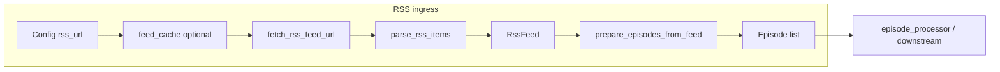

# RSS and feed ingestion guide

This guide describes how **RSS (and Atom-style) podcast feeds** are fetched, cached, parsed, and
turned into **`Episode`** objects before transcript download and downstream stages. It is the
**canonical ingress story** for URL-based feeds today. Other content sources (manual catalogs,
APIs, non-RSS manifests) may be added later; they should be documented alongside this path rather
than overloading this document.

## Scope

| In scope | Out of scope (linked elsewhere) |
| -------- | ------------------------------- |
| Feed URL configuration, multi-feed layout | Whisper / LLM providers — [ML Provider Reference](ML_PROVIDER_REFERENCE.md), [Provider Implementation](PROVIDER_IMPLEMENTATION_GUIDE.md) |
| HTTP fetch for **feed XML** and policy (retries, Issue #522) | **Transcript/media** byte download after episodes exist — [RFC-003: Transcript download processing](../rfc/RFC-003-transcript-downloads.md) |
| Safe XML parsing, item selection, `Episode` construction | Full filesystem layout — [RFC-004](../rfc/RFC-004-filesystem-layout.md), [ADR-003](../adr/ADR-003-deterministic-feed-storage.md) |
| Feed-level disk cache vs conditional GET cache | Eval materialization — [EXPERIMENT_GUIDE](EXPERIMENT_GUIDE.md) |

## End-to-end flow (single feed)

For one `Config` with a single `rss_url`, the pipeline does the following early in
`workflow.orchestration.run_pipeline` (scraping + parsing stages):

1. **`fetch_and_parse_feed`** (`workflow/stages/scraping.py`): resolve feed XML bytes (cache or HTTP),
   then **`parse_rss_items`** (`rss/parser.py`) → **`RssFeed`** (title, authors, items, `base_url`).
2. **`extract_feed_metadata_for_generation`**: reuse the same XML bytes for optional feed-level
   metadata (description, image, last updated) without a second network fetch.
3. **`prepare_episodes_from_feed`**: apply **episode selection** (order, date window, offset, cap),
   then **`create_episode_from_item`** per retained item → list of **`Episode`** models.
4. Later stages use those episodes for transcript discovery, download, transcription, metadata,
   summaries, GIL, KG, etc.

Multi-feed mode repeats the same inner sequence **once per feed URL** with a per-feed
`output_dir`; see [Multi-feed corpus](#multi-feed-corpus-github-440) below.

## Module map

| Concern | Primary code | Notes |
| ------- | ------------ | ----- |
| Orchestration | `workflow/orchestration.py`, `workflow/stages/scraping.py` | Stages `scraping` / `parsing` timings in `metrics.json` |
| Feed HTTP GET | `rss/downloader.py` — `fetch_rss_feed_url` | RSS-tuned session; optional **If-None-Match** / **If-Modified-Since** (Issue #522) |
| Media/transcript HTTP | `rss/downloader.py` — `fetch_url`, `http_get`, … | Different retry defaults than feed GET |
| HTTP policy | `rss/http_policy.py` | Throttle, Retry-After, circuit breaker, conditional GET body cache |
| Feed XML disk cache | `rss/feed_cache.py` | When `PODCAST_SCRAPER_RSS_CACHE_DIR` is set |
| XML parsing | `rss/parser.py` | `defusedxml` — [ADR-002](../adr/ADR-002-security-first-xml-processing.md) |
| Episode selection | `prepare_episodes_from_feed` | Order, dates, offset, `max_episodes` — [Episode selection](../api/CONFIGURATION.md#episode-selection-github-521) |
| Transcript URL discovery | `find_transcript_urls`, `choose_transcript_url` | `prefer_type` / `prefer_types` in `Config` |
| Public re-exports | `rss/__init__.py` | Stable import surface for `fetch_rss_feed_url`, `parse_rss_items`, etc. |

## Configuring feed URLs

- **Single feed:** `rss:` / `rss_url` in YAML, or positional / `--rss` on the CLI.
- **Multiple feeds:** `feeds:` / `rss_urls:` in operator YAML (URL strings or objects with `url` + optional per-feed overrides), corpus **`feeds.spec.yaml`** / JSON (**`--feeds-spec`**), or legacy **`--rss-file`** line list — with a corpus **parent** `output_dir`; each feed writes under `feeds/<stable_name>/`. See [CONFIGURATION.md — RSS and multi-feed corpus](../api/CONFIGURATION.md#rss-and-multi-feed-corpus-github-440), [RFC-063](../rfc/RFC-063-multi-feed-corpus-append-resume.md), [RFC-077](../rfc/RFC-077-viewer-feeds-and-serve-pipeline-jobs.md).
- **Normalization:** Request URLs go through **`normalize_url`** in the downloader (encoding,
  scheme/host handling) before cache keys and some logs.

CLI feed resolution (positional, `--rss`, `--rss-file`, **`--feeds-spec`**, config merge) lives in **`cli.py`**;
programmatic use builds **`Config`** directly or via **`load_config_file()`**.

## HTTP layer for the feed document

- **`fetch_rss_feed_url`** uses a **thread-local** RSS session with urllib3 **`Retry`** tuned for
  **RSS** (`rss_retry_total`, `rss_backoff_factor` in [Download resilience](../api/CONFIGURATION.md#download-resilience)).
- **`configure_downloader`** and **`configure_http_policy`** run at pipeline start from
  `orchestration._setup_pipeline_environment`; optional Issue #522 behavior (per-host spacing,
  circuit breaker, **RSS conditional GET**) applies here.
- **304 Not Modified:** When conditional GET is enabled and validators match, the downloader may
  synthesize a **200** response from the on-disk conditional cache. If the cache has no body for a
  **304**, the fetch is treated as a failure (warning + `None`). See **Download resilience** and
  **Troubleshooting** in CONFIGURATION.md.
- **Failure:** `None` response from the fetch path surfaces as a hard error when building the feed
  (pipeline does not continue without a parsable feed).

## Two different “RSS caches”

Do not confuse these; both can point at the same directory if you rely only on
`PODCAST_SCRAPER_RSS_CACHE_DIR` for the conditional cache base when `rss_cache_dir` is unset.

| Mechanism | Env / config | What is stored | When it runs |
| --------- | ------------ | -------------- | ------------ |
| **Feed XML cache** | `PODCAST_SCRAPER_RSS_CACHE_DIR` | Full **RSS XML** blob per normalized URL (`rss_*.xml` under cache dir) | **Before** parse, in `feed_cache.read_cached_rss` / `write_cached_rss` |
| **Conditional GET cache** | `rss_conditional_get` + `rss_cache_dir` or same env | **ETag / Last-Modified** metadata + body for validators | Around **HTTP** in `fetch_rss_feed_url` |

Details: [CONFIGURATION.md — RSS feed cache](../api/CONFIGURATION.md#rss-feed-cache-optional) and
**Download resilience** (conditional GET table).

## Parsing and security

- Parsing uses **`defusedxml`** to mitigate XML bombs and unsafe expansions (**ADR-002**).
- **`parse_rss_items`** returns feed title, channel-level authors, and a list of **items** (episodes).
- Publication dates are extracted with **`extract_episode_published_date`** / helpers used for
  **`episode_since` / `episode_until`** filtering. Items **without** a parseable date are **kept**
  when a date filter is active (logged); see CONFIGURATION episode selection notes.

## Episode selection (order, window, offset, cap)

Order of operations in **`prepare_episodes_from_feed`**:

1. Start from the feed’s item list (document order = typically newest-first).
2. **`episode_order: oldest`** — reverse the list.
3. Optional **`episode_since` / `episode_until`** — calendar-date filter on parsed `pubDate`;
   items with missing dates remain in the set (warning).
4. **`episode_offset`** — skip N items after the above.
5. **`max_episodes`** — keep at most N items.

Reference: [CONFIGURATION.md — Episode selection (GitHub #521)](../api/CONFIGURATION.md#episode-selection-github-521).

## From RSS item to `Episode`

- **`create_episode_from_item`** assigns a stable **index** (`idx`) in the **selected** list,
  resolves links, enclosures, and text fields, and sets **`base_url`** from the resolved feed URL
  when needed.
- **Transcript candidates:** **`find_transcript_urls`** gathers links (including **`podcast:transcript`**
  and generic link discovery); **`choose_transcript_url`** applies **`prefer_type`** ordering.
- **Media:** **`find_enclosure_media`** supports downstream transcription when transcripts are
  missing and **`transcribe_missing`** is enabled.

Full download and filename rules: **RFC-003**.

## Multi-feed corpus (GitHub #440)

When **`rss_urls`** (or merged `feeds`) has **two or more** URLs:

- **`cli.main`** and **`service.run`** loop feeds **sequentially** (isolated failures per feed).
- Each inner run uses **`rss_url`** set to one URL and **`output_dir`** set to
  **`feeds/<stable_id>/`** under the corpus parent (see **`filesystem.corpus_feed_output_dir`**).
- Optional parent-level **`corpus_manifest.json`**, **`corpus_run_summary.json`**, and a single
  **vector index** pass when configured — see **ARCHITECTURE.md** and **RFC-063**.

**Append / resume (#444)** interacts with **episode_id** and on-disk metadata; it does not change
RSS fetch semantics, only which episodes are skipped after selection.

## Operations and observability

- **Logs:** Feed title and item counts after fetch/selection; cache hits log at INFO when using
  `PODCAST_SCRAPER_RSS_CACHE_DIR`.
- **Metrics:** Stage timings **`scraping`** and **`parsing`**; download-resilience counters in
  **`metrics.json`** (see [Experiment Guide](EXPERIMENT_GUIDE.md#pipeline-run-metrics-download-resilience)).
- **Run artifacts:** **`failure_summary`** in **`run.json`** aggregates episode failures after the
  full pipeline; RSS fetch failure aborts before episode processing.

## Twelve-factor and deployment

Feed URLs and tuning are normal **`Config`** fields; secrets and per-deploy overrides typically
come from the **environment**. See [CONFIGURATION.md — Twelve-factor app alignment (config)](../api/CONFIGURATION.md#twelve-factor-app-alignment-config) and [DOCKER_SERVICE_GUIDE](DOCKER_SERVICE_GUIDE.md) for container-style injection.

## Testing

- **Unit:** Parser and URL choice tests under `tests/unit/podcast_scraper/` (RSS / downloader).
- **Integration:** Real HTTP against a **local** server — `tests/integration/rss/test_http_integration.py`
  (`integration_http`); workflow tests often **mock** `fetch_url` / `fetch_rss_feed_url`.
- **E2E:** Fixture feeds and mock HTTP server — [E2E Testing Guide](E2E_TESTING_GUIDE.md).

## Related documentation

| Document | Why read it |
| -------- | ----------- |
| [CONFIGURATION.md](../api/CONFIGURATION.md) | All RSS-related fields, multi-feed, episode selection, download resilience |
| [CLI.md](../api/CLI.md) | Flags for RSS URL(s), episode selection, retries |
| [PIPELINE_AND_WORKFLOW.md](PIPELINE_AND_WORKFLOW.md) | Where RSS sits in the full pipeline |
| [ARCHITECTURE.md](../architecture/ARCHITECTURE.md) | Multi-feed and orchestration summary |
| [RFC-003: Transcript downloads](../rfc/RFC-003-transcript-downloads.md) | After `Episode` exists: choosing and fetching transcript bytes |
| [ADR-002: XML security](../adr/ADR-002-security-first-xml-processing.md) | Parsing threat model |
| [ADR-003: Deterministic feed storage](../adr/ADR-003-deterministic-feed-storage.md) | Output path derivation from feed identity |

---

**Version:** 1.0  
**Created:** 2026-04-12 — consolidates RSS ingress for future non-RSS sources.
