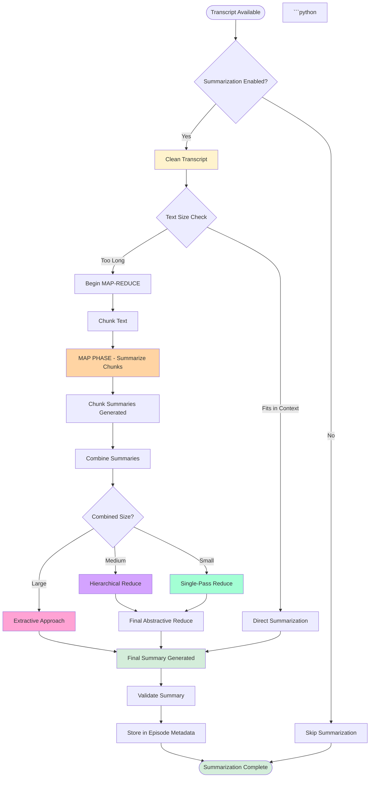

# Summarization Guide

This guide provides detailed implementation information for the podcast scraper's summarization system. The
summarization system implements a sophisticated hybrid MAP-REDUCE architecture to handle transcripts of any length
efficiently.

For high-level architectural decisions, see [Architecture](../ARCHITECTURE.md). For general development practices, see
[Development Guide](DEVELOPMENT_GUIDE.md).

## Overview

The summarization feature generates concise summaries of podcast episode transcripts using local transformer models
(BART, PEGASUS, LED). It implements a hybrid map-reduce strategy that efficiently handles transcripts of any length,
from short episodes to very long multi-hour conversations.

**Key Features:**

- Local-first approach for privacy and cost-effectiveness
- Automatic hardware detection (MPS/CUDA/CPU)
- Hybrid MAP-REDUCE architecture for long transcripts
- Quality validation and error handling
- Automatic model caching and reuse

## Summarization Flow

### 1. Transcript Cleaning

- Removes timestamps (language-agnostic: `[00:12:34]` patterns)
- Strips generic speaker tags while preserving actual speaker names
- Removes sponsor blocks and outro sections
- Collapses excessive blank lines
- Optionally saves cleaned transcript to `.cleaned.txt` for validation

### 2. Size Assessment & Model Selection

- Checks if transcript fits within model's context window
- If fits: performs single-pass direct summarization (most efficient)
- If too long: initiates MAP-REDUCE pipeline
- Selects MAP model (default: BART-large for chunk summaries)
- Selects REDUCE model (default: LED long-fast for final combination)

### 3. MAP Phase (Chunk Summarization)

- **Chunking Strategy**: Token-based chunking with configurable overlap
  - Encoder-decoder models (BART/PEGASUS): forced to 600 tokens per chunk
  - Long-context models (LED): can handle larger chunks
  - Overlap: 10% of chunk size for context continuity
- **Parallel vs Sequential Processing**:
  - CPU devices: parallel processing with ThreadPoolExecutor (up to 4 workers)
  - GPU/MPS devices: sequential to avoid memory thrashing
- **Progress Tracking**: Logs every 5 chunks with ETA estimation
- **Output**: Collection of chunk summaries (80-160 tokens each)

### 4. REDUCE Phase (Summary Combination)

The REDUCE phase employs a three-tier decision tree based on combined summary size:

#### Tier 1: Single-Pass Abstractive (≤800 tokens)

- Most efficient approach for short combined summaries
- Uses REDUCE model (default: LED) to generate final summary in one pass
- Target: 200-480 tokens final summary
- No chunk selection - uses ALL summaries for completeness

#### Tier 2: Hierarchical Reduce (800-4000 tokens)

- Fully abstractive approach for medium-sized combined summaries
- Implements mini map-reduce strategy:
  1. Re-chunk combined summaries into 3-5 sections (650 words each)
  2. Summarize each section (80-160 tokens per section)
  3. Check if result is small enough for final reduce
  4. If still too large, repeat (up to 4 iterations max)
  5. Final abstractive reduce when size permits
- Uses token-based chunking to guarantee no truncation
- Uses ALL section summaries (no selection) for accuracy
- Prevents extractive fallback by iteratively reducing size

#### Tier 3: Extractive Approach (>4000 tokens)

- Safety fallback for very large combined summaries
- Selects representative chunks instead of using all:
  - ≤3 chunks: use all
  - ≤10 chunks: use first, middle, last
  - >10 chunks: use first, 25th, 50th, 75th percentile, last
- One optional final summarization pass if selected chunks still too long
- Prioritizes avoiding hallucination over completeness

### 5. Quality Validation

- Strips instruction leaks (removes prompt text that leaked into output)
- Detects and fixes repetitive content (deduplicates repeated sentences)
- Validates summary length (flags if suspiciously close to input length)
- Returns empty string if quality validation fails

### 6. Metadata Storage

- Creates `SummaryMetadata` object with:
  - Generated summary text
  - Generation timestamp
  - Model used (MAP and optionally REDUCE)
  - Provider (local/openai)
  - Word count of original transcript
- Stores in episode metadata document (PRD-004/RFC-011)
- Respects `--skip-existing` flag (regenerates if transcription source changes)

## Model Selection Strategy

**Important**: Model validation differs by provider:

- **Transformers Provider** (local models): Only tested model aliases are supported. Direct model IDs are rejected.
- **OpenAI Provider**: Any OpenAI model name is accepted. Validation is performed by OpenAI's API.

### Transformers Provider: Supported Model Aliases

**Note**: The strict validation below applies only to the `transformers` provider.
For OpenAI provider, see [OpenAI Model Selection](#openai-provider-model-selection) below.

- **`bart-large`**: `facebook/bart-large-cnn` (production MAP, best quality, ~2GB)
- **`bart-small`**: `facebook/bart-base` (test MAP, smaller/faster, ~500MB)
- **`long`**: `allenai/led-large-16384` (production REDUCE, long-context, ~2.5GB, handles 16k tokens)
- **`long-fast`**: `allenai/led-base-16384` (test REDUCE, faster, ~1GB)

### MAP Model (Chunk Summarization)

- **Default**: `bart-large` (best quality, ~2GB)
- **Test/Dev**: `bart-small` (smaller, faster, ~500MB)

**Note**: Direct model IDs (e.g., `facebook/bart-large-cnn`) are not supported. Use aliases only.

### OpenAI Provider: Model Selection

The OpenAI provider accepts any valid OpenAI model name.
No strict validation is performed locally - OpenAI's API validates the model name.

**Common OpenAI Models:**

- `gpt-4o` (production default, high quality)
- `gpt-4o-mini` (test default, cost-effective)
- `gpt-5`, `gpt-5-mini`, `gpt-5-nano` (newer models, if available)

**Configuration:**

- `openai_summary_model`: Any OpenAI model name (default: `gpt-4o`)
- `openai_speaker_model`: Any OpenAI model name (default: `gpt-4o`)
- `openai_transcription_model`: Must be `whisper-1` (only option)

**Why No Strict Validation?**

- OpenAI models are validated by OpenAI's API
- Users may want to use newer models not yet in our constants
- No local caching/preloading required

### REDUCE Model (Final Combination)

**Note**: REDUCE models apply only to the `transformers` provider.
OpenAI provider doesn't use REDUCE (handles full transcripts directly).

- **Default**: `long` (production quality, long-context, ~2.5GB)
- **Test/Dev**: `long-fast` (faster, ~1GB)
- **Fallback**: Falls back to MAP model if not specified

**Note**: Direct model IDs (e.g., `allenai/led-large-16384`) are not supported. Use aliases only.

### Device Selection

- Auto-detects: MPS (Apple Silicon) → CUDA (NVIDIA) → CPU
- GPU/MPS: Sequential processing, memory-efficient
- CPU: Parallel processing (4 workers), slower but works without GPU

## Performance Characteristics

- **Direct Summarization**: <5s for transcripts ≤1024 tokens
- **MAP-REDUCE**: ~3s per chunk (varies by model and device)
- **Parallel Processing**: 3-4x speedup on CPU with 4 workers
- **Memory Usage**:
  - `bart-large`: ~2GB GPU memory (production MAP)
  - `bart-small`: ~500MB GPU memory (test MAP)
  - `long`: ~2.5GB (reduce phase, production default)
  - `long-fast`: ~1GB (reduce phase, test default)

## Error Handling

- Model loading failures: Log warning, skip summarization
- Out-of-memory errors: Log error, skip summarization (no automatic fallback)
- Buffer size errors (MPS): Log error with device details
- Validation failures: Return empty summary rather than hallucinated content
- Summarization failures don't block transcript processing

## Configuration

Summarization is configured via the `Config` model. Key options include:

- `generate_summaries`: Enable/disable summarization
- `summary_model`: MAP model alias (default: `bart-large`, options: `bart-large`, `bart-small`)
- `summary_reduce_model`: REDUCE model alias (default: `long`, options: `long`, `long-fast`)

**Important**: Only model aliases are supported. Direct model IDs will be rejected with an error.

- `save_cleaned_transcript`: Save cleaned transcripts to `.cleaned.txt` files

See [Configuration Documentation](../api/CONFIGURATION.md) for complete configuration options.

## Related Documentation

- [Architecture](../ARCHITECTURE.md) - High-level system design
- [Development Guide](DEVELOPMENT_GUIDE.md) - General development practices
- [Provider Implementation Guide](PROVIDER_IMPLEMENTATION_GUIDE.md) - Complete guide for implementing new
  providers (includes OpenAI example)

- [PRD-005](../prd/PRD-005-episode-summarization.md) - Product requirements for summarization
- [RFC-012](../rfc/RFC-012-episode-summarization.md) - Design decisions for summarization
