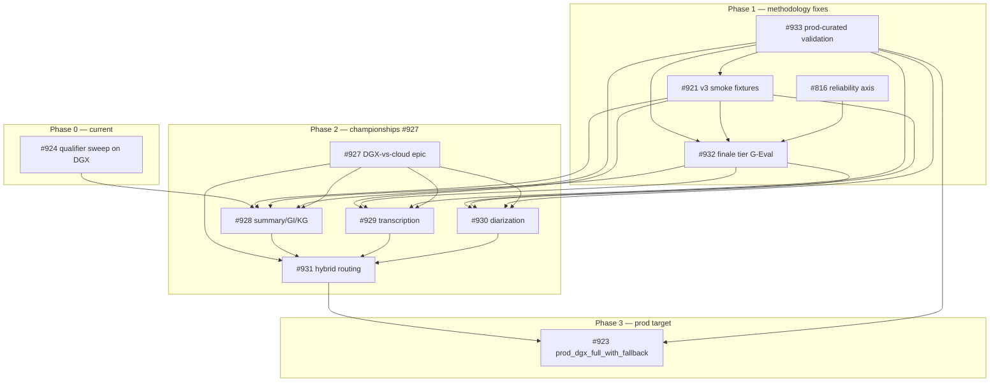

# Autoresearch — next phase dependency map

**Generated:** 2026-06-08
**Scope:** open GitHub issues forming the next phase of the autoresearch programme (epic [#907](https://github.com/chipi/podcast_scraper/issues/907)) — from the currently-running smoke v2 refresh through to the "all inference on DGX" prod decision.

This is a planning aid, not a contract. Dependencies named below are derived from issue bodies + the recent design conversations captured in this folder. Treat as the current best-shared mental model.

---

## TL;DR — the spine

```
        #924 [running now]                  #933 [filed, awaits operator backup]
        qualifier sweep                     prod-curated validation tier
              │                                       │
              │ feeds rankings into                   │ provides ground-truth reality check
              ▼                                       │
        #921 v3 smoke ◀───── fidelity-validated by ───┤
              │                                       │
              │ becomes the corpus for                │
              ▼                                       │
        #932 finale tier ◀──── top-2 sanity check ────┤
              │                                       │
              │ scores feed into                      │ same sanity role
              ▼                                       │
   #927 epic (DGX-vs-cloud championships) ◀───────────┤
              │
              │  per-stage winners feed
              ▼
        #923 prod_dgx_full_with_fallback profile
              │
              ▼
        "all inference moves to DGX"
```

Two cross-cutting tier additions (**#932**, **#933**) sit *above* the existing qualifier flow. v3 smoke (**#921**) is the next-gen replacement for v2 smoke; both #932 and #933 use it once it lands.

---

## Issues in scope (open, autoresearch label or directly downstream)

| # | Title | Phase | State |
|---|---|---|---|
| [#907](https://github.com/chipi/podcast_scraper/issues/907) | Epic: Autoresearch programme — v2 inputs, tuning, eval axes, LoRA | parent epic | open |
| [#924](https://github.com/chipi/podcast_scraper/issues/924) | Autoresearch v2 refresh on DGX — DeepSeek-R1-Distill + newer entries | phase 0 — current | open, sweep running |
| [#921](https://github.com/chipi/podcast_scraper/issues/921) | Test fixtures v3 — incorporate autoresearch learnings | phase 1 — methodology | open |
| [#932](https://github.com/chipi/podcast_scraper/issues/932) | Tier-2 finale — G-Eval 4-dimension LLM-judge | phase 1 — methodology | open, filed today |
| [#933](https://github.com/chipi/podcast_scraper/issues/933) | Tier-2 validation — frozen prod-curated subset | phase 1 — methodology | open, filed today |
| [#816](https://github.com/chipi/podcast_scraper/issues/816) | Reliability axis | phase 1 — methodology | partially shipped; integrates into #932 |
| [#927](https://github.com/chipi/podcast_scraper/issues/927) | Epic: DGX-vs-cloud autoresearch | phase 2 — championships | open |
| [#928](https://github.com/chipi/podcast_scraper/issues/928) | Summary / GI / KG model championship | phase 2 — championships | open |
| [#929](https://github.com/chipi/podcast_scraper/issues/929) | Transcription championship | phase 2 — championships | open |
| [#930](https://github.com/chipi/podcast_scraper/issues/930) | Diarization championship | phase 2 — championships | open |
| [#931](https://github.com/chipi/podcast_scraper/issues/931) | Hybrid routing decision → profile + runbook | phase 2 — championships | open |
| [#923](https://github.com/chipi/podcast_scraper/issues/923) | Prod profile: all-DGX with cloud fallback | phase 3 — prod target | open |

**Phase 0.5 prompt-tuning** (filed during the v2 sweep PR + after Phase 0):

| # | Title | Status |
|---|---|---|
| [#935](https://github.com/chipi/podcast_scraper/issues/935) | Prompt-tune gemma3:27b | open |
| [#936](https://github.com/chipi/podcast_scraper/issues/936) | Prompt-tune phi4:14b | open |
| [#937](https://github.com/chipi/podcast_scraper/issues/937) | Prompt-tune hermes3:8b | open |
| [#938](https://github.com/chipi/podcast_scraper/issues/938) | Prompt-tune mistral-small:24b | open |
| [#945](https://github.com/chipi/podcast_scraper/issues/945) | Prompt-tune older top-3 (mistral:7b, llama3.2:3b, llama3.1:8b) — optional sidecar | open |

Also surfaced from PR #941 / Phase 0 work:

| # | Title | Status |
|---|---|---|
| [#942](https://github.com/chipi/podcast_scraper/issues/942) | Wire DGX services into Sentry | open |
| [#943](https://github.com/chipi/podcast_scraper/issues/943) | Wire DGX into Prometheus + Grafana | open |

**Out of scope** (still parked, deferred): #629 / #630 / #631 (LoRA path), #912 (qwen3.5:9b bundled JSON workaround — already mitigated), #594 / #853 / #904 / #905 / #906 (closed; their learnings are in `AUTORESEARCH_LEARNINGS_FOR_V3.md`).

---

## Phase 0 — current

### #924 — qualifier sweep on DGX (running now)

Adds DeepSeek-R1 distills (7B/14B/32B/70B), gpt-oss:20B, qwen3.6:latest. Retry sweep against `baseline_llm_ollama_qwen35_35b_smoke_paragraph_v1`. Early read: DeepSeek-R1 distills cluster at 12-14% RougeL — not paragraph-summary-shaped, ruled out as champion.

**Output**: per-model `data/eval/runs/llm_ollama_*_dgx_smoke_v2_2026_06/` directories — fed into #928 ranking + the EVAL_SMOKE_V2_DGX_REFRESH_2026_06 report (still pending).

**Direct successors**:
- pending v2.1 sweep (gemma3, phi4, hermes3, mistral-small3.x, llama4, deepseek-v3) per pre-flight research
- #923 model-pick comment after sweep wraps
- Champion candidate goes into #928 stratum

---

## Phase 1 — methodology fixes (next)

Three orthogonal additions, mostly parallel. They MUST land before #927 championships can produce trustworthy verdicts.

### #921 — v3 smoke fixtures (rebuild)

Re-framed today (this WIP doc): v3 **is** smoke, evolved — not a new tier on top of v2.

**Spec source**: `docs/wip/AUTORESEARCH_LEARNINGS_FOR_V3.md` — taxonomy of every failure mode discovered by #853 / #594 / #904 / #905 / #906 / #816 that v2 doesn't simulate (ASR garbles, native ads, multi-accent, recurring guests, position arcs, burst-load knob, sponsor-shaped real content).

**Validates against**: #933 prod-curated set (fidelity check: "does v3 reproduce the findings the prod set produces?").

**Blocks**: every #927 child once it lands; #932 finale runs on v3 once available.

### #932 — finale tier (G-Eval LLM-judge)

Sits above the qualifier. 4-dimension scoring (faithfulness / coverage / coherence / fluency) on stratified finalists (cloud / MBP ≤14B / DGX Spark ≤40B / hybrid system).

**Judges**: Sonnet 4.6 primary; Gemini 2.5 Pro cross-check on top-2.
**Cost**: ~$35 / finale sweep.
**Validates against**: #933 prod-curated top-2 sanity check.

**Blocks**: #927 championships' final-winner picks; #923 model swap.

### #933 — prod-curated validation tier

10-20 frozen episodes from latest prod backup (operator-supplied when ready). Hand-tagged against the failure-mode taxonomy in `AUTORESEARCH_LEARNINGS_FOR_V3.md`.

**Source**: pulls from existing prod backups (`.test_outputs/manual/my-manual-run4` or successor latest). No new data collection.

**Used by**: #921 (fidelity check), #932 (top-2 sanity check), #927 + children (championship verdicts), #923 (prod model swap reality check).

**Blocks**: #921 fidelity check; #932 final sanity step.

### #816 — reliability axis (mostly done)

Methodology shipped. `success_rate_pct ≥ 95` floor + `effective $/successful-call` + p50/p95 under burst.

**Integration path**: could become the 5th G-Eval dimension in #932 long-term, or stay as a hard floor before any finale candidate is scored.

---

## Phase 2 — championships (#927 epic, after Phase 1 stabilizes)

All four use the same eval stack: qualifier(v3 smoke) → finale(#932) → sanity(#933).

### #927 — DGX-vs-cloud (epic)

The "is DGX truly competitive?" question. Children produce the per-stage verdicts that feed #923.

### #928 — summary / GI / KG model championship

Compares: vLLM-served Qwen (operator's experiment), DeepSeek-R1-Distill, Llama variants, gemini-2.5-flash-lite. **Blocked by**: methodology tier landing (#921 + #932 + #933).

### #929 — transcription championship

Compares: Speaches/DGX (#814, shipped), local base.en, cloud Whisper. **Blocked by**: same methodology tier — for transcription, "reality" = how does it handle the multi-accent + ASR-garble episodes in #933?

### #930 — diarization championship

Compares: pyannote/DGX (#926, in deploy), pyannote/CPU, Gemini speaker detection. **Blocked by**: methodology tier + #926 pyannote DGX deploy operational.

### #931 — hybrid routing decision

Synthesizes #928 + #929 + #930 verdicts plus cost data into a profile + runbook. **Blocked by**: all three championship issues + #816 reliability scores.

---

## Phase 3 — prod target

### #923 — prod_dgx_full_with_fallback profile

The user's "move all inference to DGX" goal materializes as a profile YAML + ADR. **Blocked by**: #927 (and therefore all of #928 / #929 / #930 / #931). #933 sanity check before the final swap.

---

## Cross-cutting dependencies (textual graph)

For machine-readable / Mermaid-rendering use:



## Recommended sequence (one path through)

| Order | Work | Why first |
|---|---|---|
| 1 | Finish #924 sweep + write report | already running, frees DGX |
| 2 | File + curate **#933** | cheapest piece, blocks #921 fidelity check and #932 sanity check |
| 3 | v2.1 sweep (gemma3, phi4, hermes3, …) | takes advantage of free DGX; informs #928 candidate list |
| 4 | Begin **#921 v3 fixtures** | longest pole; spec already exists in `AUTORESEARCH_LEARNINGS_FOR_V3.md` |
| 5 | Implement **#932** finale tier | can develop in parallel with #921; needs #933 for sanity check |
| 6 | Validate v3 fidelity against #933 | gating gate for #927 |
| 7 | Run **#928 / #929 / #930** championships | per-stage verdicts |
| 8 | **#931** synthesizes into hybrid routing decision | needs all three above |
| 9 | **#923** prod profile commit + ADR | final deliverable |

This sequence is "shortest critical path" — many items can run in parallel (e.g. #921 and #932 implementations don't block each other; v2.1 sweep proceeds independently). Use it as a hint, not a schedule.

---

## What this map deliberately omits

- **LoRA path** (#629 / #630 / #631): out of scope per `MEMORY.md` "LoRA out of scope" note.
- **#926 pyannote-on-DGX deploy**: infra work, separate from the autoresearch eval question. Operationally gates #930 (diarization championship needs DGX-side pyannote running) but is not part of the autoresearch methodology stack.
- **#814 Speaches/Whisper-on-DGX**: shipped. Gates #929 operationally only.
- **#912 qwen3.5:9b bundled JSON bug**: mitigated, parked.

---

## Living-document caveat

This map reflects today's understanding (2026-06-08). When any of:

- Phase 1 design choices change (e.g. #932 judge model selection)
- New failure modes surface in #924 / v2.1 sweep that aren't in the taxonomy yet
- An issue gets re-scoped or split

…the map needs an update. The dependency arrows above are *informational* — actual `addBlockedBy` relationships in GitHub Issues are the source of truth for what's gating what.
