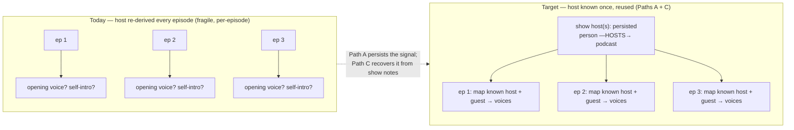

# Epic — Know the host (100% host identification)

**Status:** Specced, not started. **Branch:** TBD (new `feat/host-identity-*`).
**One-liner:** Reliably know every show's host(s), persist it as metadata + a graph
edge, and make downstream surfaces (graph, digest, library, person card) render
host-aware behaviours from that ground truth — replacing today's coarse `role`
and the viewer's coverage heuristic.

---

## 1. North star

For **every show** in the corpus we know its **host(s)** with high confidence,
stored as episode/show **metadata** and a typed **graph edge** (`person —HOSTS→
podcast`). Guest attribution improves as a byproduct. Downstream, "we know the
host" unlocks specific behaviours (§6). Success is measured, not asserted (§3).

## 2. Where we are today (the gap)

Host detection is already multi-source per episode; the weak link is everything
**cross-episode / per-show**.

| Layer | Mechanism | Gap |
|---|---|---|
| Feed metadata | `speaker_detectors/hosts.py` — RSS `itunes:author`, network/publisher tags rejected (#876), config `known_hosts` | author is often the network; no per-show persistence |
| Transcript intro | LLM NER (`guest_host_v1`) — "I'm Katie Martin…", skips bumpers | misses when no self-intro |
| Diarization | per-episode, independent → `SPEAKER_NN` | **no cross-episode voice identity** |
| Role heuristic | `gi/speakers.py` — opening cluster → host, dominant other → guest | one guest only; per-episode |
| Person `role` | single coarse `host`/`guest`/`mentioned` | **no per-show link** |
| `reconcile_hosts` (#1056) | graph-build, no ML — merge unnamed feed-exclusive host into the show's one recurring named host, else tag | can't do co-hosts / recurring guests / ambiguous shows |
| Viewer | infers per-show "Host" from **episode coverage** (≥50%, ≥2 eps) | **sample-bias bug**: a true host in few sampled eps reads as not-host (Katie Martin: Unhedged host, 1/10 sampled) |

**The shape of the gap in one picture.** A show almost always has the *same* host(s) across
every episode — that is a **show-level constant**. Today we *re-derive* it from scratch each
episode using per-episode signals (opening voice, self-intro), because diarization is
per-episode + anonymous and the host is never persisted. Knowing it **once** turns the
per-episode job from "discover the host" into "map a known name to a voice":

The guest side is already close to this ideal: the episode **title / description** usually
name the guest explicitly, and Stage-1 NER + interview-intent filtering already extracts them
(see [SPEAKER-RESOLUTION-ROADMAP.md](SPEAKER-RESOLUTION-ROADMAP.md)). The unsolved half is
**persisting the host** so the episode-level resolver starts from ground truth instead of a
heuristic — which is why Path A is *do-first*.

## 3. Approach — TDD: measure → target → slice

The spine of the epic is a **host scorecard** (Slice 0). Every path runs it
before and after; a path ships only if it moves the number toward target. The
scorecard *is* the test suite — we don't guess whether a layer "adds value," we
measure it.

### Slice 0 — the scorecard (do first, before any path)

- **Gold set** (`data/eval/host/gold.jsonl`): one row per show — `{show_id,
  show_title, split, hosts: [canonical names], notes}`. Label **all 10 prod-v2
  shows** (hosts are public: Unhedged → Katie Martin + Rob Armstrong; Hard Fork →
  Kevin Roose + Casey Newton; Odd Lots → Joe Weisenthal + Tracy Alloway; …), then
  **split in half** (operator decision): **5 `dev` shows** to develop/tune the
  detection against, **5 held-out `test` shows** the implementation never tunes
  on. Headline metrics are reported on the **held-out split** — that's the honest
  generalization measure (a layer that only works on the shows we stared at
  hasn't earned its keep). Optionally a few per-episode guest rows for guest
  metrics. Extend the gold as the corpus grows.
- **Script** (`scripts/eval/host_identification_report.py`, mirrors the
  insight-density report): build the corpus graph, extract per-show **identified
  hosts** (person nodes with `role==host` for that show + reconcile output),
  compare to gold. Metrics:
  - **Coverage** — % of shows with ≥1 host identified at all.
  - **Recall** — identified true hosts / true hosts (per show, then averaged).
  - **Precision** — correct identified hosts / all identified (catches
    network/guest mislabels).
  - **Co-host completeness** — for multi-host shows, all hosts found?
  - **Sample-bias resilience** — is a true host identified despite low episode
    coverage? (the Katie-Martin acid test — a named per-show pass/fail).
  - **Named-not-`SPEAKER`** — % of host voices that carry a real name vs a bare
    `SPEAKER_NN` / "recurring host — not auto-named".
- **Output** — per-show table (gold vs identified, ✓/✗ per host) + corpus
  aggregates + a JSON mode. Running it now = the **baseline** row.
- **Acceptance:** the scorecard runs and reports a baseline. (We now know where we
  are — nothing else in the epic starts until this exists.)

### Target (definition of done for the epic)

Measured on the **held-out `test` split** (operator decision):

- **Precision = 1.00 — a HARD gate. Zero wrong hosts allowed** (operator: "no
  mistakes"). This is invariant across *every* slice: a layer that introduces a
  single false host is **rejected**, not shipped. Design consequence — every
  layer is *confidence-gated*: when unsure, leave a host unknown rather than
  guess. Precision never moves; **coverage climbs slice by slice**.
- Coverage **100%** (every show has ≥1 host known) — the number the slices push.
- Recall **≥ 0.95**.
- Sample-bias resilience **= pass** for every gold host (coverage-independent).
- Per-show role in the person card matches gold (coverage heuristic retired).
- Downstream surfaces (§6) render host-aware.

Each metric is tracked as a time series across the paths (baseline → after A →
after C → …) so we see exactly which layer moved which number — precision held at
1.00 the whole way, coverage rising to 100%.

## 4. The paths (slices)

Each path: **change · metric it moves · downstream unlocked · acceptance (Δ on the
scorecard)**.

### Path A (Opp 1) — Persist per-show host as a graph edge  ★ do first
- **Change:** at GI/KG extraction, emit a typed `person —HOSTS→ podcast` (and
  `person —GUESTS_ON→ podcast`) edge from the **already-computed** host/NER
  signal — not transcript coverage. Add `/api/relational/shows?person=…` →
  `[{show, role}]`. Person card reads the real role, drops the coverage
  heuristic (`isHost`/`showTotalEpisodes`).
- **Moves:** Coverage↑, Sample-bias resilience↑ (this is the fix for the
  Katie-Martin bug), per-show role correctness↑.
- **Unlocks:** person card per-show role from ground truth.
- **Acceptance:** coverage ≥ baseline+big; the Katie-Martin case flips to pass;
  no precision regression.

### Path C (Opp 3) — Network-feed show-notes parsing  ★ do second
- **Change:** for org-authored feeds (no self-intro), parse the episode
  **description / show-notes** ("Host: …", "Hosted by …") + `itunes:owner` /
  `managingEditor` to recover host names the intro NER misses. Feed into the
  same host signal Path A persists.
- **Moves:** Coverage↑ + Recall↑ on the *hard* network feeds specifically.
- **Unlocks:** hosts on shows that currently only get `SPEAKER_NN`.
- **Acceptance:** recall on the gold's network-feed subset ↑; precision held.

### Path B (Opp 2) — Cross-episode voice identity (embeddings)
- **Change:** use pyannote **voice embeddings** to cluster recurring voices
  across episodes of a show, naming the recurring `SPEAKER_NN` that
  `reconcile_hosts` (feed+role only) can't — co-hosts, recurring guests.
- **Moves:** Recall↑ on co-host / ambiguous shows; Named-not-`SPEAKER`↑.
- **Unlocks:** naming voices structural rules can't. (Biggest ML lift — sequence
  after the cheap wins so we measure its *marginal* value.)
- **Acceptance:** co-host completeness↑ on multi-host gold shows.

### Path D (Opp 4) — Multi-guest attribution
- **Change:** wire **all** NER-detected guests to clusters (not just the single
  dominant non-host), so panels / roundtables attribute every guest.
- **Moves:** Guest recall↑ (needs a few per-episode guest gold rows).
- **Unlocks:** correct guest lists on multi-guest episodes.
- **Acceptance:** guest recall on the panel gold subset↑.

### Path E (Opp 5) — Role taxonomy + downstream behaviours
- **Change:** richer roles derived from the edges + frequency — `co-host`,
  `recurring-guest`, `one-time-guest`, `panelist` — and wire the §6 behaviours.
- **Moves:** role-granularity coverage; makes the downstream payoff real.
- **Unlocks:** everything in §6.
- **Acceptance:** person card / digest / library / graph render the correct
  per-show role for the gold set.

## 5. Sequencing rationale

`Slice 0 → A → C → B → D → E`, re-measuring after each.
A first (cheap, no ML, fixes a real correctness bug + persists the signal). C
next (biggest remaining coverage gap — network feeds). B after (expensive ML;
sequence late so its *marginal* lift over A+C is measured, not assumed). D + E
polish + cash in the downstream behaviours. A path that doesn't move its metric
gets re-scoped, not shipped.

## 6. Downstream behaviours unlocked (the payoff)

Gated on "host known" — the reason the epic matters:

| Surface | Host-aware behaviour |
|---|---|
| **Graph** | `HOSTS` edges; host badge on person nodes; host vs guest visual weight; "hosts of this show" cluster |
| **Digest** | "Hosted by X" attribution; weight host-stated vs guest-stated insights differently |
| **Library** | filter / group by host; "shows X hosts"; host-led vs guest-led episode framing |
| **Person card** | per-show role from ground truth ("Host of Unhedged · recurring guest on Y"), not coverage; host-first ordering of their shows |

## 7. Risks & non-goals

- **Wrong name is worse than none** — keep the conservative guards (`reconcile_hosts`
  philosophy). Precision is a hard gate, not just recall.
- **Non-goals:** real-time host ID; a global voice-fingerprint identity spanning
  the whole corpus (scope + privacy) — Path B is *within-show* only.
- Gold set is small (sample corpus); metrics are directional until the corpus
  grows — the scorecard must `log()` the gold size so we never over-read a %.

## 8. Decisions (resolved with the operator)

- **Gold-set scope** → label all 10 prod-v2 shows, **split in half**: 5 `dev`
  (develop/tune against) + 5 held-out `test` (headline metrics). Held-out proves
  the detection generalizes, not overfits the shows we looked at.
- **Precision floor** → **1.00. No mistakes allowed.** A single wrong host fails
  the slice. Every layer is confidence-gated (unknown ≻ wrong); coverage is the
  number that moves, precision stays pinned at 1.0.
- **Path B (pyannote voice embeddings)** → **in this epic** (sequenced after
  A + C so its marginal lift is measured, not assumed).
