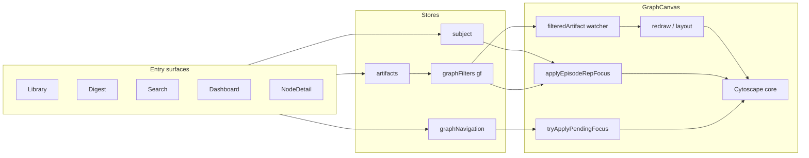

# Graph navigation handoff — deep analysis (WIP)

**Status:** Draft analysis for rearchitecture discussion. Not an ADR index entry.

**Related:** `web/gi-kg-viewer/e2e/E2E_SURFACE_MAP.md` (automation contract and matrix),
`web/gi-kg-viewer/e2e/INCREMENTAL_LOADING_TEST_CRITERIA.md` (scenario list),
GitHub [#750](https://github.com/chipi/podcast_scraper/issues/750) (expanded E2E backlog).

## 1. Why this hurts now

Incremental loading work concentrated logic in **`GraphCanvas.vue`** (thousands of lines),
 **`artifacts`** (selection, merge policy, load source flags), **`graphNavigation`**, and
 **`subject`**, while Digest / Library / Search / Dashboard **each slice the problem
 differently**.

A regression narrative that fits recent behaviour: behaviour was acceptable when **fewer
 branches** guarded redraw, focus, and layout. Recent changes added **orthogonal policies**
 (incremental append vs full layout, external vs internal load sources, ego guards,
 territory auto-load, pending recenter, pending focus watchers) **without a single reducer**
 that decides: “artifacts updated → cytoscape must reflect → then camera”.

Crossing those policies yields **ordering bugs** that look like separate bugs (camera,
 selection, incremental layout) but are the same structural issue.

## 2. Inventory of graph handoff entry points

Rough map of **who** touches **what** when sending the user (or automation) into the Graph
surface.

| Area | Typical user action | Sets / mutates |
| --- | --- | --- |
| **Library** | Row select, hover **G** (open in graph) | `subject.focusEpisode(...)`, optional `episodeId`; `switch-main-tab` → `graph`; may rely on corpus sync + territory strip (`GraphCanvas.vue`) |
| **Digest** | Topic hit, pills, clusters, open graph flows | `artifacts.setLoadSource('digest-external')`, `appendRelativeArtifacts`; `nav.requestFocusNode(...)` variants; topic vs episode ids (`DigestView.vue`, `cilGraphFocus.ts`) |
| **Semantic search** | **Show on graph** on hit | `nav.requestFocusNode(id, ..., camera includes)` (`SearchPanel.vue`, `ResultCard.vue`) |
| **Dashboard Intelligence** | Topic landscape card → graph | `@go-graph` → `App.activateGraphTab(target, fb)` (`DashboardView.vue`, `TopicLandscape.vue`) |
| **Graph internal** | Node detail **Load**, neighbourhood **Show on graph** | `artifacts.setLoadSource('graph-internal')`, append; `nav.requestFocusNode(...)` (`NodeDetail.vue`, `GraphConnectionsSection.vue`) |
| **Explore** | Focus node from explore output | `nav.requestFocusNode` (`ExplorePanel.vue`) |
| **App shell** | Tab switch without Digest paths | `activateGraphTab` may call `subject.focusTopic` / `focusGraphNode`, `nav.requestFocusNode`, `syncMergedGraphFromCorpusApi`, `ensureTopicClusterCompoundVisible` (`App.vue`) |

**Observation:** Episode-oriented flows split between **`nav.pendingFocusNodeId`** (explicit graph
 ids) and **`subject.kind === 'episode'`** + **`episodeMetadataPath`** + optional **`episodeId`**
without a single “handoff envelope” consumed in one place.

## 3. Core modules and coupling

### 3.1 `stores/graphNavigation.ts`

- Holds **`pendingFocusNodeId`**, optional fallback id, **`pendingFocusCameraIncludeRawIds`**.
- **`requestFitAfterLoad`** for fit-after-load behaviours.
- **Role:** imperative “please focus this node when the canvas can”; does not guarantee data or
 redraw completion.

### 3.2 `stores/subject.ts`

- **Episode rail:** **`episodeMetadataPath`**, **`episodeUiLabel`**, **`episodeId`** (logical UUID
 when known), **`graphConnectionsCyId`** (explicit cy id anchor when known).
- **Role:** UX state for rails; **`GraphCanvas.vue`** reconstructs cytoscape targeting from here
 alongside **`filteredArtifact`**.

### 3.3 `stores/artifacts.ts`

- **`selectedRelPaths`**, **`loadSelected`**, **`appendRelativeArtifacts`**, **`removeRelativeArtifacts`**.
- **`lastLoadSource`** (`digest-external` \| `library-external` \| `graph-internal`)
  communicates **intent** to **`GraphCanvas.vue`** (skip auto-merge, force full layout, etc.).
- **Role:** “what JSON is merged”; **`GraphCanvas`** must still decide how that becomes **Cy
 elements** and layout.

### 3.4 `stores/graphFilters` (`gf`)

- **`filteredArtifact`** etc.: logical merged view after filters / lens / ego.
- **Role:** authoritative for **resolver** helpers (`findEpisodeGraphNodeIdForMetadataPath*`,
 `findRawNodeInArtifact`). **Not** authoritative for **`core.$id(id).nonempty`** until redraw
/layout completes.

### 3.5 `components/graph/GraphCanvas.vue`

Central collision point:

- **`redraw`** / **`scheduleRedraw`**: debounced; chooses incremental vs full layout; references
 **`artifacts.currentLoadSource`**, selection growth, ego ids, **`contextSwitch`** (currently
 forced false), historical incremental heuristics. Contains **runtime `console.log`**
 (`[GraphCanvas redraw]`) in the inspected tree—sign of iterative debugging living in prod path.
- **`filteredArtifact` watcher**: can **return early** on “incremental append” when no pending focus
 **and** load is not marked external → **risk: merged artifact grows, Cytoscape does not**.
- **`applyEpisodeRepresentativeFocusIfNeeded`**: resolves episode cy id from **metadata path**
 and/or **`episodeId`** (UUID fallback for `__unified_ep__:UUID` rows without metadata properties).
 Handles territory mode **`empty`**, interaction with **`clearEpisodeRepresentativeGraphState`**
 order ( **`empty` vs `off`** batching ).
- **`tryApplyPendingFocus`**: consumes **`nav.pendingFocusNodeId`** once elements exist.
- **Auto-load territory strip**: **`loadEpisodeSliceForTerritoryStrip`** (fetch corpus episode detail,
 append GI/KG), **`episodeTerritoryAutoLoadTriedPaths`** guard.

**Structural problem:** Multiple **watchers** + **timers** + **layout callbacks** each try to patch
partial state. None owns the invariant: **`filteredArtifact` contains node N ⇔**

**`core` contains element N** before camera/selection asserts.

### 3.6 `utils/graphEpisodeMetadata.ts`

Episode identity is **three-layer:**

1. Corpus **`metadata_relative_path`** string.
2. Logical **`episode_id`** (UUID) and graph ids **`__unified_ep__:UUID`**.
3. Optional **`episode_id` / logical id parsing** inside `findEpisodeGraphNodeIdForMetadataPathOrEpisodeId`.

Unified-merge Episode nodes often **lack** **`metadata_relative_path`** in **`properties`**; path-only resolvers fail until UUID-aware paths run.

### 3.7 `App.vue` — **`activateGraphTab`**

Sequences **rail focus** (`subject.*`), **`graphNav.requestFocusNode`**, corpus bootstrap
 (`syncMergedGraphFromCorpusApi`), topic-cluster visibility. Digest/Library sometimes bypass parts
of this by appending artifacts first—**ordering depends on caller**.



## 4. Documented failure modes (from debugging threads)

These are **symptoms**, not separate root causes:

1. **Artifact has node, `core.$id` empty:** merged graph updated, **early-return** in
 **`filteredArtifact`** watcher skipped **`scheduleRedraw`**, or redraw not finished before focus.
2. **`NO_CY_EPISODE_ID`:** metadata-only resolution on Episode rows **without** metadata properties;
 fixed in principle by **`episodeId`** + **`findEpisodeGraphNodeIdForMetadataPathOrEpisodeId`** if
 **`episodeId`** is set consistently on every navigation.
3. **Territory auto-load never fires:** **`episodeTerritoryMode`** **`empty`** overwritten by **`off`**
 in **`clearEpisodeRepresentativeGraphState`** before watcher observed **`empty`** (ordering).
4. **Second Library G “does nothing”:** incremental append heuristic + **`!pendingFocusNodeId`**
 **`!library-external`** → skip disruptive ops; slice merges but canvas stale until something else
 retriggers redraw.
5. **`pendingRecenter` null:** camera helpers never armed because **`animateCameraToFocusedNode`**
 never ran—upstream focus resolution failed first.

## 5. Complexity hotspots (where to refactor first)

Ordered by leverage:

1. **Single invariant after any artifact mutation:** enforce “logical graph ⇒ cy elements” **or**
explicit **pending sync** consumed once in **`finishLayoutPass`**. The **`filteredArtifact`**
 early-return is the biggest foot-gun.

2. **Unified handoff envelope** (conceptual):

   ```text
   { kind: 'episode'|'node'|'topic', cyId?, corpusMetaPath?, episodeId?, camera?, source }
   ```

   One **async** pipeline: ensure artifacts → (**await redraw barrier**) → apply focus → camera.

3. **Remove or encapsulate overlapping episode resolution:** one module used by **`applyEpisodeRepFocus`**, **`filteredArtifact`** restore path (**`restoreEpisodeCyId`** still used metadata-only helper in watcher), Library, and corpus fetch.

4. **Strip exploratory `console.log` from `redraw`** and tighten **`contextSwitch`/incremental** policy behind feature flags **or** tests—disabled branches that are **`false`** forever hide real state transitions.

5. **`activateGraphTab` vs Digest append ordering:** document required order per caller or fold into pipeline.

## 6. Use-case coverage checklist (manual + future E2E)

Align with **`INCREMENTAL_LOADING_TEST_CRITERIA.md`**. Minimal matrix for refactor sign-off:

| # | Scenario | Entry | Assert |
| --- | --- | --- | --- |
| 1 | Library G → episode A → Library G → episode B | Library | Selection + rail + **`core.$id` nonempty** after both |
| 2 | Digest pill sequence (same then different episode) | Digest | Focus + panel + camera / dimming stable after delays |
| 3 | Search **Show on graph** | Search | Pending focus resolves; no stale highlight |
| 4 | Dashboard topic landscape → graph | Dashboard | Compound / topic fallback path |
| 5 | Graph internal **Load** | NodeDetail | **`graph-internal`** merge + incremental rules |
| 6 | Mixed sequence | Any order | No stuck **`lastLoadSource`**, no skip-redraw deadlock |

Automation: Playwright (**port 5174** harness); interactive: Chrome DevTools MCP per **`AGENT_BROWSER_LOOP_GUIDE.md`**.

## 7. Recommended next engineering steps

1. **Freeze** behavioural claims on **矩阵 above** via Playwright (even failing tests document intent).
2. **Extract** `applyEpisode*` + artifact→cy sync decision into **`graphHandoff`** (name TBD)
 module or store action—with **unit tests** for resolution only.
3. **Replace `filteredArtifact` early-return** with explicit policy: either always schedule redraw on
node-id set growth **or** queue **post-append focus** consumed in **`finishLayoutPass`** only.
4. **Retire **`[GraphCanvas redraw]` prod logging** once matrix is green**.

## 8. References (code anchors)

| File | Responsibility |
| --- | --- |
| `src/components/graph/GraphCanvas.vue` | Redraw, watchers, territory, camera, layout |
| `src/stores/artifacts.ts` | Selection, append, **`lastLoadSource`**, merge |
| `src/stores/graphNavigation.ts` | **`pendingFocusNodeId`**, fit-after-load flags |
| `src/stores/subject.ts` | Rail subject, episode ids |
| `src/App.vue` | **`activateGraphTab`** orchestration |
| `src/components/digest/DigestView.vue` | Digest append + **`requestFocusNode`** |
| `src/components/library/LibraryView.vue` | **`focusEpisode`** + tab switch |
| `src/utils/graphEpisodeMetadata.ts` | Episode id / metadata resolution |
| `src/utils/cilGraphFocus.ts` | CIL pill → focus plan |

---

**End of draft.** Update this doc as refactor decisions land; promote stable contracts to **`E2E_SURFACE_MAP.md`** and UXS/RFC only when reviewed.
