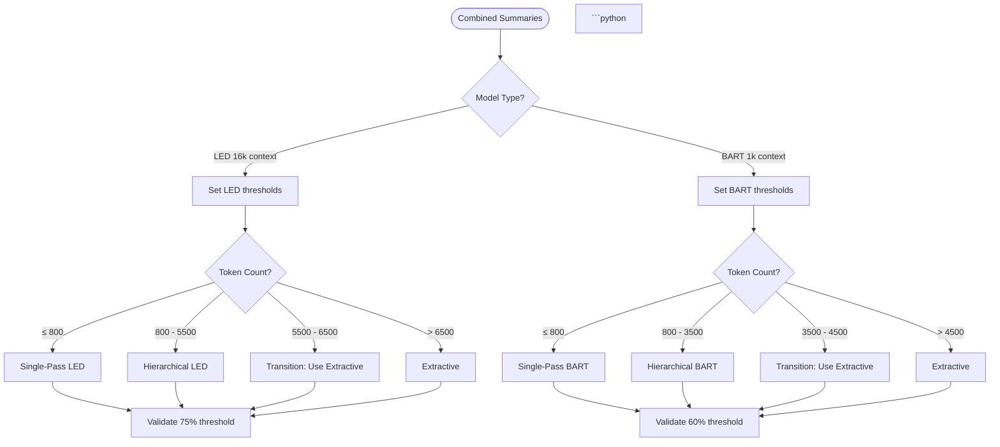

# ML Provider Fine-Tuning Guide

This guide provides comprehensive information about tuning local ML providers
(Whisper, spaCy, Transformers) for optimal performance, quality, and reliability
in the podcast scraper system.

For general provider configuration, see
[Provider Configuration Quick Reference](../guides/PROVIDER_CONFIGURATION_QUICK_REFERENCE.md).
For implementing new providers, see
[Provider Implementation Guide](../guides/PROVIDER_IMPLEMENTATION_GUIDE.md).

## Table of Contents

- [Overview](#overview)
- [Summarization Tuning](#summarization-tuning)
  - [Model Selection](#model-selection)
  - [Threshold Tuning](#threshold-tuning)
  - [Quality Validation](#quality-validation)
  - [Performance Optimization](#performance-optimization)
- [Transcription Tuning](#transcription-tuning)
- [Speaker Detection Tuning](#speaker-detection-tuning)
- [Analysis Tools](#analysis-tools)
- [Common Issues & Solutions](#common-issues--solutions)
- [Best Practices](#best-practices)

## Overview

The podcast scraper uses three local ML providers:

1. **Whisper** - Audio transcription (OpenAI's open-source model)
2. **spaCy** - Named entity recognition for speaker detection
3. **Transformers** - Abstractive summarization (BART, PEGASUS, LED models)

Each provider has configurable parameters that affect quality, speed, and resource usage.
This guide focuses primarily on **summarization tuning**, as it has the most complexity
and tuning options.

## Summarization Tuning

### Model Selection

The summarization system uses a hybrid MAP-REDUCE architecture with two model roles:

#### MAP Model (Chunk Summarization)

**Purpose**: Summarizes individual chunks of the transcript in parallel.

**Options**:

- `bart-large` (default) - Production quality, ~2GB GPU memory
  - Best quality
  - Slower
  - Model ID: `facebook/bart-large-cnn`
- `bart-small` - Test/dev alternative, ~500MB GPU memory
  - Faster
  - Lower quality
  - Model ID: `facebook/bart-base`

**Configuration**:

```yaml

# config.yaml

summary_model: bart-large  # or bart-small
```

# CLI

python3 -m podcast_scraper.cli --summary-model bart-large

```
## REDUCE Model (Final Combination)

**Purpose**: Combines chunk summaries into final coherent summary.

**Options**:

- `long` (production) - Long-context LED model, ~2.5GB
  - Best for final quality
  - Handles up to 16,384 tokens
  - Model ID: `allenai/led-large-16384`
- `long-fast` (test/default) - Smaller LED model, ~1GB
  - Faster
  - Still handles 16k tokens
  - Model ID: `allenai/led-base-16384`

**Configuration**:

```yaml

# config.yaml

summary_reduce_model: long  # or long-fast

```

# CLI

python3 -m podcast_scraper.cli --summary-reduce-model long
```

**Important**: Only model aliases are supported. Direct model IDs (e.g., `facebook/bart-large-cnn`) will be rejected.

## Threshold Tuning

The summarization system uses multiple thresholds to make decisions about how to
process transcripts. Understanding these thresholds is critical for optimal results.

### Understanding the Problem: Inconsistent Quality at Thresholds

**Symptoms**:

- Episodes with 3-4k tokens produce verbose summaries with warnings
- Episodes with >4k tokens produce cleaner, more concise summaries
- This is backwards - shorter content should produce better results

**Root Cause**:

1. **Hard threshold at 4,000 tokens** triggers different processing paths
2. **LED model characteristics** - preserves MORE detail by design (lower compression)
3. **Validation threshold too strict** - 60% triggers false warnings for normal LED behavior

**Example**:

```text
Episode 1 (3,500 tokens - under threshold):
✅ Uses hierarchical reduce (LED model)
❌ LED preserves 65.5% of input (low compression)
❌ Warning triggered (> 60% threshold)
❌ Result: Verbose, less useful summary

Episode 2 (4,500 tokens - over threshold):
❌ Uses extractive approach (selects chunks)
✅ Only uses representative chunks
✅ No warning
✅ Result: Cleaner, more concise summary
```

#### Threshold Constants

**Location**: `src/podcast_scraper/summarization/map_reduce.py`

##### Model-Specific Thresholds

```python

# LED models (long-context, 16k token window)

LED_MINI_MAP_REDUCE_MAX_TOKENS = 6000  # Ceiling for hierarchical reduce
LED_VALIDATION_THRESHOLD = 0.75        # 75% - more lenient validation

# BART/PEGASUS models (short-context, 1k token window)

BART_MINI_MAP_REDUCE_MAX_TOKENS = 4000  # Ceiling for hierarchical reduce
SUMMARY_VALIDATION_THRESHOLD = 0.6      # 60% - stricter validation
```

## Transition Zones (Smooth Boundaries)

Instead of hard cutoffs, the system uses transition zones to make gradual decisions:

```python

# LED transition zone (5.5k - 6.5k tokens)

LED_TRANSITION_START = 5500   # Start considering extractive
LED_TRANSITION_END = 6500     # Always use extractive above this

# BART transition zone (3.5k - 4.5k tokens)

BART_TRANSITION_START = 3500  # Start considering extractive
BART_TRANSITION_END = 4500    # Always use extractive above this
```

**Behavior**:

- **Below transition_start**: Always use hierarchical reduce (fully abstractive)
- **Within transition zone**: Use extractive to avoid poor compression
- **Above transition_end**: Always use extractive (too large for hierarchical)

## Decision Flow


### Model Detection

The system automatically detects model type based on context window size:

```python

# Location: src/podcast_scraper/summarization/map_reduce.py

LONG_CONTEXT_THRESHOLD = 4096  # Boundary between short/long context

if model_max >= LONG_CONTEXT_THRESHOLD:
    # LED model detected (16k context)
    mini_map_reduce_ceiling = LED_MINI_MAP_REDUCE_MAX_TOKENS  # 6000
    validation_threshold = LED_VALIDATION_THRESHOLD            # 0.75
    transition_start = LED_TRANSITION_START                    # 5500
    transition_end = LED_TRANSITION_END                        # 6500
else:
    # BART/PEGASUS model detected (1k context)
    mini_map_reduce_ceiling = BART_MINI_MAP_REDUCE_MAX_TOKENS  # 4000
    validation_threshold = SUMMARY_VALIDATION_THRESHOLD        # 0.60
    transition_start = BART_TRANSITION_START                   # 3500
    transition_end = BART_TRANSITION_END                       # 4500

```python

## When to Adjust Thresholds

**Symptoms requiring adjustment**:

1. **Too many false warnings** about summary length
   - Solution: Increase validation threshold (e.g., 0.75 → 0.80 for LED)
2. **Poor quality summaries** for medium-length episodes (3-6k tokens)
   - Solution: Adjust transition zone boundaries
3. **Inconsistent results** around threshold boundaries
   - Solution: Widen transition zone (e.g., LED_TRANSITION_START from 5500 → 5000)

**How to adjust**:

```python

# src/podcast_scraper/summarization/map_reduce.py

# Example: More lenient LED validation

LED_VALIDATION_THRESHOLD = 0.80  # Instead of 0.75

# Example: Earlier extractive fallback for LED

LED_TRANSITION_START = 5000  # Instead of 5500
LED_TRANSITION_END = 6000    # Instead of 6500

```
2. Run with current thresholds, measure compression ratio and warnings
3. Adjust threshold
4. Re-run, compare results
5. Validate no regressions on existing tests

## Quality Validation

The system performs multiple quality checks on generated summaries:

### Compression Ratio Validation

**Purpose**: Detect if model failed to compress input effectively.

**Thresholds**:

- LED models: 75% (allows 75% of input length)
- BART/PEGASUS: 60% (stricter, expects better compression)

**Example**:

```python

# Input: 3,000 characters
# Summary: 2,100 characters (70% of input)

# LED: ✅ Pass (70% < 75%)
# BART: ❌ Fail, warning (70% > 60%)

```

Final summary length (2100 chars) is suspiciously close to
input length (3000 chars). Model may have failed to summarize.

```

## Repetition Detection

**Purpose**: Detect repeated content (model hallucination).

**Location**: `src/podcast_scraper/summarization/map_reduce.py`

```python

REPETITIVE_SUMMARY_THRESHOLD = 0.8  # Flag if > 80% of selected summaries

```

Input: 5 chunk summaries (500 chars total)
Selected: 3 summaries for final reduce (400 chars)
Final summary: 420 chars

Ratio: 420 / 400 = 1.05 (105%)
Threshold: 80%
Result: ❌ Warning - repetitive content suspected

```
### Instruction Leak Detection

**Purpose**: Remove prompt text that leaked into output.

**Patterns detected**:

```python

# Examples of instruction leaks:

"Summarize the following:"
"Here is a summary:"
"The text discusses..."

```python

**Handling**: Automatically stripped from final summary.

## Empty Summary Handling

If validation fails completely:

```python

# Returns empty string instead of poor quality summary

return ""  # Better than hallucinated content

```
## Performance Optimization

### Device Selection

**Auto-detection order**:

1. **MPS** (Apple Silicon GPU)
2. **CUDA** (NVIDIA GPU)
3. **CPU** (fallback)

**GPU/MPS behavior**:

- Sequential chunk processing (avoids memory thrashing)
- Optimal for models like BART-large, LED

**CPU behavior**:

- Parallel processing with ThreadPoolExecutor
- Up to 4 workers
- 3-4x speedup compared to sequential

**Override device**:

```yaml

# config.yaml

summary_device: cpu  # Force CPU even if GPU available

```yaml

## Memory Management

**Model sizes**:

| Model       | Alias       | Size  | Context | Use Case   |
| ------------- | ------------- | ------- | --------- | ------------ |
| BART-large  | bart-large  | ~2GB  | 1k      | Production MAP |
| BART-base   | bart-small  | ~500MB| 1k      | Test MAP   |
| LED-large   | long        | ~2.5GB| 16k     | Production REDUCE |
| LED-base    | long-fast   | ~1GB  | 16k     | Test REDUCE |

**Tips**:

- Use `bart-small` + `long-fast` for development/testing
- Use `bart-large` + `long` for production
- GPU memory: Ensure 4GB+ for `bart-large` + `long`
- CPU: 8GB+ RAM recommended

### Parallelism Configuration

**Episode-level parallelism** (summarizing multiple episodes):

```yaml

summary_batch_size: 2  # Summarize 2 episodes in parallel

```

summary_chunk_parallelism: 1  # Usually 1 (sequential within episode)

```yaml

**Warning**: GPU/MPS devices ignore chunk parallelism (always sequential).

## Transcription Tuning

### Whisper Model Selection

**Available models** (smallest to largest):

| Model   | Size  | Speed | Quality | Use Case |
| --------- | ------- | ------- | --------- | ---------- |
| tiny    | ~75MB | Fast  | Basic   | Testing  |
| base    | ~150MB| Fast  | Good    | Development |
| small   | ~500MB| Medium| Better  | Production (fast) |
| medium  | ~1.5GB| Slow  | Great   | Production (quality) |
| large   | ~3GB  | Very Slow | Best | Production (best) |

**English-specific models** (faster, better for English):

- `tiny.en`, `base.en`, `small.en`, `medium.en`
- No `large.en` (large model is multilingual only)

**Configuration**:

```yaml

# config.yaml

whisper_model: base.en  # Default in v2.4+

```

# CLI

python3 -m podcast_scraper.cli --whisper-model small.en

```
- Production (fast): `small.en`
- Production (quality): `medium.en` or `large`

## Transcription Parameters

### Language

```yaml

language: en  # ISO 639-1 code

```
#### Task

```yaml

# Not configurable - always "transcribe"
# (Alternative: "translate" converts audio to English)

```yaml

## Speaker Detection Tuning

### spaCy Model Selection

**Available models**:

| Model       | Size  | Accuracy | Speed | Use Case |
| ------------- | ------- | ---------- | ------- | ---------- |
| en_core_web_sm | ~15MB | Basic | Fast | Testing |
| en_core_web_md | ~45MB | Good  | Medium | Development |
| en_core_web_lg | ~800MB| Best  | Slow  | Production |

**Configuration**:

```yaml

# config.yaml (not directly configurable - uses installed model)
# Install desired model:
# python -m spacy download en_core_web_lg

```
2. Falls back to `en_core_web_md`
3. Falls back to `en_core_web_sm`
4. Raises error if none available

## Detection Parameters

### Auto-speakers

Enable/disable automatic speaker detection:

```yaml

auto_speakers: true  # Default

```

# CLI

python3 -m podcast_scraper.cli --no-auto-speakers  # Disable

```

## Speaker Names

Provide expected speaker names (improves accuracy):

```yaml

speaker_names:

  - John Doe
  - Jane Smith

```

# CLI

python3 -m podcast_scraper.cli --speaker-name "John Doe" --speaker-name "Jane Smith"

```
## Cache Detected Hosts

Cache detected host/guest names across episodes:

```yaml

cache_detected_hosts: false  # Default: false (each episode independent)

```python
When `true`, detected speakers from earlier episodes are reused for subsequent episodes in same feed.

## Analysis Tools

### Summarization Quality Evaluation

**Tool**: `scripts/eval_summaries.py`

**Purpose**: Evaluate summarization quality using ROUGE metrics and reference-free checks.

**Usage**:

```bash

# Basic evaluation (uses defaults)

python3 scripts/eval_summaries.py

# Specify models

python3 scripts/eval_summaries.py --map-model bart-large --reduce-model long

# Custom output

python3 scripts/eval_summaries.py --output data/results/my_eval.json

# Use config file

python3 scripts/eval_summaries.py --config examples/config.my.ml.yaml

```python

**Metrics computed**:

1. **ROUGE scores** (if reference summaries exist):
   - ROUGE-1 (unigram overlap)
   - ROUGE-2 (bigram overlap)
   - ROUGE-L (longest common subsequence)
2. **Compression ratio**: Input length / summary length
3. **Repetition detection**: Repeated n-grams
4. **Keyword coverage**: How many key terms from transcript appear in summary

**Expected file structure**:

```text

data/eval/
├── transcript.cleaned.txt       # Input for summarization
├── summary.gold.long.txt        # Reference summary (detailed)
└── summary.gold.short.txt       # Reference summary (concise, optional)

```json

{
  "map_model": "bart-large",
  "reduce_model": "long-fast",
  "compression_ratio": 12.5,
  "rouge1_fmeasure": 0.45,
  "rouge2_fmeasure": 0.22,
  "rougeL_fmeasure": 0.38,
  "repetition_score": 2,
  "keyword_coverage": 0.75
}

```

## Transcript Cleaning Evaluation

**Tool**: `scripts/eval_cleaning.py`

**Purpose**: Evaluate transcript preprocessing quality.

**Usage**:

```bash

python3 scripts/eval_cleaning.py

```

- Speaker tag normalization
- Sponsor block detection
- Blank line collapsing

### Pipeline Metrics Collection

**Tool**: `scripts/collect_pipeline_metrics.py`

**Purpose**: Collect end-to-end pipeline performance metrics.

**Usage**:

```bash

python3 scripts/collect_pipeline_metrics.py --output reports/metrics.json

```

- Summarization time per episode
- Speaker detection success rate
- Error rates by stage

## Common Issues & Solutions

### Issue: Verbose Summaries with Warnings

**Symptoms**:

```text

WARNING: Final summary length (2100 chars) is suspiciously close to
input length (3000 chars). Model may have failed to summarize.

```

1. **Increase validation threshold** for LED:

   ```python
   # src/podcast_scraper/summarization/map_reduce.py
   LED_VALIDATION_THRESHOLD = 0.80  # From 0.75
   ```

2. **Use extractive approach earlier**:

   ```python
   LED_TRANSITION_START = 5000  # From 5500
   ```

3. **Switch to BART** for final reduce (higher compression):

   ```yaml
   # config.yaml
   summary_reduce_model: bart-large  # Instead of long/long-fast
   ```

### Issue: Inconsistent Quality Around 4k Tokens

**Symptoms**:

- Episodes with 3.5k tokens get verbose summaries
- Episodes with 4.5k tokens get cleaner summaries

**Cause**: Hard threshold at 4,000 tokens.

**Solution**: Already fixed in v2.4 with transition zones. Ensure you're using latest code.

### Issue: Out of Memory Errors

**Symptoms**:

```text

RuntimeError: CUDA out of memory
RuntimeError: MPS backend out of memory

```

   ```yaml
   summary_model: bart-small
   summary_reduce_model: long-fast
   ```

2. **Force CPU processing**:

   ```yaml
   summary_device: cpu
   ```

3. **Process fewer episodes in parallel**:

   ```yaml
   summary_batch_size: 1
   processing_parallelism: 1
   ```

### Issue: Slow Performance

**Symptoms**: Summarization taking >5 minutes per episode.

**Solutions**:

1. **Enable GPU** (if available):

   ```bash
   # Check if MPS/CUDA detected
   python3 -c "from podcast_scraper import summarizer; print(summarizer._detect_device())"
   ```

2. **Use faster models**:

   ```yaml
   summary_model: bart-small
   summary_reduce_model: long-fast
   ```

3. **Enable parallel processing** (CPU only):

   ```yaml
   summary_chunk_parallelism: 4  # Only effective on CPU
   ```

4. **Reduce chunk overlap**:

   ```python
   # src/podcast_scraper/summarizer.py
   CHUNK_OVERLAP_RATIO = 0.05  # From 0.1 (10% → 5%)
   ```

### Issue: Poor Summary Quality

**Symptoms**: Summaries missing key points or hallucinating.

**Solutions**:

1. **Use production models**:

   ```yaml
   summary_model: bart-large
   summary_reduce_model: long
   ```

2. **Save cleaned transcripts** for inspection:

   ```yaml
   save_cleaned_transcript: true
   ```

   Check if transcript cleaning is too aggressive.

3. **Adjust chunking**:

   ```python
   # src/podcast_scraper/summarizer.py
   DEFAULT_WORD_CHUNK_SIZE = 1000  # From 900
   DEFAULT_WORD_OVERLAP = 200      # From 150
   ```

4. **Use evaluation script**:

   ```bash
   python3 scripts/eval_summaries.py --map-model bart-large --reduce-model long
   ```

## Best Practices

### Development Workflow

1. **Start with small models** for rapid iteration:

   ```yaml
   whisper_model: base.en
   summary_model: bart-small
   summary_reduce_model: long-fast
   ```

2. **Enable cleaned transcript saving**:

   ```yaml
   save_cleaned_transcript: true
   ```

3. **Use test fixtures** for reproducibility:

   ```bash
   # Use p07, p08, p09 fixtures (threshold boundary testing)
   pytest tests/e2e/test_led_summarization_threshold_analysis_e2e.py
   ```

4. **Run evaluation scripts** to measure improvements:

   ```bash
   python3 scripts/eval_summaries.py --output results_before.json
   # Make changes
   python3 scripts/eval_summaries.py --output results_after.json
   ```

### Production Configuration

1. **Use production models**:

   ```yaml
   whisper_model: medium.en  # or small.en for speed
   summary_model: bart-large
   summary_reduce_model: long
   ```

2. **Optimize for throughput**:

   ```yaml
   summary_batch_size: 2
   processing_parallelism: 2
   ```

3. **Enable caching**:

   ```yaml
   skip_existing: true
   reuse_media: true
   ```

4. **Monitor quality**:

   ```bash
   # Regular evaluation
   python3 scripts/collect_pipeline_metrics.py --output reports/$(date +%Y%m%d).json
   ```

### Threshold Adjustment Workflow

1. **Identify problem** (verbose summaries, warnings, inconsistent quality)

2. **Create reproducible test case**:

   ```python
   # tests/e2e/test_custom_threshold.py
   def test_episode_at_4k_boundary():

```text
       # Use p07 or p08 fixture
       pass
```

3. **Run test**: `pytest tests/e2e/test_custom_threshold.py -v`

4. **Adjust threshold** in `src/podcast_scraper/summarization/map_reduce.py`

5. **Re-run test**, compare results

6. **Run full regression suite**: `make test-integration && make test-e2e`

7. **Document change** in commit message and code comments

## Related Documentation

- [Summarization Guide](../guides/SUMMARIZATION_GUIDE.md) - High-level summarization architecture
- [Provider Configuration Quick Reference](../guides/PROVIDER_CONFIGURATION_QUICK_REFERENCE.md) - Configuration options
- [Provider Implementation Guide](../guides/PROVIDER_IMPLEMENTATION_GUIDE.md) - Implementing new providers
- [Testing Guide](../guides/TESTING_GUIDE.md) - Testing strategy and execution
- [GitHub Issue #283](https://github.com/chipi/podcast_scraper/issues/283) - Threshold tuning implementation

## See Also

- [PRD-005](../prd/PRD-005-episode-summarization.md) - Summarization product requirements
- [RFC-012](../rfc/RFC-012-episode-summarization.md) - Summarization design decisions
- `docs/wip/ISSUE_283_ANALYSIS_AND_PLAN.md` - Detailed threshold tuning analysis
