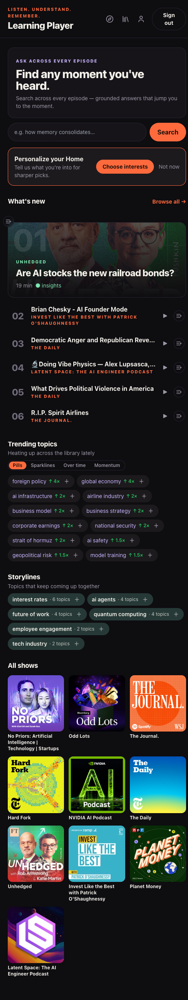
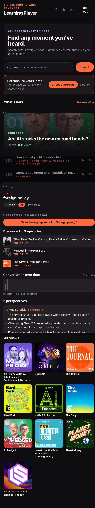
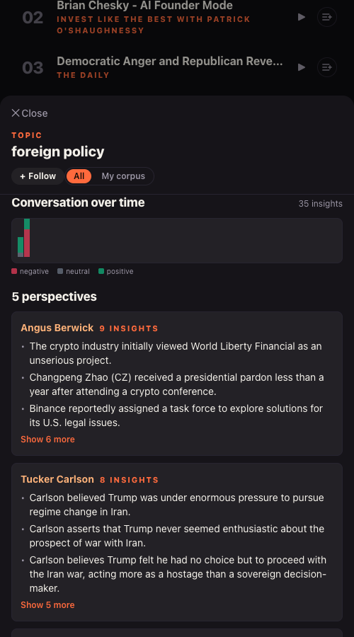
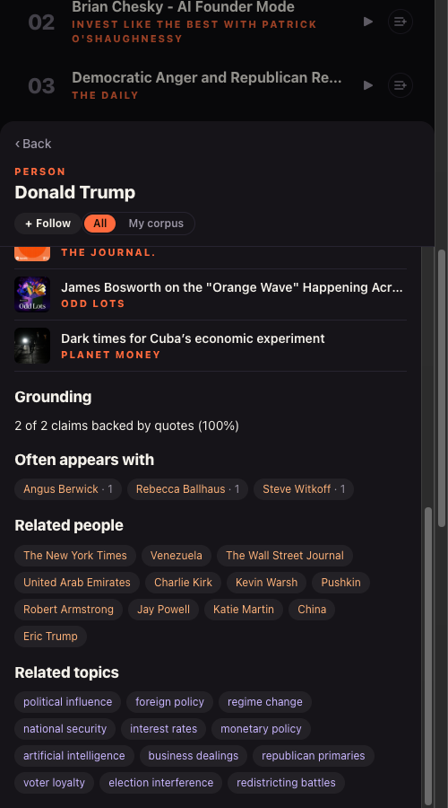
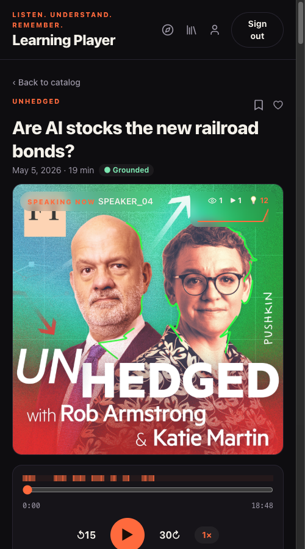
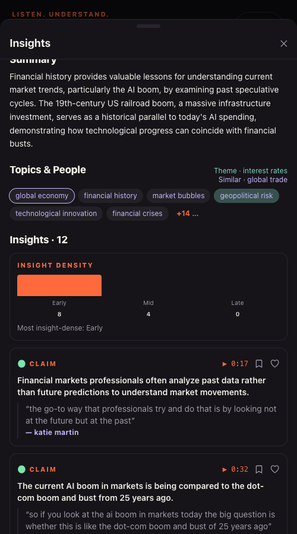
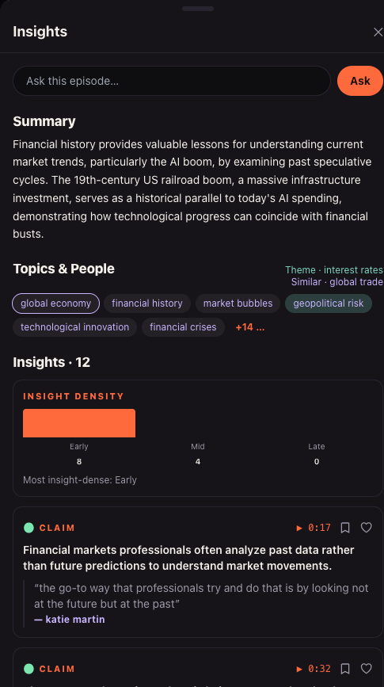
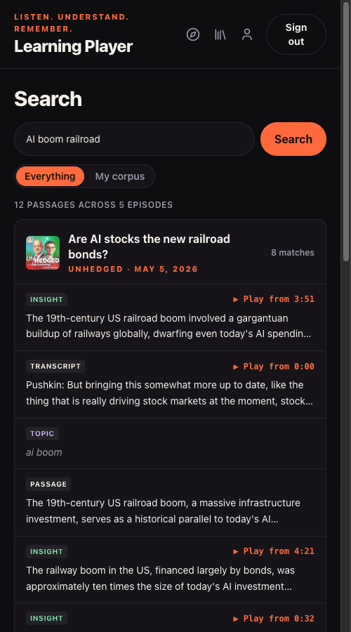

# Consumer Player — Golden Walkthrough v2 (entity map + every enrichment surface)

**What this is.** An internal, fully-detailed walk of the **consumer Learning Player** (`web/learning-player`):
how every entity connects (show → episode → topic → person and back), and **every place the player
surfaces something from the enrichment layer** (RFC-088 / ADR-108) — with an explanation of *how each
signal is computed* and screenshots of the real surface. Not an end-user guide — it's our reference for
(a) checking the graph makes sense, (b) knowing where each enricher shows up, and (c) driving manual +
automated testing.

**v1** was `PROD-V2-GOLDEN-WALKTHROUGH.md` (operator + consumer, prod-v2). **This v2** is player-only and
exhaustive. Captured **2026-07-09** against the **prod-v2** corpus (10 shows / 209 episodes, re-enriched),
signed in as the mock user "Ada Admin".

## How to reproduce this locally

```bash
# 1) backend (mock OAuth, prod-v2 corpus, trending + personalization on)
PYTHONPATH="$PWD/src" KMP_DUPLICATE_LIB_OK=TRUE \
  APP_OAUTH_PROVIDER=mock APP_SESSION_SECRET=dev-secret APP_ADMIN_EMAILS=dev@localhost \
  APP_SEED_USERS_FILE=config/dev-seed-users.json APP_SIGNUP_MODE=open \
  APP_PERSONALIZED_RANKING=true APP_TRENDING_NOW=2026-05-10T00:00:00Z \
  APP_DATA_DIR=/tmp/walkthrough-appdata \
  .venv/bin/python -m podcast_scraper.cli serve \
    --output-dir .test_outputs/manual/prod-v2/corpus --port 8000 --host 127.0.0.1

# 2) player dev server (proxies /api → :8000); opens on :5174 (or next free port)
cd web/learning-player && npm run dev
```

Then open the player, click **Ask across every episode** / a suggested episode, and walk §2 below.
(`make serve-app-dev SERVE_OUTPUT_DIR=.test_outputs/manual/prod-v2/corpus` does both in one command.)

---

## §1 — The entity model + how everything cross-links

The whole app is one graph. Five node kinds, each reachable from the others:

```text
              ┌─────────── Show (podcast/feed) ───────────┐
              │                                            │
          Episode ──┬── Insight (grounded claim + quote)   │  (episodes belong to a show)
              │     │        │                             │
              │     │     Person (speaker / mentioned) ◄───┼── "Related people", "Often appears with"
              │     │        │                             │
              │     └── Topic (KG concept) ◄───────────────┴── "Related topics", "Similar", "Alongside"
              │              │
              │           Theme cluster / Storyline (topics that co-occur)
              │
         Highlight (your saved moment/quote) · Queue · Resurfacing (per-user, signed in)
```

**Every cross-link you can actually click:**

| From | To | Surface / control |
|---|---|---|
| Home / Catalog | Episode | suggested cards ("What's new", "Recommended", "Your shows"), Browse |
| Home / Catalog | Show | show title on any card → `PodcastView` (that show's episodes) |
| Episode | Topic / Person | Knowledge Panel "Topics & People" chips → entity card |
| Episode | Insight | Knowledge Panel "Insights" list (claim + supporting quote + speaker + ▶ timestamp) |
| Topic card | Person | "Related people" chips |
| Topic card | Topic | "Similar topics", "Discussed alongside", theme siblings |
| Topic card | Episode | "Discussed in N episodes" links |
| Person card | Person | "Often appears with", "Related people" chips |
| Person card | Topic | "Related topics" chips |
| Person card | Episode | "In N episodes" links |
| Any entity card | Search | "Search every episode for '…'" → grounded search scoped to that entity |
| Entity card | Entity card | a **Back stack** (‹ Back) records the traversal so you can walk the graph and return |

The entity card itself is one shared component (`EntityCardBody.vue`, wrapped by `EntityCard.vue` as a
modal). It renders **person** or **topic**, carries the back stack, and hosts the enrichment rows
(`EntitySignals.vue`) + the read-time surfaces (perspectives, conversation arc). A scope tab (**All** /
**My corpus**) re-scopes the whole card to what *you've* heard.

---

## §2 — The interaction journey (walked, with screenshots)

### 2.1 — Home / discovery (the entry point)



The adaptive hub. Enrichment shows up in three of its rails:

- **Trending topics** — "foreign policy · trending at 4× its recent average", "global economy · 4×",
  "ai infrastructure · 2×" … This is **`temporal_velocity`**. Four view modes (Pills / Sparklines /
  Over time / Momentum) are alternate renders of the same velocity signal. Each pill has a **+** to add
  the topic to your interests (which re-ranks discovery).
- **Storylines** — "interest rates (6 topics)", "ai agents (4)", "quantum computing (4)" … This is
  **`topic_theme_clusters`**: topics the corpus keeps discussing *together*. Follow a whole storyline.
- **All shows** — the 10 shows; each opens `PodcastView`.

Plus **What's new** (discovery feed, interest-ranked when signed in) and **Recommended** (peers of your
last play). These are ranking surfaces, not enrichers.

### 2.2 — Open a topic → the topic entity card

Tapping a trending pill (or any topic chip anywhere) opens the **topic card**. This is the densest
enrichment surface in the app:



- **Momentum** — "Rising · 4× vs its 6-month average" → **`temporal_velocity`** (only rendered when
  velocity ≥ 1.5, so it's always genuine "heating up", never noise).
- **Similar topics** — us policy, economic policy, geopolitical strategy, us-china policy … →
  **`topic_similarity`** (embedding-nearest topics; each chip pivots to that topic's card).
- **Discussed alongside** — a chip row of co-occurring topics with a lift score → **`topic_cooccurrence_corpus`**
  (only pairs with lift > 1 and ≥ 2 shared episodes; "foreign policy" happens to have none above
  threshold, so the row is hidden — best-effort hide is the house pattern).
- **Related people** / **Discussed in N episodes** — KG cross-links (people who speak to this topic;
  the episodes it appears in).

Scroll the card and two **read-time** surfaces appear (built from the CIL query layer, not a stored
enricher artifact):



- **Conversation over time** — weekly bars, each stacked **positive / neutral / negative**; bar height =
  insight volume that week. The tint is **`insight_sentiment`** (VADER), joined server-side per insight
  by `cil_queries._attach_sentiment` — the player never reads the sentiment artifact directly.
- **Perspectives** — the same topic seen per speaker: each person's take (preview of their insights,
  expandable). This is the read-time `perspectives` CIL query (the honest, no-LLM replacement for the
  retired disagreement detector).

### 2.3 — Follow a person → the person entity card

From the topic card's "Related people", tap a person (e.g. Donald Trump) → the **person card** (note the
‹ Back — the graph traversal is remembered):



- **Grounding** — "2 of 2 claims backed by quotes (100%)" → **`grounding_rate`** (per person, the
  fraction of their insights that have a supporting quote; a credibility signal).
- **Often appears with** — Angus Berwick · 1, Rebecca Ballhaus · 1, Steve Witkoff · 1 →
  **`guest_coappearance`** (people who share episodes, ranked by shared-episode count; each chip pivots
  to that person's card).
- **Related people / Related topics / In N episodes** — KG cross-links back into the graph.

### 2.4 — Open an episode → the player

From a show, a suggested card, or an entity card's episode list, you land on the **player**:



The hero shows the audio (origin bridge), the synced transcript (tap any line to play / save a
highlight), the grounded summary, a **● Grounded** badge, and — on the seek bar — **"Insight density —
12 insights marked at their moments"**: the episode's insights plotted at their timestamps
(**`insight_density`** rendered as timeline markers).

### 2.5 — The insight-density strip + Knowledge Panel

Opening **Insights** surfaces the Knowledge Panel. At the head sits the dedicated density strip:



- **Insight density** — "Early 8 · Mid 4 · Late 0 · Most insight-dense: Early" →
  **`insight_density`**: each grounded insight is binned into the early/mid/late third of the episode by
  its earliest supporting quote's timestamp. Tap a third to seek there. (This episode front-loads its
  substance — 8 of 12 insights in the first third.)

The rest of the Knowledge Panel is the episode's intelligence:



- **Ask** — grounded extractive search *within this episode* (no LLM; returns passages + ▶ timestamps).
- **Summary** — the GIL episode summary.
- **Topics & People** — the KG entities, tagged with two enrichment markers: **"Theme · interest rates"**
  (the dominant **`topic_theme_clusters`** cluster for this episode) and **"Similar · global trade"**.
  Every chip opens its entity card (§2.2 / §2.3).
- **Insights · 12** — the grounded claims: each a CLAIM + ▶ timestamp + the claim text + the verbatim
  supporting quote + the speaker. Save any to Highlights / Favorites.

### 2.6 — Library (signed-in: Saved / Highlights / Revisit / Queue / Recent)


Per-user hub. The **Revisit** tab is the Resurfacing inbox — your past highlights re-surfaced on a spaced
schedule with a reflection prompt + jump-to-moment (server-driven scheduling, pausable). Saved /
Highlights / Queue / Recent are your captures + playback state.

### 2.7 — Search (grounded, entity-resolving, recall-scoped)



Corpus-wide grounded search — "12 passages across 5 episodes", each hit tagged INSIGHT / TRANSCRIPT /
TOPIC / PASSAGE with a ▶ timestamp. It **resolves entities** ("TOPIC · ai boom" → the topic card) and
has the **Everything / My corpus** toggle — "My corpus" (Recall) scopes results to what *you've* heard
or captured (honest-empty for a fresh user).

---

## §3 — Every enrichment surface, in one table

| Enricher | Kind | What it computes | Where it surfaces in the player | Render | Threshold / note |
|---|---|---|---|---|---|
| **insight_density** | det | per episode, insights binned early/mid/late by earliest-quote timing | player seek-bar markers; Knowledge-Panel **density strip** (`episode-density`) | timeline markers + 3-bar strip | hides at 0 insights |
| **temporal_velocity** | det | per topic, mention counts over time + last-month/6-mo velocity | topic card **Momentum**; Home **Trending topics** (4 views) | "Rising · N×" badge; chips/sparklines/stream/scatter | Momentum only if velocity ≥ 1.5; Home chips also need total ≥ 3 |
| **topic_similarity** | ML | per topic, top-k embedding-nearest topics | topic card **Similar topics** | chips (max 8) | — |
| **topic_cooccurrence_corpus** | det | topic pairs co-occurring across episodes + lift/pmi | topic card **Discussed alongside** | chips w/ lift (max 8) | lift > 1 **and** ≥ 2 shared episodes |
| **topic_theme_clusters** | det | clusters of topics that co-occur ("themes") | Home **Storylines**; Knowledge-Panel **"Theme ·"** marker; entity-card theme siblings | rail + pill marker | — |
| **grounding_rate** | det | per person, share of their insights backed by a quote | person card **Grounding** | "X of Y (Z%)" line | hides if 0 insights |
| **guest_coappearance** | det | person pairs sharing episodes, ranked by count | person card **Often appears with** | chips (max 8) | sorted by shared-episode count |
| **insight_sentiment** | det (VADER) | per insight, compound + pos/neg/neutral label | **server-joined** into the topic **Conversation arc** bar tint (+ position/conversation timelines) | bar stack tint | **not** read directly by the frontend — via `cil_queries._attach_sentiment` |
| **topic_consensus** | ML | cross-person corroboration pairs per topic (embedding cosine + low NLI contradiction) | **operator viewer only** today; on the consumer the related read-time surface is **Perspectives** | — | corpus artifact present; consumer renders per-speaker perspectives instead of a consensus row |

**Read-time (CIL) surfaces** (not stored enricher artifacts, but enrichment-adjacent): topic
**Perspectives** (per-speaker insights), topic **Conversation arc** (weekly volume, sentiment-tinted),
person position arc. These are computed on request from GIL/KG + `insight_sentiment`.

**Retired / not surfaced:** `nli_contradiction` (0% precision → replaced by `topic_consensus`; the
consumer "disagreements" row was removed 2026-07-09), `stance_timeline` / `stance_disagreement`
(retired). No player surface reads them.

---

## §4 — How each enricher actually works (the mechanism)

- **insight_density** (deterministic) — walks each grounded Insight → its earliest supporting Quote's
  `start_ms`, divides by the episode duration into early/mid/late thirds, counts each bin. No timing →
  even split by insight order. The signal is "where in the episode the substance is".
- **temporal_velocity** (deterministic) — buckets every topic mention by publish date into a
  weekly/monthly series, computes `velocity = last-full-month count / 6-month average` (with an EWMA and
  a "now" anchor so a partial current month doesn't collapse it). "Rising 4×" = four times its own recent
  baseline.
- **topic_similarity** (ML, embeddings) — embeds each topic (label + context), keeps the top-k nearest by
  cosine. In the committed fixture this is a deterministic hash-embedder; on a real corpus it's the
  sentence-transformer. It's "topics that mean similar things", distinct from co-occurrence.
- **topic_cooccurrence_corpus** (deterministic) — counts topic pairs appearing in the same episodes,
  scores each with **lift** (observed/expected co-occurrence) and **PMI**. "Discussed alongside" is
  lift-ranked, so it favours *surprising* pairings over merely-frequent ones.
- **topic_theme_clusters** (deterministic) — average-linkage clustering over the co-occurrence-lift graph;
  a cluster of ≥ 2 topics becomes a **theme / storyline** with a canonical label. This is what powers
  Home "Storylines" and the "Theme ·" marker.
- **grounding_rate** (deterministic) — per person, `grounded_insights / total_insights`, where "grounded"
  = the insight has a `SUPPORTED_BY` quote. Diarization placeholders (`SPEAKER_NN`) are filtered so the
  rate is meaningful. It's a per-speaker credibility signal.
- **guest_coappearance** (deterministic) — the set of person pairs that share ≥ 1 episode, ranked by the
  count of shared episodes (placeholders filtered). "Often appears with" = who shows up alongside this
  person.
- **insight_sentiment** (deterministic, VADER) — per insight, the VADER compound score + a
  positive/negative/neutral label (±0.05 band). It's a **colour layer**: the frontend never reads the
  artifact; `cil_queries` joins it onto the conversation/position timelines so the bars/segments tint.
- **topic_consensus** (ML) — the ADR-108 reimagining of the retired contradiction detector: two people
  **corroborate** on a topic when their insights have high embedding cosine **and** low NLI contradiction
  (precision 0.91 on prod-v2). Surfaced in the operator viewer; on the consumer the analogous read-time
  surface is **Perspectives**.

---

## §5 — "Does it make sense?" — a qualitative read on prod-v2

- **The graph is genuinely connected.** From "foreign policy" (topic) → "Donald Trump" (person) →
  "interest rates" (topic) → its storyline → episodes → other people, every hop is one click and the
  content is coherent (a politics/markets cluster hangs together; an AI cluster hangs together).
- **Momentum reads true.** "foreign policy 4×", "global economy 4×" match a corpus heavy on 2026
  geopolitics/markets; the ≥ 1.5 gate keeps steady/cooling topics off the surface (no "Cooling · 0×"
  noise).
- **Similar vs Alongside are meaningfully different.** "foreign policy" → *similar* = us-policy /
  geopolitical-strategy (same meaning); *alongside* (when present) = co-discussed but distinct topics.
  Good that they're separate rows.
- **Grounding is a real trust signal.** "Donald Trump 100% (2/2)" vs speakers with lower rates gives a
  fast read on who's quote-backed.
- **Density front-loading is visible + useful.** 8/4/0 on the railroad-bonds episode instantly says
  "the substance is in the first third" — a genuine navigation aid.
- **Sentiment tint is subtle but honest.** The conversation arc's pos/neu/neg stacks are believable on
  factual finance/politics content (mostly neutral with pockets) — the right call to keep it a *colour*,
  not a headline claim.
- **The one thing not on the consumer:** `topic_consensus` is operator-only; the consumer leans on
  **Perspectives** for "who says what on this topic". Worth deciding whether a consumer "where they
  agree" row is wanted, or whether Perspectives is the intended consumer answer.

---

## §6 — Testing reference (which tests drive each surface)

| Surface | Component | Test (vitest / e2e) |
|---|---|---|
| Insight-density strip | `EpisodeDensity.vue` | `EpisodeDensity.test.ts`; e2e `consolidation.spec.ts` (`episode-density`) |
| EntitySignals (grounding / co-appears / momentum / similar / alongside) | `EntitySignals.vue` | `EntitySignals.test.ts`; e2e `entity-signals.spec.ts` |
| Perspectives | `TopicPerspectives.vue` | e2e `perspectives.spec.ts` |
| Conversation arc | `TopicConversationArc.vue` | component test + arc render |
| Trending topics | `TrendingTopics.vue` (+ Chips/Sparks/Stream/Momentum) | e2e `trending.spec.ts` |
| Storylines | `Storylines.vue` | `Storylines.test.ts` |
| Knowledge Panel (topics/people/insights/ask) | `KnowledgePanel.vue` | e2e `full-listen.spec.ts`, `transcript.spec.ts` |
| Recall / My-corpus search | `SearchView.vue` | e2e `consolidation.spec.ts` (recall scope) |
| Resurfacing / Revisit | `ResurfacingInbox.vue` | `ResurfacingInbox.test.ts`; e2e `consolidation.spec.ts` |
| Queue | `QueueButton.vue` / `QueueView.vue` | e2e `queue-reorder.spec.ts`, `auth-queue.spec.ts` |

Server contracts (the enrichment envelopes these bind): `tests/integration/server/test_app_routes_consumer.py`
+ the corpus/episode enrichment routes. The committed fixture behind the e2e is
`tests/fixtures/app-validation-corpus/v3`, guarded by `tests/integration/test_app_validation_corpus_invariants.py`.

---

## Appendix — enricher → surface quick index

- `insight_density` → density strip + seek markers (§2.4/2.5)
- `temporal_velocity` → topic Momentum + Home Trending (§2.1/2.2)
- `topic_similarity` → topic "Similar topics" (§2.2)
- `topic_cooccurrence_corpus` → topic "Discussed alongside" (§2.2)
- `topic_theme_clusters` → Home Storylines + Knowledge-Panel "Theme" (§2.1/2.5)
- `grounding_rate` → person "Grounding" (§2.3)
- `guest_coappearance` → person "Often appears with" (§2.3)
- `insight_sentiment` → conversation-arc tint (§2.2)
- `topic_consensus` → operator viewer (consumer: Perspectives) (§2.2)
