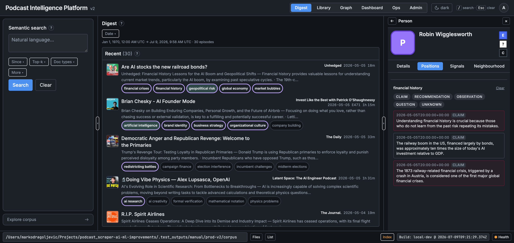
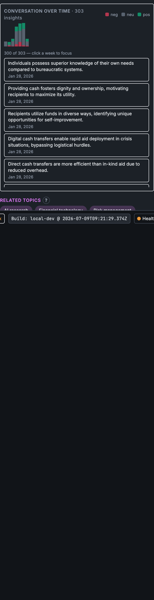
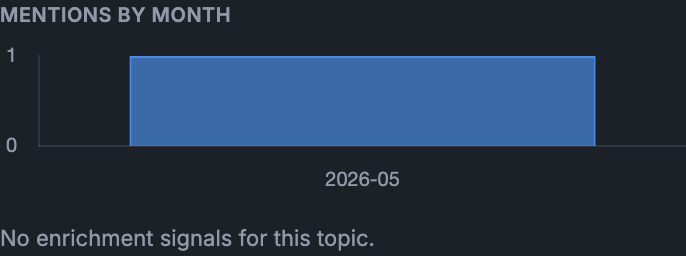
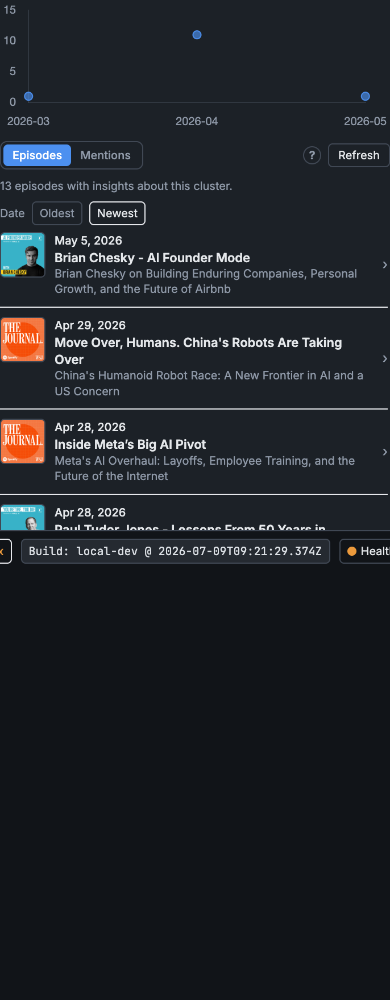
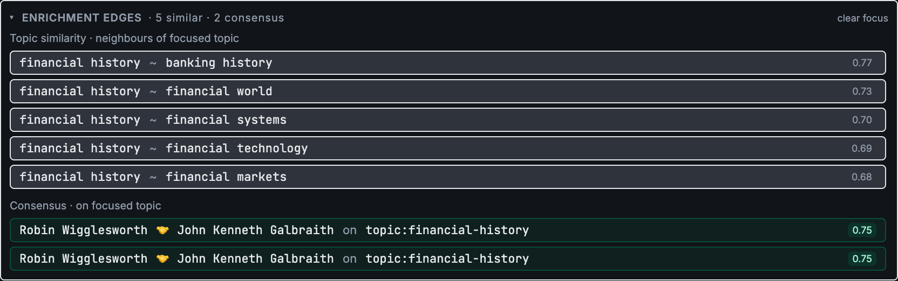
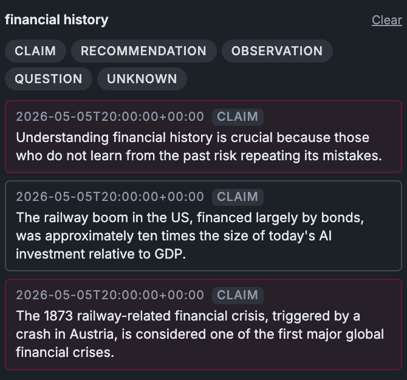
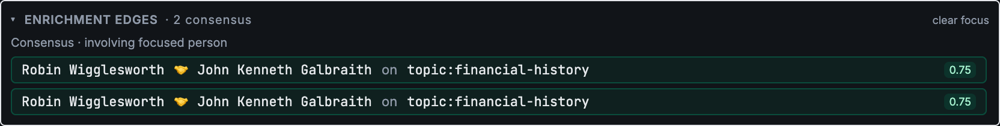
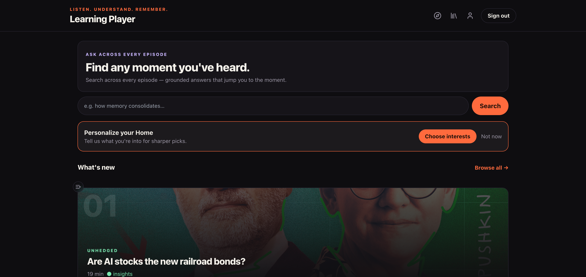
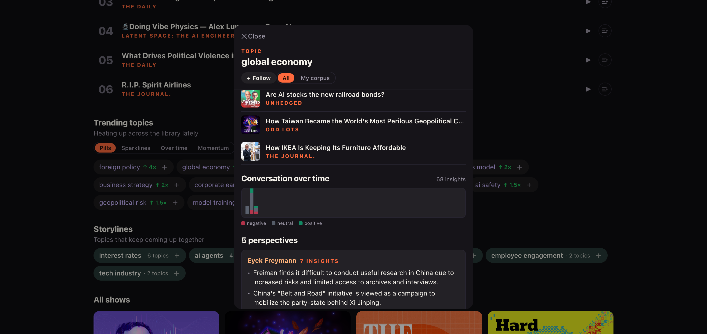

# prod-v2 Golden Walkthrough — enricher surface-area + test reference (v1)

A visual, end-to-end walk of the product on the **real prod-v2 corpus**, structured so it doubles as:

- a **user guide** — what each enricher produces and where it shows up, on real content;
- a **golden test reference** — the concrete flows (across data objects, across episodes, across
  shows) that our e2e / tier-3 tests should exercise, with a coverage map + gaps.

> **v1 scope.** Screenshots live in `docs/wip/assets/prod-v2-walkthrough/` (regenerable by re-running
> the walk against the served corpus). Surfaces not yet captured are noted as *v2 to-capture*.
> Corpus: `.test_outputs/manual/prod-v2/corpus`, re-enriched 2026-07-09 with `topic_consensus` +
> `insight_sentiment` (`make enrich … PROFILE=local WITH_ML=1`).

---

## 1. The corpus at a glance

| | prod-v2 |
|---|---|
| Shows (feeds) | **10** (Unhedged, Odd Lots, The Daily, Planet Money, The Journal, Hard Fork, Invest Like the Best, No Priors, Latent Space, NVIDIA AI) |
| Episodes (latest-run) | **99** (209 raw bridges across multiple runs → 99 after latest-run-per-feed dedup) |
| Insights labelled (sentiment) | **1 187** — 593 positive / 332 neutral / 262 negative |
| Consensus emissions | **22** cross-person pairs on 8 topics |
| Biggest cross-show topic | `topic:artificial-intelligence` — **7 shows**, 303 insights, 13 episodes in the cluster |

**Enrichers present** (corpus-level): `temporal_velocity`, `topic_similarity`, `topic_consensus`,
`topic_cooccurrence_corpus`, `topic_theme_clusters`, `grounding_rate`, `guest_coappearance`
(+ a stale `nli_contradiction.json` leftover from the pre-ADR-108 run — retired, safe to delete).
**Episode-level**: `insight_density`, `insight_sentiment`, `topic_cooccurrence` (99 each).

---

## 2. Enricher surface-area catalogue

Each enricher, what it computes, and where it surfaces (operator viewer + consumer app), on prod-v2.

| Enricher | Surfaces on | prod-v2 evidence | Shot |
|---|---|---|---|
| **insight_sentiment** | Conversation arc (both apps), position-arc tint | AI: 303 insights → 7 weekly buckets, neg/neu/pos mix | 01, 03 |
| **topic_consensus** | Enrichment edges (topic **and** person) | 22 pairs; financial-history: Wigglesworth ↔ Galbraith | 02, 04 |
| **position-arc + sentiment** | Person → Positions (Position Tracker) | Wigglesworth × financial-history: 3 tinted insights | 05 |
| **temporal_velocity** | Topic → Signals (VELOCITY) | AI: 0.46× last / 6-mo avg · 13 mentions | 11 |
| **mentions-by-month** | Topic → Signals | AI monthly histogram | 11 |
| **topic_similarity** | Enrichment edges "similar"; consumer "Similar topics" | financial-history ~ banking-history 0.77, financial-markets 0.68 | 04, 14 |
| **topic_theme_clusters** | Topic Details "THEME"; consumer "N topics in this cluster" | AI Details → THEME; global-economy → "4 topics in cluster" | 14 |
| **perspectives** (read-time) | Topic → Perspectives; consumer card | global-economy: 5 perspectives | 14 |
| **momentum** (temporal_velocity read) | Consumer home Trending rail; topic card Momentum | foreign policy 4×, global economy 4×, ai-infra 2× | 13, 14 |
| **topic timeline** (read-time, cross-episode) | Topic → Timeline | AI: 13 episodes across ≥5 shows | 12 |
| Related people (KG co-occurrence) | Consumer topic card | global-economy → Related people | 14 |
| **insight_density** | Episode detail / insights strip | 99 sidecars | *v2 to-capture* |
| **grounding_rate**, **guest_coappearance**, **topic_cooccurrence** | EntitySignals rows, episode section | present in corpus | *v2 to-capture* |

### Operator viewer


*Digest: 10 shows, recent episodes, each with clickable CIL topic pills → topic entity view.*


*Topic "artificial intelligence" — CONVERSATION OVER TIME: 303 insights rolled into 7 weekly buckets,
height = volume, colour = neg/neu/pos (insight_sentiment). The aggregate-first scale design.*


*Signals tab: temporal_velocity (0.46× last / 6-mo) + mentions-by-month histogram.*


*Timeline tab: "artificial intelligence" discussed in 13 episodes spanning multiple shows — the
cross-episode + cross-show read-time surface.*


*Enrichment edges on the financial-history **topic** node — "5 similar · 2 consensus" + "Consensus ·
on focused topic" (Wigglesworth ↔ Galbraith). topic_similarity + topic_consensus in one panel.*


*Person → Positions: Robin Wigglesworth × financial-history — the position-arc rows from the server,
each tinted by insight_sentiment.*


*The same consensus, narrowed to the focused person.*

### Consumer app


*Home: Trending topics (momentum) + What's new.*


*Topic card "global economy": cluster + conversation arc + 5 perspectives + momentum + similar
topics + related people — **six enricher surfaces in one card**.*


*The consumer conversation arc (68 insights) — same aggregate-first surface, consumer styling.*

---

## 3. Hero cross-link scenario (the golden flow)

**Story:** "artificial intelligence" is discussed across **7 shows / 13 episodes**. Walk the links:

```
Show (feed)  ──HAS_EPISODE──►  Episode
Episode      ──►  GI insights ──ABOUT──►  Topic (topic:artificial-intelligence)
Episode      ──►  GI quotes   ──SPOKEN_BY──►  Person
Insight      ──SUPPORTED_BY──►  Quote                       (grounding)
Bridge       ─ reconciles GI insight-ids ↔ KG entity-ids ↔ topic ids
                     │
   read-time CIL joins across ALL latest-run episodes:
                     ├─ topic timeline        → 13 episodes (cross-episode, cross-show)   [shot 12]
                     ├─ conversation arc       → 7 weekly buckets × sentiment              [shot 01]
                     ├─ perspectives           → per-speaker takes                          [shot 14]
                     ├─ position arc (person×topic) → sentiment-tinted timeline             [shot 05]
                     └─ consensus (topic_consensus) → cross-person agreement (per topic)    [shot 04]
```

**Two secondary heroes** exercise the person + consensus axes:
- **Robin Wigglesworth** (Unhedged) — person profile aggregates his takes *across episodes*; his
  financial-history position arc is sentiment-tinted; he **corroborates John Kenneth Galbraith**
  (`topic_consensus`) — a **cross-person** link.
- **quantum-computing** — consensus across shows (Nic Harrigan ↔ Philipp Herzig, cos 0.86) — a
  **cross-show, cross-person** link.

---

## 4. Data-object + cross-link coverage matrix

| Cross-link | Example on prod-v2 | Surface | Shot |
|---|---|---|---|
| Cross-episode (same topic, many episodes) | AI in 13 episodes | Topic timeline | 12 |
| Cross-show (same topic, many feeds) | AI in 7 shows | Topic timeline / cluster | 12, 14 |
| Cross-person (agreement on a topic) | Wigglesworth ↔ Galbraith | Consensus (topic + person) | 02, 04 |
| Person across episodes | Wigglesworth profile | Person view / positions | 05 |
| Insight → sentiment | 1187 labelled | Arc + position tint | 01, 03, 05 |
| Topic → similar topics | financial-history ~ 5 | Enrichment edges / consumer | 04, 14 |
| Topic → theme cluster | global-economy: 4 in cluster | Details THEME / consumer | 14 |
| Episode → insight density | 99 sidecars | Episode strip | *v2* |

---

## 5. Test coverage map + gaps

From an audit of unit / integration / e2e / tier-3 (stack) tests against these surfaces:

**Well covered** (integration + component + e2e): perspectives, momentum/trending, conversation-arc
(int + both viewers' vitest), position-arc + sentiment tint (int + vitest), person profile
(int + e2e), episode→GI→KG→bridge chain (int + full-pipeline e2e).

**Gaps (this is the actionable list):**

1. **Enricher *emission* is not integration-tested** for most enrichers — `topic_consensus`,
   `topic_similarity`, `grounding_rate`, `guest_coappearance`, `insight_density`,
   `topic_theme_clusters`. We test scorer units, config schema, or vitest **mocks**, but not
   "run the enricher on a fixture corpus → assert the artifact". *(insight_sentiment + topic_consensus
   now have unit enricher tests; the rest do not.)*
2. **Operator-viewer surfaces are vitest-only, no e2e / tier-3**: `TopicConversationArc`,
   `PositionTrackerPanel`, `EnrichmentEdgesPanel`, `NodeEnrichmentSection`. None are driven by a
   Playwright/stack test against a served corpus.
3. **Cross-link flows lack e2e**: cross-episode timeline **rendering**, cross-person consensus
   **rendering** in the operator viewer, cross-show cluster rendering.
4. **Consumer `TopicConversationArc`** — vitest only, no e2e spec.

---

## 6. End analysis — the three questions

### Q1 — Do the **fixtures** have everything we need to test this?

**Mostly, with two gaps.** The e2e/tier-3 fixture `tests/fixtures/app-validation-corpus/v3`
(9 shows, 36 episodes) **has**: `topic_consensus` (10 pairs), `insight_sentiment` (36 sidecars),
`temporal_velocity`, `grounding_rate`, `guest_coappearance`, `topic_cooccurrence_corpus`,
`topic_theme_clusters`. **Missing:**

- **`topic_similarity.json`** — so the EnrichmentEdges "similar" surface + consumer "Similar topics"
  can only be exercised with **mocks**, never fixture data. → add topic_similarity to the v3 build.
- **per-episode `topic_cooccurrence` sidecars** — present on prod-v2, absent on v3.
- Cross-show depth is thinner (9 shows × ~4 episodes) than prod-v2 — enough for a cross-show topic,
  but worth confirming the fixture has ≥1 topic spanning ≥3 shows and ≥1 multi-run feed (to exercise
  the latest-run dedup fix).

### Q2 — Do we have coverage + assertions (mocks + fixtures)?

**Read surfaces: yes. Enricher emission + operator-viewer e2e: no** (see §5 gaps). The strongest
assertions today are the CIL integration contracts + the component vitest. The clearest holes are
(a) no "enricher runs → artifact asserted" integration tests for 5–6 enrichers, and (b) zero e2e for
the four operator-viewer enrichment surfaces.

### Q3 — Are we qualitatively happy with the data?

**Yes, with caveats.** What looks right:
- Sentiment distribution (593/332/262) is a healthy spread, not degenerate; arc shapes read
  sensibly (finance topics skew slightly negative, AI mildly positive).
- Consensus is **sparse but precise** — 22 pairs on genuinely-corroborated topics
  (financial-history, quantum-computing, commodities) with high cosine (0.75–0.86); no obvious
  false pairs in a spot check. Sparsity matches the ADR-108 finding (corroboration is rare).
- Cross-show AI (7 shows, 13 episodes) is exactly the "generic topic at scale" case the arc was
  designed for — and it renders as a shape, not a 303-row list.

Caveats to watch:
- The stale `nli_contradiction.json` should be removed from prod-v2 (cosmetic).
- Consensus surfaces only where corroboration exists — most topics show "0 consensus", which is
  correct but means the surface is empty for the majority of topics.
- prod-v2 person names include a few ASR artifacts (e.g. "Speaker 02") — a data-quality note for the
  KG/diarization layer, not the enrichers.

---

## 7. Next (v2)

- Capture the *v2 to-capture* surfaces (insight_density episode strip, grounding_rate /
  guest_coappearance EntitySignals rows, the KG graph, a consumer episode view).
- Close the §5 gaps: enricher-emission integration tests + operator-viewer e2e for the four surfaces.
- Add `topic_similarity` (+ per-episode `topic_cooccurrence`) to the v3 fixture build.
