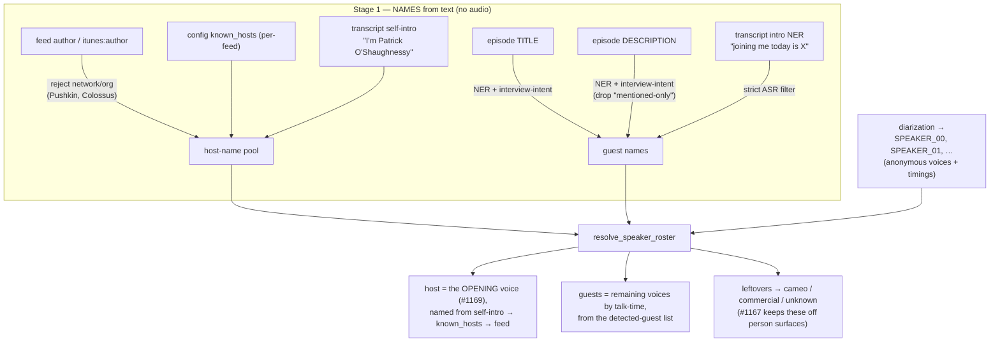

# Speaker resolution — reduce unknown speakers (roadmap + before/after measurement)

**Goal:** name more diarized voices (fewer `SPEAKER_NN`), and keep the ones that stay
unknown from polluting the corpus. Every step is measured **before/after on the same real
corpus** so we know what each one actually contributes.

**Measurement corpus:** `.test_outputs/manual/prod-v2/corpus` — **90 diarized episodes**,
**579 diarized voices** (the caption-derived episodes have no diarization roster and are
excluded). Method: replay `resolve_speaker_roster` on the cached segments + metadata (no
audio, no LLM, no GPU), A/B the one variable per step. Scripts:
`scratchpad/measure_1a.py`, `measure_1b.py`, `measure_reconcile.py` (promotable to
`scripts/` + a `make` target if we want this to be a standing gate).

Baseline is **not** a single number — separate "did we NAME more voices" (reducers) from
"did we stop MIS-LINKING the unknowns" (correctness). They are different wins.

---

## How host/guest detection works (two stages)

Detection separates **"who are the people?"** (names, mined from *text*) from **"which voice
is which person?"** (roles, resolved against the *audio* diarization). Episode title and
description feed the **first** stage only.

**The host is currently re-derived per episode** from opening-voice + self-intro signals,
because diarization is per-episode and anonymous (no cross-episode voice identity) and the
show's host is not yet persisted. Making the host a **known show-level constant** — so each
episode only has to *map* a known host name to a voice, not *discover* who the host is — is
[EPIC-HOST-IDENTIFICATION.md](EPIC-HOST-IDENTIFICATION.md) Path A (persist `person —HOSTS→
podcast`) + Path C (parse "Host: …" from show notes).

---

## Shipped this branch — measured contribution

| Step | What it does | Measured effect (prod-v2, 90 eps / 579 voices) |
|---|---|---|
| **#1a** own-turn self-intro | Name a voice from *its own* turns' "I'm X", not just the opening host intro | **NAMES MORE:** 212 → **253** voices named (36.6% → **43.7%**), **+41 voices across 31 eps, 0 regressions**. Talk-time on a named voice **72.1% → 76.0%**. Source split: 29 direct self-intro + 12 improved guest matching. |
| **#1b** episode-scoped ids | Unresolved voice → `person:speaker-{ep}-NN`, not global `person:speaker-NN` | **CORRECTNESS:** the old shared ids fused **`person:speaker-00` = 16 episodes across 6 shows** into one phantom person; **9 ids collapsed ≥2 episodes, 7 collapsed ≥2 shows**. Episode-scoping → **all 0**. Does NOT name more voices. |
| **#2** publisher denylist | A network/publisher (`The New York Times`) is never a host/guest | Removes *wrong* names; not a reducer. |
| **#1c** diagnostics sidecar | Per-episode `what we tried / resolved / why unresolved` | The measurement substrate — makes "why still unknown" auditable. |
| **#3** host/guest role on card | Per-show role surfaced in the player | UX; not a reducer. |
| **voice_type** cameo/commercial/unknown | Classify each *unnamed* voice so noise is labelled and only real people count as "unknown" | **RECLASSIFIES:** of 326 unresolved voices, **196 (60%) are noise** — 195 cameo (<20s) + 1 commercial — leaving **130 real people** to chase. Carried on the roster + diagnostics; `display_label_for()` renders "Brief speaker"/"Advertisement". |
| **Step B** per-feed `known_hosts` | Name a network feed's recurring host that never self-introduces | **NAMES MORE:** 253 → **272** named (43.7% → **47.0%**), **+19** (recurring hosts named in episodes with no "I'm …": Alexi Horowitz-Ghazi ×5, Katie Martin ×4, Brandon ×4). Config-only, wired into `feeds.spec.yaml`. |

**Cumulative on prod-v2:** named **212 → 272** (36.6% → **47.0%**) via #1a + Step B; of the
**307 still unresolved**, **~196 are labelled noise** (cameo/commercial), leaving **~111 real
people** to name. #1b is a correctness fix orthogonal to naming.

---

## Final accounting — what is TRULY unknown (prod-v2, 579 voices)

After **all** steps (self-intro + intro-guest NER + voice-type + Host + show-centric), categorise
every diarized voice and accept Host / cameo / commercial as resolved outcomes:

| bucket | voices | % | status |
|---|---|---|---|
| named (real person) | 253 | 44% | resolved |
| **Host** (unnamed, show-centric) | 31 | 5% | accepted — correct outcome |
| cameo (<20s) | 181 | 31% | parked as noise |
| commercial | 1 | 0% | parked |
| **TRULY UNKNOWN** | **113** | **20%** | a real person we failed to name |

**→ 466 / 579 (80%) handled; 113 truly unknown remain.** The residual is **almost entirely
guests** (110 guests + 3 role-unknown, **0 hosts**) — hosts are effectively solved (named or
"Host"). The 113 are **panel-show guests** who are never introduced with a "my guest is X" cue
(e.g. NPR Planet Money "How to make a BOOK" has 6, prediction-markets has 5), several with real
talk time (100–216 s). That — un-introduced multi-guest panels — is the remaining frontier; it
needs a recall lever beyond the intro (voice-diarization-aware attribution or a looser,
verified guest pass), which trades against the precision we protected in Step D.

---

## Reducer roadmap (ordered by leverage / cost) — each with a before/after plan

### Step B — per-feed `known_hosts` config  ·  cheapest, highest yield
Network feeds whose host never self-introduces (author tag is the org) stay `SPEAKER_NN`
forever. Hand-name the recurring hosts per feed in config; the roster already consumes
`known_hosts`. **Measure:** inject `known_hosts` for the top-N feeds, re-run `measure_1a.py`,
report the additional named voices + talk-time coverage.

### Step C — label unnamed hosts "Host" (SHIPPED lean)
Measured the reconciliation ceiling first: of **31 unnamed-host episodes across 7 feeds**, only
**6 are NAMEABLE** by `reconcile_hosts` (a feed with exactly one recurring *named* host to borrow
from — Katie Martin ×4, Noah Kravitz ×2). The other **23 are feeds where the host is never named
in any episode** (news desks / show-centric feeds — NPR, flightcast, megaphone) so there is no
sibling name to reconcile from. So the heavy KG-reconciliation precursor buys a 6-episode naming
gain — **not worth the plumbing**.

Instead, the lean win: the roster already marks an intro-dominant unnamed voice `role=host`, so
render it **"Host"** (via the same `friendly_speaker_label` display path as cameo/ad) — **31
unnamed-host voices across 31 episodes** now read "Host" instead of `SPEAKER_00`, the correct
outcome for a show-centric feed. The id-bearing label stays raw. To actually *name* those 31,
point **Step B** (`known_hosts`) at the 7 feeds.

Follow-up (optional): a per-feed `show_centric` flag so the diagnostics treat an unnamed host as
*expected*, not a detection failure, for feeds like WSJ/NPR where the host isn't the point.

### Step D — intro as a guest source (SHIPPED)
The feed metadata often omits guests the opening minutes name ("joining me today is X"). Treat
the transcript intro as another *description*: run the SAME NER + interview-indicator filter on
the first ~3000 chars (`INTRO_SNIPPET_LENGTH`) in `detect_speaker_names`.

**Precision was the whole game.** The naive "same logic as description" over-fires badly on ASR:
a first pass named **+85 voices — but mostly garbage** (mononym fragments "Ezra"/"Kevin", people
merely *mentioned* — Trump, Tucker, Khamenei — ASR noise "Diva Down"/"Squix", and hosts
mislabelled as guests). `_is_likely_actual_guest`'s `.*?` proximity lets a cue "introduce" a name
1000s of chars away. Added an ASR-grade guard `is_introduced_guest`: **First-Last name AND an
interview cue within 40 chars of it**. Result: **+7 named (194 → 201), high precision** — real
interviewees only (Robert Armstrong, Chris Wright, RJ Honecke, Nick Allardyce, Nicolas
Serissier…). Modest but clean; the guard cut ~90% false positives. Description behaviour
unchanged (only the intro path uses the strict filter).

### Step E — cross-episode voice fingerprinting  ·  out of scope (ML)
The real fix for recurring anonymous hosts, but explicitly a non-goal in #1056 (no ML voice
ID). Parked.

---

## Open decisions for the operator
1. Order: B → D → C (config-first, then guest NER, then the reconcile precursor)? B is a
   config change with no code risk and likely the biggest single jump on network feeds.
2. Promote the three measurement scripts to `scripts/measure_speaker_naming.py` + a
   `make measure-speakers` target so before/after is a repeatable gate, not scratchpad?
3. Chase only high-talk-time unknowns (ignore the <30s cameo tail), or full coverage?
