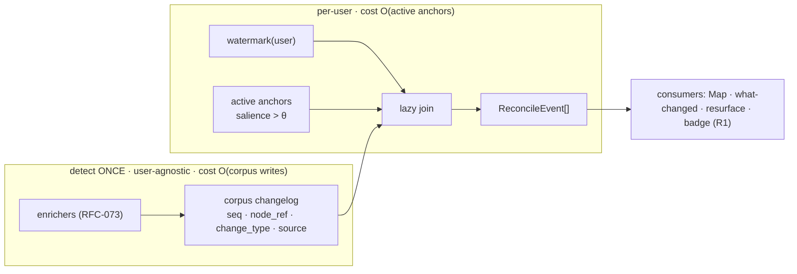
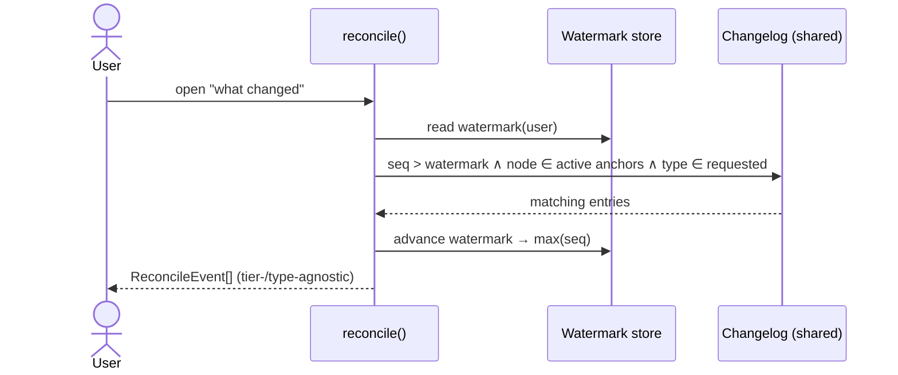
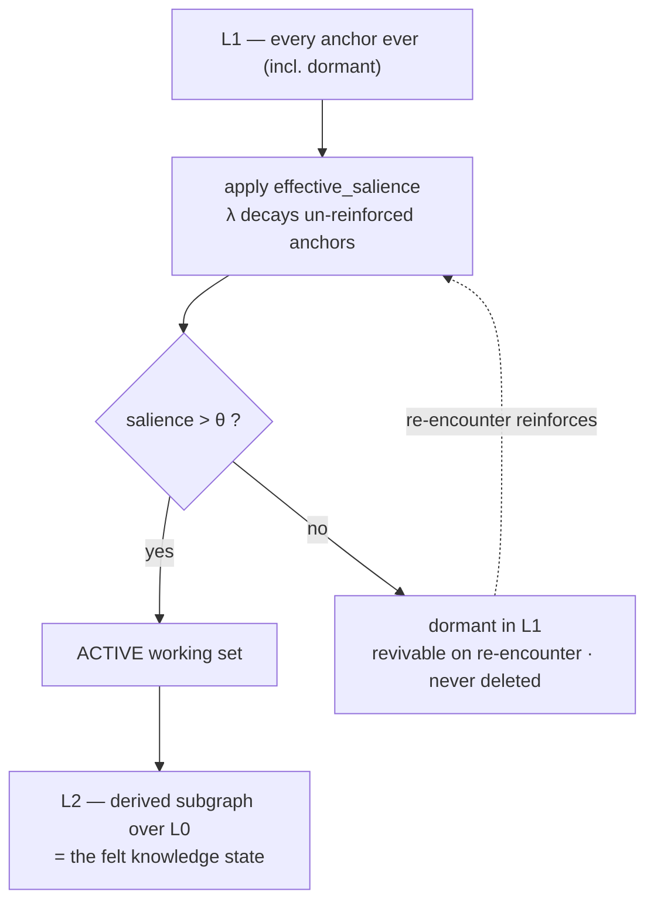

# RFC-081: Personal Knowledge Layer & Reconciliation Architecture

- **Status**: Draft
- **Authors**: Marko
- **Layer**: OSS (substrate)
- **Companion PRD**: `docs/prd/PRD-034-knowledge-retention-layer.md`
- **Depends on**:
  - `docs/rfc/RFC-072-canonical-identity-layer.md` — canonical `person:`/`org:`/`topic:` refs
  - `docs/rfc/RFC-065-agent-observable-instrumentation.md` — corpus-write observability (batch/live tiers)
  - `docs/rfc/RFC-073-enrichment-pipeline.md` — enrichers as source of corpus-change signal
- **Relates to**:
  - v2.7 enricher registry ADR — registration point for change-emitting enrichers
  - `docs/rfc/RFC-077-graph-visualization-modes.md` — L2 rendering

> **Proposed numbering** — `RFC-081` / `PRD-034` are placeholders; confirm against the
> repo doc tree and renumber before merge.

---

## Summary

A thin per-user **salience overlay (L1)** of typed **Anchors** into the canonical corpus
(L0), from which a **personal subgraph (L2)** is *derived live* and never stored as ground
truth. The hard problem — **reconciliation at massive user scale** — is solved by
**inverting** the dataflow: the corpus emits a user-agnostic **changelog** (computed once
per node, shared by all users), and reconciliation is a **lazy read-side join** of a
user's small, decayed Anchor set against the changelog since their watermark. The core
join is a pure function; *when* it runs is a pluggable **`Reconciler` tier**. v1 ships the
cheapest tier (on-demand) with the cheapest change-type (extension), and both dials turn
up independently as infra and enrichers mature.

---

## Motivation

See PRD-034 for the product model (unit-of-value reframe; decay/staleness/isolation; the
five operations; the flywheel). This RFC specifies the data model and the reconciliation
mechanism, with one hard constraint driving every choice:

> The detection of "what changed in the corpus" must be done **once per node, shared
> across all users.** The per-user cost must scale with a user's **(small, decaying)
> Anchor set**, never with corpus size or total user count.

That constraint is what makes the layer affordable for a large user base, and it is the
reason for the inversion described below.

---

## Layer model

- **L0 — Corpus.** KG entities/claims/edges, GIL insight nodes, episodes. Canonical,
  shared, evolving. Already exists.
- **L1 — Salience overlay.** Per-user set of Anchors. Typed pointers + provenance +
  salience. **No L0 content is copied here.**
- **L2 — Personal subgraph.** Induced, salience-weighted neighbourhood of L0 selected by
  L1. **Derived view, recomputed on read.** Never persisted as truth. → never stale by
  construction; only the user's *awareness* goes stale.

Invariant: **L2 is reconstructable at any time from `L1 ⋈ current L0`.** If a derived L2
cache is wiped, recomputation yields the same view. This is a testable success criterion
(PRD-034 §Success #2).

**Erasure corollary (GDPR).** The same property makes user erasure trivial: dropping a user's
L1 rows removes *all* their personal state, and L2 — being derived — vanishes with it. There is
no copied content to locate or purge. Export is symmetric: serialise the user's L1 (typed
pointers + provenance + salience). Both fall out of the content-free design (PRD-034 FR1.6).

---

## Data model

### Anchor (the L1 unit)

```jsonc
{
  "id": "anc_01H…",
  "user_id": "usr_…",
  "targets": [                      // typed refs into L0 — the load-bearing field
    { "ref": "insight:gil:9f3a…", "role": "primary" },
    { "ref": "person:CIL:angela-merkel", "role": "entity" },
    { "ref": "claim:gil:7b21…", "role": "claim" }
  ],
  "provenance": {                   // where the user hit it
    "episode": "ep:lex-fridman-420",
    "t_offset_s": 1832,
    "surface": "player.insight_save"
  },
  "salience": {
    "base": 1.0,                    // strength at deposit
    "last_reinforced_at": "2026-06-01T…",
    "reinforce_count": 3
  },
  "explicitness": "explicit",       // explicit | inferred  (FR1.2)
  "note": null,                     // optional annotation, never replaces targets
  "captured_at": "2026-05-12T…"
}
```

Key points:

- **`targets` are canonical refs (RFC-072)**, not strings. This is the difference between
  a layer that can only resurface (decay) and one that can also reconcile (staleness). A
  free-text save is a dead end for reconciliation; a typed save is not.
- **Deposit is cheap and weak; resolution is async.** The user taps once. A non-blocking
  job walks GIL/KG provenance to populate `targets` beyond the directly-saved node (e.g.
  the entities/claims a saved insight references). Consistent with the "enrichers are
  always non-blocking, always `derived`" principle.
- `explicitness` separates user-asserted Anchors from high-confidence inferred ones so UI
  and salience weighting can treat them differently.

### L1 store

Per-user, small (tens–low hundreds of *active* Anchors by design). A row store keyed by
`user_id` with secondary indexes on `targets[].ref` (for the reconcile join) and on
`effective_salience` (for ranked reads). No special database is required for v1; this fits
the existing backend (DuckDB/JSONL today, trivially a table).

### L2 derivation (not stored)

`L2(user, t) =` the subgraph of L0 induced by
`{ nodes with aggregate effective_salience(t) > θ } ∪ k-hop neighbourhood`, edge- and
node-weighted by salience. Computed on read for `/api/l2/graph` and `/api/l2/node`.
Optionally *cached* with a short TTL, but the cache is disposable — never authoritative.

### Salience decay (the metabolism)

Append-only L1 rebuilds the graveyard at system scale. Anchors must fade.

```
effective_salience(anchor, t)
    = base * exp(-λ * (t - last_reinforced_at)) * f(reinforce_count)
```

- **Exponential decay** with half-life `1/λ` (start global; later per-change-type or
  per-surface).
- **Reinforcement** on re-encounter — re-anchoring the same node, replaying that moment,
  or acknowledging a resurface — raises `base`/resets `last_reinforced_at` and increments
  `reinforce_count`. `f(reinforce_count)` is a sub-linear bonus (repeatedly-reinforced
  Anchors resist decay).
- **L2 inclusion threshold `θ`**: nodes whose aggregate Anchor salience falls below `θ`
  drop out of the *active* L2 view but are **not deleted** from L1 — they go dormant and
  can revive on re-encounter. This auto-curates without asking the user to prune, and
  bounds the per-user reconcile cost to the *active* set.

Aggregate per node: a node may be targeted by several Anchors; its node-salience is the
(decayed, capped) sum.

---

## The reconciliation problem

### Why the naive approach does not scale

The obvious design: on every corpus write, find which users have Anchors on the affected
node and notify them. This is a **push fan-out**. It couples the enrichment pipeline to
per-user state, and its cost scales with `writes × users-anchoring-the-hot-nodes`. For a
large user base on popular entities, that is the expensive quadrant, and it forces the
event spine to exist before anything can ship.

### The inversion: corpus changelog + watermark + lazy join

Split detection from delivery, and make detection user-agnostic.

**1. Corpus changelog (shared, user-agnostic, append-only).** As a *byproduct* of
enrichment, every run that meaningfully changes a node appends an entry:

```jsonc
{
  "seq": 489213,                    // monotonic
  "node_ref": "person:CIL:angela-merkel",
  "change_type": "extension",       // extension | contradiction | evolution | corroboration
  "source": { "episode": "ep:…", "claim": "claim:gil:…" },
  "detected_at": "2026-06-20T…"
}
```

This is computed **once per node**, independent of any user, and is independently useful
to L0 itself as a "corpus evolution feed." Cost: `O(corpus writes)`, which we already pay.

**2. Watermark (per user).** `last_reconciled_seq` (or `_at`). Cheap.

**3. Reconcile = a lazy read-side join.** When a user is reconciled (on demand, on digest,
or on event), run:

```
reconcile(user, since_seq) =
    changelog entries with seq > since_seq
    WHERE node_ref ∈ user's ACTIVE anchored refs   -- small set, salience > θ
    (optionally) WHERE change_type ∈ requested_types
```

Then advance the watermark. **The expensive part (detection) is shared and done once; the
per-user part (the join) scales with the user's active Anchor count.** Anchors are bounded
by decay/curation, so this is cheap and predictable.

### Cost summary

| Stage | Cost | Per-user? |
|---|---|---|
| Detect corpus change → changelog | `O(corpus writes)` | **No — shared, once** |
| On-demand / batch join | `O(active_anchors)` per reconcile | Yes, but bounded small |
| Live fan-out (Tier 2 only) | `O(writes × users-on-hot-node)` | Yes — only built when needed |

---

## The abstraction: `Reconciler` with two orthogonal dials

The *join logic is invariant* across every tier — what varies is **when** it runs and
**which change-types** it considers. So we abstract exactly those two dials, in the same
spirit as the existing `SearchBackend` / `CompletionBackend` protocols.

### Dial A — trigger tier (cheap → expensive)

```python
class Reconciler(Protocol):
    def reconcile(self, user_id: str, since_seq: int,
                  change_types: set[ChangeType]) -> list[ReconcileEvent]:
        ...   # IDENTICAL CORE across all tiers — the lazy join above
```

- **`OnDemandReconciler`** *(v1)* — runs the join when the user opens "what changed".
  Pull, not push. No background infra beyond the changelog. **No event spine required.**
- **`BatchReconciler`** *(later)* — a cron runs the join for active users, emits a digest.
  Still pull-shaped, just scheduled. Cost = `active_users × avg_active_anchors`.
- **`EventDrivenReconciler`** *(later)* — changelog appends trigger reconciliation for
  affected users in near-real-time. Needs a reverse index `node_ref → {user_ids with
  active anchor}` and the RFC-065 event spine. Only build when interrupt-style alerts are
  clearly warranted.

The same `reconcile()` body is called by all three; only the *driver* (request handler /
scheduler / event consumer) differs. Swapping tiers does not touch core logic.

### Dial B — change-type richness (cheap → rich)

`ChangeType ∈ { extension, contradiction, evolution, corroboration }`, gated by enricher
maturity:

- **`extension`** *(v1)* — "more was said about your node." Trivial: new changelog entries
  referencing the node. Needs no conflict detection.
- **`contradiction`** *(fast-follow)* — a new claim conflicts with a claim at/near the
  anchored node. The staleness killer. Needs conflict-detection enrichers.
- **`evolution`** *(later)* — a tracked position on the entity shifted over time.
- **`corroboration`** *(later)* — independent source agrees; *strengthens* rather than
  flags.

Detection of richer types happens corpus-side, once, and simply lights up new
`change_type` values in the shared changelog. The per-user join is unchanged.

### v1 = (OnDemand × extension)

Cheapest cell in the matrix. Proves the loop end-to-end with no event-spine dependency and
no conflict enricher. Both dials advance independently afterward.

```
                 extension   contradiction   evolution
   on-demand    [   v1   ]   [ fast-follow ] [  later  ]
   batch        [ later  ]   [   later     ] [  later  ]
   live         [ later  ]   [   later     ] [  later  ]
```

### Consumer contract (the rule that makes walking the matrix cheap)

The whole point of the abstraction is lost if any consumer hardcodes the v1 cell.
Therefore:

> **R1 — generic `ReconcileEvent`.** `reconcile()` returns `ReconcileEvent` objects that
> carry `change_type` and provenance as *data*. Every consumer (API serializers, the Map,
> "what changed", the resurface card, the catalog badge) renders an event **without
> branching on `change_type` and without assuming which tier produced it.** A consumer may
> *style* by change-type (e.g. a contradiction gets a warning colour) via a lookup table,
> but must not *gate existence* on it — an unknown future change-type still renders.

```python
@dataclass(frozen=True)
class ReconcileEvent:
    anchor_id: str
    node_ref: str
    change_type: ChangeType        # extension | contradiction | evolution | corroboration | <future>
    source: SourceRef              # episode/claim back-link into L0
    detected_at: datetime
    seq: int
```

Consequence: turning up **Dial A** (a `BatchReconciler` / `EventDrivenReconciler` driver)
or **Dial B** (a new `change_type` emitted into the changelog) is **zero consumer rework**.
New tiers and types appear in surfaces that already render `ReconcileEvent`. This is why
the internal v1 build closes the value chain *first*: it hardens this contract.

---

## Change-type → GIL/KG mapping

| ChangeType | Source signal |
|---|---|
| extension | new GIL insight / KG edge references the anchored node (edge count delta since seq) |
| contradiction | conflict-detection enricher flags a new claim as opposing a claim at/near the node |
| evolution | position/stance enricher detects a shift on the entity across time |
| corroboration | independent source asserts an existing claim (provenance multiplicity) |

`extension` is a pure graph-delta and ships in v1. The rest are emitted by enrichers
registered through the v2.7 enricher registry and are picked up "for free" by the existing
join as they come online.

---

## Dependencies & where they bite

- **RFC-072 (CIL)** — *hard for everything.* Without canonical refs, Anchors can't be
  joined across shows and reconciliation is impossible. Anchors target CIL refs.
- **Changelog emission** — *hard for reconcile, but cheap.* Needs enrichers to append a
  changelog entry on node-affecting writes. For v1/extension this is a graph-delta hook,
  not new ML.
- **RFC-065 event spine** — *only for Tier 2 (live).* v1 (on-demand) and batch do not need
  it. This is the key de-risking: the most valuable-sounding tier is *not* on the v1
  critical path.
- **v2.7 enricher registry** — registration point for contradiction/evolution emitters;
  gates Dial B beyond extension.
- **GIL grounding contract** — Anchor resolution faithfulness; reconcile provenance links
  resolve back to grounded L0 nodes.

---

## Phasing

> **v1 is an internal value-chain dogfood**, not a public release: its job is to harden
> the data model, the derived-view endpoints, and the consumer contract (R1) on the
> cheapest matrix cell. Once the chain is closed internally, both dials turn **immediately**
> and **without re-opening this RFC.**

1. **v1 (internal)** — Anchor schema + L1 store + async resolution; salience decay; L2
   derived-view endpoints; `OnDemandReconciler` + `extension`; corpus changelog (extension
   entries only); reverse index *not* built; consumer contract R1 enforced.
2. **Dial B (turn immediately)** — `contradiction`, then `evolution` / `corroboration`.
   Each is **enricher work registered through the v2.7 enricher registry** that emits a new
   `change_type` into the changelog. **Not a new reconciliation RFC** — the join and all
   consumers are unchanged.
3. **Dial A (turn in parallel)** — `OnDemand → Batch` is a new *driver* over the identical
   `reconcile()` core: **implementation, ADR at most.** `→ Live` (`EventDrivenReconciler` +
   reverse index `node_ref → users` + RFC-065 fan-out) is the one deferred piece of real
   machinery and **earns a focused future RFC (RFC-082)**.

### What earns a new document

| Change | Artifact |
|---|---|
| on-demand → batch driver | implementation (optional ADR) |
| live / event-triggered tier | **future RFC-082** (reverse index + RFC-065 fan-out) |
| any new `change_type` (contradiction/evolution/…) | enricher-registry work, **not** a reconciliation RFC |
| new consumer surface | rides R1; no reconciliation change |

This RFC (the L1/L2 model, the changelog, the lazy-join core, the `Reconciler` protocol) is
**not re-opened to walk up the matrix.** That is the payoff of designing both dials now.

---

## Watermark mechanics & decay metabolism (detailed design)

Two parameter systems govern the layer's felt behaviour: the **watermark** decides *what
reconcile shows you*, and the **decay metabolism** (`λ`, `θ`) decides *what stays in your
living model*. Both are detailed here; only residual unknowns remain in Open Questions.

Context — where these two live in the inverted dataflow:



The watermark sits on the per-user side; `θ` gates which anchors are even eligible for the
join. Neither touches the shared detection cost.

### Watermark — the "since when" cursor

**Purpose.** Reconcile must answer *"what is new to **me** since I last looked"*, not
*"everything that ever happened."* The watermark is the per-user cursor into the shared
changelog `seq` space recording how far the user has already been shown. It is used in
exactly one place — the lazy join — and advanced immediately after:

```
reconcile(user, types):
    rows = changelog WHERE seq > watermark(user)
                       AND node_ref ∈ active_anchors(user)   # salience > θ
                       AND change_type ∈ types
    emit ReconcileEvent per row          # generic, R1
    advance watermark(user) → max(seq among rows)
```



The changelog strip and the cursor, concretely:

```
shared, append-only changelog (one entry per node-affecting corpus write):
 seq:   101     102    103    104    105    106    107   → head
 node:  merkel  saab   merkel nato   tesla  merkel nato
 type:  ext     ext    contra ext    ext    ext    evo

 user A · active anchors {merkel, nato} · watermark_A = 103
                                    │
   already shown ───────────────────┘
   join (seq>103 ∧ node∈{merkel,nato}):  104 nato/ext · 106 merkel/ext · 107 nato/evo
   skipped: 102 saab, 105 tesla  (not in A's active set)
   then watermark_A ← 107
```

Restated property: **detection is written once and shared; the cursor + join is per-user
but scales with the small active-anchor set.** The watermark is what makes reconcile feel
like *progress* — without it, every call re-shows the same changes and the surface decays
into noise.

#### Granularity: per-user vs per-node — why it reshapes the UX

A single per-user cursor is one integer, but it is **all-or-nothing**: viewing "what
changed" jumps the cursor to head and marks *everything* seen at once. A cursor **per
active node** is heavier (a small map, bounded by the active set) but enables per-item
"mark handled":

```
PER-USER watermark (one cursor)
  before:  watermark = 103   pending = {104 nato, 106 merkel, 107 nato}
  user reads the merkel contradiction, closes the view
  after:   watermark = 107   → ALL advanced; 104 & 107 (nato) silently gone,
                               though the user never handled nato.  ← newspaper reset

PER-NODE watermark (cursor per active anchor)
  before:  wm[merkel]=103   wm[nato]=103
  user acknowledges the merkel item (106)
  after:   wm[merkel]=106   wm[nato]=103   → 104 & 107 nato STILL pending.  ← triage inbox
```

This is the difference between an inbox you can triage and a newspaper that resets every
morning. **Value impact:** per-user is correct when the surface is a *digest consumed
whole*; per-node is correct when it is an *item-by-item staleness inbox* — which is the
differentiated surface. **Decision:** ship per-user in v1 (proves the loop); migrate to
per-node when the "what changed" view becomes item-by-item. The migration is additive —
split one cursor into a map keyed by active node — and the join body is unchanged.

#### Stale watermark + compacted changelog = a hole (ties to retention)

The changelog cannot grow forever; it is compacted below some `min_seq`. A user who does
not reconcile for a long time can fall *behind* the surviving window, making the delta join
**lossy**:

```
                       compaction boundary (min_seq = 070)
   trimmed ────────────┤▒▒▒▒▒▒▒ surviving changelog ▒▒▒▒▒▒▒├────→ head
                       │
   wm_user = 045 ──────┘  ← behind the boundary: HOLE — changes 045..070 unrecoverable
```

**Handling:** when `watermark(user) < changelog.min_seq`, the delta cannot be trusted.
Fallback = **full L2 recompute** ("we refreshed your model; some interim changes may not be
itemised") and set `watermark = head`. This couples the watermark to changelog **retention**:
retention must exceed the longest plausible reconcile gap for the *active* cohort, or the
fallback becomes routine. (See Open Question on retention.)

### Decay metabolism — `λ` and `θ`

```
effective_salience(anchor, t) = base · exp(−λ · (t − last_reinforced)) · f(reinforce_count)
```

These two numbers decide what is *in* the living model at any instant — they are the entire
"value, not graveyard" promise expressed quantitatively.

#### `λ` — decay rate (as half-life): recency vs accumulation

`λ` (equivalently, half-life `ln2 / λ`) sets how fast an un-reinforced anchor loses weight.
It is read **everywhere L2 is ranked or shown**: Map node size, salience-ranked library
sort order, advise weighting, resurface eligibility, and — via `θ` — reconcile active-set
membership.

```
salience
 1.0 |R                  R              R = reinforce: clock resets, salience jumps up
     | \                / \
 0.8 |  \              /   \
     |   \            /     \
 0.6 |    \          /       \
     |     \        /         \
 0.4 |------\------/-----------\--------------- θ   (below θ → leaves ACTIVE L2)
     |       \    /             \
 0.2 |        \  /               \______
     |         R                        \______
 0.0 +----+----+----+----+----+----+----+----+----> time (weeks)
      0    2    4    6    8   10   12   14   16
   long  half-life → shallow slopes → accumulative, durable model (risks hoard creep)
   short half-life → steep slopes   → recency-biased model (sheds old interests fast)
```

The middle anchor decays toward `θ`, is reinforced back near `1.0` (re-encounter), then —
not reinforced again — sinks **below `θ` into dormancy**. Reinforcement is what rescues
recurrently-relevant nodes automatically, with no user bookkeeping.

#### `θ` — inclusion threshold: the active-set gate (UX *and* cost)

`θ` is the salience floor below which a node drops out of the **active** L2 view — *not*
deleted from L1, just dormant and revivable on re-encounter. It does double duty: it sets
how busy the Map is **and** it bounds **per-user reconcile cost**, because only above-`θ`
anchors enter the join. Low `θ` → rich but noisy Map, reconcile fires on marginal interests;
high `θ` → clean Map, cheaper reconcile, but mild interests stop being tracked.

#### `λ × θ` = the working set (the felt knowledge state)



`λ` controls *how fast* things sink; `θ` controls *how deep before they vanish from view*.
Together they define the **working set** — the slice of everything-ever-saved that is
currently live — and that working set *is* the user's felt model. Tune loose → L2 becomes a
hoard; tune tight → L2 becomes sharp, current, slightly forgetful. Reinforcement makes it
humane: things the user keeps meeting resist decay without being managed. The whole "lasting
value, not one-time-and-gone" property lives in these two numbers plus reinforcement.

#### Why `λ`/`θ` are not guessed in v1

They are **behavioural, not architectural**: the right half-life depends on how often *our*
users actually re-encounter nodes, which is unknown until the resurface-acknowledge loop is
instrumented. Guess too short → live interests get deleted; too long → the graveyard
returns. **v1 ships a deliberately conservative long half-life** (nothing fades meaningfully
before it is measured), instruments acknowledgements, then fits `λ`/`θ` to observed
re-encounter intervals. Decay is live from day one *structurally*; its *aggressiveness* is
calibrated from data, not vibes.

---

## Open questions

1. **Per-node watermark migration trigger** — the *metric* that says the "what changed"
   surface has become item-by-item triage (and so warrants splitting the per-user cursor).
   Candidate: per-event acknowledge rate vs whole-view dismiss rate.
2. **Initial `λ`/`θ` values** — the specific conservative half-life and threshold to seed
   before behavioural data exists, and the fit procedure once acknowledgement data lands.
3. **Inferred-deposit policy** — what (if anything) auto-creates Anchors (full
   listen-through? replay?) without breaching the smallness property. Defaulted *off* in v1.
4. **Changelog retention window** — how long the changelog is kept before compaction; must
   exceed the active cohort's longest plausible reconcile gap or the hole-fallback (above)
   becomes routine.
5. **L2 cache** — whether to cache the derived subgraph at all in v1, given correctness risk
   vs render cost on `gi-kg-viewer`.

---

## Alternatives considered

- **Store saved text (Readwise-style).** Rejected: strings can be resurfaced but never
  reconciled; kills the differentiated axis. Typed pointers are the whole point.
- **Push fan-out on every corpus write.** Rejected for v1: couples enrichment to per-user
  state, scales poorly on hot nodes, forces the event spine early. Retained only as the
  Tier-2 live option behind a reverse index.
- **Materialise L2 as stored ground truth.** Rejected: it would go stale and reintroduce a
  sync problem; the derived-view design makes "keep it alive" free.
- **Append-only L1 (no decay).** Rejected: rebuilds the graveyard at system scale and
  makes reconcile/resurface noisy. Decay is what keeps the per-user active set — and thus
  cost — bounded.
