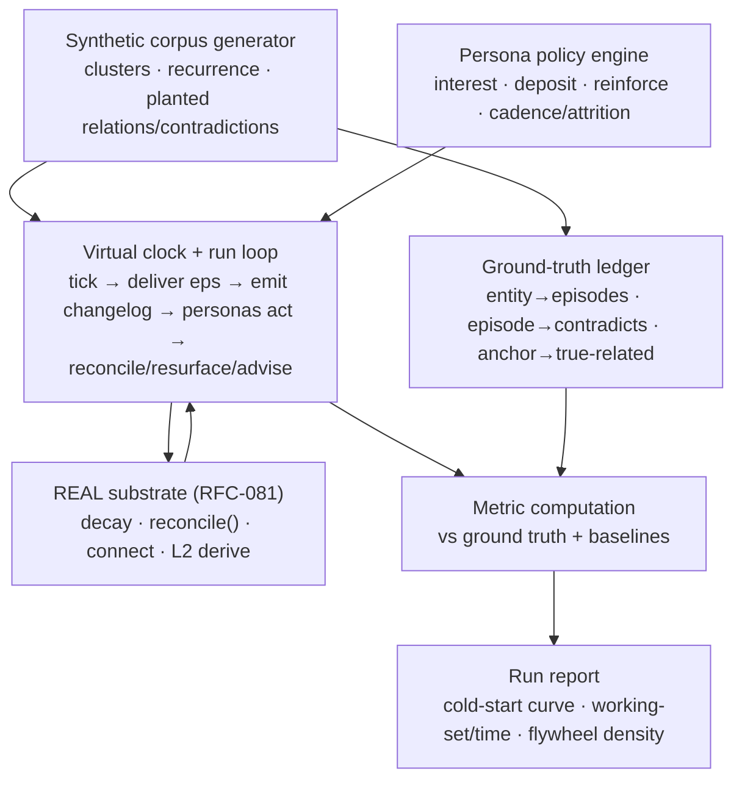

# RFC-087: Simulation & Validation Harness Architecture

- **Status**: Draft
- **Authors**: Marko
- **Companion PRD**: `PRD-036-simulation-validation-harness.md`
- **Layer**: internal — synthetic data only (no PII); encodes the value model.
- **Depends on**:
  - `RFC-081-personal-knowledge-layer-reconciliation.md` — the substrate the harness drives
    (decay fn, reconcile join, changelog, L2 derivation) **by calling the real code paths**
  - `RFC-086-operator-data-access-and-tooling.md` — sandbox isolation + `reconcile/inspect`
    + `decay/simulate` reused as harness primitives
- **Relates to**:
  - `RFC-056-autoresearch-loop.md` — kindred eval discipline (immutable harness, single
    metric); the sim is the *value* harness sibling to the prompt/param optimizer

> **Proposed numbering** — `RFC-087` / `PRD-036` are placeholders; verify and renumber.

---

## Summary

A deterministic, ground-truth, **virtual-time** simulation engine that validates the
Knowledge Retention value model **without real users**. It generates a synthetic corpus with
*planted* recurrence and relations, drives **persona agents** that deposit/reinforce per
behavioral policy, advances a **virtual clock** to compress months into a run, and computes
**value metrics against ground truth** plus baselines. It runs inside the RFC-086 sandbox and
**executes the real substrate functions** (decay, reconcile, connect) — never reimplementations
— so a green sim means the shipped code is right, not a parallel toy.

The core enabler: because the harness *plants* which entities recur, which episodes
contradict which, and which anchors are truly related, precision/recall are **computable, not
estimated** — the thing real users can never give you.

---

## Principles

1. **Real code paths only.** The loop calls the production decay function, the production
   `reconcile()` join, the production connect query. The harness supplies data and time; it
   does not model the mechanism. (Otherwise you validate the simulation, not the product.)
2. **Determinism.** Every run is seeded; same seed + same schedule ⇒ identical output.
   Reproducible regressions.
3. **Ground truth at generation.** The corpus generator emits a truth ledger alongside L0;
   metrics join against it.
4. **Virtual time is injectable.** Nothing reads `datetime.now()`; the clock is a parameter.
   (Hard substrate requirement — see §Injectable clock.)
5. **Isolation.** Runs use sandbox scope (RFC-086): synthetic anchors/changelog never touch
   real users or the real changelog.

---

## Injectable clock (the hard requirement)

Decay half-life is weeks; reconcile needs the corpus to grow *after* anchors exist. You
cannot wait in wall-clock time, so **time is a parameter the harness drives**. This requires a
small, load-bearing substrate change:

- **Decay** (`effective_salience` uses `t = now`), **spaced resurface scheduling**, and
  **changelog/anchor timestamps** must read from an **injectable clock**, never
  `datetime.now()`.
- The reconcile join is `seq`-ordered and already time-agnostic; virtual time drives it
  indirectly by controlling the *order and timing* of changelog appends.

This is added to PLAN **M2 (decay)** and **M3 (changelog/reconcile)** as an acceptance
criterion. Without it, none of the trajectory metrics below are testable.

---

## Components



### 1. Synthetic corpus generator

Produces L0 (episodes with entities/claims/GIL-shaped insight nodes) organized into
**clusters** with controlled **entity recurrence** and **planted relations** and
**contradictions**. Parameters: `#clusters`, per-cluster `recurrence_distribution`,
`relation_density`, `contradiction_rate`, `arrival_schedule`. Emits the **ground-truth
ledger**: `entity → [episodes]`, `episode → [contradicted_claims]`, `node → [truly-related
nodes]`.

> The generator must mirror the *shape* of real GIL/KG output (canonical refs per RFC-072,
> insight nodes with grounding) closely enough that the real resolution/reconcile code accepts
> it. Faithfulness of the synthetic shape is its own quality bar.

### 2. Persona policy engine

Agents, each = `{ interest_profile (cluster weights), deposit_policy (P(anchor|relevance),
salience dist), reinforce_policy (P(ack resurface), replay rate), cadence (eps/week),
attrition (lapse model) }`. Stochastic but seeded. Emits anchors with **virtual
`captured_at`** via the real `POST /anchors` path (sandbox-scoped). The four v1 archetypes
(PRD-036) are configs, not code.

### 3. Virtual clock + run loop

Advance in ticks (default: 1 virtual day). Per tick:
1. deliver scheduled episodes into sandbox L0;
2. emit changelog entries (extension; synthetic contradiction injection optional — see below);
3. each active persona decides deposits / reinforces / replays per policy;
4. run **real** reconcile / resurface / advise for active personas at the virtual `now`;
5. record per-tick metrics + working-set snapshots.

Compresses an N-week trajectory into one deterministic run.

### 4. Ground-truth ledger

The planted truth from §1, the join key for all precision/recall. Without it, value metrics
are vibes; with it, they are computed.

### 5. Metric computation + baselines

Computes the PRD-036 metric catalog against ground truth. **Baselines run on identical
seeds:** advise **on vs off**, resurface **entity-triggered vs spaced/random**, ordering
**L2-ranked vs chronological/random**. A/B is clean because the ground-truth subgraph is held
fixed across arms.

---

## Synthetic contradiction injection (decouples Dial B detection from the rest)

The contradiction enricher (Dial B) is later. But because reconcile and every consumer are
**type-agnostic (R1)**, the harness can inject `change_type=contradiction` changelog entries
**directly**, bypassing the not-yet-built detector. This validates the **contradiction
reconcile path, watermark behaviour, and UI** *today* — detection and propagation are tested
independently, and the detector, when built, only has to produce entries the harness already
proved the rest of the system handles. This is a concrete payoff of R1.

---

## Corpus value-potential diagnostic (recurrence + dispersion)

A standalone analysis (runs over **any** corpus — synthetic *or* the real beta corpus) that
measures whether the corpus can produce value **before** any building or simulation. It
computes **two** numbers per recurring entity, because the corpus has **two** binding
constraints that fail independently:

**Metric A — Recurrence (the *overlap* / firing floor).** For tracked-eligible entities, in
how many episodes within a plausible consumption path does the entity appear? **Value is gated
by recurrence, not episode count** — if the median tracked entity appears in only 1 episode,
connect/resurface/advise/reconcile all starve regardless of volume. Floor: **≥2–3** for
connect/reconcile to fire. Predicts: connect, resurface, advise.

**Metric B — Stance/claim dispersion (the *divergence* / moat fuel).** Across the episodes
that touch an entity, how much do the **claims about it disagree, shift, or come from
different sources**? Measured along the axes that matter: stance dispersion (same entity,
opposing views), temporal spread (same entity over time), source/show spread (same entity,
distinct shows), and claim-level revisit (same *proposition* with differing verdicts).
Predicts: **contradiction-reconcile, evolution, cross-show synthesis — i.e. the
differentiator.**

**Why both, and why dispersion is the one teams forget.** A corpus can **pass A and fail B** —
high recurrence, low dispersion — which is the **echo-chamber failure mode**: connect and
extension-reconcile work, but reconcile only ever emits boring "more was said" events,
synthesis is repetitive, and the objectivization moat starves. This failure is **invisible
unless dispersion is measured**. The matrix:

```
                 low dispersion        high dispersion
   low recur.    islands → graveyard   noise → nothing connects
   high recur.   ECHO CHAMBER          TARGET
                 (moat starves)        (everything fires + moat fed)
```

**Output:** per-cluster histograms of (A) entity → episode-count and (B) entity → claim/stance
dispersion; flags clusters that clear A but fail B (echo chambers) and entities that **bridge
clusters** (frontier/Map value). Run **both** over the real beta corpus first; A tells you the
connect floor is cleared, B tells you whether the moat has fuel. The dispersion read is also
the actionable lever — a failing cluster is fixed by **seeding adversarial/divergent sources
into it**, not by adding more content.

---

## Arrival-schedule design

To exercise fresh/stale/decay, post-anchor arrivals must touch anchored nodes **within ~1–2
half-lives**, or you only ever test decay and never reconcile. The schedule is designed to
**guarantee every state is reached** per persona:

1. anchor → extension **before** decay (reconcile-while-fresh);
2. anchor → dormancy with **no** extension (decay wins / "you missed it");
3. reinforced anchor **persists** through extensions;
4. anchor → contradiction (via injection until Dial B exists).

**Rate derivation.** For a target cadence (e.g. ≥1 reconcile event / active-user / week =
"feels alive"): if a tracked entity recurs in fraction `f` of its cluster and the cluster
emits `N` new eps/week, eligible touches/entity/week ≈ `N·f`. Solve `N` for the target. (Worked
example: `f≈0.3`, target `0.5`/entity/week over an 8-week half-life → `N≈1–2` new eps/week/cluster
sustained.) The harness sets the schedule from this; in production it becomes the corpus
freshness SLO.

---

## Outputs (run report)

- **Cold-start curve** — first episode index at which each surface yields ≥1 non-trivial
  output, per persona. (The literal "content needed to create value" answer.)
- **Working-set-size over time** — per persona/cohort; must stay bounded (no graveyard / no
  collapse). The λ/θ tuning surface.
- **Flywheel curve** — subgraph density vs episodes-consumed, **advise on vs off**. The
  thesis, falsifiable: if density doesn't grow faster with advise on, the compounding claim is
  wrong.
- Per-metric tables with ground-truth precision/recall and baseline deltas.

---

## Determinism & reproducibility

Seeded RNG for generator + personas; fixed tick schedule; snapshotable run state. A run is a
config (corpus params + persona configs + schedule + seed) → a report. Configs are
versioned; reports are diffable across substrate changes (regression detection).

---

## Relationship to the autoresearch loop (RFC-056)

The autoresearch loop optimizes prompts/params against an immutable harness on a single
metric. The sim is its **value-side sibling**: it can emit eval datasets and serve as the
fixture corpus, and it shares the immutable-harness discipline (don't tune the harness to pass
the test). Keep them distinct — RFC-056 optimizes enricher quality; RFC-087 validates the
retention model — but they can share corpus-generation and metric plumbing.

---

## Dependencies

- **Injectable clock** in RFC-081 components (decay, resurface scheduling, timestamps) — added
  to PLAN M2/M3.
- **RFC-086 sandbox** isolation + `reconcile/inspect` + `decay/simulate` as harness primitives.
- **Real substrate functions** (decay, `reconcile()`, connect, L2 derive) callable in-process
  at sandbox scope.
- **RFC-072 refs** for synthetic canonical identities.

---

## Phasing

1. **P0** — corpus generator (clusters + recurrence + relations) + ground-truth ledger +
   persona engine (4 archetypes) + virtual clock/run loop + metrics for connect (P/R), reconcile
   (yield/precision), decay/working-set health, **cold-start curve**, **flywheel A/B**. Plus the
   **corpus value-potential diagnostic** (recurrence + dispersion) — run it against the real beta
   corpus immediately to confirm the connect floor *and* that the moat has divergence fuel.
2. **P1** — synthetic contradiction injection (Dial B path) + advise A/B + resurface
   timing-vs-baseline + richer attrition/replay policies.
3. **P2** — eval-dataset export for RFC-056; production-deposit-rate calibration hook (re-fit
   persona policies from first real telemetry).

---

## Open questions

1. **Persona-policy realism** — initial deposit/reinforce/attrition distributions are guesses
   until first real telemetry; treat as calibratable, re-fit early (P2).
2. **Synthetic GIL fidelity** — how closely synthetic insight nodes must mirror real ones for
   resolution/reconcile to behave identically; risk of testing an easier-than-real corpus.
3. **Recurrence floor value** — confirm ≥2–3 empirically (the point connect/reconcile cross
   from starving to firing) rather than by assumption.
4. **Contradiction injection realism** — injected contradictions may be "cleaner" than what the
   future enricher emits; revisit once the enricher exists.

---

## Security / data note

Synthetic data only — no PII, safe to keep in-repo. Still internal (it encodes the value model
and tuning). Runs are sandbox-isolated and never write to real users or the real changelog.
