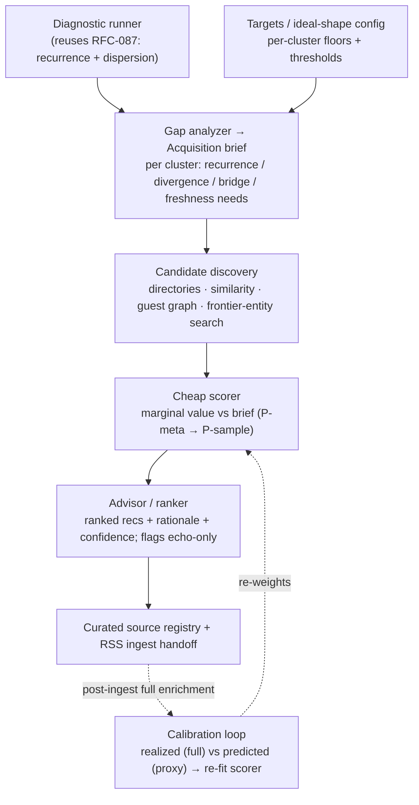

# RFC-088: Corpus Scout Architecture

- **Status**: Draft
- **Authors**: Marko
- **Companion PRD**: `PRD-037-corpus-scout.md`
- **Layer**: internal / Pro — builds and maintains the curated source registry (a moat asset).
- **Depends on**:
  - `RFC-087-simulation-validation-harness.md` — the **corpus value-potential diagnostic**
    (recurrence + dispersion) is reused as the measurement core
  - existing **RSS ingest** + Podcast 2.0 namespace — the execution path for accepted feeds
- **Relates to**:
  - `PRD-034` §Corpus composition — the precondition this tool operationalises
  - `RFC-056-autoresearch-loop.md` — the calibration loop shares its self-improvement discipline

> **Proposed numbering** — `RFC-088` / `PRD-037` are placeholders; verify and renumber.

---

## Summary

A **standalone** tool that moves the corpus toward ideal shape: it **diagnoses** the current
corpus against per-cluster targets, turns gaps into an **acquisition brief**, **discovers**
candidate RSS feeds, **cheaply estimates** each candidate's *marginal* contribution to the
brief **without full enrichment**, and **advises** what to ingest — then **calibrates** its
own proxy from realized post-ingest contribution. Its recommendations populate the curated
source registry and hand accepted feeds to the existing RSS ingest.

The pipeline: **diagnose → brief → discover → score → advise → (ingest) → calibrate.**

---

## Principles

1. **Cheap before expensive.** Full GIL/KG on every candidate is infeasible; score from
   metadata + samples, enrich fully only after the ingest decision. (Same inversion spirit as
   reconciliation.)
2. **Marginal-to-target, not absolute quality.** A feed's value is its contribution to the
   *current gap*, relative to the *current corpus*. Redundant excellence scores low.
3. **Divergence is measured from content, never imposed from labels.** *(Integrity-critical —
   see §Divergence integrity.)*
4. **Advice, not auto-ingest** (in v1). Human-in-the-loop; the tool ranks and justifies.
5. **Standalone.** Runs independently against a corpus snapshot + targets; not coupled to the
   live app.
6. **Reuse the diagnostic.** The same recurrence+dispersion measurement (RFC-087) scores both
   the existing corpus and (via proxy) candidates — one metric definition, two applications.

---

## The cheap-proxy problem (the crux)

You cannot run the full pipeline on the open internet, but the value metrics
(recurrence, dispersion) require enriched content. Resolve with **tiers of estimation**, each
carrying a confidence the advisor surfaces:

| Tier | Input | Estimates | Cost |
|---|---|---|---|
| **P-meta** | feed + episode metadata, titles, show-notes → light NER | entity coverage (overlap signal) | cheapest |
| **P-sample** | sample N episodes → light enrichment | dispersion + extraction-amenability (divergence/quality signal) | medium |
| **Full** | full GIL/KG (post-ingest only) | realized recurrence + dispersion (ground truth for calibration) | expensive |

A candidate is scored at P-meta first; promising ones escalate to P-sample. Full enrichment is
never spent on rejection — only after an ingest decision, where it doubles as the calibration
signal.

---

## Components



### 1. Diagnostic runner
Runs the RFC-087 **value-potential diagnostic** over a corpus snapshot: per-cluster
recurrence histogram + dispersion read + bridge-entity map.

### 2. Targets (ideal-shape config)
Per-cluster, declarative: recurrence floor (≥2–3), dispersion threshold, required bridge
coverage, freshness/cadence SLO (from the reconcile-arrival rate, RFC-087). Targets are the
operator's statement of "ideal place."

### 3. Gap analyzer → acquisition brief
Diagnostic − targets = a structured brief per cluster:
`{ cluster, needs: { recurrence_on:[entities], divergence_on:[entities], bridge_to:[clusters],
freshness:Δ } }`. This is the machine-readable definition of "what to bring in."

### 4. Candidate discovery
Sources of candidate feeds:
- **Directories** — Podcast Index / Apple directory APIs (by topic/entity).
- **Similarity expansion** — "shows like X" for shows already in a healthy cluster.
- **Guest / co-occurrence graph** — people who appear across shows lead to adjacent shows.
- **Frontier-entity search** — for under-covered entities in the brief, search for shows that
  cover them.

### 5. Cheap scorer (marginal value vs brief)
Per candidate, relative to current corpus + brief:

```
marginal_value(feed) =
      w1 · overlap_contribution     # tracked/under-recurring entities the feed touches
    + w2 · divergence_contribution  # does it bring DIFFERING claims on entities we cover narrowly?
    + w3 · bridge_contribution      # does it connect two clusters (covers spanning entities)?
    + w4 · extraction_amenability   # analytical/claim-rich? (the substrate quality floor)
    + w5 · freshness_fit            # cadence vs the cluster's freshness SLO
    - w6 · redundancy_penalty       # high overlap + ZERO divergence = echo; penalise
```

Each term sources from a proxy tier (overlap/bridge from P-meta NER; divergence/extraction
from P-sample). Output carries the **confidence** (which tier produced it).

### 6. Advisor / ranker
Ranks candidates by `marginal_value`, attaches a **rationale** ("fills divergence gap in
cluster X on entities A,B; bridges X↔Z") and confidence, and explicitly **flags echo-only
feeds** (high overlap, no divergence) so the operator doesn't deepen an echo chamber.

### 7. Registry + ingest handoff
Accepted recommendations are written to the **curated source registry**; accepted feeds are
handed to the **existing RSS ingest**. Rejected/known feeds are recorded to avoid re-proposal.

### 8. Calibration loop
After ingest, run the **full** diagnostic on the new content → compare **realized**
contribution to the **predicted** proxy score → use the error to **re-fit the scorer weights /
proxy mappings**. The scout's prospecting accuracy improves over time. Shares RFC-056's
immutable-target discipline (don't tune the target to flatter the proxy).

---

## Divergence integrity (mission-critical)

The tempting shortcut is to score divergence from **external source political-lean labels**.
**Forbidden.** This tool feeds a corpus whose purpose is *objectivization*; importing
ideological labels would bake the exact bias the platform exists to expose into its acquisition
layer — self-defeating and a trust hazard.

- **Divergence is measured empirically from content:** do sources make **differing claims about
  the same entities/propositions** (P-sample dispersion)? That is the signal.
- Any external lean prior is at most a **weak, transparent, optional, logged** hint — never the
  basis of a score, and always overridable by measured dispersion.
- The scout records *why* it judged two sources divergent (the differing claims), so the
  judgement is auditable, not asserted.

---

## Standalone shape

Runs as an independent CLI/service: input = corpus snapshot + targets; output = a ranked
acquisition report (machine-readable + human-readable). Optionally loops: re-diagnose after
ingest, re-prospect, re-calibrate. No dependency on the live player/app; reads the same corpus
store.

---

## Dependencies

- **RFC-087 diagnostic** (recurrence + dispersion) — the measurement core, reused.
- **Light NER + light enrichment** path for P-meta/P-sample (cheaper than full GIL/KG; may
  reuse a reduced enricher profile).
- **Podcast directory APIs** (Podcast Index / Apple) for discovery.
- **Existing RSS ingest** + Podcast 2.0 — execution path for accepted feeds.
- **Curated source registry** — the destination for recommendations.

---

## Phasing

1. **P0** — diagnostic runner + targets + gap→brief + **P-meta** scoring over a
   **manually-supplied candidate list** + advisor ranking. (Proves gap→brief→score→advise on
   curated candidates before automating discovery.)
2. **P1** — directory/similarity/guest/frontier **discovery** + **P-sample** scoring
   (dispersion/extraction) + echo-flagging + registry/ingest handoff.
3. **P2** — **calibration loop** (realized vs predicted) + discovery learning + optional
   semi-automated ingest with approval gate.

---

## Open questions

1. **Light-enrichment fidelity** — how reduced can P-sample enrichment be while still
   estimating dispersion reliably? Risk: under-reading divergence on shallow samples.
2. **Divergence prior, if any** — whether to admit *any* external signal beyond measured
   dispersion, and how to keep it transparent/optional without it becoming load-bearing.
3. **Feed identity/dedup** — same show across multiple feeds/directories; canonicalise before
   scoring.
4. **Scorer weights `w1..w6`** — initial values vs learned; the calibration loop should own
   them after P2, seeded conservatively before.
5. **Sampling cost budget** — N episodes per candidate at P-sample; cost vs estimate variance.

---

## Security / data note

Operates on public feed content + your own corpus; no user PII. Internal/Pro because it
encodes curation strategy and feeds a moat asset (the curated source registry). The divergence
rationale log must be retained for auditability of the integrity principle.
